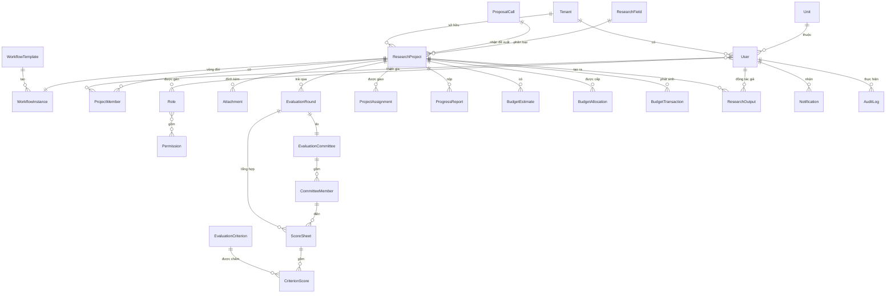
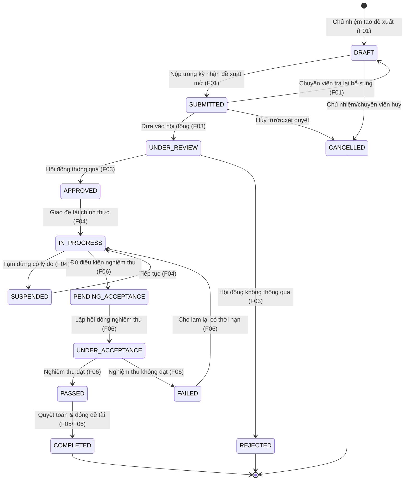

# Mô hình dữ liệu

> **Nguồn sự thật về dữ liệu dùng chung.** Mọi `spec.md` tham chiếu tên thực thể, tên trường và
> enum trạng thái ở đây thay vì tự định nghĩa lại. Khi một feature cần trường mới, bổ sung vào file
> này trong cùng PR. Tên thực thể tiếng Anh, PascalCase; tên trường tiếng Anh camelCase.

## 1. Quy ước chung

- **Khóa chính:** mọi thực thể có `id` (UUID v4), không tái sử dụng.
- **Trường audit dùng chung** (mọi thực thể nghiệp vụ, không lặp lại trong bảng trường bên dưới):
  `createdAt`, `createdBy`, `updatedAt`, `updatedBy` (FK → `User`).
- **Actor (tác nhân):** tác nhân của một hành động không chỉ là con người — nhật ký dùng cặp
  `actorType` (`HUMAN` | `SYSTEM` | `AI_AGENT`) + `actorId`, kèm `onBehalfOf` khi AI/hệ thống hành động thay người.
  AI luôn là **một actor chịu RLS + RBAC** như mọi actor (không tạo "user ảo"). Xem [ADR-0010](decisions/0010-chuan-du-lieu-cho-ai-tham-gia.md).
- **Phân loại nhạy cảm:** trường/thực thể có thể gắn nhãn `dataClassification` (`PUBLIC` | `INTERNAL` | `SENSITIVE`)
  để kiểm soát dữ liệu nào được đưa cho AI/model ngoài. Mặc định `INTERNAL` nếu không ghi rõ ([ADR-0010](decisions/0010-chuan-du-lieu-cho-ai-tham-gia.md)).
- **Xóa mềm:** thực thể danh mục và hồ sơ dùng `recordStatus` (`ACTIVE` | `INACTIVE` | `DELETED`)
  thay vì xóa cứng, để giữ toàn vẹn tham chiếu lịch sử.
- **Tiền tệ:** lưu số nguyên VND (`bigint`), không dùng số thực.
- **Thời gian:** lưu UTC (`timestamptz`), hiển thị theo múi giờ Việt Nam ở tầng giao diện.
- **File đính kèm:** không lưu nhị phân trong CSDL — xem thực thể `Attachment` (trỏ tới object storage).
- **Đa tổ chức (multi-tenant):** mọi thực thể nghiệp vụ và danh mục đều có `tenantId` (FK → `Tenant`); cô lập
  dữ liệu bằng PostgreSQL Row-Level Security (`app.current_tenant`). Xem [ADR-0008](decisions/0008-keycloak-idp-dang-nhap-email-otp.md)
  và [migration-coverage Q1](migration-coverage.md). Để bảng gọn, `tenantId` **không lặp lại** trong từng bảng
  trường bên dưới (mặc định mọi bảng nghiệp vụ đều có, trừ chính `Tenant`). Các unique cấp tổ chức là unique
  **theo `tenantId`** (vd `email`, `projectCode`).
- **Trạng thái vòng đời:** vòng đời `ResearchProject` **cấu hình động per-tenant** ([ADR-0007](decisions/0007-workflow-engine-dong-per-tenant.md)).
  Do đó dùng cặp trường: `status` = mã bước theo cấu hình của tổ chức (= `WorkflowStep.code`), và `statusSemantic`
  = trạng thái **chuẩn hoá** (enum cố định §3.1) để báo cáo và luật nghiệp vụ hoạt động xuyên tổ chức.

## 2. Sơ đồ thực thể (ERD)

> `EvaluationRound` là một **lượt đánh giá** của một hội đồng trên một đề tài; nó được dùng lại cho cả
> **xét duyệt** (F03) và **nghiệm thu** (F06) — phân biệt bằng trường `type`. Xem [ADR-0003](decisions/0003-mo-hinh-hoi-dong-dung-chung.md).

## 3. Vòng đời đề tài (workflow mặc định)

Vòng đời `ResearchProject` là **trục xương sống** nối các feature. Theo [ADR-0007](decisions/0007-workflow-engine-dong-per-tenant.md),
vòng đời **cấu hình động per-tenant**: sơ đồ dưới đây là **workflow mặc định** (template seed sẵn), tổ chức có
thể tuỳ biến (thêm/bớt bước, đổi tên) — nhất là NCKH nội bộ. Mỗi chuyển trạng thái đi qua **domain service
dùng chung** (không update enum ở màn hình) và được ghi `AuditLog` + `WorkflowHistory`.

> Vì step có thể khác nhau giữa tổ chức, **mọi báo cáo và luật xuyên tổ chức bám `statusSemantic` (§3.1)**,
> không bám `status` (mã bước theo cấu hình tổ chức).

| Từ trạng thái | Tới | Điều kiện | Feature | Người thực hiện |
|---|---|---|---|---|
| `DRAFT` | `SUBMITTED` | Kỳ nhận đề xuất đang mở, hồ sơ đủ trường bắt buộc | F01 | Chủ nhiệm |
| `SUBMITTED` | `DRAFT` | Hồ sơ thiếu/sai, còn hạn nộp | F01 | Chuyên viên |
| `SUBMITTED` | `UNDER_REVIEW` | Hết hạn nộp / chốt danh sách, đã gán hội đồng | F03 | Chuyên viên |
| `UNDER_REVIEW` | `APPROVED` / `REJECTED` | Đủ phiếu chấm hợp lệ, đạt/không đạt ngưỡng | F03 | Chuyên viên (theo kết luận HĐ) |
| `APPROVED` | `IN_PROGRESS` | Đã giao đề tài chính thức | F04 | Chuyên viên |
| `IN_PROGRESS` | `PENDING_ACCEPTANCE` | Đã nộp báo cáo cuối + đủ sản phẩm cam kết | F06 | Chủ nhiệm |
| `UNDER_ACCEPTANCE` | `PASSED` / `FAILED` | Hội đồng nghiệm thu kết luận | F06 | Chuyên viên |
| `PASSED` | `COMPLETED` | Đã quyết toán kinh phí | F05/F06 | Chuyên viên |

> Quy tắc chung: **chỉ cho chuyển theo transition đã định nghĩa trong template của tổ chức** (engine validate
> graph: 1 step initial, mọi final reachable, không transition mồ côi — [ADR-0007](decisions/0007-workflow-engine-dong-per-tenant.md)).
> Mọi chuyển trạng thái phải kèm `comment`/`reason` khi transition yêu cầu (`requiresComment`). Logic tập trung
> ở backend (domain service dùng chung), không phân tán ở từng màn hình.

### 3.1 `statusSemantic` — từ vựng trạng thái chuẩn (cố định)

Mỗi `WorkflowStep` (dù tổ chức đặt tên/`code` gì) phải gắn đúng **một** `statusSemantic` dưới đây. Đây là enum
**cố định trong code** (`packages/domain-types`), là cơ sở cho báo cáo B02, dashboard và mọi luật xuyên tổ chức.

| `statusSemantic` | Ý nghĩa | Bước mặc định tương ứng |
|---|---|---|
| `DRAFT` | Đang soạn, chưa nộp | DRAFT |
| `SUBMITTED` | Đã nộp, chờ xử lý | SUBMITTED |
| `UNDER_REVIEW` | Đang xét duyệt hội đồng | UNDER_REVIEW |
| `APPROVED` | Đã duyệt, chưa triển khai | APPROVED |
| `IN_PROGRESS` | Đang thực hiện | IN_PROGRESS |
| `SUSPENDED` | Tạm dừng | SUSPENDED |
| `PENDING_ACCEPTANCE` | Chờ nghiệm thu | PENDING_ACCEPTANCE |
| `UNDER_ACCEPTANCE` | Đang nghiệm thu | UNDER_ACCEPTANCE |
| `PASSED` | Nghiệm thu đạt | PASSED |
| `FAILED` | Nghiệm thu không đạt | FAILED |
| `COMPLETED` | Đã quyết toán & đóng | COMPLETED |
| `REJECTED` | Bị từ chối | REJECTED |
| `CANCELLED` | Đã huỷ | CANCELLED |

> Tổ chức bỏ bớt bước (vd nội bộ không qua hội đồng) thì đơn giản là **không dùng** semantic tương ứng
> (`UNDER_REVIEW`). Không tổ chức nào được tạo semantic mới ngoài danh sách này.

## 4. Thực thể cốt lõi

### 4.1 Người dùng & phân quyền (B03)

**User**

| Trường | Kiểu | Ràng buộc | Mô tả |
|---|---|---|---|
| `id` | uuid | PK | |
| `userCode` | string | unique theo tenant | Mã cán bộ/nhà khoa học |
| `keycloakId` | string | unique, not null | Khoá liên kết Keycloak (claim `sub`) — [ADR-0008](decisions/0008-keycloak-idp-dang-nhap-email-otp.md) |
| `fullName` | string | not null | |
| `email` | string | unique theo tenant, not null | Định danh đăng nhập email-OTP (khớp Keycloak) |
| `phoneNumber` | string | | Dùng cho thông báo SMS (B04) |
| `unitId` | uuid | FK → Unit | Đơn vị công tác |
| `academicTitle` | string | | Phục vụ lý lịch khoa học (F08) |
| `accountSource` | enum | `SSO` \| `INTERNAL` | Nguồn tạo tài khoản |
| `status` | enum | `ACTIVE` \| `LOCKED` \| `INACTIVE` | |

**Role** (`id`, `code` unique, `name`, `description`, `isSystem` bool) — vai trò chuẩn xem B03 §Vai trò.
**Permission** (`id`, `code` unique vd `RESEARCH_PROJECT.APPROVE`, `description`) — quyền nguyên tử theo `MODULE.ACTION`.
**User_Role** và **Role_Permission**: bảng nối nhiều-nhiều.

### 4.2 Danh mục dùng chung (B01)

Hai nhóm: **(a) danh mục có entity riêng** vì bị FK nghiệp vụ trỏ tới, và **(b) danh mục lookup
chung** dùng cặp bảng generic `Catalog`/`CatalogItem` (thêm loại mới chỉ cần thêm 1 dòng `Catalog`,
không cần migration). Toàn bộ do B01 quản trị trên một màn hình hub duy nhất — xem B01 §5.

**(a) Danh mục có entity riêng (bị FK trỏ tới):**

**Unit** (`id`, `code`, `name`, `parentUnitId` self-FK, `recordStatus`) — cây đơn vị; `User.unitId`,
`ResearchProject.hostUnitId` trỏ tới.
**ResearchField** (`id`, `code`, `name`, `parentFieldId` self-FK, `recordStatus`) — lĩnh vực/chuyên
ngành nghiên cứu; `ResearchProject.researchFieldId`, `ProposalCall.researchFieldIds` trỏ tới.
**ProductType** (`id`, `code`, `name`, `category` enum `ARTICLE`|`PATENT`|`SOLUTION`|`TRAINING`|`OTHER`);
`ResearchOutput.productTypeId` trỏ tới.
**SystemSetting** (`key` PK, `value`, `dataType`, `description`) — tham số chạy (ngưỡng điểm, hạn nhắc, **tỷ lệ phí quản lý** `budget.managementFeeRate` và **trần** `budget.managementFeeCap` cấp tổ chức — F05 BR-10…).

**(b) Danh mục lookup chung (generic):**

**Catalog** — định nghĩa **loại** danh mục.

| Trường | Kiểu | Ràng buộc | Mô tả |
|---|---|---|---|
| `id` | uuid | PK | |
| `code` | string | unique theo tenant | Mã loại danh mục, vd `POSITION`, `NOTIFICATION_CATEGORY` |
| `name` | string | not null | Tên hiển thị, vd "Chức vụ" |
| `structure` | enum | `FLAT` \| `TREE` | `TREE` cho phép `CatalogItem.parentItemId` (vd địa chỉ Tỉnh/Huyện/Xã) |
| `isSystem` | bool | default false | Loại lõi hệ thống — không cho xóa/đổi `code` qua UI |
| `extraSchema` | jsonb | nullable | (tùy chọn) mô tả các trường mở rộng hợp lệ cho `CatalogItem.extra` |
| `description` | text | | |
| `recordStatus` | enum | `ACTIVE`\|`INACTIVE`\|`DELETED` | Xóa mềm theo §1 |

**CatalogItem** — **mục** trong một danh mục.

| Trường | Kiểu | Ràng buộc | Mô tả |
|---|---|---|---|
| `id` | uuid | PK | |
| `catalogId` | uuid | FK → Catalog, not null | Thuộc loại danh mục nào |
| `code` | string | unique theo (`tenantId`,`catalogId`) | Mã mục, duy nhất trong cùng danh mục |
| `name` | string | not null | Tên hiển thị |
| `parentItemId` | uuid | self-FK, nullable | Chỉ dùng khi `Catalog.structure = TREE`; chống chu trình |
| `sortOrder` | int | default 0 | Thứ tự hiển thị trong danh mục |
| `extra` | jsonb | nullable | Trường đặc thù theo loại, vd `{ "level": "PROVINCE" }` cho địa chỉ |
| `recordStatus` | enum | `ACTIVE`\|`INACTIVE`\|`DELETED` | Xóa mềm theo §1 |

> Danh mục lookup khởi tạo (có thể phát sinh thêm): `ADMINISTRATIVE_DIVISION` (Tỉnh/Huyện/Xã, TREE),
> `RESEARCH_TOPIC_CATEGORY` (phân loại đề tài NCKH), `NOTIFICATION_CATEGORY` (phân loại thông báo —
> **khác** `eventType` của B04), `EVALUATION_CATEGORY` (phân loại đánh giá — **khác** `CriteriaSet`),
> `POSITION` (chức vụ), `USER_ROLE_LABEL` (vị trí/vai trò hiển thị — **khác** RBAC `Role` của B03).
> Tham chiếu từ thực thể khác dùng `CatalogItem.id` (FK `ON DELETE RESTRICT`, xem §5).

### 4.3 Kỳ nhận đề xuất & đề tài (F02, F01)

**ProposalCall**

| Trường | Kiểu | Ràng buộc | Mô tả |
|---|---|---|---|
| `id` | uuid | PK | |
| `code` | string | unique | Mã kỳ, vd `KG-2026-01` |
| `name` | string | not null | |
| `startDate` / `endDate` | date | not null | Khoảng nhận đề xuất |
| `researchFieldIds` | uuid[] | | Lĩnh vực được nhận trong kỳ |
| `proposalTemplateId` | uuid | | Mẫu thuyết minh áp dụng |
| `reviewCriteriaSetId` | uuid | FK → CriteriaSet | Bộ tiêu chí xét duyệt áp dụng |
| `status` | enum | `DRAFT`\|`OPEN`\|`CLOSED`\|`CANCELLED` | Vòng đời kỳ (xem F02) |

**ResearchProject**

| Trường | Kiểu | Ràng buộc | Mô tả |
|---|---|---|---|
| `id` | uuid | PK | |
| `projectCode` | string | unique | Sinh tự động khi nộp |
| `name` | string | not null | |
| `proposalCallId` | uuid | FK → ProposalCall, not null | Kỳ nộp |
| `researchFieldId` | uuid | FK → ResearchField | |
| `principalInvestigatorId` | uuid | FK → User, not null | Chủ nhiệm |
| `hostUnitId` | uuid | FK → Unit | Đơn vị chủ trì |
| `abstract` | text | | |
| `proposalDocument` | jsonb | | Nội dung theo biểu mẫu của kỳ |
| `requestedBudget` | bigint | | Tổng dự toán đề xuất (VND) |
| `durationMonths` | int | | Số tháng |
| `status` | string | not null | Mã bước hiện tại theo workflow của tổ chức (= `WorkflowStep.code`) |
| `statusSemantic` | enum | not null | Trạng thái chuẩn hoá §3.1 — dùng cho báo cáo/luật xuyên tổ chức |
| `submittedAt` | timestamptz | | Thời điểm chuyển bước có `statusSemantic = SUBMITTED` |

**ProjectMember** (`id`, `researchProjectId`, `userId`, `projectRole` enum `PRINCIPAL_INVESTIGATOR`|`MEMBER`|`SECRETARY`, `responsibility`).
**Attachment** (`id`, `targetType`, `targetId`, `fileName`, `storageKey` object-storage key, `fileSize`, `mimeType`) — dùng chung cho mọi feature.

### 4.4 Hội đồng & đánh giá (F03, F06)

**EvaluationCommittee** (`id`, `code`, `name`, `type` enum `PROPOSAL_REVIEW`|`ACCEPTANCE`, `status`).
**CommitteeMember** (`id`, `committeeId`, `userId`, `committeeRole` enum `CHAIR`|`REVIEWER`|`MEMBER`|`SECRETARY`).
**CriteriaSet** (`id`, `name`, `type` `PROPOSAL_REVIEW`|`ACCEPTANCE`) & **EvaluationCriterion** (`id`, `criteriaSetId`, `name`, `maxScore`, `weight`).
**EvaluationRound** (`id`, `researchProjectId`, `committeeId`, `type` `PROPOSAL_REVIEW`|`ACCEPTANCE`, `status`, `conclusion` enum `PASSED`|`FAILED`|`null`, `aggregateScore`).
**ScoreSheet** (`id`, `evaluationRoundId`, `committeeMemberId`, `status` `DRAFT`|`SUBMITTED`, `comment`, `totalScore`).
**CriterionScore** (`id`, `scoreSheetId`, `evaluationCriterionId`, `score`).

### 4.5 Thực hiện đề tài (F04, F05)

**ProjectAssignment** (`id`, `researchProjectId`, `assignmentType` `CONTRACT`|`DECISION`, `contractNo`, `decisionNo`, `signedAt` date, `effectiveDate` date, `startDate` date, `endDate` date, `approvedBudget` bigint, `fundingSource`, `status` `DRAFT`|`EFFECTIVE`|`CANCELLED`, `note`).

**ProgressReport** (`id`, `researchProjectId`, `period` int, `dueDate` date, `submittedAt`, `content` text, `status` `PENDING_SUBMISSION`|`SUBMITTED`|`PASSED`|`REVISION_REQUESTED`, `officerComment`).
**BudgetEstimate** (`id`, `researchProjectId`, `budgetLine`, `estimatedAmount` bigint, `period`, `settlementMode` `LUMP_SUM`|`ACTUAL_EXPENSE`|`MIXED`).
**BudgetAllocation** (`id`, `researchProjectId`, `allocationNo`, `amount` bigint, `managementFeeAmount` bigint (≥ 0, ≤ `amount`; phần **phí quản lý** tổ chức chủ trì giữ lại — F05, BR-10; *kinh phí thực hiện* = `amount − managementFeeAmount`, dẫn xuất), `plannedDate` date, `actualDate` date, `status` `PLANNED`|`DISBURSED`|`CANCELLED`).
**BudgetTransaction** (`id`, `researchProjectId`, `budgetLine`, `amount` bigint, `type` `DISBURSEMENT`|`EXPENSE`, `date`, `reconciliationStatus` `UNRECONCILED`|`MATCHED`|`MISMATCHED`, `financeTransactionCode`).

### 4.6 Sản phẩm & lý lịch (F07, F08)

**ResearchOutput** (`id`, `researchProjectId` nullable, `productTypeId`, `name`, `authors` jsonb, `publicationYear`, `publicationInfo`, `evidenceAttachmentId` FK → Attachment, `approvalStatus` `PENDING_APPROVAL`|`APPROVED`|`REJECTED`).
> Lý lịch khoa học (F08) là **khung nhìn tổng hợp** trên `User` + `ResearchOutput` + vai trò
> trong `ResearchProject`, không phải một bảng riêng (xem F08 §Dữ liệu).

### 4.7 Hạ tầng dùng chung (B04, audit)

**Notification** (`id`, `recipientId`, `eventType`, `title`, `content`, `channel` `IN_APP`|`EMAIL`|`SMS`, `status` `PENDING_SEND`|`SUBMITTED`|`READ`|`ERROR`, `link`).
**AuditLog** (`id`, `actorType` `HUMAN`|`SYSTEM`|`AI_AGENT`, `actorId`, `onBehalfOf` nullable, `action`, `targetType`, `targetId`, `oldValue` jsonb, `newValue` jsonb, `occurredAt`, `ipAddress`) — append-only, xem [ADR-0002](decisions/0002-kien-truc-hai-mat-mot-backend.md). Actor mở rộng cho AI/hệ thống theo [ADR-0010](decisions/0010-chuan-du-lieu-cho-ai-tham-gia.md).

### 4.8 Đa tổ chức & workflow engine ([ADR-0007](decisions/0007-workflow-engine-dong-per-tenant.md), [ADR-0008](decisions/0008-keycloak-idp-dang-nhap-email-otp.md))

**Tenant** (`id`, `name`, `slug` unique, `realm` unique — realm Keycloak của tổ chức, `isActive`) — gốc cô lập
multi-tenant; mọi thực thể nghiệp vụ FK `tenantId` về đây (RLS theo `app.current_tenant`).

> Workflow engine **cấu hình động per-tenant** — graph nằm trong DB, side-effect nằm trong code (xem [ADR-0007](decisions/0007-workflow-engine-dong-per-tenant.md) mô hình 3 tầng).

**WorkflowTemplate** (`id`, `entityType` mặc định `RESEARCH_PROJECT`, `name`, `version`, `isActive`) — một bộ vòng đời của một tổ chức; versioned (instance đang chạy ghim version).
**WorkflowStep** (`id`, `templateId`, `code`, `name`, `statusSemantic` enum §3.1, `isInitial`, `isFinal`, `order`) — một trạng thái; `code` do tổ chức đặt, `statusSemantic` để chuẩn hoá.
**WorkflowTransition** (`id`, `templateId`, `fromStepId` nullable, `toStepId`, `code`, `allowedRoles` (role RMS), `requiresComment`, `guards` string[], `effects` string[]) — `guards`/`effects` chọn từ catalog cố định trong code.
**WorkflowInstance** (`id`, `templateId`, `entityType`, `entityId`, `currentStepId`) — vòng đời của một đề tài; unique theo (`entityId`,`entityType`).
**WorkflowHistory** (`id`, `instanceId`, `fromStepId`, `toStepId`, `transitionId`, `triggeredBy`, `triggeredByActorType` `HUMAN`|`SYSTEM`|`AI_AGENT`, `comment`, `metadata` jsonb, `createdAt`) — append-only, song hành `AuditLog`. Actor mở rộng theo [ADR-0010](decisions/0010-chuan-du-lieu-cho-ai-tham-gia.md).

### 4.9 Chuẩn dữ liệu cho AI & sự kiện ([ADR-0010](decisions/0010-chuan-du-lieu-cho-ai-tham-gia.md))

> Bake sẵn để AI tham gia về sau **không cần migration phá vỡ**. **Ranh giới vàng:** AI không tự ghi sự thật
> authoritative (đổi `status`, ghi `ScoreSheet`…); mọi tác động đi qua *đề xuất → con người duyệt → domain service
> dùng chung* ([ADR-0007](decisions/0007-workflow-engine-dong-per-tenant.md)).

**AiSuggestion** — đề xuất của AI, tách khỏi sự thật authoritative; có cổng duyệt của con người.

| Trường | Kiểu | Ràng buộc | Mô tả |
|---|---|---|---|
| `id` | uuid | PK | |
| `targetType` / `targetId` | string / uuid | not null | Thực thể được đề xuất (vd `ResearchProject`) |
| `suggestionType` | string | not null | Loại đề xuất (vd `CLASSIFY_FIELD`, `PRESCORE`, `SUGGEST_TRANSITION`) |
| `payload` | jsonb | not null | Nội dung đề xuất (typed theo `suggestionType`) |
| `status` | enum | `PENDING`\|`ACCEPTED`\|`REJECTED` | Khi `ACCEPTED` mới gọi domain service tạo tác động thật |
| `decidedBy` | uuid | FK → User, nullable | Người duyệt/từ chối |
| `decidedAt` | timestamptz | nullable | |
| `modelId` | string | not null | Provenance: model sinh đề xuất |
| `promptVersion` | string | not null | Provenance: phiên bản prompt |
| `inputHash` | string | | Provenance: hash/snapshot input để tái lập & eval |
| `confidence` | float | | Độ tự tin (0–1) |
| `sources` | jsonb | | Dẫn nguồn/citations |

> Append-only về mặt nghiệp vụ: không sửa `payload` sau khi tạo; vòng đời chỉ đi qua `status`/`decided*`.

**DomainEvent** — sự kiện nghiệp vụ chuẩn hoá; ghi qua **outbox trong cùng transaction lõi** (cổng để AI *quan sát*
hệ thống và là nền cho lộ trình Event Stream; tải vận chuyển in-process→broker thuộc ADR riêng).

| Trường | Kiểu | Ràng buộc | Mô tả |
|---|---|---|---|
| `id` | uuid | PK | Khoá idempotency cho consumer |
| `eventType` | string | not null | Đặt theo `statusSemantic` (§3.1) → ổn định xuyên tổ chức |
| `schemaVersion` | int | not null | Phiên bản `payload` |
| `payload` | jsonb | not null | Typed trong `packages/domain-types` |
| `actorType` / `actorId` / `onBehalfOf` | — | | Actor phát sự kiện (như §1) |
| `aggregateType` / `aggregateId` | string / uuid | not null | Thực thể gốc (vd `ResearchProject`) |
| `occurredAt` | timestamptz | not null | |
| `dispatchedAt` | timestamptz | nullable | Outbox: thời điểm đã giao consumer (null = chưa) |

> Append-only. `WorkflowHistory` (§4.8) vẫn là nhật ký chuyển bước; `DomainEvent` là lớp sự kiện chuẩn hoá để tiêu thụ.

## 5. Ghi chú toàn vẹn

- Mọi FK trỏ tới danh mục dùng `ON DELETE RESTRICT` — danh mục đang được tham chiếu không xóa cứng được.
- `ResearchProject.status` chỉ được đổi qua domain service, không update trực tiếp từ API CRUD.
- Bảng nối nhiều-nhiều (`User_Role`, `Role_Permission`, `CommitteeMember`) có unique constraint trên cặp khóa để tránh trùng.
- `AiSuggestion` **không** trực tiếp đổi trạng thái nghiệp vụ: chỉ khi `status = ACCEPTED` mới gọi domain service dùng chung để tạo tác động thật (giữ luật bất biến [AGENTS.md §4.1/§4.2](../../AGENTS.md)).
- `AuditLog`, `WorkflowHistory`, `DomainEvent` append-only; AI là actor chịu RLS (`app.current_tenant`) + RBAC như mọi actor ([ADR-0010](decisions/0010-chuan-du-lieu-cho-ai-tham-gia.md)).
