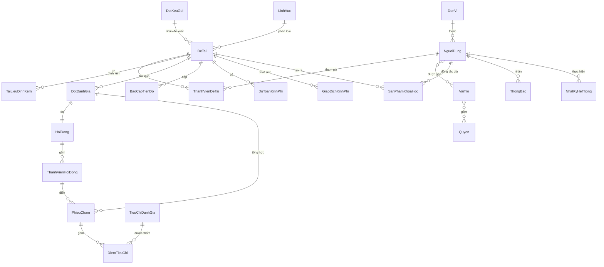
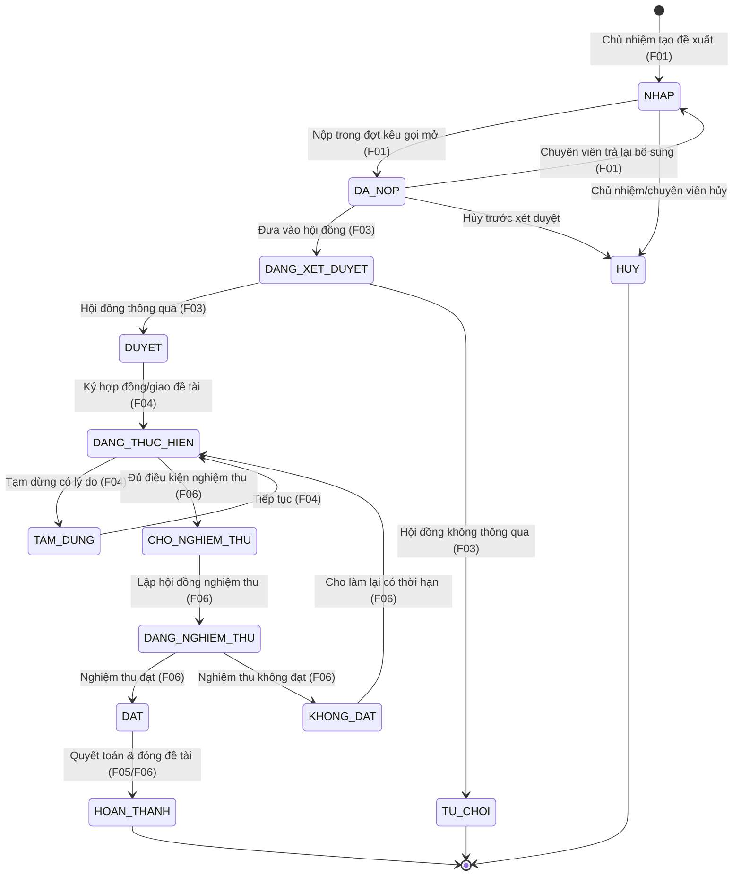

# Mô hình dữ liệu

> **Nguồn sự thật về dữ liệu dùng chung.** Mọi `spec.md` tham chiếu tên thực thể, tên trường và
> enum trạng thái ở đây thay vì tự định nghĩa lại. Khi một feature cần trường mới, bổ sung vào file
> này trong cùng PR. Tên thực thể không dấu, PascalCase; tên trường camelCase.

## 1. Quy ước chung

- **Khóa chính:** mọi thực thể có `id` (UUID v4), không tái sử dụng.
- **Trường audit dùng chung** (mọi thực thể nghiệp vụ, không lặp lại trong bảng trường bên dưới):
  `createdAt`, `createdBy`, `updatedAt`, `updatedBy` (FK → `NguoiDung`).
- **Xóa mềm:** thực thể danh mục và hồ sơ dùng `trangThaiBanGhi` (`ACTIVE` | `INACTIVE` | `DELETED`)
  thay vì xóa cứng, để giữ toàn vẹn tham chiếu lịch sử.
- **Tiền tệ:** lưu số nguyên VND (`bigint`), không dùng số thực.
- **Thời gian:** lưu UTC (`timestamptz`), hiển thị theo múi giờ Việt Nam ở tầng giao diện.
- **File đính kèm:** không lưu nhị phân trong CSDL — xem thực thể `TaiLieuDinhKem` (trỏ tới object storage).

## 2. Sơ đồ thực thể (ERD)

> `DotDanhGia` là một **lượt đánh giá** của một hội đồng trên một đề tài; nó được dùng lại cho cả
> **xét duyệt** (F03) và **nghiệm thu** (F06) — phân biệt bằng trường `loai`. Xem [ADR-0003](decisions/0003-mo-hinh-hoi-dong-dung-chung.md).

## 3. Vòng đời đề tài (state machine)

Trạng thái của `DeTai.trangThai` là **trục xương sống** nối các feature. Mỗi chuyển trạng thái
do đúng một feature kích hoạt và được ghi `NhatKyHeThong`.

| Từ trạng thái | Tới | Điều kiện | Feature | Người thực hiện |
|---|---|---|---|---|
| `NHAP` | `DA_NOP` | Đợt kêu gọi đang mở, hồ sơ đủ trường bắt buộc | F01 | Chủ nhiệm |
| `DA_NOP` | `NHAP` | Hồ sơ thiếu/sai, còn hạn nộp | F01 | Chuyên viên |
| `DA_NOP` | `DANG_XET_DUYET` | Hết hạn nộp / chốt danh sách, đã gán hội đồng | F03 | Chuyên viên |
| `DANG_XET_DUYET` | `DUYET` / `TU_CHOI` | Đủ phiếu chấm hợp lệ, đạt/không đạt ngưỡng | F03 | Chuyên viên (theo kết luận HĐ) |
| `DUYET` | `DANG_THUC_HIEN` | Đã giao đề tài / ký hợp đồng | F04 | Chuyên viên |
| `DANG_THUC_HIEN` | `CHO_NGHIEM_THU` | Đã nộp báo cáo cuối + đủ sản phẩm cam kết | F06 | Chủ nhiệm |
| `DANG_NGHIEM_THU` | `DAT` / `KHONG_DAT` | Hội đồng nghiệm thu kết luận | F06 | Chuyên viên |
| `DAT` | `HOAN_THANH` | Đã quyết toán kinh phí | F05/F06 | Chuyên viên |

> Quy tắc chung: **không cho nhảy trạng thái ngoài sơ đồ**. Mọi chuyển trạng thái phải kèm
> `lyDo` khi là chuyển lùi/hủy/tạm dừng. Logic này tập trung ở backend (domain service), không
> phân tán ở từng màn hình.

## 4. Thực thể cốt lõi

### 4.1 Người dùng & phân quyền (B03)

**NguoiDung**

| Trường | Kiểu | Ràng buộc | Mô tả |
|---|---|---|---|
| `id` | uuid | PK | |
| `maNguoiDung` | string | unique | Mã cán bộ/nhà khoa học |
| `hoTen` | string | not null | |
| `email` | string | unique, not null | Định danh đăng nhập (khớp SSO) |
| `soDienThoai` | string | | Dùng cho thông báo SMS (B04) |
| `donViId` | uuid | FK → DonVi | Đơn vị công tác |
| `hocHamHocVi` | string | | Phục vụ lý lịch khoa học (F08) |
| `nguonTaiKhoan` | enum | `SSO` \| `NOI_BO` | Nguồn tạo tài khoản |
| `trangThai` | enum | `ACTIVE` \| `LOCKED` \| `INACTIVE` | |

**VaiTro** (`id`, `ma` unique, `ten`, `moTa`, `laHeThong` bool) — vai trò chuẩn xem B03 §Vai trò.
**Quyen** (`id`, `ma` unique vd `DE_TAI.DUYET`, `moTa`) — quyền nguyên tử theo `MODULE.HANH_DONG`.
**NguoiDung_VaiTro** và **VaiTro_Quyen**: bảng nối nhiều-nhiều.

### 4.2 Danh mục dùng chung (B01)

**DonVi** (`id`, `ma`, `ten`, `donViChaId` self-FK, `trangThaiBanGhi`) — cây đơn vị.
**LinhVuc** (`id`, `ma`, `ten`, `linhVucChaId` self-FK, `trangThaiBanGhi`) — lĩnh vực nghiên cứu.
**LoaiSanPham** (`id`, `ma`, `ten`, `nhom` enum `BAI_BAO`|`SANG_CHE`|`GIAI_PHAP`|`DAO_TAO`|`KHAC`).
**CauHinhHeThong** (`khoa` PK, `giaTri`, `kieuDuLieu`, `moTa`) — tham số chạy (ngưỡng điểm, hạn nhắc…).

### 4.3 Đợt kêu gọi & đề tài (F02, F01)

**DotKeuGoi**

| Trường | Kiểu | Ràng buộc | Mô tả |
|---|---|---|---|
| `id` | uuid | PK | |
| `ma` | string | unique | Mã đợt, vd `KG-2026-01` |
| `ten` | string | not null | |
| `tuNgay` / `denNgay` | date | not null | Khoảng nhận đề xuất |
| `linhVucIds` | uuid[] | | Lĩnh vực được nhận trong đợt |
| `bieuMauThuyetMinhId` | uuid | | Mẫu thuyết minh áp dụng |
| `tieuChiXetDuyetId` | uuid | FK → BoTieuChi | Bộ tiêu chí xét duyệt áp dụng |
| `trangThai` | enum | `NHAP`\|`MO`\|`DONG`\|`HUY` | Vòng đời đợt (xem F02) |

**DeTai**

| Trường | Kiểu | Ràng buộc | Mô tả |
|---|---|---|---|
| `id` | uuid | PK | |
| `maDeTai` | string | unique | Sinh tự động khi nộp |
| `ten` | string | not null | |
| `dotKeuGoiId` | uuid | FK → DotKeuGoi, not null | Đợt nộp |
| `linhVucId` | uuid | FK → LinhVuc | |
| `chuNhiemId` | uuid | FK → NguoiDung, not null | Chủ nhiệm |
| `donViChuTriId` | uuid | FK → DonVi | Đơn vị chủ trì |
| `tomTat` | text | | |
| `thuyetMinh` | jsonb | | Nội dung theo biểu mẫu của đợt |
| `kinhPhiDeXuat` | bigint | | Tổng dự toán đề xuất (VND) |
| `thoiGianThucHien` | int | | Số tháng |
| `trangThai` | enum | not null | Vòng đời §3 |
| `ngayNop` | timestamptz | | Thời điểm chuyển `DA_NOP` |

**ThanhVienDeTai** (`id`, `deTaiId`, `nguoiDungId`, `vaiTroTrongDeTai` enum `CHU_NHIEM`|`THANH_VIEN`|`THU_KY`, `nhiemVu`).
**TaiLieuDinhKem** (`id`, `loaiDoiTuong`, `doiTuongId`, `tenFile`, `duongDan` object-storage key, `kichThuoc`, `mimeType`) — dùng chung cho mọi feature.

### 4.4 Hội đồng & đánh giá (F03, F06)

**HoiDong** (`id`, `ma`, `ten`, `loai` enum `XET_DUYET`|`NGHIEM_THU`, `trangThai`).
**ThanhVienHoiDong** (`id`, `hoiDongId`, `nguoiDungId`, `chucDanh` enum `CHU_TICH`|`PHAN_BIEN`|`UY_VIEN`|`THU_KY`).
**BoTieuChi** (`id`, `ten`, `loai` `XET_DUYET`|`NGHIEM_THU`) & **TieuChiDanhGia** (`id`, `boTieuChiId`, `ten`, `diemToiDa`, `trongSo`).
**DotDanhGia** (`id`, `deTaiId`, `hoiDongId`, `loai` `XET_DUYET`|`NGHIEM_THU`, `trangThai`, `ketLuan` enum `DAT`|`KHONG_DAT`|`null`, `diemTongHop`).
**PhieuCham** (`id`, `dotDanhGiaId`, `thanhVienHoiDongId`, `trangThai` `NHAP`|`DA_GUI`, `nhanXet`, `tongDiem`).
**DiemTieuChi** (`id`, `phieuChamId`, `tieuChiDanhGiaId`, `diem`).

### 4.5 Thực hiện đề tài (F04, F05)

**BaoCaoTienDo** (`id`, `deTaiId`, `ky` int, `kyHan` date, `ngayNop`, `noiDung` text, `trangThai` `CHO_NOP`|`DA_NOP`|`DAT`|`YEU_CAU_CHINH_SUA`, `nhanXetChuyenVien`).
**DuToanKinhPhi** (`id`, `deTaiId`, `khoanMuc`, `soTienDuToan` bigint, `ky`).
**GiaoDichKinhPhi** (`id`, `deTaiId`, `khoanMuc`, `soTien` bigint, `loai` `CAP`|`CHI`, `ngay`, `trangThaiDoiSoat` `CHUA_DOI_SOAT`|`KHOP`|`LECH`, `maGiaoDichTaiChinh`).

### 4.6 Sản phẩm & lý lịch (F07, F08)

**SanPhamKhoaHoc** (`id`, `deTaiId` nullable, `loaiSanPhamId`, `ten`, `tacGia` jsonb, `namCongBo`, `thongTinXuatBan`, `minhChungId` FK → TaiLieuDinhKem, `trangThaiDuyet` `CHO_DUYET`|`DA_DUYET`|`TU_CHOI`).
> Lý lịch khoa học (F08) là **khung nhìn tổng hợp** trên `NguoiDung` + `SanPhamKhoaHoc` + vai trò
> trong `DeTai`, không phải một bảng riêng (xem F08 §Dữ liệu).

### 4.7 Hạ tầng dùng chung (B04, audit)

**ThongBao** (`id`, `nguoiNhanId`, `loaiSuKien`, `tieuDe`, `noiDung`, `kenh` `IN_APP`|`EMAIL`|`SMS`, `trangThai` `CHO_GUI`|`DA_GUI`|`DA_DOC`|`LOI`, `lienKet`).
**NhatKyHeThong** (`id`, `nguoiThucHienId`, `hanhDong`, `loaiDoiTuong`, `doiTuongId`, `giaTriCu` jsonb, `giaTriMoi` jsonb, `thoiGian`, `diaChiIp`) — append-only, xem [ADR-0002](decisions/0002-kien-truc-hai-mat-mot-backend.md).

## 5. Ghi chú toàn vẹn

- Mọi FK trỏ tới danh mục dùng `ON DELETE RESTRICT` — danh mục đang được tham chiếu không xóa cứng được.
- `DeTai.trangThai` chỉ được đổi qua domain service, không update trực tiếp từ API CRUD.
- Bảng nối nhiều-nhiều (`NguoiDung_VaiTro`, `VaiTro_Quyen`, `ThanhVienHoiDong`) có unique constraint trên cặp khóa để tránh trùng.
