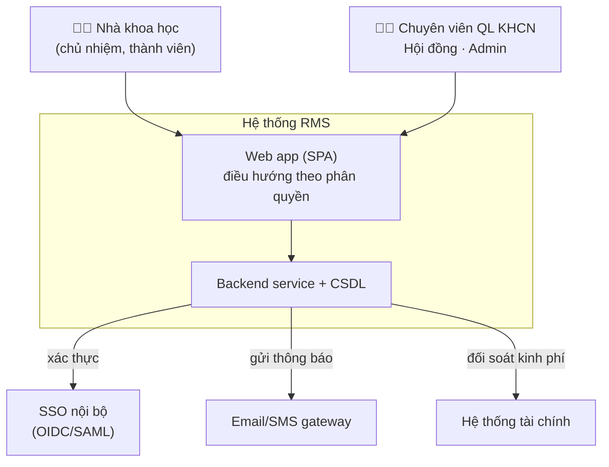
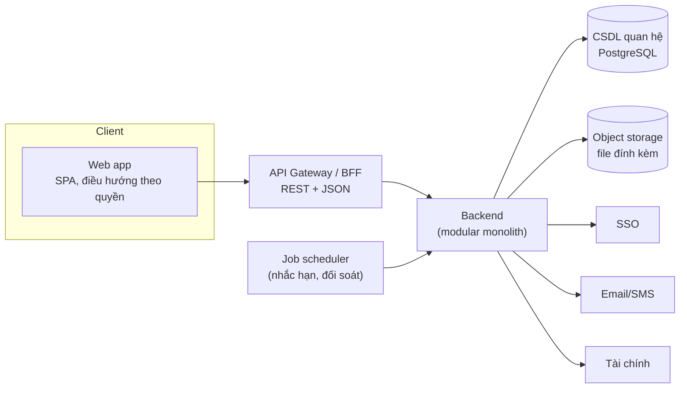

# Kiến trúc tổng quan

> Mức **HOW** của hệ thống. Quyết định lớn được tách thành ADR trong `decisions/`.
> Stack nêu dưới đây là **khuyến nghị** (giả định hợp lý cho hệ thống nội bộ bệnh viện/cơ sở y tế),
> có thể điều chỉnh qua ADR mà không ảnh hưởng tài liệu nghiệp vụ trong `features/`.

## 1. Context (C4 - mức 1)

Mọi nhóm người dùng truy cập **một web app duy nhất**; chức năng hiển thị **theo phân quyền (RBAC)**,
dùng chung một backend và một CSDL (xem [ADR-0009](decisions/0009-hop-nhat-mot-web-phan-quyen.md),
supersede [ADR-0002](decisions/0002-kien-truc-hai-mat-mot-backend.md)).

## 2. Container (C4 - mức 2)

| Thành phần | Trách nhiệm | Stack khuyến nghị |
|---|---|---|
| Web app | Giao diện cho mọi vai trò; route & menu render theo `Permission` | SPA (React/Vue), gọi REST |
| API Gateway/BFF | Xác thực token, định tuyến, rate-limit | Reverse proxy + lớp BFF mỏng |
| Backend | Toàn bộ domain logic, vòng đời đề tài | **Modular monolith** chia module theo feature (F01–F08, B01–B04) |
| CSDL | Lưu trữ giao dịch | PostgreSQL (RDBMS, transaction, jsonb) |
| Object storage | File thuyết minh, minh chứng, báo cáo | S3-compatible/MinIO |
| Job scheduler | Tác vụ định kỳ (nhắc hạn báo cáo, đối soát) | Cron/queue worker |

> **Vì sao monolith module hóa thay vì microservices:** đội ngũ lean, nghiệp vụ gắn kết quanh một
> thực thể trung tâm (`ResearchProject`) cần transaction xuyên feature; tách service sớm gây chi phí phân tán
> không tương xứng. Ranh giới module theo feature giữ khả năng tách về sau. Xem [ADR-0002](decisions/0002-kien-truc-hai-mat-mot-backend.md).

## 3. Module backend ↔ feature

Mỗi feature tài liệu (`features/F0x`, `B0x`) tương ứng một module/bounded context backend, giao tiếp
qua interface rõ ràng. Thực thể dùng chung định nghĩa ở `data-model.md`.

| Nhóm | Module |
|---|---|
| Nền tảng | `iam` (B03 người dùng/quyền), `catalog` (B01 danh mục), `notification` (B04), `audit`, `home` (B06 trang chủ — aggregation/BFF read-only) |
| Đầu vòng đời | `call` (F02 kỳ nhận đề xuất), `proposal` (F01 đề xuất), `review` (F03 xét duyệt) |
| Thực hiện | `progress` (F04), `budget` (F05), `acceptance` (F06 nghiệm thu) |
| Đầu ra | `product` (F07 sản phẩm), `profile` (F08 lý lịch), `report` (B02 thống kê) |

## 4. Cross-cutting concerns

### 4.1 Xác thực & phân quyền
- **Xác thực:** SSO nội bộ qua OIDC/SAML (xem `integrations.md`); backend cấp access token nội bộ
  (JWT) sau khi xác thực. Tài khoản nội bộ chỉ dùng cho trường hợp không có trên SSO.
- **Phân quyền:** RBAC — `Permission` (nguyên tử `MODULE.ACTION`) gom vào `Role`, gán cho `User`.
  Kiểm tra quyền ở backend cho mọi API; web app chỉ ẩn/hiện theo quyền, **không** là lớp bảo vệ.
- Phạm vi dữ liệu (data scoping): chủ nhiệm chỉ thấy đề tài của mình; chuyên viên thấy theo đơn vị/kỳ.
  Xem [ADR-0005](decisions/0005-sso-va-rbac.md).

### 4.2 Audit & nhật ký
Mọi hành động làm đổi trạng thái nghiệp vụ quan trọng (nộp, duyệt, chấm, chi kinh phí, đổi quyền)
ghi `AuditLog` (append-only). Tách khỏi log kỹ thuật. Bất biến, có thể truy vết ai-làm-gì-khi-nào.

### 4.3 Trạng thái & máy trạng thái
Vòng đời `ResearchProject` (xem `data-model.md` §3) là logic tập trung ở `proposal`/domain service dùng chung,
**không** rải ở từng màn hình. Các feature gọi service để chuyển trạng thái, không tự update enum.

### 4.4 Đa ngôn ngữ & định dạng
Giao diện tiếng Việt là chính; chuỗi UI tách resource để mở rộng. Tiền tệ VND, ngày `dd/MM/yyyy`,
múi giờ Asia/Ho_Chi_Minh ở tầng hiển thị; lưu UTC ở CSDL.

### 4.5 Phi chức năng (NFR tóm tắt)
| Khía cạnh | Mục tiêu định hướng |
|---|---|
| Bảo mật | HTTPS toàn hệ thống; mã hóa file nhạy cảm at-rest; nhật ký truy cập |
| Hiệu năng | Trang danh sách < 2s với phân trang server-side |
| Sẵn sàng | Backup CSDL hằng ngày; RPO ≤ 24h (điều chỉnh theo yêu cầu vận hành) |
| Truy vết | 100% hành động đổi trạng thái có audit |
| Khả chuyển | Ranh giới module cho phép tách service khi cần |

## 5. Liên kết
- Mô hình dữ liệu & vòng đời: `data-model.md`
- Tích hợp ngoài: `integrations.md`
- Cấu hình per-tenant (đa tổ chức): `variation-points.md` ([ADR-0012](decisions/0012-ranh-gioi-loi-vs-cau-hinh-tenant.md))
- Quyết định kiến trúc: `decisions/`
