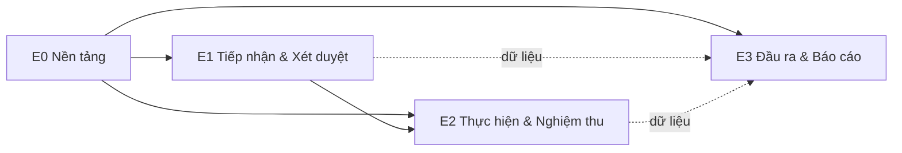

# Bản đồ Epic RMS

> **Epic** là lớp tổ chức phía trên Feature: gom các feature theo vòng đời đề tài & nền tảng.
> Phân tầng: **Epic (`docs/epics/`) → Feature (`docs/features/<mã>/`) → Spec làm việc SDD (`specs/NNN-*` của Spec Kit)**.
> Epic **không** chứa nội dung nghiệp vụ — chỉ định nghĩa mục tiêu/phạm vi/phụ thuộc và *link tới* feature.
> Folder feature giữ phẳng ở `docs/features/`; quan hệ feature↔epic gắn bằng field `epic:` trong frontmatter
> spec và cột Epic ở [features/README.md](../features/README.md).

## Tổng quan

| Epic | Tên | Feature | Pha | Phụ thuộc |
|---|---|---|---|---|
| **[E0](E0-nen-tang.md)** | Nền tảng | B03, B01, B04, P01 (workflow), P02 (audit) | Now + xuyên suốt | — |
| **[E1](E1-tiep-nhan-xet-duyet.md)** | Tiếp nhận & Xét duyệt | F02, F01, F03 | Now | E0 |
| **[E2](E2-thuc-hien-nghiem-thu.md)** | Thực hiện & Nghiệm thu | F04, F05, F06 | Next | E0, E1 |
| **[E3](E3-dau-ra-bao-cao.md)** | Đầu ra, Lý lịch & Báo cáo | F07, F08, B02, cổng công khai | Later | E0; dữ liệu E1–E2 |

## Cây Epic → Feature

```
E0 Nền tảng
├── B03 Quản lý người dùng (iam)
├── B01 Danh mục & cấu hình (catalog)
├── B04 Thông báo (notification)
├── P01 Workflow engine (kernel dùng chung — ADR-0007)
└── P02 Audit (module audit, xuyên suốt — ADR-0010)

E1 Tiếp nhận & Xét duyệt
├── F02 Kỳ nhận đề xuất (call)
├── F01 Đề xuất đề tài (proposal)         ★ tracer bullet
└── F03 Xét duyệt hội đồng + đạo đức (review)

E2 Thực hiện & Nghiệm thu
├── F04 Quản lý tiến độ (progress)
├── F05 Quản lý kinh phí (budget)
└── F06 Nghiệm thu (acceptance)

E3 Đầu ra, Lý lịch & Báo cáo
├── F07 Sản phẩm khoa học (product)
├── F08 Lý lịch khoa học (profile)
├── B02 Báo cáo & thống kê (report)
└── ◌ Cổng công khai                      (chưa có mã feature — quyết định sau)
```

## Phụ thuộc giữa Epic



- **E0 là nền**: mọi epic khác phụ thuộc workflow engine, RBAC, danh mục, audit, thông báo.
- **E1 → E2**: vòng đời tuyến tính (đề tài duyệt mới thực hiện được).
- **F03 ↔ F06** dùng chung mô hình hội đồng/cuộc họp ([ADR-0003](../architecture/decisions/0003-mo-hinh-hoi-dong-dung-chung.md)).
- **E3** phụ thuộc *dữ liệu* sinh ra ở E1–E2 (báo cáo, lý lịch, sản phẩm).

## Quan hệ với Spec Kit

Khi bắt đầu hiện thực một feature, chạy `/speckit-specify` → sinh `specs/NNN-slug/` (xưởng SDD); spec đã
chốt được chắt lọc về `docs/features/<mã>/`. Epic giúp xác định **thứ tự** & **phụ thuộc** khi lên kế hoạch
các đợt specify/plan. Xem [AGENTS.md §7](../../AGENTS.md).

## Ghi chú
- **Cổng công khai** chưa có mã feature riêng — đang để ở E3 dạng mục chưa-mã; quyết định tách `B05` hay
  giữ mục epic-level sẽ chốt sau (xem [E3](E3-dau-ra-bao-cao.md)).
- Trạng thái độ chín từng feature: [features/README.md §4](../features/README.md) + [features/REVIEW.md](../features/REVIEW.md).
