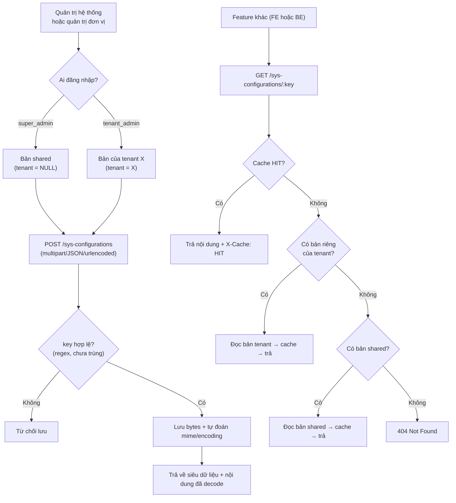

# Danh mục & cấu hình (sys-config-service)

> **Nguồn sự thật về nghiệp vụ** của feature — do **PO/BA sở hữu và duyệt**. Mọi luật, dữ liệu,
> tiêu chí nghiệm thu nằm ở đây, viết bằng **ngôn ngữ nghiệp vụ**.
>
> **Cách hiện thực kỹ thuật** (mô hình dữ liệu, endpoint, cache Redis, Keycloak) ở `design.md` —
> DEV sở hữu. Giao diện ở `ui.md`; kiểm thử ở `test-plan.md`. Cả ba đều trỏ ngược về file này.

## 1. Bối cảnh & mục tiêu

B01 là **microservice riêng** (`sys-config-service`) chuyên lưu **cấu hình dạng khóa–giá trị**
(key → nội dung nhị phân + siêu dữ liệu) phục vụ toàn hệ thống RMS. Đây là nơi các feature khác
đọc **dropdown lookup** (danh sách vai trò hiển thị, học hàm/học vị, chuyên ngành…) và **tham số
vận hành** (JSON config cho FE, thông số hệ thống, mẫu văn bản base64…).

Điểm khác biệt so với "danh mục nghiệp vụ có ràng buộc FK" (Unit / ResearchField / ProductType…) —
những danh mục đó **không thuộc B01** mà thuộc backend nghiệp vụ `nckh-backend` vì bị các bảng
nghiệp vụ trỏ FK trực tiếp. `sys-config-service` chỉ lo **blob config** không có FK ràng buộc,
đổi lại có 3 đặc tính riêng:

- **Đa tenant với fallback dùng chung:** một key có thể có **bản dùng chung cho mọi tenant** (row
  `tenantId = NULL`) và các **bản ghi đè theo từng tenant**. Khi tenant đọc key, ưu tiên bản riêng;
  nếu chưa có thì tự động dùng bản chung.
- **Nội dung đa định dạng:** JSON, XML, text, hình ảnh, PDF, base64… lưu ở dạng bytes; hệ thống tự
  đoán MIME type + charset nếu người tạo không khai báo.
- **Cache Redis 5 phút:** đọc key nóng không đụng DB; ghi/xóa key nào thì invalidate ngay key đó.

**Người dùng feature này:**
- **Quản trị hệ thống (super_admin)** — ghi/sửa các bản **dùng chung** cho mọi tenant.
- **Quản trị đơn vị (tenant_admin / admin)** — ghi/sửa các bản **của tenant mình**.
- **Người dùng đã xác thực bất kỳ** — chỉ **đọc** cấu hình (qua các feature khác gọi ngầm).

**Kết quả mong đợi:**
- Một nơi tập trung để cấu hình dropdown/tham số hệ thống mà **không cần deploy lại** khi đổi.
- Tenant chưa cấu hình riêng vẫn dùng được ngay bằng bản chung; muốn cá biệt hóa thì ghi đè.
- Đọc key nóng nhanh (cache), ghi có validate, không lộ config của tenant khác.

## 2. Phạm vi

- **Trong phạm vi:**
  - Lưu trữ cấu hình dạng **khóa–giá trị**: `key` (mã) → `content` (bytes) kèm siêu dữ liệu
    (mô tả, MIME, encoding, mã tham chiếu, nhóm, cờ public/active).
  - **CRUD** cấu hình: tạo, đọc, cập nhật, xóa (xóa cứng, không có xóa mềm ở service này).
  - **Fallback dùng chung theo tenant:** super_admin ghi bản shared (tenant = NULL); tenant_admin
    ghi bản của tenant mình; khi đọc, tenant thiếu bản riêng thì tự lấy bản shared.
  - **Nhận nội dung nhiều dạng:** multipart file upload, JSON body với base64, hoặc urlencoded text.
  - **Tự đoán** MIME type + charset khi người tạo không khai báo (dựa vào magic bytes / chardet).
  - **Cache** Redis 5 phút để trả về nhanh; invalidate khi ghi/xóa.
  - **Tìm kiếm + phân trang** danh sách cấu hình theo từ khóa, mã tham chiếu, nhóm, cờ public/active,
    khoảng thời gian tạo/sửa.
  - **Chế độ dry-run** (`?detect=true`) để xem trước metadata mà không lưu DB.
  - Xác thực **JWT Keycloak** (chung realm với các service khác), phân quyền theo `realm_access.roles`.

- **Ngoài phạm vi:**
  - **Danh mục nghiệp vụ có FK ràng buộc** (Unit, ResearchField, ProductType, MANAGING_BODY,
    NOTIFICATION_CATEGORY, POSITION, ADMINISTRATIVE_DIVISION…) — thuộc backend nghiệp vụ `nckh-backend`,
    khác service. Ở đó có `Catalog`/`CatalogItem` generic, cây `Unit`/`ResearchField`, khóa ngoại,
    xóa mềm `recordStatus`, ADR-0005/0011.
  - **Bộ tiêu chí đánh giá** (`CriteriaSet`, `EvaluationCriterion`) — thuộc F03/F06 (nckh-backend).
  - **Mẫu biểu thuyết minh, mẫu văn bản có schema** — thuộc feature nghiệp vụ liên quan.
  - **Workflow / trạng thái phê duyệt** cấu hình — không có; ghi là hiệu lực ngay.
  - **Audit log chi tiết** kiểu `AuditLog` với `oldValue/newValue` — không có ở service này (chỉ có
    trường `created`/`modified` timestamp trên row).
  - **Xóa mềm** (`recordStatus`) — không có; chỉ có `active` (cờ ẩn/hiện) và xóa cứng.
  - **Phân quyền theo từng key** (ACL từng key) — không có; phân quyền chỉ ở cấp service (đọc/ghi).
  - **Giới hạn dung lượng nội dung theo tenant** — không có; giới hạn chung `MAX_CONTENT_BYTES`
    (20 MB, cấu hình cứng trong code).

## 3. Luồng nghiệp vụ chính

Luồng cấu hình xoay quanh 4 tình huống: **quản trị ghi**, **feature khác đọc**, **cá biệt hóa theo
tenant**, **cập nhật/xóa**. Trình tự chuẩn của một key:

- **3.1 Ghi shared:** super_admin đăng nhập → POST/PUT một key → hệ thống lưu với `tenantId = NULL`.
  Từ đó mọi tenant chưa ghi đè đều nhìn thấy bản này.
- **3.2 Ghi override tenant:** tenant_admin đăng nhập → POST/PUT cùng key đó → hệ thống lưu với
  `tenantId = <tenant của mình>`. Không đè lên bản shared.
- **3.3 Đọc:** GET `/sys-configurations/:key` — thứ tự **bản riêng → bản shared → 404**. Kết quả
  được cache 5 phút. Header `X-Cache: HIT|MISS` cho người gọi biết.
- **3.4 Cập nhật/xóa:** PUT/DELETE trên key → invalidate cache key đó ngay.
- **3.5 Tra cứu:** GET `/sys-configurations` (list) — trả **siêu dữ liệu** (không kèm bytes) với
  bộ lọc keyword / refer / group / public / active / khoảng thời gian; phân trang skip+limit.
  Danh sách bao gồm cả bản của tenant hiện tại **và** bản shared.
- **3.6 Dry-run:** POST kèm `?detect=true` → trả về metadata đã parse (mime, encoding, size) **không
  lưu DB** — dùng để kiểm thử format trước khi lưu thật.

## 4. Business rules

| ID    | Quy tắc | Mô tả | Ghi chú |
|-------|---------|-------|---------|
| BR-01 | Key duy nhất trong phạm vi tenant | Cặp `(tenantId, key)` là **duy nhất** với ngữ nghĩa `NULLS NOT DISTINCT`: một bản shared duy nhất cho mỗi key + N bản override theo từng tenant. | Unique constraint DB; trùng → 409 Conflict. |
| BR-02 | Ai được ghi cái gì | **super_admin** ghi bản shared (`tenantId = NULL`). **admin / tenant_admin** ghi bản của tenant mình (`tenantId = <tenant JWT>`). Người dùng không thuộc 3 vai trò trên **không** được POST/PUT/DELETE. | Guard `Roles(['admin','tenant_admin'])`; super_admin luôn pass. |
| BR-03 | Đọc theo thứ tự fallback | GET key: thử `(tenantId = <tenant JWT>, key)` trước; nếu không có, thử `(tenantId = NULL, key)`; nếu vẫn không có → **404**. | Super_admin đọc chỉ nhìn bản shared, không fallback. |
| BR-04 | Cache 5 phút, invalidate khi ghi | Đọc key được cache Redis TTL 5 phút, namespace theo `<tenantId hoặc __shared__>:<key>`. PUT/DELETE key nào thì xóa **đúng** cache key đó (không xóa toàn cache). | Cache lỗi thì fallback đọc DB, không chặn request. |
| BR-05 | Key hợp lệ | Chỉ chấp nhận ký tự `[a-zA-Z0-9._-]+`, độ dài ≤ 128. Không được chứa dấu cách, `/`, `:`, `?`, `#`, `[`, `]`, `@`, `!`, `$`, `&`, `'`, `(`, `)`, `*`, `+`, `,`, `;`, `=`. | Kiểm tra ở BE trước khi lưu; sai → 400. |
| BR-06 | Nội dung bắt buộc khi tạo | POST **phải** có content (qua multipart file, JSON `content`, hoặc urlencoded). Content rỗng → 400. PUT có thể để trống content → giữ nguyên nội dung cũ. | |
| BR-07 | Giới hạn kích thước nội dung | Content ≤ **20 MB** (`MAX_CONTENT_BYTES = 20 * 1024 * 1024`). Vượt → 413/400 tùy multer. | Cấu hình cứng trong code, không theo tenant. |
| BR-08 | Tự đoán MIME + encoding | Nếu người tạo không khai `mime_type`: đoán theo magic bytes (`file-type` v16); không nhận diện được thì thử "text-like" → `text/plain`; fallback cuối `application/octet-stream`. Nếu không khai `encoding`: dùng `chardet` đoán; fallback `utf-8`. | Ưu tiên giá trị người gọi khai; chỉ đoán khi thiếu. |
| BR-09 | Content-Type khi trả về | GET `:key` set header `Content-Type = <mime lưu>`; với MIME dạng text (`text/*`, `application/json`, `application/xml`, `application/yaml`…) đính kèm `charset = <encoding lưu>`. | Người gọi nhận đúng format gốc đã lưu. |
| BR-10 | Xóa cứng, không xóa mềm | DELETE thực sự xóa row khỏi DB. Không có `recordStatus`/`deletedAt`. Cờ `active = false` là **ẩn khỏi UI chọn** chứ không xóa. | Người tạo tự chịu trách nhiệm; không có nút "khôi phục". |
| BR-11 | Tenant không thấy tenant khác | Query list/get chỉ trả kết quả có `tenantId = <tenant JWT>` **hoặc** `tenantId = NULL`. Không có cách hợp lệ nào để tenant A đọc bản riêng của tenant B. | Ràng buộc trong service layer; JWT sai → 401. |
| BR-12 | Xác thực Keycloak RS256 | Mọi endpoint yêu cầu Bearer token Keycloak, verify chữ ký RS256 qua JWKS của issuer (`iss` trong token). `tenantId` lấy từ claim `tenant_id`/`tenantId`; nếu thiếu cả hai thì lấy realm name từ `iss`. | Token hết hạn / sai issuer → 401. |

## 5. Dữ liệu

Service sở hữu **duy nhất một bảng** `sys_configuration`. Không có bảng phụ, không có audit log
tách riêng, không có bảng danh mục cha–con.

**SysConfiguration** (một cấu hình):
- `id` — UUID sinh tự động.
- `tenantId` — chuỗi ≤ 128 ký tự, **có thể NULL**. NULL = bản shared cho mọi tenant.
- `key` — chuỗi ≤ 128 ký tự, mã cấu hình (xem BR-05 quy tắc ký tự).
- `description` — chuỗi ≤ 1024, mô tả người đọc hiểu.
- `content` — bytes, nội dung (JSON/XML/text/binary), tối đa 20 MB.
- `mimeType` — chuỗi ≤ 64, có thể NULL nếu chưa biết; khi trả về mặc định `application/octet-stream`.
- `encoding` — chuỗi ≤ 16, mặc định `utf-8`.
- `refer` — chuỗi ≤ 64, **mã tham chiếu nghiệp vụ** để nhóm các key liên quan (ví dụ `GEOHUB`,
  `FRONTEND`, `ROLES`). Mặc định `GEOHUB`.
- `group` — chuỗi ≤ 64, có thể NULL, nhóm logic tùy chọn (khác `refer`).
- `public` — boolean có thể NULL, cờ "có phơi bày cho user chưa xác thực không" (hiện chưa dùng để
  bypass auth — chỉ là siêu dữ liệu để filter).
- `active` — boolean, mặc định `true`, cờ ẩn/hiện ở UI chọn.
- `created`, `modified` — timestamptz, sinh tự động.

**Ràng buộc & chỉ mục:**
- Unique `(tenantId, key)` — NULLS NOT DISTINCT (bản shared duy nhất mỗi key).
- Index `(tenantId, group)` và `(tenantId, refer)` để lọc list nhanh.

**Không có ở data-model service này** (khác với B01 v0.2 đề xuất trước đây): Unit tree,
ResearchField tree, ProductType, CriteriaSet/EvaluationCriterion, Catalog/CatalogItem generic,
mẫu biểu thuyết minh, AuditLog. Toàn bộ những thứ đó thuộc `nckh-backend` (khác service).

## 6. Acceptance criteria

- **AC-01** — Given super_admin đăng nhập, When POST một key mới không kèm `tenantId`, Then bản ghi
  được lưu với `tenantId = NULL` (shared) và mọi tenant đọc key đó đều nhận được. *(happy, BR-02/BR-03)*
- **AC-02** — Given tenant_admin của tenant X đăng nhập, When POST cùng key mà super_admin đã tạo
  shared, Then bản mới được lưu với `tenantId = X` (override, không đè bản shared); tenant X đọc key
  nhận bản của mình; tenant Y đọc vẫn nhận bản shared. *(happy, BR-01/BR-03)*
- **AC-03** — Given đã có bản `(tenantId = X, key = "ROLES")`, When tenant_admin của X POST lại
  đúng key đó, Then hệ thống từ chối với 409 "duplicate" và không tạo bản ghi mới. *(biên, BR-01)*
- **AC-04** — Given key `"CONFIG.FE"` không tồn tại ở tenant X lẫn shared, When user đọc key này,
  Then trả về **404 Not Found**. *(lỗi, BR-03)*
- **AC-05** — Given key `"CONFIG.FE"` chỉ có bản shared, When user tenant X đọc, Then trả về nội
  dung bản shared với header `X-Cache: MISS` ở lần đầu, `HIT` ở lần thứ hai trong vòng 5 phút.
  *(happy, BR-04)*
- **AC-06** — Given cache đang HIT cho key `"CONFIG.FE"` của tenant X, When tenant_admin của X
  PUT/DELETE key đó, Then cache của **đúng key đó** (`X:config.fe`) bị xóa; lần đọc tiếp theo
  là MISS. *(biên, BR-04)*
- **AC-07** — Given user chỉ có vai trò `user` (không admin/tenant_admin), When họ POST/PUT/DELETE
  một key, Then hệ thống từ chối với 403 Forbidden. *(quyền, BR-02)*
- **AC-08** — Given người dùng POST key chứa dấu cách hoặc dấu `/`, When gọi API, Then hệ thống
  từ chối với 400 và thông báo ký tự không hợp lệ. *(biên, BR-05)*
- **AC-09** — Given người dùng upload file PNG 3 KB qua multipart không khai `mime_type`, When lưu,
  Then hệ thống tự đoán `mime_type = "image/png"` và `encoding` theo chardet; GET trả header
  `Content-Type: image/png` (không có charset). *(happy, BR-08/BR-09)*
- **AC-10** — Given người dùng POST kèm `?detect=true`, When gọi, Then hệ thống trả về metadata đã
  parse (mime, encoding, content_size) và **không** insert row vào DB. *(happy, dry-run)*
- **AC-11** — Given content upload > 20 MB, When gọi API, Then hệ thống từ chối (413/400) do vượt
  `MAX_CONTENT_BYTES`. *(biên, BR-07)*
- **AC-12** — Given tenant_admin của X DELETE một key có bản riêng, When gọi, Then row của X bị
  **xóa cứng** khỏi DB; bản shared (nếu có) vẫn nguyên; tenant X sau đó đọc key sẽ nhận bản shared
  (fallback). *(happy, BR-10/BR-03)*
- **AC-13** — Given tenant_admin của X đọc list, When gọi GET `/sys-configurations`, Then chỉ nhận
  các bản `tenantId = X` **và** `tenantId = NULL`; không nhìn thấy bản của tenant khác. *(quyền,
  BR-11)*

## 7. Phụ thuộc & rủi ro

- **Phụ thuộc xuôi (service khác dùng sys-config-service):**
  - `nckh-backend` đọc các key nghiệp vụ chung như `ROLES` (danh sách nhãn vai trò hiển thị),
    `ACADEMIC_TITLES` (học hàm), `SPECIALTIES` (chuyên ngành), … để build dropdown / seed default.
  - FE (isofh-admin, portal) đọc config JSON runtime (theme, feature flag, endpoint map, …).
  - `mail-service`, `templates-service` có thể lưu template mail/document ở đây dưới dạng base64.

- **Phụ thuộc ngược (sys-config-service dùng gì):**
  - **Keycloak** — verify JWT RS256, đọc realm_access.roles và tenant_id claim (chung realm với
    nckh-backend theo ADR-0008).
  - **PostgreSQL** — một database riêng `sys_config_db` (không dùng chung với nckh-backend).
  - **Redis** — dùng chung cụm với nckh-backend / isofh-admin cluster; key namespace
    `sys-config:admin:<tenantId hoặc __shared__>:<key thường>` để tránh va nhau.
  - **Multer** (NestJS) — nhận file multipart.

- **Rủi ro & điểm cần làm rõ:**
  1. **Content-format không đồng thuận với FE:** BE lưu bytes, decode theo MIME khi trả về; nếu FE
     giả định luôn JSON mà BE lưu text/plain thì lỗi parse. Cần **convention** cứng theo `refer`.
  2. **Cache stale khi scale multi-pod:** invalidate chỉ xóa key trong Redis chung → nhiều pod đều
     thấy MISS lần kế → OK. Nhưng nếu Redis xuống, mỗi pod cache in-memory riêng thì có thể stale.
     Hiện thiết kế dùng Redis store, chưa fallback in-memory — chấp nhận.
  3. **`public = true` không bypass auth:** hiện `public` chỉ là metadata filter, không có endpoint
     đọc không cần JWT. Nếu tương lai cần thì bổ sung route riêng — cần PO chốt.
  4. **Không có audit thay đổi:** khác với các danh mục nghiệp vụ ở nckh-backend, service này không
     ghi `AuditLog`. Nếu cần truy vết ai đổi tham số hệ thống, cần bổ sung riêng (đề xuất mở).
  5. **Không có versioning nội dung:** một PUT ghi đè hoàn toàn `content` cũ; không có lịch sử để
     rollback. Nếu cần, đề xuất bảng `sys_configuration_history` — chưa có.
  6. **`refer` = `GEOHUB` mặc định:** giá trị mặc định là "GEOHUB" (di sản từ project cũ). Cần chuẩn
     hóa lại theo domain RMS trước khi seed diện rộng.

## 8. Divergent so với v0.2

Bản v0.3 **thu hẹp scope** đáng kể so với v0.2:

- **Bỏ khỏi B01** (chuyển sang backend nghiệp vụ `nckh-backend`, không phải service này):
  Unit tree, ResearchField tree, ProductType, `Catalog`/`CatalogItem` generic, MANAGING_BODY,
  ADMINISTRATIVE_DIVISION, POSITION, NOTIFICATION_CATEGORY, EVALUATION_CATEGORY,
  USER_ROLE_LABEL, EVIDENCE_TYPE, RESEARCH_TOPIC_CATEGORY, ACADEMIC_YEAR (entity riêng),
  FISCAL_YEAR (entity riêng), CriteriaSet / EvaluationCriterion, SystemSetting kiểu có `dataType`,
  mẫu biểu thuyết minh (`BieuMauThuyetMinh`), AuditLog.
- **Bỏ luôn khái niệm** `recordStatus` (ACTIVE / INACTIVE / DELETED), xóa mềm, chống xóa khi còn
  FK, chống vòng cây, tổng trọng số = 100%, `extraSchema` jsonb, `isSystem = true`.
- **Thêm mới trong v0.3:** cơ chế **shared fallback** (row `tenantId = NULL` dùng chung), cache
  Redis 5 phút hai namespace, tự đoán MIME + encoding, chế độ dry-run, giới hạn 20 MB, phân
  quyền theo `super_admin` / `admin` / `tenant_admin`.
- **Endpoint** cụ thể: 5 endpoint duy nhất (`GET list`, `GET :key stream`, `POST`, `PUT :key`,
  `DELETE :key`) — chi tiết path/body/header ở [`design.md`](./design.md).
