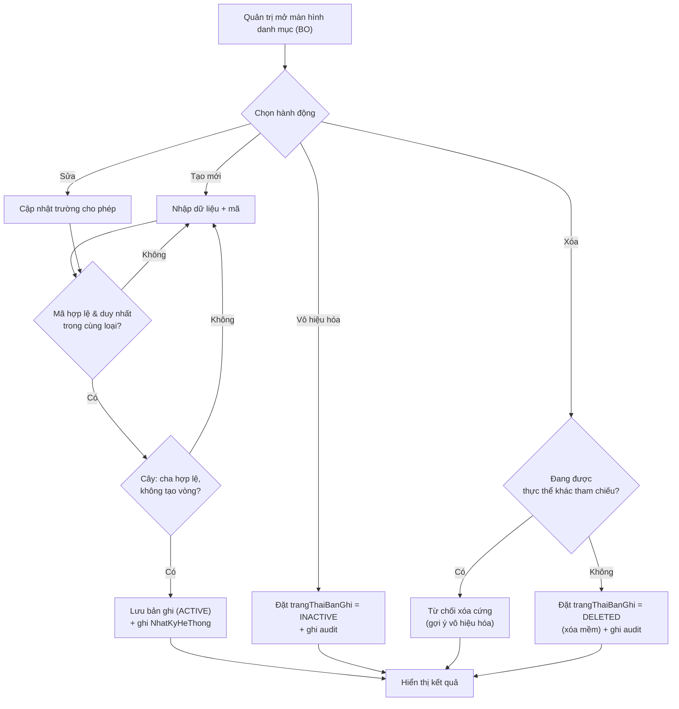

# Danh mục & cấu hình

> Nguồn sự thật về **nghiệp vụ** của feature. Mọi luật, dữ liệu, tiêu chí nghiệm thu
> nằm ở đây. `backoffice.md` chỉ mô tả giao diện và trỏ ngược về file này.

## 1. Bối cảnh & mục tiêu

B01 là **feature nền tảng dùng chung** của RMS: nó sở hữu các danh mục và tham số cấu hình mà hầu hết
các feature nghiệp vụ khác tham chiếu tới (đơn vị, lĩnh vực, loại sản phẩm, bộ tiêu chí đánh giá, mẫu
biểu thuyết minh, tham số hệ thống). Nếu các danh mục này không nhất quán hoặc bị sửa tùy tiện, dữ liệu
toàn hệ thống sẽ lệch: đề tài gắn sai lĩnh vực, hội đồng chấm sai thang điểm, đợt kêu gọi dùng mẫu cũ.

Hiện trạng (chưa có hệ thống): danh mục nằm rải rác trong file Excel/quy chế giấy, mỗi phòng ban giữ một
bản, không có lịch sử thay đổi. B01 tập trung hóa việc quản trị các danh mục này vào một nơi duy nhất,
thuần mặt **BackOffice (BO)**, do **Quản trị hệ thống** vận hành.

Kết quả mong đợi:

- Một nguồn dữ liệu danh mục/cấu hình thống nhất, có mã duy nhất, có lịch sử thay đổi (audit).
- Bảo vệ toàn vẹn tham chiếu: danh mục đang được feature khác dùng không bị xóa cứng làm hỏng dữ liệu.
- Cho phép thay đổi tham số vận hành (ngưỡng điểm xét duyệt, số ngày nhắc hạn báo cáo…) mà không cần
  sửa code/deploy lại.

## 2. Phạm vi

- **Trong phạm vi:**
  - Quản lý (xem, tạo, sửa, vô hiệu hóa/xóa mềm) các danh mục: **DonVi** (cây phân cấp), **LinhVuc**
    (cây phân cấp), **LoaiSanPham**.
  - Quản lý **CauHinhHeThong** (tham số khóa–giá trị) như ngưỡng điểm xét duyệt, số ngày nhắc hạn báo cáo…
  - Quản lý **BoTieuChi** và **TieuChiDanhGia** (bộ tiêu chí `XET_DUYET` / `NGHIEM_THU`, mỗi tiêu chí có
    `diemToiDa` và `trongSo`) dùng chung cho F03 (xét duyệt) và F06 (nghiệm thu).
  - Quản lý **mẫu biểu thuyết minh** (biểu mẫu được đợt kêu gọi F02 áp dụng) — cấu trúc biểu mẫu, không
    phải nội dung thuyết minh của từng đề tài.
  - Xóa mềm theo `trangThaiBanGhi` (`ACTIVE` | `INACTIVE` | `DELETED`); chặn xóa cứng khi đang được tham chiếu.
  - Ghi nhật ký (audit) cho mọi thay đổi danh mục/cấu hình.

- **Ngoài phạm vi:**
  - Quản lý **người dùng, vai trò, quyền** (RBAC) — thuộc B03.
  - Vòng đời **đợt kêu gọi** (mở/đóng đợt, gán mẫu biểu vào đợt) — thuộc F02; B01 chỉ cung cấp mẫu biểu
    để F02 lựa chọn.
  - Quá trình **chấm điểm** theo bộ tiêu chí — thuộc F03/F06; B01 chỉ định nghĩa bộ tiêu chí.
  - Mặt người dùng (FE): không có. Nhà khoa học chỉ **đọc gián tiếp** danh mục qua các feature khác.

## 3. Luồng nghiệp vụ chính

Luồng quản trị một mục danh mục (áp dụng chung cho mọi loại danh mục/cấu hình): tạo mới → sửa →
vô hiệu hóa hoặc xóa. Việc xóa luôn kiểm tra ràng buộc tham chiếu trước khi cho phép.

Luồng riêng của **BoTieuChi**: khi lưu/sửa bộ tiêu chí, hệ thống tính tổng `trongSo` các tiêu chí con
và **cảnh báo** nếu khác 100% (không chặn lưu — xem BR-07).

## 4. Business rules

| ID    | Quy tắc | Mô tả | Ghi chú |
|-------|---------|-------|---------|
| BR-01 | Mã danh mục duy nhất | Trường `ma` của mỗi danh mục (`DonVi`, `LinhVuc`, `LoaiSanPham`, `BoTieuChi`…) là duy nhất, không trùng trong cùng loại danh mục. Với `CauHinhHeThong`, `khoa` là duy nhất toàn cục. | Unique constraint ở CSDL; báo lỗi rõ ràng khi trùng. |
| BR-02 | Không xóa cứng danh mục đang dùng | Danh mục đang được thực thể khác tham chiếu (FK) không được xóa cứng (`ON DELETE RESTRICT`). Hệ thống chỉ cho **xóa mềm** (`trangThaiBanGhi = DELETED`) hoặc **vô hiệu hóa** (`INACTIVE`). | Bảo toàn dữ liệu lịch sử (đề tài cũ vẫn trỏ tới lĩnh vực đã ngừng dùng). |
| BR-03 | Cây không tạo vòng | Với danh mục cây (`DonVi.donViChaId`, `LinhVuc.linhVucChaId`), một nút **không thể** chọn chính nó hoặc một nút con/cháu của nó làm cha. | Kiểm tra chu trình trước khi lưu. |
| BR-04 | Vô hiệu hóa thay vì xóa khi còn tham chiếu | Mục `INACTIVE` không xuất hiện trong danh sách chọn mới ở các feature khác, nhưng vẫn hiển thị trên các bản ghi cũ đã gắn nó. | Mục `DELETED` ẩn hoàn toàn khỏi UI chọn mới. |
| BR-05 | Mọi thay đổi danh mục/cấu hình ghi audit | Tạo/sửa/vô hiệu/xóa mềm bất kỳ danh mục hay tham số cấu hình nào đều ghi `NhatKyHeThong` với `giaTriCu`/`giaTriMoi`. | Append-only; phục vụ truy vết ai-đổi-gì-khi-nào. |
| BR-06 | Tham số cấu hình đúng kiểu | `CauHinhHeThong.giaTri` phải hợp lệ theo `kieuDuLieu` (vd `INT`, `DECIMAL`, `BOOLEAN`, `STRING`). Lưu giá trị sai kiểu bị từ chối. | Ràng buộc tham số nghiệp vụ, vd ngưỡng điểm phải là số trong khoảng cho phép. |
| BR-07 | Tổng trọng số bộ tiêu chí nên bằng 100% | Tổng `trongSo` các `TieuChiDanhGia` trong một `BoTieuChi` **nên** bằng 100%. Nếu khác, hệ thống **cảnh báo** nhưng vẫn cho lưu. | Không chặn cứng để hỗ trợ bộ tiêu chí đang soạn dở. |
| BR-08 | Mỗi tiêu chí có điểm tối đa & trọng số hợp lệ | `TieuChiDanhGia.diemToiDa > 0` và `0 ≤ trongSo ≤ 100`. | Đảm bảo F03/F06 tính điểm tổng hợp được. |
| BR-09 | `LoaiSanPham.nhom` thuộc tập cố định | `nhom` chỉ nhận một trong `BAI_BAO` \| `SANG_CHE` \| `GIAI_PHAP` \| `DAO_TAO` \| `KHAC`. | Enum chốt cứng ở data-model, không sửa qua UI. |
| BR-10 | Phân quyền theo vai trò | Chỉ **Quản trị hệ thống** được CRUD toàn bộ danh mục. **Chuyên viên QL KHCN** chỉ được xem; riêng **BoTieuChi/TieuChiDanhGia** được quản lý (tạo/sửa) theo phân quyền nghiệp vụ. | Chi tiết ở `backoffice.md` §2 Permission matrix. |

## 5. Dữ liệu

Thực thể do B01 sở hữu, định nghĩa tại [`../../architecture/data-model.md`](../../architecture/data-model.md)
§4.2 (Danh mục dùng chung) và §4.4 (BoTieuChi/TieuChiDanhGia). B01 **không** định nghĩa lại trường mới
mà dùng đúng các trường đã có:

- **DonVi** (`id`, `ma`, `ten`, `donViChaId` self-FK, `trangThaiBanGhi`) — cây đơn vị.
- **LinhVuc** (`id`, `ma`, `ten`, `linhVucChaId` self-FK, `trangThaiBanGhi`) — cây lĩnh vực nghiên cứu.
- **LoaiSanPham** (`id`, `ma`, `ten`, `nhom` enum `BAI_BAO`|`SANG_CHE`|`GIAI_PHAP`|`DAO_TAO`|`KHAC`).
- **CauHinhHeThong** (`khoa` PK, `giaTri`, `kieuDuLieu`, `moTa`) — tham số khóa–giá trị.
- **BoTieuChi** (`id`, `ten`, `loai` `XET_DUYET`|`NGHIEM_THU`) & **TieuChiDanhGia**
  (`id`, `boTieuChiId`, `ten`, `diemToiDa`, `trongSo`) — dùng chung cho F03/F06.

Trường audit dùng chung (`createdAt/By`, `updatedAt/By`) và quy ước xóa mềm `trangThaiBanGhi`
(`ACTIVE`|`INACTIVE`|`DELETED`) theo data-model §1. Toàn vẹn tham chiếu `ON DELETE RESTRICT` theo
data-model §5.

**Đề xuất bổ sung** (cần thêm vào data-model nếu được duyệt, ngoài phạm vi trường hiện có):

- Mẫu biểu thuyết minh hiện được tham chiếu qua `DotKeuGoi.bieuMauThuyetMinhId` nhưng **chưa có thực thể
  riêng** trong data-model. *Đề xuất bổ sung* thực thể `BieuMauThuyetMinh`
  (`id`, `ma`, `ten`, `cauTruc` jsonb — danh sách trường/section, `trangThaiBanGhi`) để B01 quản lý
  vòng đời mẫu biểu. Trước khi được duyệt, các AC liên quan mẫu biểu coi là phụ thuộc mở (xem §7).
- `TieuChiDanhGia` hiện chưa có cờ ẩn/khôi phục riêng; dùng chung quy ước xóa mềm của bộ cha. Nếu cần
  vô hiệu từng tiêu chí, *đề xuất bổ sung* `trangThaiBanGhi` cho `TieuChiDanhGia`.

## 6. Acceptance criteria

- **AC-01** — Given Quản trị hệ thống đang ở màn hình quản lý `LinhVuc`, When tạo mới một lĩnh vực với
  `ma` chưa tồn tại và đầy đủ trường bắt buộc, Then bản ghi được lưu với `trangThaiBanGhi = ACTIVE` và
  một bản ghi `NhatKyHeThong` được tạo. *(happy)*
- **AC-02** — Given đã tồn tại một `LinhVuc` có `ma = "LV-01"`, When Quản trị tạo/sửa một lĩnh vực khác
  với `ma = "LV-01"`, Then hệ thống từ chối lưu và báo lỗi "mã đã tồn tại". *(biên – trùng mã, BR-01)*
- **AC-03** — Given một `DonVi` A là cha của `DonVi` B, When Quản trị sửa A để chọn B (hoặc chính A) làm
  `donViChaId`, Then hệ thống từ chối và báo "không thể tạo vòng trong cây đơn vị". *(lỗi – chu trình, BR-03)*
- **AC-04** — Given một `LinhVuc` đang được ít nhất một `DeTai` tham chiếu, When Quản trị yêu cầu xóa
  lĩnh vực đó, Then hệ thống **không** xóa cứng, mà thông báo lĩnh vực đang được sử dụng và đề nghị
  vô hiệu hóa thay thế. *(lỗi – RESTRICT, BR-02)*
- **AC-05** — Given một `LinhVuc` không còn bản ghi nào tham chiếu, When Quản trị xóa, Then bản ghi được
  đặt `trangThaiBanGhi = DELETED` (xóa mềm), không còn xuất hiện ở danh sách chọn mới, và audit được ghi.
  *(happy/biên – xóa mềm, BR-04/BR-05)*
- **AC-06** — Given Quản trị đang sửa tham số `CauHinhHeThong` có `khoa = "NGUONG_DIEM_XET_DUYET"` với
  `kieuDuLieu = DECIMAL`, When nhập giá trị không phải số (vd "abc"), Then hệ thống từ chối và báo lỗi
  sai kiểu dữ liệu. *(lỗi – kiểu dữ liệu, BR-06)*
- **AC-07** — Given Quản trị đang soạn một `BoTieuChi` loại `XET_DUYET` với các `TieuChiDanhGia` có tổng
  `trongSo` = 90%, When lưu bộ tiêu chí, Then hệ thống hiển thị **cảnh báo** "tổng trọng số chưa đạt 100%"
  nhưng vẫn lưu thành công. *(biên – cảnh báo, BR-07)*
- **AC-08** — Given một người dùng có vai trò **Chuyên viên QL KHCN** (không phải Quản trị hệ thống),
  When họ cố tạo/sửa danh mục `DonVi`, Then hệ thống từ chối với lỗi thiếu quyền; nhưng When họ tạo/sửa
  `BoTieuChi`, Then được phép theo phân quyền nghiệp vụ. *(quyền, BR-10)*
- **AC-09** — Given Quản trị tạo `TieuChiDanhGia` với `diemToiDa = 0`, When lưu, Then hệ thống từ chối và
  báo `diemToiDa` phải lớn hơn 0. *(lỗi – ràng buộc tiêu chí, BR-08)*

## 7. Phụ thuộc & rủi ro

- **Phụ thuộc xuôi (feature khác dùng B01):** F01/F02 dùng `LinhVuc`, mẫu biểu thuyết minh và bộ tiêu chí
  xét duyệt; F03/F06 dùng `BoTieuChi`/`TieuChiDanhGia`; F07 dùng `LoaiSanPham`; F04/B04 dùng
  `CauHinhHeThong` (số ngày nhắc hạn báo cáo). Mọi feature đều dùng `DonVi`.
- **Phụ thuộc ngược:** B03 cung cấp vai trò/quyền để kiểm soát truy cập B01 (RBAC). `audit` module ghi
  `NhatKyHeThong`.
- **Rủi ro – thay đổi cấu hình tác động vận hành:** đổi `NGUONG_DIEM_XET_DUYET` hay số ngày nhắc hạn ảnh
  hưởng ngay tới F03/F04 đang chạy. Giảm thiểu: ghi audit đầy đủ (BR-05) và cảnh báo phạm vi ảnh hưởng.
- **Rủi ro – xóa nhầm danh mục:** giảm thiểu bằng `RESTRICT` + xóa mềm (BR-02/BR-04).
- **Điểm cần làm rõ (mở):**
  1. Thực thể `BieuMauThuyetMinh` chưa có trong data-model — cần ADR/PR bổ sung trước khi triển khai
     phần quản lý mẫu biểu (xem §5 "đề xuất bổ sung").
  2. Ranh giới phân quyền `BoTieuChi` giữa Quản trị hệ thống và Chuyên viên QL KHCN cần PO chốt cuối
     (hiện đặt theo BR-10 và Permission matrix ở `backoffice.md`).
