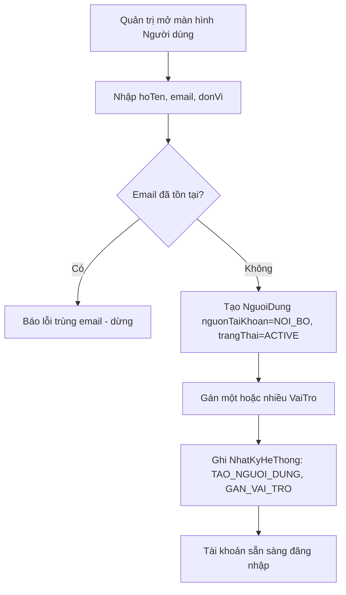
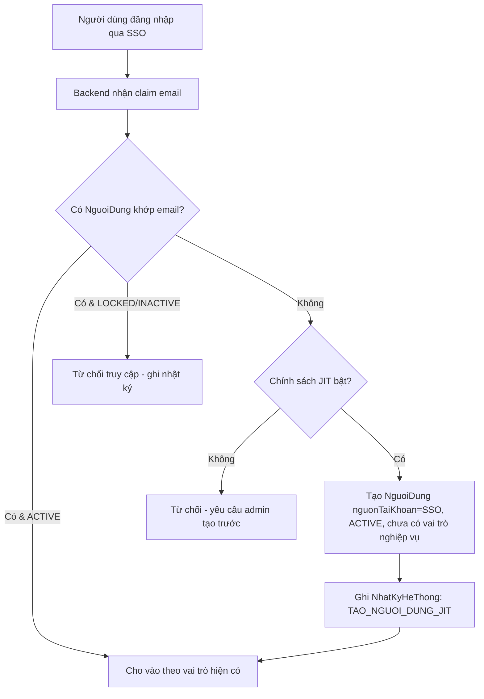
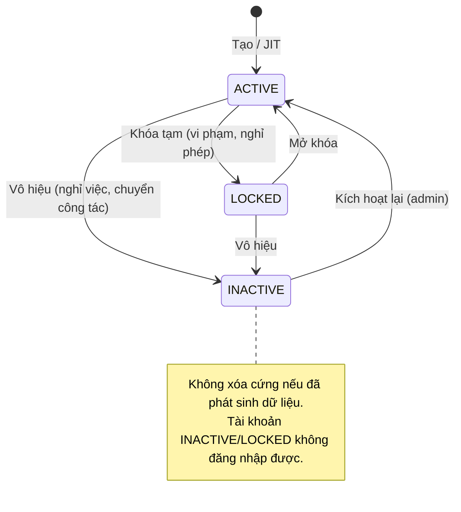
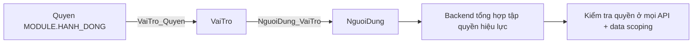

# Quản lý người dùng

> Nguồn sự thật về **nghiệp vụ** của feature. Mọi luật, dữ liệu, tiêu chí nghiệm thu
> nằm ở đây. `backoffice.md` chỉ mô tả giao diện và trỏ ngược về file này.

## 1. Bối cảnh & mục tiêu

RMS phục vụ nhiều nhóm người dùng với quyền hạn khác nhau (chủ nhiệm, thành viên, chuyên viên
QL KHCN, thành viên hội đồng, quản trị hệ thống). Để mọi feature nghiệp vụ (F01–F08, B01–B04)
kiểm soát truy cập đúng và truy vết được "ai làm gì", hệ thống cần một nơi quản lý tập trung
**tài khoản người dùng**, **vai trò** và **quyền**. Đây là feature nền tảng (module `iam`):
xác thực dựa trên SSO nội bộ, còn phân quyền theo mô hình RBAC do RMS tự quản
(xem [ADR-0005](../../architecture/decisions/0005-sso-va-rbac.md)).

Người dùng feature này: chủ yếu **Quản trị hệ thống**; **Chuyên viên QL KHCN** chỉ được xem
(tra cứu danh sách người dùng/đơn vị để phối hợp công việc).

Kết quả mong đợi:

- Mọi người dùng RMS có đúng một tài khoản `NguoiDung` định danh bằng email khớp SSO; tài khoản
  được tạo nội bộ hoặc tự sinh khi đăng nhập SSO lần đầu (just-in-time).
- Quản trị viên gán/gỡ vai trò và quyền cho người dùng mà không làm mất dữ liệu lịch sử họ đã tạo.
- Mọi thay đổi tài khoản, vai trò, quyền được ghi `NhatKyHeThong` để truy vết.

## 2. Phạm vi

- **Trong phạm vi:**
  - Quản lý tài khoản `NguoiDung`: tạo nội bộ (`nguonTaiKhoan = NOI_BO`), tự sinh từ SSO
    (`nguonTaiKhoan = SSO`, just-in-time), sửa thông tin, khóa (`LOCKED`) / mở khóa, vô hiệu (`INACTIVE`).
  - Quản lý vai trò chuẩn `VaiTro` (CRUD; vai trò hệ thống `laHeThong = true` không cho xóa).
  - Quản lý quyền nguyên tử `Quyen` dạng `MODULE.HANH_DONG`.
  - Gán/gỡ `Quyen` ↔ `VaiTro` và `VaiTro` ↔ `NguoiDung` (một người có thể có nhiều vai trò).
  - Định nghĩa **phạm vi dữ liệu (data scoping)** theo vai trò ở mức nguyên tắc.
- **Ngoài phạm vi:**
  - Cơ chế đăng nhập/đăng xuất, cấp & làm mới token SSO — thuộc hạ tầng xác thực
    (xem `../../architecture/integrations.md` §2 và `overview.md` §4.1).
  - Quản lý mẫu/nội dung thông báo gửi tới người dùng — thuộc B04.
  - Lý lịch khoa học (khung nhìn tổng hợp trên `NguoiDung`) — thuộc F08.
  - Quản lý cây đơn vị `DonVi` (chỉ tham chiếu) — thuộc B01.
  - Xóa cứng tài khoản đã phát sinh dữ liệu nghiệp vụ.

## 3. Luồng nghiệp vụ chính

### 3.1 Tạo & cấp quyền tài khoản nội bộ

### 3.2 Đăng nhập SSO lần đầu (just-in-time provisioning)

### 3.3 Khóa / mở khóa / vô hiệu tài khoản

### 3.4 Gán/gỡ vai trò & cấu hình quyền cho vai trò

Quản trị chọn một `VaiTro`, tick các `Quyen` thuộc vai trò đó; chọn một `NguoiDung`, gán/gỡ các
`VaiTro`. Backend tổng hợp **tập quyền hiệu lực** = hợp của quyền từ mọi vai trò đang gán cho
người dùng (chỉ tính tài khoản `ACTIVE`).

## 4. Business rules

| ID | Quy tắc | Mô tả | Ghi chú |
|----|---------|-------|---------|
| BR-01 | Email là định danh duy nhất khớp SSO | `NguoiDung.email` là `unique`, không phân biệt hoa/thường; dùng để ánh xạ claim `email` từ SSO. Không cho tạo/sửa trùng email đã tồn tại. | Khóa ghép SSO ↔ RMS, xem ADR-0005 |
| BR-02 | Không tự khóa/vô hiệu chính mình | Quản trị viên đang đăng nhập không được khóa (`LOCKED`) hay vô hiệu (`INACTIVE`) chính tài khoản của mình, tránh tự khóa hệ thống. | So sánh theo `id` phiên đăng nhập |
| BR-03 | Vai trò hệ thống không xóa | `VaiTro` có `laHeThong = true` (5 vai trò chuẩn) không được xóa và không đổi `ma`; chỉ được sửa `moTa` và tập quyền. | Tránh hỏng phân quyền nền |
| BR-04 | Không xóa cứng tài khoản đã phát sinh dữ liệu | Tài khoản đã là `createdBy`/`chuNhiemId`/`nguoiThucHienId`… của bất kỳ bản ghi nào chỉ được chuyển `INACTIVE`, không xóa cứng, để giữ toàn vẹn tham chiếu lịch sử. | Phù hợp `ON DELETE RESTRICT` (data-model §5) |
| BR-05 | Một người nhiều vai trò; quyền là hợp | Một `NguoiDung` có thể được gán nhiều `VaiTro`; tập quyền hiệu lực là **hợp** các quyền của các vai trò đó. Chỉ tài khoản `ACTIVE` mới có quyền hiệu lực. | `NguoiDung_VaiTro` nhiều-nhiều |
| BR-06 | Gỡ vai trò không xóa dữ liệu lịch sử | Khi gỡ một `VaiTro` khỏi người dùng, các bản ghi người đó đã tạo/tham gia trước đó **không** bị xóa hay đổi tác giả; chỉ ngừng cấp quyền từ thời điểm gỡ. | Audit ghi `GO_VAI_TRO` |
| BR-07 | Quyền theo định dạng `MODULE.HANH_DONG` | `Quyen.ma` phải đúng dạng `MODULE.HANH_DONG` (vd `DE_TAI.DUYET`, `NGUOI_DUNG.KHOA`), unique. Không cho tạo quyền trùng mã. | Chuẩn hóa kiểm tra quyền backend |
| BR-08 | Backend là lớp thực thi quyền duy nhất | Mọi API kiểm tra quyền tại backend; BO chỉ ẩn/hiện theo quyền, không thay backend quyết định. Phạm vi dữ liệu (data scoping) áp dụng cùng tầng. | ADR-0005 §Hệ quả |
| BR-09 | Tài khoản SSO không sửa email tại RMS | Với `nguonTaiKhoan = SSO`, `email` là dữ liệu được đồng bộ từ SSO, không cho sửa tại BO; chỉ tài khoản `NOI_BO` mới sửa được email. | Tránh lệch ánh xạ danh tính |

## 5. Dữ liệu

Tham chiếu `../../architecture/data-model.md` §4.1 (Người dùng & phân quyền). B03 **không** định nghĩa
lại thực thể; chỉ liệt kê thực thể/trường dùng và ràng buộc đặc thù.

| Thực thể | Trường dùng | Ghi chú B03 |
|----------|-------------|-------------|
| `NguoiDung` | `id`, `maNguoiDung`, `hoTen`, `email`, `soDienThoai`, `donViId`, `hocHamHocVi`, `nguonTaiKhoan` (`SSO`\|`NOI_BO`), `trangThai` (`ACTIVE`\|`LOCKED`\|`INACTIVE`) | `email` unique không phân biệt hoa/thường (BR-01); `trangThai` theo state machine §3.3 |
| `VaiTro` | `id`, `ma` (unique), `ten`, `moTa`, `laHeThong` (bool) | 5 vai trò chuẩn có `laHeThong = true` (xem §Vai trò chuẩn) |
| `Quyen` | `id`, `ma` (unique, `MODULE.HANH_DONG`), `moTa` | Quyền nguyên tử (BR-07) |
| `NguoiDung_VaiTro` | (`nguoiDungId`, `vaiTroId`) unique | Bảng nối nhiều-nhiều (BR-05) |
| `VaiTro_Quyen` | (`vaiTroId`, `quyenId`) unique | Bảng nối nhiều-nhiều |
| `DonVi` | `id`, `ten` (tham chiếu) | Quản lý ở B01; B03 chỉ gán `donViId` |
| `NhatKyHeThong` | `nguoiThucHienId`, `hanhDong`, `loaiDoiTuong`, `doiTuongId`, `giaTriCu`, `giaTriMoi`, `thoiGian`, `diaChiIp` | Ghi mọi thay đổi tài khoản/vai trò/quyền (§Audit ở backoffice.md) |

### Vai trò chuẩn (khớp `personas.md`)

| `ma` | `ten` | `laHeThong` | Mặt dùng chính |
|------|-------|:-----------:|----------------|
| `CHU_NHIEM_DE_TAI` | Chủ nhiệm đề tài | ✓ | FE |
| `THANH_VIEN_DE_TAI` | Thành viên đề tài | ✓ | FE |
| `CHUYEN_VIEN_QL_KHCN` | Chuyên viên QL KHCN | ✓ | BO |
| `THANH_VIEN_HOI_DONG` | Thành viên hội đồng | ✓ | BO |
| `QUAN_TRI_HE_THONG` | Quản trị hệ thống | ✓ | BO |

> **Đề xuất bổ sung** (chưa có trong data-model, cần thêm trong cùng PR khi triển khai):
> cờ chính sách JIT provisioning nên đặt ở `CauHinhHeThong` (B01) với khóa
> `iam.jit_provisioning_enabled` (kiểu bool) thay vì hardcode — dùng cho luồng §3.2.

## 6. Acceptance criteria

- **AC-01** (Happy — tạo nội bộ) — *Given* quản trị viên đã đăng nhập với quyền `NGUOI_DUNG.TAO`,
  *When* tạo `NguoiDung` với email chưa tồn tại và gán vai trò `CHUYEN_VIEN_QL_KHCN`,
  *Then* tài khoản được tạo với `nguonTaiKhoan = NOI_BO`, `trangThai = ACTIVE`, có vai trò đã gán,
  và `NhatKyHeThong` ghi `TAO_NGUOI_DUNG` + `GAN_VAI_TRO`.
- **AC-02** (Happy — JIT từ SSO) — *Given* chính sách JIT bật và email đăng nhập SSO chưa có tài khoản,
  *When* người dùng đăng nhập SSO lần đầu, *Then* hệ thống tạo `NguoiDung` với `nguonTaiKhoan = SSO`,
  `trangThai = ACTIVE`, chưa có vai trò nghiệp vụ, và ghi `NhatKyHeThong` `TAO_NGUOI_DUNG_JIT`.
- **AC-03** (Biên — trùng email) — *Given* đã có `NguoiDung` với email `a@benhvien.vn`,
  *When* quản trị tạo/sửa một tài khoản khác dùng email `A@benhvien.vn` (khác hoa/thường),
  *Then* hệ thống từ chối với lỗi trùng email và không tạo/sửa bản ghi (BR-01).
- **AC-04** (Lỗi/quyền — tự khóa) — *Given* quản trị viên X đang đăng nhập,
  *When* X cố khóa hoặc vô hiệu chính tài khoản của X, *Then* hệ thống từ chối với thông báo
  "Không thể khóa/vô hiệu tài khoản đang đăng nhập" và giữ nguyên `trangThai` (BR-02).
- **AC-05** (Lỗi — xóa vai trò hệ thống) — *Given* vai trò `QUAN_TRI_HE_THONG` có `laHeThong = true`,
  *When* quản trị cố xóa vai trò này, *Then* hệ thống từ chối với lỗi "Không xóa được vai trò hệ thống"
  và vai trò vẫn tồn tại (BR-03).
- **AC-06** (Happy — gán nhiều vai trò, quyền là hợp) — *Given* người dùng U đang `ACTIVE`,
  *When* quản trị gán cho U cả `CHU_NHIEM_DE_TAI` và `THANH_VIEN_HOI_DONG`,
  *Then* tập quyền hiệu lực của U là hợp các quyền của hai vai trò, và `NhatKyHeThong` ghi `GAN_VAI_TRO` (BR-05).
- **AC-07** (Biên — gỡ vai trò giữ dữ liệu) — *Given* người dùng U từng tạo các đề tài và có vai trò
  `CHU_NHIEM_DE_TAI`, *When* quản trị gỡ vai trò `CHU_NHIEM_DE_TAI` khỏi U,
  *Then* các đề tài do U tạo vẫn tồn tại với `chuNhiemId`/`createdBy = U` không đổi, U mất quyền từ vai trò đó,
  và audit ghi `GO_VAI_TRO` (BR-06).
- **AC-08** (Lỗi — không xóa cứng tài khoản có dữ liệu) — *Given* tài khoản U đã là chủ nhiệm của ≥1 đề tài,
  *When* quản trị cố xóa cứng U, *Then* hệ thống từ chối xóa cứng và chỉ cho chuyển `INACTIVE` (BR-04).
- **AC-09** (Lỗi/quyền — đăng nhập tài khoản bị khóa) — *Given* tài khoản U có `trangThai = LOCKED`,
  *When* U đăng nhập qua SSO, *Then* hệ thống từ chối truy cập và ghi `NhatKyHeThong` `TU_CHOI_DANG_NHAP`.
- **AC-10** (Lỗi — quyền không đủ ở BO) — *Given* người dùng có vai trò `CHUYEN_VIEN_QL_KHCN` (chỉ xem),
  *When* gọi API tạo/sửa người dùng, *Then* backend trả 403 dù BO có ẩn nút, vì backend là lớp thực thi quyền (BR-08).

## 7. Phụ thuộc & rủi ro

**Phụ thuộc:**

- SSO nội bộ (OIDC/SAML) — `../../architecture/integrations.md` §2; quyết định nền — [ADR-0005](../../architecture/decisions/0005-sso-va-rbac.md).
- `DonVi` (B01) cho trường `donViId`; `CauHinhHeThong` (B01) cho cờ JIT (đề xuất bổ sung §5).
- `NhatKyHeThong` & module `audit` cho ghi nhật ký.
- Mọi feature F01–F08, B01–B04 phụ thuộc B03 cho danh tính và kiểm tra quyền.

**Rủi ro & điểm cần làm rõ:**

| Rủi ro | Ảnh hưởng | Giảm thiểu |
|--------|-----------|------------|
| Phân quyền sai gây lộ/lệch dữ liệu | Cao | Backend thực thi quyền duy nhất (BR-08); review ma trận quyền; data scoping |
| SSO sự cố không đăng nhập được | Cao | Tài khoản `NOI_BO` dự phòng (integrations §2), có audit riêng |
| JIT tạo tài khoản rác (email lạ vẫn vào được SSO) | Trung bình | Cờ JIT có thể tắt; tài khoản JIT chưa có vai trò nghiệp vụ cho tới khi admin gán |
| Email SSO đổi (đổi tên đăng nhập) làm lệch ánh xạ | Trung bình | Cần quy trình hợp nhất tài khoản — *điểm cần làm rõ với đội SSO* |
| Quản trị tự khóa toàn bộ admin | Cao | BR-02 chặn tự khóa; *đề xuất* cảnh báo khi còn ≤1 tài khoản `QUAN_TRI_HE_THONG` đang `ACTIVE` |
