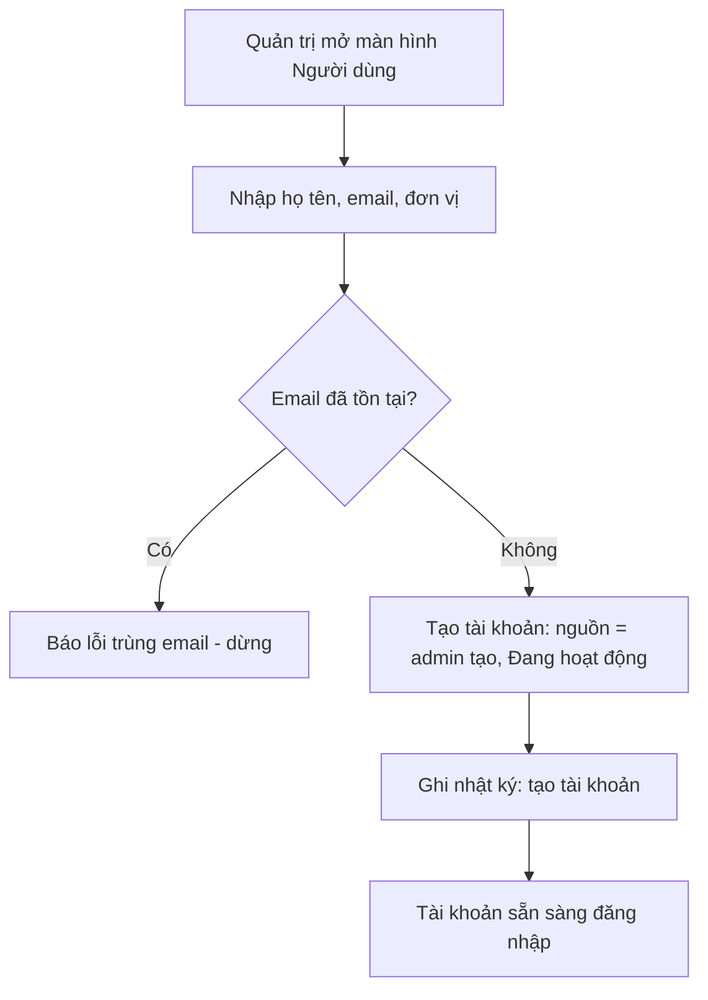
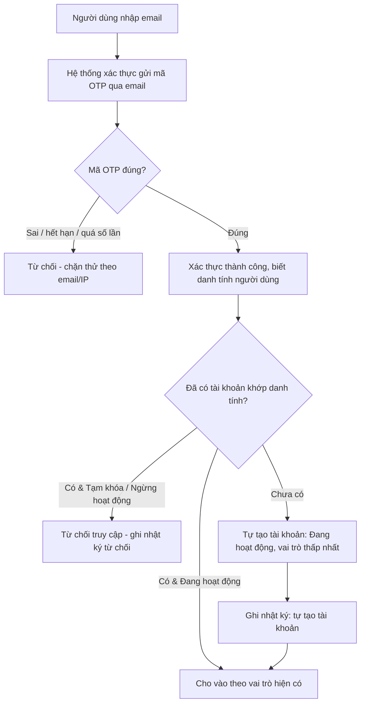
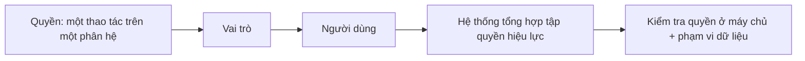
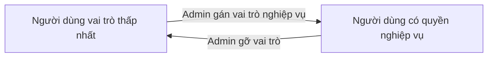

# Quản lý người dùng

> **Nguồn sự thật về nghiệp vụ** của feature — do **PO/BA sở hữu và duyệt**. Mọi luật, dữ liệu,
> tiêu chí nghiệm thu nằm ở đây, viết bằng **ngôn ngữ nghiệp vụ**.
>
> **Cách hiện thực kỹ thuật** (Keycloak, định danh, mô hình quyền, API) ở [`design.md`](./design.md) —
> DEV sở hữu. Giao diện ở `ui.md`; kiểm thử ở `test-plan.md`. Cả ba đều trỏ ngược về file này.

## 1. Bối cảnh & mục tiêu

RMS phục vụ nhiều nhóm người dùng với quyền hạn khác nhau (chủ nhiệm, thành viên, chuyên viên QL KHCN,
thành viên hội đồng, quản trị hệ thống). Để mọi feature nghiệp vụ (F01–F08, B01–B04) kiểm soát truy cập
đúng và truy vết được "ai làm gì", hệ thống cần một nơi quản lý tập trung **tài khoản người dùng**,
**vai trò** và **quyền**.

Hai việc tách bạch:
- **Đăng nhập (ai là ai):** do một **hệ thống xác thực tập trung** lo — đăng nhập bằng **email + mã OTP**,
  **không dùng mật khẩu** ([ADR-0008](../../architecture/decisions/0008-keycloak-idp-dang-nhap-email-otp.md)).
- **Phân quyền (được làm gì):** do **RMS** tự quản — vai trò và quyền
  ([ADR-0005](../../architecture/decisions/0005-sso-va-rbac.md)).

Người dùng feature này: chủ yếu **Quản trị hệ thống**; **Chuyên viên QL KHCN** chỉ được xem (tra cứu
danh sách người dùng/đơn vị để phối hợp công việc).

**Kết quả mong đợi:**
- Mỗi người dùng RMS có đúng một tài khoản, gắn với một danh tính đăng nhập duy nhất; tài khoản do admin
  tạo trước **hoặc tự tạo lần đầu đăng nhập** — khi đó nhận **vai trò thấp nhất**, chờ admin nâng quyền.
- Quản trị viên gán/gỡ vai trò và quyền cho người dùng mà **không làm mất** dữ liệu lịch sử họ đã tạo.
- Mọi thay đổi tài khoản, vai trò, quyền đều được **ghi nhật ký** để truy vết.

> **Trạng thái tài khoản** (ngôn ngữ nghiệp vụ): **Đang hoạt động** · **Tạm khóa** · **Ngừng hoạt động**.
> Ánh xạ sang enum kỹ thuật ở [`design.md §0`](./design.md).

## 2. Phạm vi

- **Trong phạm vi:**
  - Quản lý tài khoản người dùng: admin tạo trước **hoặc** tài khoản **tự tạo** khi đăng nhập email-OTP lần
    đầu; sửa thông tin; **tạm khóa** / mở khóa; **ngừng hoạt động**.
  - **Nâng/hạ quyền** người dùng: gán/gỡ vai trò nghiệp vụ (đặc biệt nâng từ vai trò thấp nhất lên vai trò
    nghiệp vụ).
  - **Chính sách OTP** đăng nhập: thời hạn hiệu lực của mã, số lần thử, chặn thử quá nhiều theo email
    (chống dò mật khẩu/dò tài khoản).
  - Quản lý **vai trò** (thêm/sửa/xóa; vai trò hệ thống không cho xóa).
  - Quản lý **quyền** (mỗi quyền là một thao tác trên một phân hệ).
  - Gán/gỡ **quyền cho vai trò** và **vai trò cho người dùng** (một người có thể có nhiều vai trò).
  - Định nghĩa **phạm vi dữ liệu** theo vai trò ở mức nguyên tắc.
- **Ngoài phạm vi:**
  - Cơ chế kỹ thuật phát/đổi phiên đăng nhập, gửi email OTP, cấu hình hệ thống xác thực — thuộc hạ tầng
    ([ADR-0008](../../architecture/decisions/0008-keycloak-idp-dang-nhap-email-otp.md),
    [`integrations.md §2`](../../architecture/integrations.md)). *Chính sách* OTP (thời hạn/số lần thử) thì
    **thuộc** B03 (xem in-scope).
  - Mẫu/nội dung thông báo gửi tới người dùng — thuộc B04.
  - Lý lịch khoa học (khung nhìn tổng hợp trên người dùng) — thuộc F08.
  - Quản lý cây đơn vị (chỉ tham chiếu) — thuộc B01.
  - Xóa cứng tài khoản đã phát sinh dữ liệu nghiệp vụ.

## 3. Luồng nghiệp vụ chính

### 3.1 Tạo tài khoản (admin tạo trước)

### 3.2 Đăng nhập email-OTP lần đầu (tự tạo tài khoản)

> Tự tạo tài khoản **luôn bật** ở giai đoạn đầu (không có công tắc bật/tắt). Tài khoản mới chỉ có **vai trò
> thấp nhất** cho tới khi admin nâng quyền (§3.5). Rủi ro người lạ tự tạo tài khoản được bù bằng việc chặn
> thử quá nhiều (BR-11) và việc vai trò thấp nhất chưa có quyền nghiệp vụ nào.

### 3.3 Khóa / mở khóa / ngừng hoạt động tài khoản

### 3.4 Gán/gỡ vai trò & cấu hình quyền cho vai trò

Quản trị chọn một **vai trò**, tick các **quyền** thuộc vai trò đó; chọn một **người dùng**, gán/gỡ các
**vai trò**. Hệ thống tổng hợp **tập quyền hiệu lực** = hợp của quyền từ mọi vai trò đang gán cho người
dùng (chỉ tính tài khoản **Đang hoạt động**).

### 3.5 Nâng/hạ quyền người dùng

Vì tài khoản tự tạo chỉ có vai trò thấp nhất, quản trị **nâng quyền** bằng cách gán vai trò nghiệp vụ
(chuyên viên QL KHCN, thành viên hội đồng…) và **hạ quyền** bằng cách gỡ vai trò. Đây là luồng vận hành
chính (cách "admin tạo tài khoản trước" vẫn giữ khi cần).

## 4. Business rules

| ID | Quy tắc | Mô tả | Ghi chú |
|----|---------|-------|---------|
| BR-01 | Một người, một tài khoản, một danh tính | Mỗi người dùng có đúng một tài khoản, gắn 1-1 với một danh tính đăng nhập duy nhất; email cũng không được trùng (không phân biệt hoa/thường). | Cách khóa định danh: `design.md` (ADR-0008). |
| BR-02 | Không tự khóa/ngừng chính mình | Quản trị viên đang đăng nhập không được tạm khóa hay ngừng hoạt động **chính** tài khoản của mình, tránh tự khóa hệ thống. | — |
| BR-03 | Vai trò hệ thống không xóa | Các vai trò chuẩn của hệ thống không được xóa và không đổi mã; chỉ được sửa mô tả và tập quyền. | Tránh hỏng phân quyền nền. |
| BR-04 | Không xóa cứng tài khoản đã phát sinh dữ liệu | Tài khoản đã từng tạo/tham gia bất kỳ bản ghi nào chỉ được **ngừng hoạt động**, không xóa cứng, để giữ toàn vẹn lịch sử. | Hiện thực: `design.md`. |
| BR-05 | Một người nhiều vai trò; quyền là hợp | Một người có thể có nhiều vai trò; tập quyền hiệu lực là **hợp** các quyền của các vai trò đó. Chỉ tài khoản **Đang hoạt động** mới có quyền hiệu lực. | — |
| BR-06 | Gỡ vai trò không xóa dữ liệu lịch sử | Khi gỡ một vai trò khỏi người dùng, các bản ghi người đó đã tạo/tham gia trước đó **không** bị xóa hay đổi tác giả; chỉ ngừng cấp quyền từ thời điểm gỡ. | Ghi nhật ký gỡ vai trò. |
| BR-07 | Quyền là thao tác nguyên tử, mã duy nhất | Mỗi quyền là một thao tác trên một phân hệ (vd: duyệt đề tài, khóa người dùng), có mã duy nhất, không trùng. | Định dạng mã: `design.md`. |
| BR-08 | Quyền được kiểm tra ở máy chủ | Mọi thao tác đều được kiểm tra quyền ở **máy chủ**; giao diện chỉ ẩn/hiện theo quyền, **không** phải lớp bảo vệ. Phạm vi dữ liệu cũng áp ở máy chủ. | ADR-0005. |
| BR-09 | Email do hệ thống xác thực quản | Email (và danh tính đăng nhập) do hệ thống xác thực quản; **không** sửa email trực tiếp trong RMS. Muốn đổi email thì đổi ở hệ thống xác thực rồi đồng bộ về. | Tránh lệch ánh xạ danh tính (ADR-0008). |
| BR-10 | Tài khoản tự tạo nhận vai trò thấp nhất | Đăng nhập email-OTP lần đầu với danh tính chưa có trong RMS → tạo tài khoản **Đang hoạt động**, gán **vai trò thấp nhất** (chỉ xem nội dung công khai theo cấu hình); mọi quyền nghiệp vụ phải do admin nâng (§3.5). | ADR-0008. |
| BR-11 | OTP có thời hạn & chặn thử quá nhiều | Mã OTP có thời hạn hiệu lực và giới hạn số lần thử; vượt ngưỡng → khóa tạm theo email (chống dò mật khẩu, giảm dò tài khoản). Tham số do admin cấu hình. | Tham số đặt ở cấu hình hệ thống (B01) — `design.md`. |

## 5. Dữ liệu (mức khái niệm)

Các đối tượng nghiệp vụ B03 quản (mô hình bảng/trường ở [`design.md §2`](./design.md) và
[`../../architecture/data-model.md §4.1`](../../architecture/data-model.md)):

- **Người dùng:** họ tên, email, số điện thoại, đơn vị, học hàm/học vị, **nguồn tạo tài khoản** (admin tạo
  hay tự tạo), **trạng thái** (Đang hoạt động / Tạm khóa / Ngừng hoạt động).
  > B03 sở hữu **khung tài khoản & định danh** (email, vai trò, quyền, trạng thái). **Nội dung hồ sơ cá
  > nhân** (giới tính, năm sinh, địa chỉ, chức vụ, học hàm/học vị + năm nhận, quá trình công tác) do
  > **[F08](../F08-ly-lich-khoa-hoc/spec.md)** sở hữu — người dùng **tự cập nhật**; admin chỉ sửa hộ.
- **Vai trò:** nhóm quyền có tên & mô tả; một số là **vai trò hệ thống** (không xóa được — BR-03).
- **Quyền:** một thao tác nguyên tử trên một phân hệ (BR-07).
- **Gán quyền cho vai trò** và **gán vai trò cho người dùng** (đều nhiều–nhiều).
- **Nhật ký (audit):** ghi mọi thay đổi tài khoản / vai trò / quyền — ai, làm gì, khi nào, giá trị trước/sau.

### Vai trò chuẩn của hệ thống (khớp [`personas.md`](../../product/personas.md))

| Vai trò | Mặt dùng chính |
|---------|----------------|
| Người dùng cơ bản (đã đăng nhập, tự tạo) — *vai trò thấp nhất* | FE |
| Chủ nhiệm đề tài | FE |
| Thành viên đề tài | FE |
| Chuyên viên QL KHCN | BO |
| Thành viên hội đồng | BO |
| Quản trị hệ thống | BO |

> Mã kỹ thuật của các vai trò và cờ "vai trò hệ thống" ở [`design.md §2`](./design.md).
>
> **Phân biệt với persona Khách:** "Người dùng cơ bản" là **đã đăng nhập** (baseline), khác với *Khách*
> (truy cập công khai **chưa** đăng nhập) — hai khái niệm **tách bạch**, dù phạm vi xem có thể trùng phần
> nội dung công khai.

## 6. Acceptance criteria

Viết theo Given / When / Then bằng ngôn ngữ nghiệp vụ. Khẳng định mức field (tên enum, mã hành động) để ở
`test-plan.md`/`design.md`.

- **AC-01** (happy — admin tạo tài khoản) — Given quản trị viên đã đăng nhập với quyền tạo người dùng,
  When tạo tài khoản với email chưa tồn tại, Then tài khoản được tạo với nguồn **admin tạo**, trạng thái
  **Đang hoạt động**, và nhật ký ghi *tạo tài khoản*.
- **AC-02** (happy — tự tạo tài khoản qua email-OTP) — Given một email chưa có tài khoản RMS, When người
  dùng đăng nhập email-OTP lần đầu và nhập đúng mã, Then hệ thống tạo tài khoản **Đang hoạt động**, gán
  đúng **vai trò thấp nhất**, và ghi nhật ký *tự tạo tài khoản* (BR-10).
- **AC-03** (biên — trùng email) — Given đã có tài khoản với email `a@benhvien.vn`, When quản trị tạo/sửa một
  tài khoản khác dùng email `A@benhvien.vn` (khác hoa/thường), Then hệ thống từ chối với lỗi trùng email và
  không tạo/sửa bản ghi (BR-01).
- **AC-04** (lỗi/quyền — tự khóa) — Given quản trị viên X đang đăng nhập, When X cố khóa hoặc ngừng hoạt
  động **chính** tài khoản của X, Then hệ thống từ chối với thông báo "Không thể khóa/ngừng tài khoản đang
  đăng nhập" và giữ nguyên trạng thái (BR-02).
- **AC-05** (lỗi — xóa vai trò hệ thống) — Given vai trò **Quản trị hệ thống** là vai trò hệ thống, When
  quản trị cố xóa vai trò này, Then hệ thống từ chối với lỗi "Không xóa được vai trò hệ thống" và vai trò
  vẫn tồn tại (BR-03).
- **AC-06** (happy — gán nhiều vai trò, quyền là hợp) — Given người dùng U đang **Đang hoạt động**, When
  quản trị gán cho U cả **Chủ nhiệm đề tài** và **Thành viên hội đồng**, Then tập quyền hiệu lực của U là
  hợp các quyền của hai vai trò, và nhật ký ghi *gán vai trò* (BR-05).
- **AC-07** (biên — gỡ vai trò giữ dữ liệu) — Given người dùng U từng tạo các đề tài và có vai trò **Chủ
  nhiệm đề tài**, When quản trị gỡ vai trò này khỏi U, Then các đề tài do U tạo **vẫn tồn tại** và vẫn ghi
  nhận U là người tạo/chủ nhiệm, U mất quyền từ vai trò đó, và nhật ký ghi *gỡ vai trò* (BR-06).
- **AC-08** (lỗi — không xóa cứng tài khoản có dữ liệu) — Given tài khoản U đã là chủ nhiệm của ≥1 đề tài,
  When quản trị cố xóa cứng U, Then hệ thống từ chối xóa cứng và chỉ cho **ngừng hoạt động** (BR-04).
- **AC-09** (lỗi/quyền — đăng nhập tài khoản bị khóa) — Given tài khoản U **Tạm khóa**, When U nhập đúng mã
  OTP, Then hệ thống **vẫn từ chối** truy cập và ghi nhật ký *từ chối đăng nhập*.
- **AC-10** (lỗi — quyền không đủ) — Given người dùng có vai trò **Chuyên viên QL KHCN** (chỉ xem), When
  thực hiện thao tác tạo/sửa người dùng, Then hệ thống từ chối **dù giao diện có ẩn nút**, vì quyền được
  kiểm tra ở máy chủ (BR-08).
- **AC-11** (bảo mật — OTP sai quá ngưỡng) — Given một email nhập mã OTP sai quá số lần cho phép, When tiếp
  tục thử, Then hệ thống **khóa tạm theo email** và không cho đăng nhập (BR-11).
- **AC-12** (happy — nâng quyền) — Given tài khoản U đang ở **vai trò thấp nhất** (tự tạo), When quản trị gán
  vai trò **Chuyên viên QL KHCN**, Then U có quyền của vai trò đó (hợp quyền, BR-05) và nhật ký ghi *gán vai
  trò* (§3.5).

## 7. Phụ thuộc & rủi ro

**Phụ thuộc:**
- **Hệ thống xác thực tập trung** (đăng nhập email-OTP) —
  [ADR-0008](../../architecture/decisions/0008-keycloak-idp-dang-nhap-email-otp.md);
  **phân quyền** do RMS quản — [ADR-0005](../../architecture/decisions/0005-sso-va-rbac.md);
  [`integrations.md §2`](../../architecture/integrations.md).
- **Hạ tầng gửi email** để gửi mã OTP (liên quan B04).
- **Đơn vị** (B01) cho trường đơn vị công tác; **cấu hình hệ thống** (B01) cho tham số OTP.
- **Nhật ký (audit)** cho ghi vết.
- Mọi feature F01–F08, B01–B04 phụ thuộc B03 cho danh tính và kiểm tra quyền.

**Rủi ro & điểm cần làm rõ:**

| Rủi ro | Ảnh hưởng | Giảm thiểu |
|--------|-----------|------------|
| Phân quyền sai gây lộ/lệch dữ liệu | Cao | Quyền kiểm ở máy chủ (BR-08); review ma trận quyền; phạm vi dữ liệu |
| Hệ thống xác thực sự cố, không đăng nhập được | Cao | Lối khẩn cấp qua admin của hệ thống xác thực (không còn lối mật khẩu RMS — ADR-0008); giám sát, nhật ký riêng |
| Người lạ tự tạo tài khoản (mọi email nhận được OTP đều vào được) | Trung bình | Chặn thử quá nhiều (BR-11); vai trò thấp nhất chưa có quyền nghiệp vụ tới khi admin nâng; cân nhắc giới hạn theo tên miền email nếu cần siết |
| Đổi email gây lệch danh tính | Thấp | Khóa theo danh tính đăng nhập (bất biến) thay vì email (BR-01); email chỉ là thuộc tính đồng bộ |
| Quản trị tự khóa toàn bộ admin | Cao | BR-02 chặn tự khóa; *đề xuất* cảnh báo khi còn ≤1 tài khoản Quản trị hệ thống Đang hoạt động |

**Điểm nghiệp vụ cần PO chốt (mở):**
- Có giới hạn tên miền email được phép tự tạo tài khoản không? (siết rủi ro người lạ).
- Có cần cảnh báo "còn ≤1 admin đang hoạt động" trước khi khóa/ngừng không?
