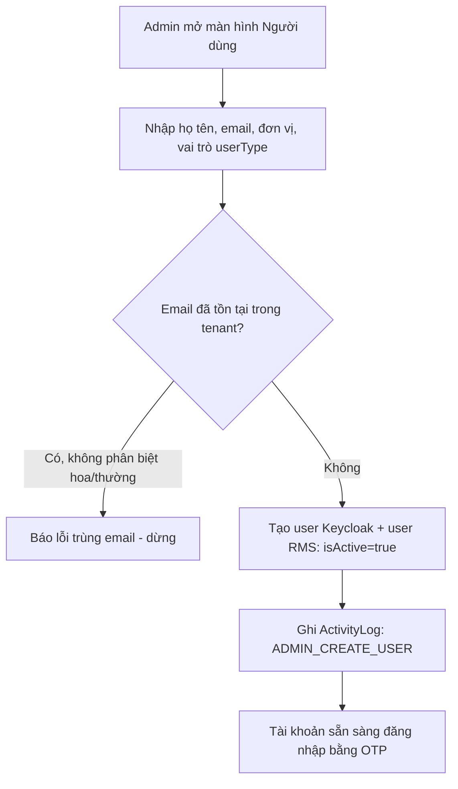
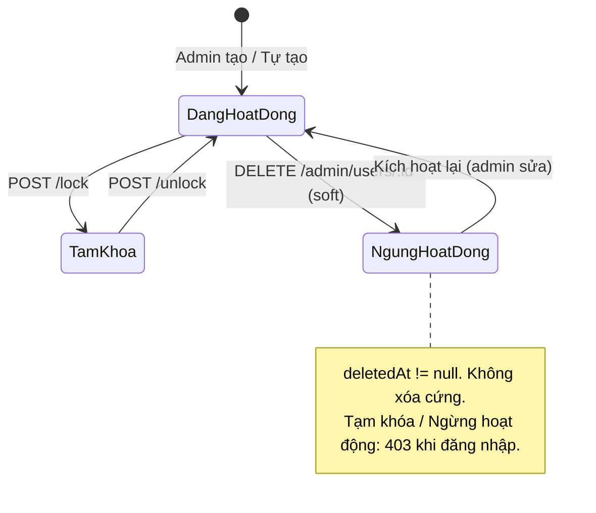
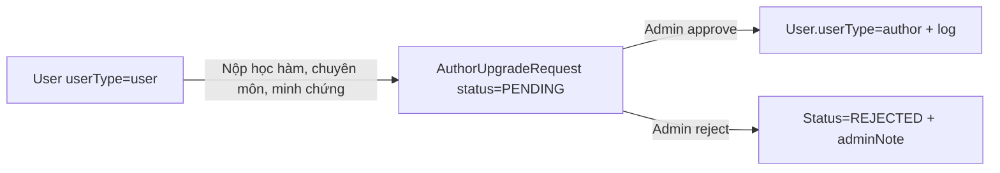

# Quản lý người dùng

> **Nguồn sự thật về nghiệp vụ** của feature — do **PO/BA sở hữu và duyệt**. Mọi luật, dữ liệu,
> tiêu chí nghiệm thu nằm ở đây, viết bằng **ngôn ngữ nghiệp vụ**.
>
> **Cách hiện thực kỹ thuật** (Keycloak, định danh, mô hình quyền, API) ở [`design.md`](./design.md) —
> DEV sở hữu. Giao diện ở `ui.md`; kiểm thử ở `test-plan.md`. Cả ba đều trỏ ngược về file này.

## 1. Bối cảnh & mục tiêu

RMS phục vụ nhiều nhóm người dùng với quyền hạn khác nhau (chủ nhiệm đề tài, chuyên viên QL KHCN,
thành viên hội đồng, quản trị hệ thống, người dùng cơ bản). Để mọi feature nghiệp vụ (F01–F11, B01–B04)
kiểm soát truy cập đúng và truy vết được "ai làm gì", hệ thống cần một nơi quản lý tập trung
**tài khoản người dùng**, **vai trò cố định** và **quyền chức năng**.

Hai việc tách bạch:
- **Đăng nhập (ai là ai):** do **hệ thống xác thực tập trung Keycloak** lo — đăng nhập bằng
  **email + mã OTP**, không mật khẩu ([ADR-0008](../../architecture/decisions/0008-keycloak-idp-dang-nhap-email-otp.md)).
- **Phân quyền (được làm gì):** do **RMS** tự quản — vai trò (userType) và quyền chức năng
  ([ADR-0005](../../architecture/decisions/0005-sso-va-rbac.md)).

Người dùng feature này: chủ yếu **Quản trị hệ thống**; **Chuyên viên QL KHCN** chỉ được xem danh sách
người dùng để phối hợp công việc.

**Kết quả mong đợi:**
- Mỗi người dùng RMS có đúng một tài khoản, gắn 1-1 với một danh tính Keycloak; tài khoản do admin
  tạo trước **hoặc tự tạo lần đầu đăng nhập** — khi đó nhận vai trò `user` (thấp nhất), chờ admin
  nâng quyền hoặc chờ tự xin nâng cấp thành `author`.
- Quản trị viên đổi vai trò và gán thêm quyền cho người dùng mà **không làm mất** dữ liệu lịch sử.
- Mọi thay đổi tài khoản, vai trò, quyền đều được **ghi ActivityLog** để truy vết.

> **Trạng thái tài khoản** (ngôn ngữ nghiệp vụ): **Đang hoạt động** · **Tạm khóa** · **Ngừng hoạt động**.
> Ánh xạ sang cặp `isActive` + `deletedAt` ở [`design.md §0`](./design.md).

## 2. Phạm vi

- **Trong phạm vi:**
  - Quản lý tài khoản người dùng: admin tạo trước **hoặc** tài khoản **tự tạo** khi đăng nhập Keycloak
    lần đầu; sửa thông tin cá nhân; **tạm khóa** / mở khóa; **ngừng hoạt động** (soft delete).
  - **Đổi vai trò** người dùng: gán một trong 4 vai trò cố định (`author` / `admin` / `user` / `staff`).
  - Gán **quyền chức năng bổ sung** cho một người dùng cụ thể (ghi ActivityLog audit, chưa persist DB).
  - **Yêu cầu nâng cấp thành `author`**: người dùng `user` nộp hồ sơ (học hàm/học vị, chuyên môn, minh
    chứng); admin duyệt hoặc từ chối.
  - Đồng bộ tài khoản với Keycloak (endpoint `/auth/me` + `/users/me`).
- **Ngoài phạm vi:**
  - Cơ chế kỹ thuật phát/đổi phiên đăng nhập, gửi email OTP, cấu hình Keycloak realm — thuộc hạ tầng
    ([ADR-0008](../../architecture/decisions/0008-keycloak-idp-dang-nhap-email-otp.md)).
  - **Chính sách OTP** (thời hạn, số lần thử, chặn dò email): **cấu hình ở Keycloak realm**, không thuộc
    RMS (xem BR-11).
  - Mẫu/nội dung thông báo gửi tới người dùng — thuộc B04.
  - Lý lịch khoa học (khung nhìn tổng hợp) — thuộc F08.
  - Quản lý cây đơn vị (chỉ tham chiếu `departmentId`) — thuộc B01.
  - Xóa cứng tài khoản đã phát sinh dữ liệu nghiệp vụ.
  - Tạo/sửa/xóa **vai trò** động (RMS dùng enum cố định `UserType`, không có bảng `Role`).
  - Tạo/sửa/xóa **catalog quyền** (danh mục 17 quyền hardcode trong code, xem BR-07).

## 3. Luồng nghiệp vụ chính

### 3.1 Tạo tài khoản (admin tạo trước)

Endpoint: `POST /admin/users`.

### 3.2 Tự tạo tài khoản (Keycloak first login)

Endpoint: `GET /auth/me` (sync từ token) hoặc `GET /users/me` (kèm cờ `isNew`).

```mermaid
flowchart TD
    A[Người dùng nhập email] --> B[Keycloak gửi OTP + xác thực]
    B --> V{OTP đúng?}
    V -->|Sai / hết hạn / quá số lần| X[Keycloak từ chối - chặn theo email]
    V -->|Đúng| K[Xác thực thành công, có JWT với keycloakId]
    K --> C{RMS đã có user khớp keycloakId?}
    C -->|Có & isActive=true| H[Vào theo userType hiện có, isNew=false]
    C -->|Có & isActive=false| L[403 - từ chối truy cập, ghi log]
    C -->|Chưa có| F[Tự tạo user RMS: userType=user, isActive=true, isProfileComplete=false]
    F --> G[Ghi ActivityLog: tự tạo]
    G --> H2[Trả về isNew=true để FE mở form hoàn tất hồ sơ]
```

> Tự tạo tài khoản luôn bật. User mới nhận vai trò `user` (thấp nhất, chỉ có quyền `meetings.view`) cho
> tới khi admin đổi vai trò (§3.4) hoặc user tự nộp hồ sơ xin nâng cấp `author` (§3.6).

### 3.3 Khóa / mở khóa tài khoản

Endpoint: `POST /admin/users/:id/lock` và `POST /admin/users/:id/unlock`.

Kiểm tra bắt buộc trước khi khóa:
- **BR-02**: nếu `targetUserId == currentUserId` → 400 "Không thể tự khóa tài khoản của mình".
- **BR-12**: nếu target là admin cuối cùng đang hoạt động trong tenant → 409 "Phải còn tối thiểu 1
  admin đang hoạt động".

### 3.4 Đổi vai trò (change userType)

Endpoint: `POST /admin/users/:id/change-role`.

Admin chọn user, chọn `userType` mới trong 4 giá trị `author | admin | user | staff`. Hệ thống:
1. Kiểm tra BR-12 (không cho phép hạ admin cuối cùng xuống vai trò khác).
2. Ghi ActivityLog `ADMIN_CHANGE_USER_ROLE` (before/after).
3. Cập nhật `User.userType`. Tập quyền hiệu lực auto derive từ `ROLE_PERMISSIONS[userType]`.

> **Không có** thao tác "gán nhiều vai trò". Mỗi user chỉ có **1 vai trò** (§5, BR-05).

### 3.5 Gán quyền chức năng bổ sung

Endpoint: `PATCH /admin/permissions/:userId` với body `{ permissions: FeaturePermission[] }`.

Admin chọn tick các quyền trong catalog 17 quyền cứng (BR-07). Hệ thống:
1. Validate mọi quyền đều thuộc `FEATURE_PERMISSIONS`.
2. Ghi ActivityLog `ADMIN_UPDATE_PERMISSIONS` (metadata gồm danh sách quyền cũ/mới).
3. **Chưa persist** vào bảng riêng — audit-only ở giai đoạn này (xem note §5).

Tập quyền hiệu lực = `ROLE_PERMISSIONS[user.userType]` (RolesGuard đọc từ code).

### 3.6 Yêu cầu nâng cấp thành `author`

Endpoint người dùng: `POST /users/me/author-request`.
Endpoint admin: `PATCH /users/author-requests/:id/approve` hoặc `.../reject`.

- User cung cấp: `academicTitle`, `specialty`, `licenseNo?`, `graduationYear?`, `researchDirection?`,
  `evidenceFileUrls[]`.
- Admin xem hồ sơ, quyết định. Kết quả ghi `reviewedById`, `reviewedAt`, `adminNote`.
- Không tự nâng: chỉ admin mới đổi `userType` (BR-13).

## 4. Business rules

| ID | Quy tắc | Mô tả | Ghi chú |
|----|---------|-------|---------|
| BR-01 | Email unique per tenant | Trong một tenant, email không được trùng (không phân biệt hoa/thường). Unique constraint `(tenantId, email)`. | `schema.prisma` User. |
| BR-02 | Không tự khóa chính mình | Admin đang đăng nhập không được khóa/ngừng chính tài khoản của mình. Kiểm tra ở service. | 400 BadRequest. |
| BR-04 | Không xóa cứng tài khoản có dữ liệu | `DELETE /admin/users/:id` chỉ set `isActive=false` + `deletedAt=now()`. Không xóa hàng khỏi DB. | Giữ toàn vẹn lịch sử. |
| BR-05 | Mỗi user chỉ **một** vai trò | `User.userType` là enum đơn trị (`author \| admin \| user \| staff`). Không có bảng many-to-many. Tập quyền hiệu lực = `ROLE_PERMISSIONS[userType]` + quyền custom (nếu có, hiện audit-only). | Khác BRD sơ khai. |
| BR-07 | Catalog quyền cố định | 17 quyền chức năng hardcode trong `FEATURE_PERMISSIONS`. Mã duy nhất, ngôn ngữ nghiệp vụ mô tả ở `PERMISSION_DESCRIPTIONS`. Không thêm/sửa qua UI. | Thêm quyền = release code. |
| BR-08 | Quyền kiểm ở server | Mọi endpoint áp `RolesGuard` — merge `realm_access.roles` (Keycloak) và `userType` (RMS DB), so với `@Roles(...)` decorator. Giao diện chỉ ẩn/hiện, **không** thay thế guard. | ADR-0005. |
| BR-09 | Email do Keycloak quản | Email + danh tính đăng nhập do Keycloak sở hữu. RMS không cho sửa email trực tiếp; muốn đổi thì đổi ở Keycloak rồi đồng bộ về qua `/auth/me`. | Tránh lệch định danh. |
| BR-10 | User tự tạo → vai trò `user` | Login Keycloak lần đầu → RMS tạo record `userType=user` (thấp nhất, chỉ có `meetings.view`). Mọi quyền nghiệp vụ phải do admin nâng (§3.4) hoặc qua author-request (§3.6). | Rủi ro người lạ bù bằng BR-11 (Keycloak). |
| BR-11 | Chính sách OTP ở Keycloak realm | Thời hạn OTP, số lần thử, chặn brute-force theo email — cấu hình ở **Keycloak realm**, không thuộc RMS. RMS chỉ tin JWT. | *Out-of-scope B03*. |
| BR-12 | Tối thiểu 1 admin đang hoạt động | Không được khóa/soft-delete/change-role admin cuối cùng đang `isActive=true` của tenant. Kiểm tra count trước khi commit. | 409 Conflict "Phải còn tối thiểu 1 admin đang hoạt động". |
| BR-13 | Author upgrade cần admin duyệt | User không được tự đổi `userType`. Muốn thành `author` phải nộp `AuthorUpgradeRequest`; chỉ admin `approve` mới thay đổi. | Reject cần `adminNote`. |

## 5. Dữ liệu (mức khái niệm)

Chi tiết ánh xạ bảng/cột ở [`design.md §2`](./design.md) và
[`../../architecture/data-model.md §4.1`](../../architecture/data-model.md).

### 5.1 Người dùng (`User`)

Trường nghiệp vụ chính:
- **Định danh**: `id` (UUID RMS), `keycloakId` (unique, do Keycloak sở hữu), `tenantId`, `email`.
- **Hồ sơ**: `fullName`, `phone`, `departmentId` (→ B01), `positionId` (→ B01), `academicTitle`,
  `graduationYear`, `licenseNo`, `researchDirection`, `specialty`, `isProfileComplete`.
- **Vai trò & trạng thái**: `userType` (enum), `isActive` (khóa/mở), `deletedAt` (soft delete).
- **Audit**: `createdAt`, `updatedAt`.

> B03 sở hữu **khung tài khoản & định danh** (email, userType, quyền, trạng thái). **Nội dung học thuật
> chi tiết** (quá trình công tác, quá trình học tập, xuất bản) do **[F08](../F08-ly-lich-khoa-hoc/spec.md)**
> sở hữu — người dùng tự cập nhật; admin chỉ sửa hộ.

### 5.2 Vai trò (`UserType` enum — cố định)

| Giá trị | Mặt dùng | Quyền mặc định (từ `ROLE_PERMISSIONS`) |
|---------|----------|----------------------------------------|
| `admin` | Quản trị hệ thống | Full 17 quyền |
| `staff` | Chuyên viên QL KHCN (BO) | 11 quyền: `research.proposals`, `research.reviews`, `research.evaluations`, `councils.view`, `councils.manage`, `meetings.view`, `meetings.manage`, `reports.view`, `reports.export`, `users.manage`, `notifications.send` |
| `author` | Chủ nhiệm đề tài (FE) | 3 quyền: `research.projects`, `research.proposals`, `meetings.view` (BE tự filter theo `authorId`) |
| `user` | Người dùng cơ bản (đã đăng nhập) | 1 quyền: `meetings.view` |

> Enum cố định trong `schema.prisma` — muốn thêm role phải sửa Prisma migration + `ROLE_PERMISSIONS`.
> Không có bảng `Role`, không có UI CRUD role.
>
> **Phân biệt với Khách**: `user` là **đã đăng nhập** (baseline), khác Khách công khai chưa đăng nhập.

### 5.3 Quyền chức năng (`FEATURE_PERMISSIONS` — cố định)

17 quyền hardcode trong `src/modules/admin/constants/permissions.constant.ts`:

- **Nghiên cứu**: `research.projects`, `research.proposals`, `research.reviews`, `research.evaluations`.
- **Hội đồng & họp**: `councils.view`, `councils.manage`, `meetings.view`, `meetings.manage`,
  `meetings.report`, `meetings.settings`.
- **Chứng nhận**: `certificates.view`, `certificates.manage`.
- **Báo cáo**: `reports.view`, `reports.export`.
- **Quản trị**: `users.manage`, `catalog.manage`, `notifications.send`.

Mỗi mã có mô tả tiếng Việt (BR-07). FE dùng để ẩn/hiện menu; BE dùng `RolesGuard` để enforce.

### 5.4 Yêu cầu nâng cấp author (`AuthorUpgradeRequest`)

`id`, `tenantId`, `userId`, `status` (`PENDING | APPROVED | REJECTED`), `academicTitle`, `specialty`,
`licenseNo?`, `graduationYear?`, `researchDirection?`, `evidenceFileUrls[]`, `adminNote?`, `reviewedById?`,
`reviewedAt?`, `createdAt`, `updatedAt`.

### 5.5 Quyền custom per user (giai đoạn hiện tại: audit-only)

Endpoint `PATCH /admin/permissions/:userId` **không** persist vào bảng dedicated — chỉ ghi
`ActivityLog.metadata` với `permissions[]`. Tập quyền hiệu lực khi RolesGuard chạy vẫn dựa trên
`ROLE_PERMISSIONS[userType]`.

> **Điểm cần PO chốt**: có triển khai bảng `UserPermission` để override per-user không, hay giữ nguyên
> mô hình "1 role = 1 tập quyền cố định"?

### 5.6 Nhật ký (`ActivityLog`)

Ghi mọi thay đổi tài khoản với `action` trong tập:
`ADMIN_CREATE_USER`, `ADMIN_UPDATE_USER`, `ADMIN_DELETE_USER`, `ADMIN_CHANGE_USER_ROLE`,
`ACCOUNT_LOCKED`, `ACCOUNT_UNLOCKED`, `ADMIN_UPDATE_PERMISSIONS`. Trường: `userId`, `tenantId`,
`action`, `metadata` (JSON before/after), `createdAt`.

## 6. Acceptance criteria

Viết theo Given / When / Then bằng ngôn ngữ nghiệp vụ; enum/mã action ở `test-plan.md` + `design.md`.

- **AC-01** (happy — admin tạo tài khoản) — Given admin có quyền `users.manage`, When gọi
  `POST /admin/users` với email chưa tồn tại trong tenant, Then user được tạo với `isActive=true`,
  `userType` như body request, và ghi `ActivityLog: ADMIN_CREATE_USER`.
- **AC-02** (happy — tự tạo qua Keycloak first login) — Given email chưa có user RMS, When gọi
  `GET /auth/me` với JWT hợp lệ, Then RMS tạo user `userType=user`, `isActive=true`,
  `isProfileComplete=false`, trả `isNew=true` và ghi log (BR-10).
- **AC-03** (biên — trùng email case-insensitive) — Given tenant đã có `a@bv.vn`, When admin tạo user
  khác với `A@bv.vn`, Then hệ thống từ chối 409 và không tạo bản ghi (BR-01).
- **AC-04** (lỗi — admin tự khóa) — Given admin X đang đăng nhập, When X gọi
  `POST /admin/users/{X.id}/lock`, Then 400 "Không thể tự khóa tài khoản của mình" và giữ nguyên
  trạng thái (BR-02).
- **AC-07** (biên — không xóa cứng) — Given user U có ≥1 đề tài, When admin gọi `DELETE /admin/users/:id`,
  Then user chỉ được set `isActive=false` + `deletedAt=now()`; đề tài do U tạo vẫn còn (BR-04).
- **AC-08** (lỗi — user bị khóa cố đăng nhập) — Given user U `isActive=false`, When U nhập đúng OTP
  Keycloak và có JWT hợp lệ, When gọi bất kỳ endpoint RMS, Then RMS trả 403 và ghi log từ chối.
- **AC-09** (lỗi — quyền không đủ) — Given user `userType=user` (chỉ có `meetings.view`), When gọi
  `POST /admin/users`, Then RolesGuard trả 403 dù giao diện có ẩn nút (BR-08).
- **AC-11** (happy — đổi vai trò) — Given user U `userType=user`, When admin gọi
  `POST /admin/users/{U.id}/change-role` với body `{ userType: 'staff' }`, Then U có quyền của
  `staff` (11 quyền), và ghi `ActivityLog: ADMIN_CHANGE_USER_ROLE` với before/after.
- **AC-12** (happy — lock/unlock) — Given user U `isActive=true`, When admin `POST /admin/users/{U.id}/lock`,
  Then 200 + U có `isActive=false`, ghi `ACCOUNT_LOCKED`. When admin `POST /.../unlock`, Then U trở lại
  `isActive=true` và ghi `ACCOUNT_UNLOCKED`.
- **AC-13** (happy — author upgrade) — Given user U `userType=user`, When U gọi
  `POST /users/me/author-request` với hồ sơ hợp lệ, Then hệ thống tạo `AuthorUpgradeRequest`
  `status=PENDING`. When admin gọi `PATCH /users/author-requests/:id/approve`, Then U có
  `userType=author` (3 quyền), request `status=APPROVED`, ghi log (BR-13).
- **AC-14** (biên — khóa admin cuối cùng) — Given tenant chỉ còn 1 admin `isActive=true` là U, When admin
  khác cố `POST /admin/users/{U.id}/lock` (hoặc `change-role`, hoặc `DELETE`), Then 409 "Phải còn tối
  thiểu 1 admin đang hoạt động" và giữ nguyên (BR-12).

> Chính sách OTP (thời hạn, số lần thử, chặn brute-force theo email) **thuộc Keycloak realm**, không có
> AC riêng ở RMS (xem BR-11).

## 7. Phụ thuộc & rủi ro

**Phụ thuộc:**
- **Keycloak** (đăng nhập email-OTP + realm role) —
  [ADR-0008](../../architecture/decisions/0008-keycloak-idp-dang-nhap-email-otp.md);
  **Phân quyền RolesGuard** — [ADR-0005](../../architecture/decisions/0005-sso-va-rbac.md);
  [`integrations.md §2`](../../architecture/integrations.md).
- **Hạ tầng gửi email** (do Keycloak realm cấu hình) để gửi OTP.
- **Đơn vị** (B01) cho trường `departmentId`, `positionId` (chỉ FK reference, không dùng B01 catalog cho
  role/permission).
- **ActivityLog** (nội bộ RMS) — ghi vết mọi thao tác admin.
- Mọi feature F01–F11, B01–B04 phụ thuộc B03 cho danh tính (`userId`) và kiểm tra quyền
  (`FEATURE_PERMISSIONS`).

**Rủi ro & điểm cần làm rõ:**

| Rủi ro | Ảnh hưởng | Giảm thiểu |
|--------|-----------|------------|
| Phân quyền sai gây lộ/lệch dữ liệu | Cao | Quyền kiểm ở server (BR-08); review ma trận `ROLE_PERMISSIONS`; test guard theo endpoint. |
| Keycloak sự cố, không đăng nhập được | Cao | Lối khẩn cấp qua Keycloak admin console; giám sát; RMS log riêng khi verify JWT lỗi. |
| Người lạ tự tạo tài khoản (mọi email nhận được OTP đều vào được) | Trung bình | Chặn thử OTP ở Keycloak (BR-11); `userType=user` chỉ có 1 quyền `meetings.view`; cân nhắc giới hạn tên miền email nếu cần siết. |
| Đổi email gây lệch danh tính | Thấp | Khóa theo `keycloakId` (unique) thay vì email; email chỉ là thuộc tính đồng bộ. |
| Admin tự khóa toàn bộ | Cao | BR-02 (chặn tự khóa) + BR-12 (min 1 admin active) đã enforce ở service. |
| Custom permissions không persist DB | Trung bình | Hiện chỉ audit; **PO cần chốt** có làm bảng `UserPermission` để override per-user không. |

**Điểm nghiệp vụ cần PO chốt (mở):**
- Có giới hạn tên miền email được phép tự tạo tài khoản không?
- Có triển khai persist quyền custom per-user (§5.5) không, hay giữ mô hình "1 role = 1 tập quyền cố định"?
- Có cần cảnh báo UI "còn ≤1 admin đang hoạt động" trước khi khóa/change-role (bổ sung UX cho BR-12)?

## 8. Divergent from v0.3

Spec v0.4 rewrite bám sát code hiện tại. Khác v0.3:

- **BỎ** khái niệm "Vai trò động" — v0.3 mô tả bảng `Role` + `UserRole` + `RolePermission` many-to-many.
  Code thực tế dùng enum `UserType` cố định 4 giá trị; không có UI CRUD role. §5.2 rewrite theo enum.
- **BỎ BR-03** ("vai trò hệ thống không xóa") — không applicable vì không có bảng role, không có
  thao tác xóa role.
- **BỎ BR-05 many-to-many** — code cho **mỗi user đúng 1 `userType`**. BR-05 mới: single-role, quyền
  derive từ `ROLE_PERMISSIONS[userType]`.
- **BỎ BR-06** ("gỡ vai trò không xóa lịch sử") — không applicable, vì không có thao tác "gỡ vai trò"
  (chỉ có `change-role` thay giá trị enum).
- **BỎ AC-05** (xóa vai trò hệ thống), **AC-06** (union quyền từ nhiều role) — không áp dụng.
- **BỎ AC-10** trong v0.3 (OTP throttle) → chuyển thành BR-11 out-of-scope (Keycloak realm quản).
- **THÊM BR-12** (min 1 admin active) — code đã enforce với 409 Conflict.
- **THÊM BR-13** (author upgrade request cần admin duyệt) — code có `AuthorUpgradeRequest` model +
  endpoint approve/reject.
- **THÊM AC-13** (author upgrade flow), **AC-14** (lock admin cuối cùng).
- **THÊM §5.4** (AuthorUpgradeRequest schema), **§5.5** (custom permissions audit-only), **§5.6**
  (ActivityLog action list).
- **§3.5 rewrite**: "gán quyền" hiện chỉ là audit ActivityLog, không persist bảng riêng — spec ghi rõ
  hạn chế này và đánh dấu điểm cần PO chốt.
