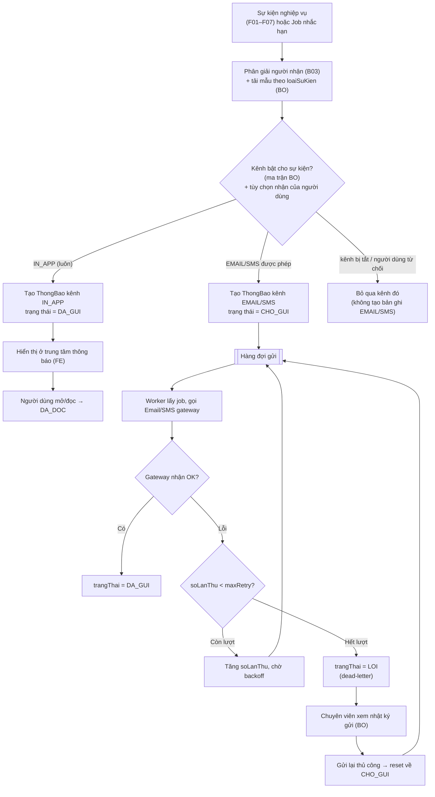

# Thông báo

> Nguồn sự thật về **nghiệp vụ** của feature. Mọi luật, dữ liệu, tiêu chí nghiệm thu
> nằm ở đây. `frontend.md` và `backoffice.md` chỉ mô tả giao diện và trỏ ngược về file này.

## 1. Bối cảnh & mục tiêu

B04 là feature **xuyên suốt (cross-cutting)**: không phải một quy trình nghiệp vụ độc lập mà là
hạ tầng gửi thông báo, được kích hoạt bởi các sự kiện của F01–F07 và các job định kỳ. Hôm nay
nhà khoa học và chuyên viên nắm trạng thái hồ sơ chủ yếu qua email rời rạc hoặc nhắc miệng — dễ
trễ hạn báo cáo, bỏ lỡ kết quả xét duyệt/nghiệm thu, không truy được "đã gửi cho ai, khi nào".

Feature cung cấp một cơ chế thống nhất: **sự kiện nghiệp vụ → tạo `ThongBao` → đẩy hàng đợi →
worker gửi theo kênh (IN_APP/EMAIL/SMS) → cập nhật trạng thái**, có retry và dead-letter, có mẫu
nội dung quản lý tập trung theo `loaiSuKien` (không hardcode), tôn trọng tùy chọn nhận của người dùng.

Kết quả mong đợi:

- Mọi sự kiện quan trọng trong vòng đời đề tài đều phát thông báo **in-app** tới đúng người nhận,
  kèm email/SMS khi phù hợp.
- Người dùng có **trung tâm thông báo** để xem/lọc/đánh dấu đã đọc và **tự quản tùy chọn** nhận email/SMS.
- Quản trị/Chuyên viên **quản lý mẫu**, **bật/tắt kênh theo sự kiện**, **theo dõi nhật ký gửi** và **gửi lại** khi lỗi.

## 2. Phạm vi

- **Trong phạm vi:**
  - Tiếp nhận sự kiện nghiệp vụ từ F01–F07 và từ job nhắc hạn, sinh `ThongBao` theo người nhận và kênh.
  - Hàng đợi gửi, worker gửi đa kênh, cơ chế retry và đánh trạng thái `LOI` (dead-letter) khi quá số lần.
  - Trung tâm thông báo in-app (FE) cho mọi người dùng: danh sách, lọc, đánh dấu đã đọc.
  - Tùy chọn nhận thông báo của người dùng (bật/tắt EMAIL/SMS theo nhóm sự kiện).
  - Quản lý **mẫu thông báo** theo `loaiSuKien` và **ma trận sự kiện ↔ kênh** (BO).
  - Theo dõi **nhật ký gửi** (DA_GUI/LOI) và **gửi lại** thủ công (BO).
- **Ngoài phạm vi:**
  - Hạ tầng gửi thật (SMTP/SMS provider): do Email/SMS gateway đảm nhận — xem `../../architecture/integrations.md` §3.
  - Định nghĩa **khi nào** sự kiện xảy ra (logic chuyển trạng thái đề tài): thuộc về F01–F07 và `data-model.md` §3.
  - Quản lý người nhận / vai trò: thuộc B03; cấu hình tham số (số ngày nhắc hạn): thuộc B01 (`CauHinhHeThong`).
  - Kênh push/native mobile, Zalo OA — có thể mở rộng sau, ngoài phiên bản này.

## 3. Luồng nghiệp vụ chính

Luồng cốt lõi: **phát sinh sự kiện → tạo ThongBao (per người nhận × kênh) → hàng đợi → worker gửi →
cập nhật trạng thái**, có nhánh lỗi/retry và dead-letter. IN_APP coi như gửi thành công ngay khi tạo
(người dùng đọc trong portal); EMAIL/SMS đi qua gateway nên có thể lỗi và phải thử lại.

> Lưu ý: một sự kiện có thể sinh **nhiều bản ghi `ThongBao`** = (số người nhận) × (số kênh được phép).
> Mỗi bản ghi có vòng đời trạng thái độc lập. IN_APP và EMAIL/SMS của cùng một sự kiện là các bản ghi riêng.

### Bảng sự kiện ↔ kênh ↔ người nhận

`loaiSuKien` là enum chuỗi; tên gợi ý dưới đây dùng nhất quán trong toàn hệ thống. Cột "Kênh mặc định"
là cấu hình khởi tạo, Quản trị có thể bật/tắt ở BO (xem `backoffice.md`). "Ưu tiên" = cao thì mới mở SMS.

| loaiSuKien | Sự kiện (feature) | Người nhận | Kênh mặc định | Ưu tiên |
|---|---|---|---|---|
| `DOT_KEU_GOI_MO` | Mở đợt kêu gọi (F02) | Nhà khoa học thuộc lĩnh vực của đợt | IN_APP, EMAIL | Thường |
| `DE_XUAT_TRA_LAI` | Đề xuất bị trả lại bổ sung (F01) | Chủ nhiệm | IN_APP, EMAIL | Cao |
| `DE_XUAT_TIEP_NHAN` | Đề xuất được tiếp nhận hợp lệ (F01) | Chủ nhiệm | IN_APP, EMAIL | Thường |
| `XET_DUYET_DUYET` | Kết quả xét duyệt = DUYET (F03) | Chủ nhiệm, thành viên đề tài | IN_APP, EMAIL, SMS | Cao |
| `XET_DUYET_TU_CHOI` | Kết quả xét duyệt = TU_CHOI (F03) | Chủ nhiệm | IN_APP, EMAIL | Cao |
| `BAO_CAO_SAP_HAN` | Báo cáo tiến độ sắp đến hạn (F04, job) | Chủ nhiệm | IN_APP, EMAIL | Thường |
| `BAO_CAO_QUA_HAN` | Báo cáo tiến độ đã quá hạn (F04, job) | Chủ nhiệm, chuyên viên phụ trách | IN_APP, EMAIL, SMS | Cao |
| `KINH_PHI_CHENH_LECH` | Đối soát phát sinh chênh lệch `LECH` (F05) | Chủ nhiệm, chuyên viên phụ trách | IN_APP, EMAIL | Cao |
| `NGHIEM_THU_LICH` | Lịch nghiệm thu được lập (F06) | Chủ nhiệm, thành viên hội đồng | IN_APP, EMAIL, SMS | Cao |
| `NGHIEM_THU_KET_QUA` | Kết quả nghiệm thu DAT/KHONG_DAT (F06) | Chủ nhiệm | IN_APP, EMAIL, SMS | Cao |
| `SAN_PHAM_DUYET` | Sản phẩm khoa học được duyệt (F07) | Chủ nhiệm/chủ kê khai | IN_APP, EMAIL | Thường |
| `SAN_PHAM_TU_CHOI` | Sản phẩm khoa học bị từ chối (F07) | Chủ nhiệm/chủ kê khai | IN_APP, EMAIL | Thường |

## 4. Business rules

| ID | Quy tắc | Mô tả | Ghi chú |
|---|---|---|---|
| BR-01 | IN_APP luôn được tạo | Với mọi sự kiện, luôn tạo bản ghi `ThongBao` kênh `IN_APP` cho từng người nhận, **bất kể** EMAIL/SMS có bật hay gửi lỗi. IN_APP đặt `trangThai = DA_GUI` ngay khi tạo. | Đảm bảo người dùng không bao giờ mất thông tin do gateway lỗi (degrade mode, xem `integrations.md` §6). |
| BR-02 | Tôn trọng tùy chọn người dùng | Chỉ tạo bản ghi EMAIL/SMS nếu người nhận **chưa tắt** kênh đó cho nhóm sự kiện tương ứng. Tùy chọn người dùng **không** áp dụng cho IN_APP và **không** áp dụng cho sự kiện hệ thống bắt buộc (xem BR-08). | Tùy chọn lưu theo từng người dùng × nhóm sự kiện × kênh. |
| BR-03 | SMS chỉ cho sự kiện ưu tiên cao | Kênh `SMS` chỉ được phép với `loaiSuKien` có "Ưu tiên = Cao" trong bảng §3. Nếu sự kiện không ưu tiên cao, bỏ qua kênh SMS dù ma trận/tùy chọn có bật. | Kiểm soát chi phí SMS; danh sách sự kiện cao quản lý ở BO. |
| BR-04 | Retry rồi mới LOI | Gửi EMAIL/SMS lỗi được thử lại tối đa `maxRetry` lần với backoff tăng dần. Quá số lần → `trangThai = LOI` (dead-letter) để chuyên viên theo dõi/gửi lại. | `maxRetry` và backoff đọc từ `CauHinhHeThong` (B01). Mặc định gợi ý `maxRetry = 3`. |
| BR-05 | Mẫu theo loaiSuKien, không hardcode | Tiêu đề/nội dung mỗi thông báo render từ **mẫu** gắn với `loaiSuKien` (BO quản lý), điền biến ngữ cảnh (tên đề tài, hạn, kết quả…). Không nhúng chuỗi nội dung cố định trong code. | Mỗi `loaiSuKien` × kênh có thể có mẫu riêng; thiếu mẫu → coi là lỗi cấu hình, ghi log. |
| BR-06 | Kênh bật/tắt theo sự kiện ở BO | Ma trận `loaiSuKien ↔ kênh` do Quản trị cấu hình. Một kênh bị tắt ở cấp sự kiện thì **không** tạo bản ghi kênh đó cho mọi người nhận, kể cả người dùng đã bật tùy chọn. | Cấp sự kiện (BO) ưu tiên cao hơn tùy chọn cá nhân. |
| BR-07 | Nhắc hạn do job định kỳ | `BAO_CAO_SAP_HAN` / `BAO_CAO_QUA_HAN` do job scheduler chạy định kỳ phát sinh, dựa trên số ngày cấu hình ở B01 (`CauHinhHeThong`, ví dụ khóa `baocao.nhachan.soNgayTruoc`). Mỗi (đề tài × kỳ × mốc) chỉ nhắc **một lần** để tránh trùng. | Idempotent theo khóa `(loaiSuKien, doiTuongId, mocNhac)`. |
| BR-08 | Thông báo bắt buộc không tắt được | Một số `loaiSuKien` đánh dấu **bắt buộc** (ví dụ `XET_DUYET_DUYET`, `NGHIEM_THU_KET_QUA`, `BAO_CAO_QUA_HAN`): người dùng không được tắt EMAIL cho nhóm này; SMS vẫn theo BR-03. | Tránh người dùng tự bỏ lỡ kết quả/hạn quan trọng. |
| BR-09 | Đánh dấu đã đọc chỉ cho IN_APP | `DA_DOC` chỉ áp dụng cho bản ghi `IN_APP` khi người nhận mở thông báo. EMAIL/SMS không có trạng thái đọc (dừng ở `DA_GUI`/`LOI`). | "Đánh dấu tất cả đã đọc" chỉ tác động bản ghi IN_APP của chính người dùng. |
| BR-10 | Người nhận chỉ thấy thông báo của mình | Trung tâm thông báo (FE) chỉ trả về `ThongBao` có `nguoiNhanId = người đang đăng nhập`. Nhật ký gửi (BO) chỉ chuyên viên/quản trị có quyền mới xem, theo phạm vi dữ liệu (data scoping). | Xem Permission matrix ở `backoffice.md`. |

## 5. Dữ liệu

Thực thể chính: **`ThongBao`** — định nghĩa ở `../../architecture/data-model.md` §4.7. Không định nghĩa lại
trường ở đây; chỉ làm rõ cách dùng trong B04:

| Trường (`ThongBao`) | Cách dùng trong B04 |
|---|---|
| `nguoiNhanId` | FK → `NguoiDung`. Mỗi người nhận một bản ghi/kênh. Nguồn người nhận lấy từ B03. |
| `loaiSuKien` | Khóa nối tới **mẫu** và **ma trận kênh** (BO); giá trị theo bảng §3. |
| `tieuDe`, `noiDung` | Kết quả render từ mẫu của `loaiSuKien` × kênh, đã điền biến ngữ cảnh. |
| `kenh` | `IN_APP` \| `EMAIL` \| `SMS`. |
| `trangThai` | `CHO_GUI` (chờ worker) → `DA_GUI` → `DA_DOC` (chỉ IN_APP); hoặc → `LOI` khi hết retry. |
| `lienKet` | Deep-link tới đối tượng nguồn (đề tài, báo cáo, phiếu…) để bấm vào điều hướng đúng trang. |

**Trường vận hành cần bổ sung cho `ThongBao`** (bổ sung vào `data-model.md` §4.7 trong cùng PR nếu chưa có):

- `soLanThu` (int, default 0) — số lần đã thử gửi, phục vụ BR-04.
- `lanThuCuoiLuc` (timestamptz, nullable) — mốc thử gửi gần nhất.
- `lyDoLoi` (text, nullable) — thông điệp lỗi gateway gần nhất, hiển thị ở nhật ký BO.

**Cấu hình liên quan (không thuộc bảng `ThongBao`):**

- **Mẫu thông báo** & **ma trận sự kiện ↔ kênh**: quản lý ở BO (B04), có thể hiện thực bằng bảng cấu hình
  riêng `MauThongBao(loaiSuKien, kenh, tieuDeMau, noiDungMau, batKenh, batBuoc)` — đề xuất bổ sung khi triển khai.
- **Tùy chọn nhận của người dùng**: lưu theo `NguoiDung` × nhóm sự kiện × kênh (gợi ý `TuyChonThongBao`).
- **Tham số nhắc hạn / retry**: `CauHinhHeThong` (B01), ví dụ `baocao.nhachan.soNgayTruoc`, `thongbao.maxRetry`.

## 6. Acceptance criteria

- **AC-01** — Given một sự kiện `XET_DUYET_DUYET` phát sinh từ F03 với chủ nhiệm là người nhận,
  When hệ thống xử lý sự kiện, Then tạo bản ghi `ThongBao` kênh `IN_APP` `trangThai = DA_GUI` và
  hiển thị ở trung tâm thông báo của chủ nhiệm với `lienKet` trỏ tới đề tài.
- **AC-02** — Given người nhận **đã tắt** EMAIL cho nhóm sự kiện không bắt buộc và sự kiện đó phát sinh,
  When hệ thống tạo thông báo, Then **vẫn tạo** bản ghi IN_APP nhưng **không tạo** bản ghi EMAIL (BR-01, BR-02).
- **AC-03** — Given một `loaiSuKien` có "Ưu tiên = Thường", When hệ thống xử lý, Then **không** tạo
  bản ghi kênh SMS dù ma trận/tùy chọn bật SMS (BR-03).
- **AC-04** — Given một bản ghi EMAIL ở `CHO_GUI` và gateway trả lỗi, When worker gửi và `soLanThu < maxRetry`,
  Then tăng `soLanThu`, giữ `CHO_GUI` và đưa lại hàng đợi với backoff; When `soLanThu` đạt `maxRetry` mà vẫn lỗi,
  Then đặt `trangThai = LOI` và ghi `lyDoLoi` (BR-04).
- **AC-05** — Given một bản ghi ở `LOI`, When chuyên viên có quyền bấm "Gửi lại" ở nhật ký gửi (BO),
  Then bản ghi được reset về `CHO_GUI`, `soLanThu = 0` và đưa lại hàng đợi; thao tác ghi `NhatKyHeThong`.
- **AC-06** — Given trung tâm thông báo của người dùng có các thông báo IN_APP chưa đọc,
  When người dùng mở một thông báo, Then bản ghi đó chuyển `DA_GUI → DA_DOC`; When bấm "Đánh dấu tất cả đã đọc",
  Then mọi IN_APP chưa đọc **của chính người đó** chuyển `DA_DOC` (BR-09, BR-10).
- **AC-07** — Given job nhắc hạn chạy và một báo cáo tiến độ còn `N` ngày tới hạn đúng ngưỡng cấu hình ở B01,
  When job xử lý, Then phát `BAO_CAO_SAP_HAN` cho chủ nhiệm; When job chạy lại cùng mốc, Then **không** tạo
  thông báo trùng cho cùng (đề tài × kỳ × mốc) (BR-07).
- **AC-08** — Given Quản trị **tắt** kênh EMAIL cho `loaiSuKien` ở ma trận (BO), When sự kiện đó phát sinh,
  Then không bản ghi EMAIL nào được tạo cho mọi người nhận, kể cả người đã bật tùy chọn EMAIL (BR-06).
- **AC-09** — Given một `loaiSuKien` **bắt buộc** (BR-08), When người dùng vào màn hình tùy chọn nhận,
  Then không thể tắt EMAIL cho nhóm sự kiện đó (control bị khóa, có chú thích).
- **AC-10** — Given một `loaiSuKien` chưa cấu hình mẫu cho kênh đang gửi, When hệ thống render nội dung,
  Then coi là lỗi cấu hình: ghi log/cảnh báo, vẫn tạo IN_APP với nội dung mặc định an toàn và không làm
  hỏng việc gửi các kênh khác (BR-05).

## 7. Phụ thuộc & rủi ro

**Phụ thuộc:**

- **B03 — Quản lý người dùng**: nguồn người nhận, email, `soDienThoai`, vai trò để phân giải người nhận.
- **B01 — Danh mục & cấu hình**: tham số nhắc hạn, `maxRetry`/backoff (`CauHinhHeThong`).
- **Email/SMS gateway**: kênh gửi thật, hàng đợi, retry, dead-letter, template — `../../architecture/integrations.md` §3.
- **Job scheduler**: phát sự kiện nhắc hạn định kỳ — `../../architecture/overview.md` §2.
- **Được kích hoạt bởi F01–F07**: các feature gọi sang module `notification` khi sự kiện nghiệp vụ xảy ra
  (xem bảng §3); B04 không tự quyết định khi nào sự kiện xảy ra.

**Giả định:**

- Module nghiệp vụ phát sự kiện qua một interface nội bộ ổn định (event/command), không gọi gateway trực tiếp.
- `NguoiDung.email` luôn có; `soDienThoai` có thể trống → bỏ qua SMS cho người đó (degrade, không lỗi).

**Rủi ro & điểm cần làm rõ:**

- **Bùng nổ số lượng** thông báo khi một sự kiện có nhiều người nhận (ví dụ `DOT_KEU_GOI_MO` cho cả lĩnh vực)
  → cần phân trang/gom batch khi đẩy hàng đợi; theo dõi tải.
- **Trùng thông báo** nếu sự kiện bị phát lại → cần khóa idempotent (BR-07) và khử trùng ở tầng tạo bản ghi.
- **Chi phí SMS**: cần rà soát danh sách sự kiện ưu tiên cao định kỳ (BR-03).
- **Quyền riêng tư nội dung**: nội dung email/SMS không lộ thông tin nhạy cảm vượt mức cần thiết (chỉ tiêu đề + deep-link).
