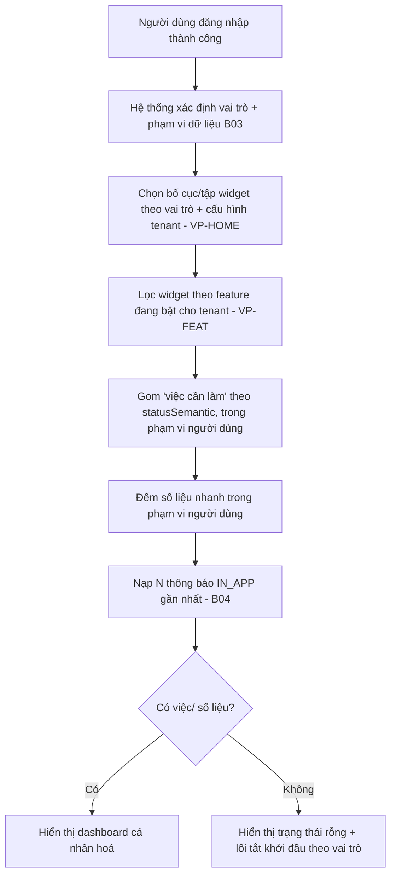
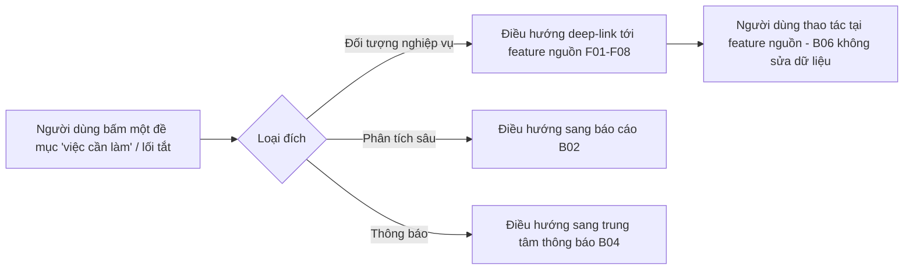

# Trang chủ (Dashboard cá nhân)

> **Nguồn sự thật về nghiệp vụ** của feature — do **PO/BA sở hữu và duyệt**. Mọi luật, dữ liệu, tiêu chí
> nghiệm thu nằm ở đây, viết bằng **ngôn ngữ nghiệp vụ**. Giao diện ở [`ui.md`](./ui.md); kiểm thử ở
> [`test-plan.md`](./test-plan.md); cả hai trỏ ngược về file này.
>
> B06 là **màn hình đích sau khi đăng nhập** — một **khung nhìn tổng hợp (dashboard) cá nhân hoá** đặt trên
> dữ liệu của các feature khác. B06 **không sở hữu dữ liệu nghiệp vụ riêng** và **không tạo/sửa** nghiệp vụ:
> mọi thẻ việc, số liệu, lối tắt đều **gom từ F01–F08, B04** và mọi hành động là **điều hướng** (deep-link)
> sang feature nguồn (tương tự F08 lý lịch là *view*, không lưu trùng).

## 1. Bối cảnh & mục tiêu

Khi đăng nhập, người dùng cần một **điểm khởi đầu** trả lời ngay ba câu: *tôi đang có việc gì cần làm*,
*có gì mới*, và *tôi đi đâu tiếp*. Hôm nay (chưa có B06) người dùng vào thẳng một danh sách hoặc menu rời
rạc; mỗi vai trò phải tự nhớ phải mở module nào, dễ bỏ sót báo cáo đến hạn, kết quả xét duyệt, phiếu chấm
chờ điền…

B06 cung cấp một **trang chủ cá nhân hoá theo vai trò & phạm vi dữ liệu**: lời chào + ngữ cảnh, khối
**"Việc cần làm của tôi"**, **số liệu nhanh** theo phạm vi của chính người dùng, **thông báo gần đây**, và
**lối tắt** theo quyền. Một web app duy nhất, nội dung hiển thị theo phân quyền (RBAC) — xem
[ADR-0009](../../architecture/decisions/0009-hop-nhat-mot-web-phan-quyen.md).

Tách bạch với các feature lân cận:
- **B02 — Báo cáo & thống kê** sở hữu **báo cáo phân tích** (lọc, drill-down, export, số liệu xuyên tổ chức).
  B06 chỉ hiển thị **số liệu nhanh cá nhân** (đếm trong phạm vi của người dùng) làm điểm vào, **không** thay
  báo cáo. Khi cần phân tích sâu, B06 **điều hướng sang B02**.
- **B04 — Thông báo** sở hữu **trung tâm thông báo** đầy đủ (danh sách, lọc, đánh dấu đã đọc). B06 chỉ hiển
  thị **tóm tắt N thông báo gần nhất** của chính người dùng và link sang B04.
- **P01 — Workflow engine** sở hữu trạng thái vòng đời; B06 đọc **trạng thái chuẩn hoá `statusSemantic`**
  để gom "việc cần làm", **không** phụ thuộc tên bước per-tenant.

**Người dùng feature này:** **mọi người dùng đã đăng nhập** (mọi persona FE và BO). Nội dung trang chủ khác
nhau theo **vai trò** và **phạm vi dữ liệu**, nhưng khung trang là một.

**Kết quả mong đợi:**
- Sau đăng nhập, người dùng thấy ngay việc cần làm của mình, không phải tự đi tìm qua từng module.
- Mỗi mục việc/số liệu/lối tắt đều **đúng quyền và đúng phạm vi dữ liệu** của người đang đăng nhập.
- Mỗi trường/viện (tenant) cấu hình được **tập widget và bố cục** trang chủ mà không sửa code.
- Trang chủ tải nhanh và không trở thành "bản sao" của báo cáo (B02) hay trung tâm thông báo (B04).

## 2. Phạm vi

- **Trong phạm vi:**
  - **Khối ngữ cảnh người dùng:** lời chào, họ tên, vai trò hiện hành, trường/viện (tenant) đang đăng nhập;
    chỉ dẫn nhanh hồ sơ (F08) còn thiếu trường bắt buộc (nếu có).
  - **Khối "Việc cần làm của tôi"** (BR-03): danh sách **đề mục hành động** gom theo trạng thái chuẩn hoá,
    lọc theo vai trò + phạm vi dữ liệu. Ví dụ theo vai trò ở §3. Mỗi đề mục có deep-link tới feature nguồn.
  - **Khối số liệu nhanh (counters)** theo phạm vi của người dùng (BR-06): các thẻ đếm như *đề tài của tôi
    đang thực hiện*, *báo cáo quá hạn*, *sản phẩm chờ duyệt*, *hồ sơ chờ tiếp nhận*… (tập thẻ tuỳ vai trò).
  - **Khối thông báo gần đây** (BR-07): **5** thông báo IN_APP mới nhất của chính người dùng (B04) + link
    sang trung tâm thông báo.
  - **Khối lối tắt (shortcuts)** theo quyền: nút đi nhanh tới tác vụ thường dùng của vai trò (vd "Nộp đề
    xuất", "Mở kỳ nhận đề xuất", "Xem báo cáo").
  - **Cấu hình per-tenant:** tập widget hiển thị và **bố cục mặc định theo vai trò** (BR-04, BR-05, VP-HOME).
  - **Trạng thái rỗng** thân thiện cho người dùng mới/không có việc (BR-09).
- **Ngoài phạm vi:**
  - **Báo cáo phân tích**, bộ lọc đa chiều, drill-down, export — thuộc [B02](../B02-bao-cao-thong-ke/).
  - **Trung tâm thông báo** đầy đủ, đánh dấu đã đọc, tuỳ chọn nhận — thuộc [B04](../B04-thong-bao/).
  - **Tạo/sửa/duyệt** bất kỳ đối tượng nghiệp vụ nào — thuộc các feature F01–F08; B06 chỉ điều hướng tới
    (BR-02).
  - **Định nghĩa trạng thái/vòng đời** và cách chuyển bước — thuộc [P01](../P01-workflow-engine/) và
    `data-model.md` §3; B06 chỉ **đọc** `statusSemantic`.
  - **Khu vực công khai (Cổng công khai)** cho Khách chưa đăng nhập — *ngoài phạm vi B06* (B06 là trang sau
    đăng nhập); đang để mở mã feature riêng — xem [epics/README.md](../../epics/README.md).
  - **Trường tuỳ biến widget do người dùng tự kéo-thả tự do** — *ngoài phạm vi giai đoạn này*; chỉ cấu hình
    bật/tắt + bố cục theo vai trò ở mức tenant (BR-05). Ghim/ẩn cá nhân là tuỳ chọn để mở (§7).

## 3. Luồng nghiệp vụ chính

### 3.1 Mở trang chủ sau đăng nhập

> Mọi truy vấn ở bước E–G **kiểm quyền và áp phạm vi dữ liệu ở máy chủ** (BR-01); giao diện chỉ hiển thị
> widget theo quyền, **không** thay cho kiểm tra ở backend.

### 3.2 Từ trang chủ đi tới tác vụ (điều hướng, không thao tác tại chỗ)

## 4. Business rules

| ID | Quy tắc | Mô tả | Ghi chú |
|----|---------|-------|---------|
| BR-01 | Cá nhân hoá theo quyền & phạm vi, kiểm ở máy chủ | Trang chủ hiển thị theo **người đang đăng nhập**: mọi thẻ việc, số liệu, lối tắt được lọc theo **vai trò** và **phạm vi dữ liệu** (data scoping). Giao diện ẩn/hiện widget theo quyền **không** thay cho kiểm tra ở backend. | [ADR-0005](../../architecture/decisions/0005-sso-va-rbac.md), [ADR-0009](../../architecture/decisions/0009-hop-nhat-mot-web-phan-quyen.md). |
| BR-02 | Chỉ đọc & điều hướng, không sửa nghiệp vụ | B06 là **khung nhìn tổng hợp read-only**: không tạo/sửa/duyệt đối tượng nghiệp vụ. Mọi hành động trên trang chủ là **điều hướng** (deep-link) sang feature nguồn (F01–F08), báo cáo (B02) hoặc thông báo (B04). | Giống F08 lý lịch là *view*; không lưu trùng. |
| BR-03 | "Việc cần làm" gom theo trạng thái chuẩn hoá | Đề mục "việc cần làm của tôi" được gom từ **`statusSemantic`** chuẩn hoá (P01), **không hardcode** tên bước per-tenant, nên đúng cho mọi tenant dù vòng đời cấu hình khác nhau. | [ADR-0007](../../architecture/decisions/0007-workflow-engine-dong-per-tenant.md); `data-model.md` §3. |
| BR-04 | Widget theo vai trò; ẩn widget của feature đang tắt | Tập widget hiển thị tuỳ **vai trò**. Widget thuộc feature **đang tắt cho tenant** (VP-FEAT) thì **không hiển thị** (vd tenant tắt E4 thì không có widget đề tài sinh viên/giờ giảng). | [ADR-0012](../../architecture/decisions/0012-ranh-gioi-loi-vs-cau-hinh-tenant.md). |
| BR-05 | Tập widget & bố cục cấu hình per-tenant | Mỗi tenant cấu hình **widget nào hiển thị** và **bố cục mặc định theo vai trò** trên bộ widget chuẩn; không tạo widget tuỳ biến mới ở giai đoạn này. | VP-HOME — [variation-points](../../architecture/variation-points.md). |
| BR-06 | Số liệu nhanh là đếm theo phạm vi, không phải báo cáo | Các thẻ số liệu chỉ là **tổng hợp đếm** trong phạm vi dữ liệu của người dùng, làm điểm vào nhanh. **Báo cáo phân tích** (lọc, drill-down, export, số liệu xuyên tổ chức) thuộc **B02**; B06 link sang B02 khi cần. | Tránh trùng chức năng với B02. |
| BR-07 | Khối thông báo chỉ là tóm tắt của B04 | Khối thông báo hiển thị **5 bản ghi IN_APP gần nhất của chính người dùng** (N=5; recipient = người đăng nhập), kèm deep-link; thao tác đầy đủ (đánh dấu đã đọc, lọc, tuỳ chọn) ở **trung tâm thông báo B04**. | B04 BR-09, BR-10. |
| BR-08 | Mở trang chủ là hành động chỉ-đọc | Mở/tải trang chủ **không** sinh `AuditLog` nghiệp vụ (audit append-only chỉ cho hành động **đổi trạng thái** nghiệp vụ — AGENTS.md §4.4). Truy vết kỹ thuật (nếu có) tách khỏi audit nghiệp vụ. | Khác các feature đổi trạng thái. |
| BR-09 | Trạng thái rỗng có ích | Người dùng mới hoặc không có việc cần làm thấy **trạng thái rỗng thân thiện**: thông điệp + **lối tắt khởi đầu theo vai trò** (vd chủ nhiệm → "Xem kỳ nhận đề xuất đang mở"), không phải màn hình trống. | Trải nghiệm onboarding. |
| BR-10 | Tải nhanh, chấp nhận số liệu trễ nhẹ | Trang chủ ưu tiên tải nhanh; số liệu nhanh có thể **tính sẵn/cache** và chấp nhận trễ nhẹ (eventual). Khi hiển thị số liệu từ cache, nêu **mốc cập nhật**; đề mục "việc cần làm" cần đủ tươi để không bỏ sót hạn. | Hiệu năng — chi tiết ngưỡng ở `design.md`. |

## 5. Dữ liệu (mức khái niệm)

B06 **không định nghĩa thực thể nghiệp vụ mới**; trang chủ là **khung nhìn tổng hợp (aggregation/BFF)** đọc
từ các nguồn đã có (mô hình bảng/trường ở [`../../architecture/data-model.md`](../../architecture/data-model.md)):

- **Đề tài & trạng thái** — `ResearchProject` + `statusSemantic` (P01) cho "đề tài của tôi", "việc theo
  trạng thái" (BR-03).
- **Đề xuất & kỳ** — `Proposal`/đề xuất (F01), kỳ nhận đề xuất đang mở (F02) cho lối tắt & việc cần làm.
- **Báo cáo tiến độ** — lịch & trạng thái báo cáo (F04) cho "báo cáo sắp/đã quá hạn".
- **Xét duyệt & nghiệm thu** — phiếu chấm/đợt đánh giá chờ (F03, F06) cho thành viên hội đồng/chuyên viên.
- **Sản phẩm khoa học** — trạng thái chờ duyệt (F07).
- **Hồ sơ** — độ đầy đủ hồ sơ (F08) cho chỉ dẫn "hoàn thiện hồ sơ".
- **Thông báo** — `Notification` kênh `IN_APP` của người dùng (B04), 5 bản ghi gần nhất (BR-07).
- **Cấu hình trang chủ (mức tenant):** tập widget & bố cục theo vai trò (VP-HOME) — cấu hình per-tenant,
  **không** lưu theo từng người dùng. Tuỳ chọn ghim/ẩn widget **cá nhân** (`HomePreference`) **ngoài phạm vi
  giai đoạn này** (đã chốt §7).

> Mọi truy vấn tổng hợp **đi qua API đọc của module nguồn hoặc một read-model dùng chung**, tôn trọng phạm vi
> dữ liệu của module đó — B06 không truy vấn vòng qua phân quyền. Chi tiết kỹ thuật (read-model, cache, mốc
> dữ liệu) thuộc `design.md`.

## 6. Acceptance criteria

Viết theo Given / When / Then bằng ngôn ngữ nghiệp vụ; khẳng định mức field để ở `test-plan.md`/`design.md`.

- **AC-01** (happy — landing sau đăng nhập) — Given người dùng U đã đăng nhập, When U vào hệ thống, Then U
  được đưa tới **trang chủ** hiển thị lời chào, vai trò hiện hành và trường/viện của U (BR-01).
- **AC-02** (cá nhân hoá theo vai trò) — Given hai người dùng khác vai trò (chủ nhiệm đề tài vs chuyên viên
  QL KHCN) cùng đăng nhập, When mỗi người mở trang chủ, Then tập **widget và việc cần làm khác nhau** đúng
  theo vai trò (vd chủ nhiệm thấy "báo cáo tiến độ của tôi"; chuyên viên thấy "hồ sơ chờ tiếp nhận") (BR-01, BR-04).
- **AC-03** (phạm vi dữ liệu — kiểm ở máy chủ) — Given chuyên viên C chỉ phụ trách đơn vị X, When C mở trang
  chủ, Then số liệu và việc cần làm chỉ tính trên **đề tài/hồ sơ thuộc phạm vi của C**, và yêu cầu vượt phạm
  vi bị **từ chối ở máy chủ** dù giao diện có hiển thị widget (BR-01).
- **AC-04** (việc cần làm theo trạng thái chuẩn hoá) — Given U là chủ nhiệm có 1 đề xuất **bị trả lại bổ
  sung** và 1 báo cáo tiến độ **quá hạn**, When U mở trang chủ, Then khối "việc cần làm của tôi" liệt kê đúng
  2 đề mục đó, gom theo **trạng thái chuẩn hoá** (không phụ thuộc tên bước của tenant), mỗi đề mục có link
  tới feature nguồn (BR-02, BR-03).
- **AC-05** (chỉ đọc & điều hướng) — Given U thấy một đề mục "việc cần làm" trên trang chủ, When U bấm vào,
  Then hệ thống **điều hướng** tới đúng màn hình của feature nguồn (F01–F08) để U thao tác ở đó; trang chủ
  **không** sửa dữ liệu nghiệp vụ trực tiếp (BR-02).
- **AC-06** (số liệu nhanh ≠ báo cáo) — Given U mở thẻ số liệu nhanh "đề tài của tôi đang thực hiện = 5",
  When U bấm "xem chi tiết/phân tích", Then hệ thống **điều hướng sang báo cáo B02** (có lọc/drill-down),
  còn trên trang chủ chỉ là **con số đếm** trong phạm vi của U (BR-06).
- **AC-07** (thông báo gần đây là tóm tắt B04) — Given U có thông báo IN_APP mới, When U mở trang chủ, Then
  khối thông báo hiển thị **5 bản ghi gần nhất của chính U** kèm link; When U bấm "xem tất cả", Then điều
  hướng tới **trung tâm thông báo B04** (BR-07).
- **AC-08** (ẩn widget theo feature tắt của tenant) — Given tenant T **tắt** năng lực E4 (P03/F09–F12), When
  người dùng của T mở trang chủ, Then **không** hiển thị widget liên quan E4 (vd "giờ giảng quy đổi", "đề tài
  sinh viên") (BR-04, VP-FEAT).
- **AC-09** (bố cục per-tenant theo vai trò) — Given tenant T cấu hình bố cục trang chủ cho vai trò "chuyên
  viên QL KHCN", When chuyên viên của T mở trang chủ, Then tập widget và thứ tự hiển thị **đúng cấu hình của
  T**, khác tenant khác trên cùng bộ widget chuẩn (BR-05, VP-HOME).
- **AC-10** (trạng thái rỗng) — Given người dùng mới M chưa có đề tài/việc nào, When M mở trang chủ, Then
  hiển thị **trạng thái rỗng thân thiện** kèm lối tắt khởi đầu theo vai trò của M, không phải màn hình trống
  (BR-09).
- **AC-11** (không ghi audit nghiệp vụ khi mở) — Given U mở trang chủ nhiều lần, When tải trang, Then **không**
  sinh bản ghi `AuditLog` nghiệp vụ cho hành động xem (BR-08).
- **AC-12** (số liệu cache nêu mốc) — Given số liệu nhanh được tính sẵn/cache, When U mở trang chủ, Then thẻ
  số liệu hiển thị **mốc cập nhật** của con số; đề mục "việc cần làm" phản ánh trạng thái đủ tươi để không bỏ
  sót hạn (BR-10).

## 7. Phụ thuộc & rủi ro

**Phụ thuộc:**
- [B03](../B03-quan-ly-nguoi-dung/spec.md) — danh tính, vai trò/quyền, **phạm vi dữ liệu** để cá nhân hoá.
- [P01](../P01-workflow-engine/spec.md) — `statusSemantic` chuẩn hoá để gom "việc cần làm" (BR-03).
- [B04](../B04-thong-bao/spec.md) — `Notification` IN_APP cho khối thông báo gần đây (BR-07).
- [B02](../B02-bao-cao-thong-ke/spec.md) — đích điều hướng khi người dùng cần phân tích sâu (BR-06).
- **Nguồn đề mục/số liệu:** F01 (đề xuất), F02 (kỳ), F03 (xét duyệt), F04 (tiến độ), F05 (kinh phí), F06
  (nghiệm thu), F07 (sản phẩm), F08 (hồ sơ); với tenant bật E4: P03, F09–F12.
- **Sổ biến thiên** — VP-HOME (tập widget & bố cục per-tenant theo vai trò), VP-FEAT (feature bật/tắt):
  [variation-points.md](../../architecture/variation-points.md); [ADR-0012](../../architecture/decisions/0012-ranh-gioi-loi-vs-cau-hinh-tenant.md).

**Rủi ro & điểm cần làm rõ:**

| Rủi ro | Ảnh hưởng | Giảm thiểu |
|--------|-----------|------------|
| B06 phình to thành "bản sao" của B02 (báo cáo) | Trung bình | Giữ ranh giới BR-06: trang chủ chỉ đếm + điều hướng; phân tích sâu ở B02 |
| Tải trang chủ chậm do gom nhiều nguồn | Trung bình | Read-model/cache số liệu, tải bất đồng bộ từng widget; ngưỡng ở `design.md` (BR-10) |
| Lộ số liệu vượt phạm vi do tổng hợp vòng qua phân quyền | Cao | Mọi truy vấn đi qua API/đọc tôn trọng data scoping của module nguồn; kiểm ở backend (BR-01) |
| Việc cần làm lệch khi tenant đổi tên bước workflow | Trung bình | Gom theo `statusSemantic` chuẩn hoá, không theo tên bước (BR-03) |

**Điểm cần PO chốt:**
- **Tập widget chuẩn & bố cục mặc định theo từng vai trò** (đầu vào cho VP-HOME) — đang chờ PO/BA duyệt đề
  xuất bộ widget `W-xx` + bố cục theo vai trò (xem [`ui.md` §3](./ui.md)).

**Đã chốt (2026-06-26):**
- **Mã feature = B06**; `B05` để dành cho **Cổng công khai** (xem [epics/README.md](../../epics/README.md) §Ghi chú).
- **Không** làm tuỳ chọn ghim/ẩn widget **cá nhân** (`HomePreference`) ở giai đoạn này — chỉ cấu hình ở
  **mức tenant theo vai trò** (VP-HOME, BR-05); để mở cá nhân hoá cho tương lai.
- **N = 5** — khối thông báo trang chủ hiển thị **5** thông báo IN_APP gần nhất của người dùng (BR-07).
</content>
</invoke>
