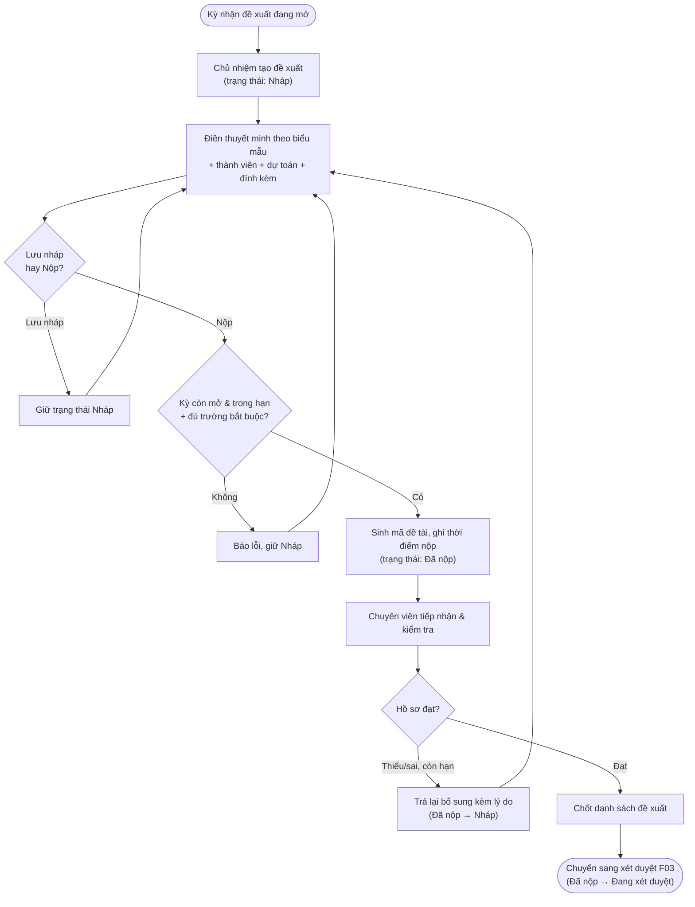

# Đề xuất đề tài

> **Nguồn sự thật về nghiệp vụ** của feature — do **PO/BA sở hữu và duyệt**. Mọi luật, dữ liệu,
> tiêu chí nghiệm thu nằm ở đây, viết bằng **ngôn ngữ nghiệp vụ**.
>
> **Cách hiện thực kỹ thuật** (mô hình bảng/trường, máy trạng thái, API) ở [`design.md`](./design.md) —
> DEV sở hữu. Giao diện ở `ui.md`; kiểm thử ở `test-plan.md`. Cả ba đều trỏ ngược về file này.

## 1. Bối cảnh & mục tiêu

Hiện nay nhà khoa học đăng ký đề tài nghiên cứu qua email/giấy tờ rời rạc: chủ nhiệm khó biết
trạng thái hồ sơ, chuyên viên QL KHCN khó kiểm soát đủ/đúng hồ sơ và dễ thất lạc. F01 số hóa
**giai đoạn đề xuất**: chủ nhiệm soạn thuyết minh theo biểu mẫu của kỳ nhận đề xuất, thêm thành viên,
dự toán kinh phí, đính kèm tài liệu, lưu nháp rồi nộp; chuyên viên tiếp nhận, kiểm tra, trả lại
bổ sung khi cần và chốt danh sách đưa sang xét duyệt (F03).

F01 là **điểm khởi đầu vòng đời của một đề tài**, mở hai trạng thái đầu tiên: **Nháp** và **Đã nộp**.

**Kết quả mong đợi:**
- Mọi đề xuất nằm trong một kỳ nhận đề xuất **đang mở**, dữ liệu chuẩn hóa theo biểu mẫu, truy vết được.
- Chủ nhiệm chủ động theo dõi trạng thái hồ sơ và lý do trả lại; giảm hồ sơ thiếu/sai.
- Chuyên viên có danh sách đề xuất theo kỳ để kiểm tra và chốt sang xét duyệt nhanh, đúng hạn.

> **Trạng thái hồ sơ đề xuất** (ngôn ngữ nghiệp vụ): **Nháp** → **Đã nộp** → (sang F03: *Đang xét duyệt*);
> hoặc **Đã hủy**. Ánh xạ sang tên kỹ thuật ở [`design.md §1`](./design.md).

## 2. Phạm vi

- **Trong phạm vi:**
  - Chủ nhiệm tạo/sửa đề xuất khi kỳ nhận đề xuất đang mở: điền thuyết minh theo biểu mẫu của kỳ,
    thêm thành viên, dự toán kinh phí đề xuất, đính kèm tài liệu.
  - Lưu **nháp** và **nộp** (Nháp → Đã nộp): hệ thống sinh **mã đề tài** và ghi nhận **thời điểm nộp**.
  - Chuyên viên tiếp nhận, kiểm tra hồ sơ; **trả lại bổ sung** (Đã nộp → Nháp) kèm lý do khi còn hạn.
  - Chuyên viên chốt danh sách đề xuất hợp lệ để chuyển sang xét duyệt (F03).
- **Ngoài phạm vi:**
  - Cấu hình & mở/đóng kỳ nhận đề xuất, biểu mẫu thuyết minh, bộ tiêu chí → **F02** và **B01**.
  - Gán hội đồng, chấm điểm, đưa hồ sơ vào xét duyệt và kết luận duyệt/từ chối → **F03**.
  - Quản lý người dùng/lĩnh vực/đơn vị → **B03/B01**.
  - Hợp đồng, tiến độ, kinh phí thực chi, nghiệm thu, sản phẩm → **F04–F08**.

## 3. Luồng nghiệp vụ chính

Luồng đề xuất chỉ gồm hai bước chuyển trạng thái thuộc F01: **Nháp ↔ Đã nộp**. Bước đưa hồ sơ vào hội
đồng (Đã nộp → Đang xét duyệt) thuộc F03.

Diễn giải các bước:
1. **Tạo đề xuất:** chủ nhiệm chọn một kỳ nhận đề xuất đang mở; hệ thống tạo hồ sơ ở trạng thái **Nháp**,
   ghi người tạo là **chủ nhiệm**, đồng thời thêm chính người đó vào danh sách thành viên với vai trò chủ nhiệm.
2. **Soạn hồ sơ:** điền tên đề tài, lĩnh vực nghiên cứu (thuộc lĩnh vực của kỳ), tóm tắt, nội dung thuyết
   minh theo biểu mẫu của kỳ, thời gian thực hiện, kinh phí đề xuất; thêm thành viên; đính kèm tài liệu.
   Có thể lưu nháp nhiều lần.
3. **Nộp:** hệ thống kiểm tra điều kiện nộp (BR-01..BR-04); nếu đạt thì chuyển **Đã nộp**, sinh **mã đề tài**
   duy nhất và ghi **thời điểm nộp**, lưu nhật ký.
4. **Tiếp nhận/kiểm tra:** chuyên viên xem danh sách đề xuất theo kỳ, mở chi tiết hồ sơ.
5. **Trả lại bổ sung:** nếu hồ sơ thiếu/sai và kỳ còn hạn, chuyên viên trả về **Nháp** kèm lý do;
   chủ nhiệm sửa và nộp lại.
6. **Chốt:** chuyên viên chốt các đề xuất hợp lệ; bước đưa vào hội đồng/xét duyệt thuộc F03.

## 4. Business rules

| ID    | Quy tắc | Mô tả | Ghi chú |
|-------|---------|-------|---------|
| BR-01 | Chỉ nộp khi kỳ đang mở & còn hạn | Chỉ được nộp (Nháp → Đã nộp) khi kỳ nhận đề xuất **đang mở** và thời điểm nộp nằm trong khoảng thời gian nhận hồ sơ của kỳ. | Quá hạn hoặc kỳ đã đóng/hủy → chặn nộp. |
| BR-02 | Đủ trường bắt buộc của biểu mẫu | Phải đủ các thông tin bắt buộc của đề tài (tên, lĩnh vực, thời gian thực hiện, kinh phí đề xuất) và mọi trường bắt buộc trong bản thuyết minh theo biểu mẫu của kỳ mới được nộp. | Hệ thống kiểm tra khi nộp; giao diện phản ánh sớm để người dùng sửa. |
| BR-03 | Lĩnh vực hợp lệ với kỳ | Lĩnh vực nghiên cứu của đề tài phải thuộc danh sách lĩnh vực mà kỳ nhận đề xuất cho phép. | Nếu kỳ không giới hạn lĩnh vực thì bỏ qua. |
| BR-04 | Mỗi đề xuất một chủ nhiệm | Một đề tài có đúng một chủ nhiệm, và chủ nhiệm cũng là một thành viên với vai trò chủ nhiệm. | Chủ nhiệm là người tạo đề xuất. |
| BR-05 | Chủ nhiệm chỉ sửa khi Nháp | Chỉ chỉnh sửa được hồ sơ (thuyết minh, thành viên, dự toán, đính kèm) khi hồ sơ ở trạng thái **Nháp**. Sau khi **Đã nộp**, hồ sơ bị khóa. | Quyền sửa nội dung: chủ nhiệm; thành viên xem (xem `ui.md`). |
| BR-06 | Trả lại mới mở khóa sửa | Sau khi đã nộp, hồ sơ chỉ sửa tiếp được khi chuyên viên **trả lại bổ sung** (Đã nộp → Nháp) kèm lý do, và chỉ khi kỳ còn hạn. | Mọi lần trả lại bắt buộc có lý do. |
| BR-07 | Mã đề tài tự động & duy nhất | **Mã đề tài** được sinh tự động tại thời điểm nộp lần đầu, duy nhất toàn hệ thống, và **giữ nguyên** qua các lần trả lại/nộp lại. | Quy tắc đánh số: xem điểm mở §7. |
| BR-08 | Thành viên không trùng | Trong một đề tài, một người chỉ xuất hiện một lần trong danh sách thành viên. | — |
| BR-09 | Kinh phí & thời gian hợp lệ | Kinh phí đề xuất không âm (đơn vị VND); thời gian thực hiện là số tháng dương. | Định dạng tiền/thời gian theo quy ước chung. |
| BR-10 | Hủy đề xuất có điều kiện | Đề xuất ở **Nháp** hoặc **Đã nộp** (trước xét duyệt) có thể chuyển **Đã hủy** kèm lý do; **không xóa cứng**. | Sau khi vào xét duyệt thì không hủy ở F01. |
| BR-11 | Trạng thái chuyển tập trung, có nhật ký | Mọi thay đổi trạng thái của đề tài đều đi qua quy trình chung và được ghi nhật ký; không sửa trạng thái tùy tiện. | Hiện thực: `design.md §3`. |

## 5. Dữ liệu (mức khái niệm)

Các đối tượng nghiệp vụ F01 đụng tới (mô hình bảng/trường ở [`design.md §2`](./design.md) và
[`../../architecture/data-model.md`](../../architecture/data-model.md)):

- **Hồ sơ đề xuất (đề tài):** đối tượng trung tâm. Thông tin chính: mã đề tài (sinh khi nộp), tên,
  kỳ nhận đề xuất, lĩnh vực nghiên cứu, chủ nhiệm, đơn vị chủ trì, tóm tắt, nội dung thuyết minh (theo
  biểu mẫu của kỳ), kinh phí đề xuất, thời gian thực hiện, trạng thái, thời điểm nộp.
- **Thành viên đề tài:** danh sách người tham gia và vai trò (chủ nhiệm / thành viên / thư ký), kèm
  trách nhiệm. Một người chỉ xuất hiện một lần (BR-08).
- **Tài liệu đính kèm:** các tệp gắn với hồ sơ đề xuất.
- **Kỳ nhận đề xuất** (do F02 quản): hồ sơ đọc trạng thái mở/đóng, thời gian nhận, lĩnh vực cho phép và
  biểu mẫu thuyết minh để xác định điều kiện nộp.
- **Nhật ký (audit):** ghi mọi lần nộp, trả lại bổ sung, hủy — kèm lý do và thời điểm.

**Các bước chuyển trạng thái thuộc F01:**

| Từ | Tới | Điều kiện | Người thực hiện | BR |
|----|-----|-----------|-----------------|----|
| Nháp | Đã nộp | Kỳ đang mở & còn hạn, đủ trường bắt buộc | Chủ nhiệm | BR-01, BR-02 |
| Đã nộp | Nháp | Hồ sơ thiếu/sai, còn hạn nộp, kèm lý do | Chuyên viên | BR-06 |
| Nháp / Đã nộp | Đã hủy | Trước xét duyệt, kèm lý do | Chủ nhiệm/Chuyên viên | BR-10 |

## 6. Acceptance criteria

Viết theo Given / When / Then bằng ngôn ngữ nghiệp vụ — đầu vào trực tiếp cho `test-plan.md`.
Khẳng định mức field (tên enum, tên cột) để ở `test-plan.md`/`design.md`.

- **AC-01** (happy — tạo & lưu nháp) — Given chủ nhiệm đăng nhập và một kỳ nhận đề xuất đang mở,
  When tạo đề xuất mới và lưu nháp, Then hệ thống tạo hồ sơ ở trạng thái **Nháp** với người tạo là
  **chủ nhiệm** và một thành viên vai trò chủ nhiệm, **chưa** sinh mã đề tài.
- **AC-02** (happy — nộp hợp lệ) — Given một hồ sơ **Nháp** đủ trường bắt buộc trong kỳ đang mở còn hạn,
  When chủ nhiệm nộp, Then hồ sơ chuyển **Đã nộp**, sinh **mã đề tài** duy nhất, ghi **thời điểm nộp**,
  khóa sửa hồ sơ và lưu nhật ký.
- **AC-03** (biên — quá hạn nộp) — Given một hồ sơ **Nháp** và thời điểm hiện tại đã sau hạn nhận của kỳ
  (hoặc kỳ đã đóng), When chủ nhiệm nộp, Then hệ thống chặn, giữ **Nháp** và báo lỗi "Đã hết hạn nộp của
  kỳ" (BR-01).
- **AC-04** (lỗi — thiếu trường bắt buộc) — Given một hồ sơ **Nháp** thiếu ≥1 trường bắt buộc của biểu mẫu
  hoặc của đề tài, When chủ nhiệm nộp, Then hệ thống chặn, giữ **Nháp** và liệt kê các trường còn thiếu (BR-02).
- **AC-05** (sai quyền — sửa sau khi nộp) — Given một hồ sơ ở **Đã nộp**, When chủ nhiệm cố sửa thuyết
  minh/thành viên/đính kèm, Then hệ thống từ chối với thông báo hồ sơ đã nộp chỉ sửa được sau khi được
  trả lại (BR-05, BR-06).
- **AC-06** (sai quyền — không phải chủ nhiệm) — Given một người dùng không phải chủ nhiệm và không có
  quyền của chuyên viên, When cố mở/sửa/nộp đề xuất của người khác, Then bị từ chối và không thấy đề xuất
  ngoài phạm vi của mình.
- **AC-07** (happy — chuyên viên trả lại bổ sung) — Given chuyên viên QL KHCN và một hồ sơ **Đã nộp** trong
  kỳ còn hạn, When trả lại bổ sung kèm lý do, Then hồ sơ chuyển **Nháp**, mở khóa cho chủ nhiệm sửa, lý do
  hiển thị cho chủ nhiệm và lưu nhật ký (BR-06).
- **AC-08** (biên — trả lại khi hết hạn) — Given một hồ sơ **Đã nộp** mà kỳ đã hết hạn nộp, When chuyên
  viên trả lại bổ sung, Then hệ thống chặn vì chủ nhiệm không còn thời gian nộp lại (BR-06), gợi ý xử lý
  theo F03.
- **AC-09** (lỗi — thành viên trùng) — Given một hồ sơ **Nháp** đã có thành viên X, When chủ nhiệm thêm lại
  đúng người X, Then hệ thống từ chối vì thành viên đã tồn tại (BR-08).
- **AC-10** (happy — chốt sang xét duyệt) — Given các hồ sơ **Đã nộp** hợp lệ trong một kỳ, When chuyên
  viên chốt danh sách, Then danh sách sẵn sàng chuyển sang xét duyệt F03; bản thân việc chuyển sang
  **Đang xét duyệt** do F03 thực hiện.
- **AC-11** (biên — mã đề tài giữ nguyên khi nộp lại) — Given một hồ sơ từng **Đã nộp** rồi bị trả lại về
  **Nháp**, When chủ nhiệm sửa và nộp lại, Then **mã đề tài không** sinh mới, **thời điểm nộp** cập nhật
  theo lần nộp mới nhất (BR-07).

## 7. Phụ thuộc & rủi ro

**Phụ thuộc:**
- **F02 — Kỳ nhận đề xuất:** cần kỳ đang mở, thời gian nhận, lĩnh vực cho phép, biểu mẫu thuyết minh.
- **B01 — Danh mục:** lĩnh vực nghiên cứu, biểu mẫu thuyết minh, cấu hình hệ thống (định dạng mã đề tài).
- **B03 — Người dùng & phân quyền:** tài khoản, vai trò/quyền, phạm vi dữ liệu.
- **Chuyển tiếp F03 — Xét duyệt:** nhận các đề xuất **Đã nộp** đã chốt và đưa vào xét duyệt.
- **B04 — Thông báo (tùy chọn giai đoạn Now):** thông báo khi trả lại bổ sung/nộp thành công.

**Giả định:**
- Biểu mẫu thuyết minh được B01/F02 định nghĩa trước; F01 chỉ hiển thị & kiểm tra theo biểu mẫu.

**Điểm nghiệp vụ cần chốt (mở):**
- **Quy tắc đánh số mã đề tài:** theo kỳ hay theo năm? (ảnh hưởng BR-07). Chống trùng khi nộp đồng thời:
  xem `design.md §5`.
- **Biểu mẫu đổi giữa kỳ:** nếu biểu mẫu thay đổi sau khi đã có hồ sơ **Nháp**, cần quy tắc giữ nguyên dữ
  liệu thuyết minh đã nhập (version hóa) để không vỡ hồ sơ — cần PO chốt cách xử lý.
- **Quyền sửa của thành viên:** giai đoạn Now mặc định chỉ chủ nhiệm sửa nội dung; nếu cho thành viên/thư
  ký cùng sửa cần bổ sung quyền & nhật ký (cần PO xác nhận).
- **Hết hạn khi đang nháp:** hồ sơ **Nháp** chưa nộp khi kỳ đã đóng sẽ không nộp được — cần thông báo nhắc
  hạn (B04) để giảm rủi ro trễ.
