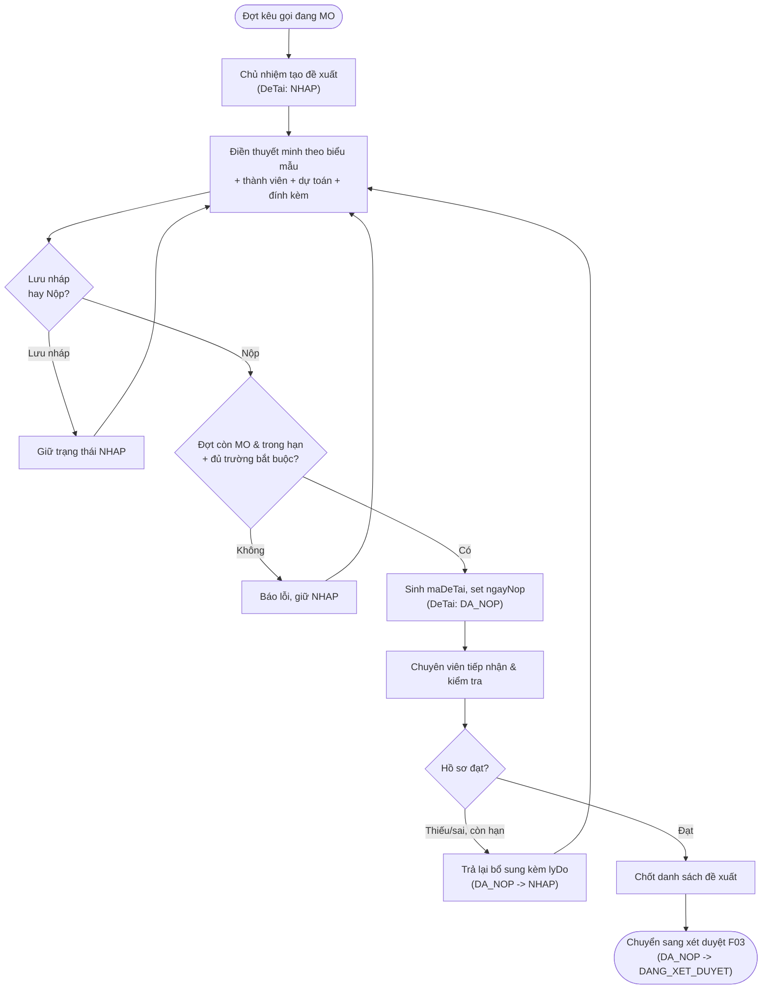

# Đề xuất đề tài

> Nguồn sự thật về **nghiệp vụ** của feature. Mọi luật, dữ liệu, tiêu chí nghiệm thu
> nằm ở đây. `frontend.md` và `backoffice.md` chỉ mô tả giao diện và trỏ ngược về file này.

## 1. Bối cảnh & mục tiêu

Hiện nay nhà khoa học đăng ký đề tài nghiên cứu qua email/giấy tờ rời rạc: chủ nhiệm khó biết
trạng thái hồ sơ, chuyên viên QL KHCN khó kiểm soát đủ/đúng hồ sơ và dễ thất lạc. F01 số hóa
**giai đoạn đề xuất**: chủ nhiệm soạn thuyết minh theo biểu mẫu của đợt kêu gọi, thêm thành viên,
dự toán kinh phí, đính kèm tài liệu, lưu nháp rồi nộp; chuyên viên tiếp nhận, kiểm tra, trả lại
bổ sung khi cần và chốt danh sách đưa sang xét duyệt (F03).

F01 là **điểm khởi đầu vòng đời `DeTai`** (xem `../../architecture/data-model.md` §3), mở hai
trạng thái đầu tiên `NHAP` và `DA_NOP`.

**Kết quả mong đợi:**
- Mọi đề xuất nằm trong một đợt kêu gọi đang `MO`, dữ liệu chuẩn hóa theo biểu mẫu, truy vết được.
- Chủ nhiệm chủ động theo dõi trạng thái hồ sơ và lý do trả lại; giảm hồ sơ thiếu/sai.
- Chuyên viên có danh sách đề xuất theo đợt để kiểm tra và chốt sang xét duyệt nhanh, đúng hạn.

## 2. Phạm vi

- **Trong phạm vi:**
  - Chủ nhiệm tạo/sửa đề xuất khi đợt kêu gọi `MO`: điền thuyết minh theo biểu mẫu của đợt, thêm
    thành viên (`ThanhVienDeTai`), dự toán kinh phí đề xuất, đính kèm tài liệu (`TaiLieuDinhKem`).
  - Lưu nháp (`NHAP`) và nộp (`NHAP` → `DA_NOP`): sinh `maDeTai`, set `ngayNop`.
  - Chuyên viên tiếp nhận, kiểm tra hồ sơ; trả lại bổ sung (`DA_NOP` → `NHAP`) kèm lý do khi còn hạn.
  - Chuyên viên chốt danh sách đề xuất hợp lệ để chuyển sang xét duyệt (F03).
- **Ngoài phạm vi:**
  - Cấu hình & mở/đóng đợt kêu gọi, biểu mẫu thuyết minh, bộ tiêu chí → **F02** và **B01**.
  - Gán hội đồng, chấm điểm, chuyển `DA_NOP` → `DANG_XET_DUYET` và kết luận duyệt/từ chối → **F03**.
  - Quản lý người dùng/lĩnh vực/đơn vị → **B03/B01**.
  - Hợp đồng, tiến độ, kinh phí thực chi, nghiệm thu, sản phẩm → **F04–F08**.

## 3. Luồng nghiệp vụ chính

Luồng đề xuất bám đúng chuyển trạng thái `NHAP ↔ DA_NOP` của `DeTai` trong
`../../architecture/data-model.md` §3. Chỉ hai chuyển này thuộc F01; bước đưa vào hội đồng
(`DA_NOP` → `DANG_XET_DUYET`) thuộc F03.

Diễn giải các bước:
1. **Tạo đề xuất:** chủ nhiệm chọn một đợt kêu gọi đang `MO`, hệ thống tạo `DeTai` ở `NHAP`,
   `chuNhiemId` = người tạo, đồng thời tạo một `ThanhVienDeTai` vai trò `CHU_NHIEM`.
2. **Soạn hồ sơ:** điền `ten`, `linhVucId` (thuộc lĩnh vực của đợt), `tomTat`, `thuyetMinh`
   (jsonb theo `bieuMauThuyetMinhId` của đợt), `thoiGianThucHien`, `kinhPhiDeXuat`; thêm thành
   viên; đính kèm tài liệu. Có thể lưu nháp nhiều lần.
3. **Nộp:** hệ thống kiểm tra điều kiện nộp (BR-01..BR-04), nếu đạt thì chuyển `DA_NOP`, sinh
   `maDeTai` duy nhất và set `ngayNop`, ghi `NhatKyHeThong`.
4. **Tiếp nhận/kiểm tra:** chuyên viên xem danh sách đề xuất theo đợt, mở chi tiết hồ sơ.
5. **Trả lại bổ sung:** nếu hồ sơ thiếu/sai và đợt còn hạn, chuyên viên trả về `NHAP` kèm `lyDo`;
   chủ nhiệm sửa và nộp lại.
6. **Chốt:** chuyên viên chốt các đề xuất hợp lệ; bước đưa vào hội đồng/xét duyệt thuộc F03.

## 4. Business rules

| ID    | Quy tắc | Mô tả | Ghi chú |
|-------|---------|-------|---------|
| BR-01 | Chỉ nộp khi đợt `MO` & còn hạn | `NHAP` → `DA_NOP` chỉ thực hiện khi `DotKeuGoi.trangThai = MO` và thời điểm nộp trong khoảng `[tuNgay, denNgay]`. | Quá `denNgay` hoặc đợt `DONG/HUY` → chặn nộp. |
| BR-02 | Đủ trường bắt buộc của biểu mẫu | Phải đủ trường bắt buộc của `DeTai` (`ten`, `linhVucId`, `thoiGianThucHien`, `kinhPhiDeXuat`) và mọi trường bắt buộc trong `thuyetMinh` theo `bieuMauThuyetMinhId` của đợt mới được nộp. | Validate tại backend; FE chỉ phản ánh sớm. |
| BR-03 | Lĩnh vực hợp lệ với đợt | `DeTai.linhVucId` phải thuộc `DotKeuGoi.linhVucIds` của đợt nộp. | Nếu đợt không giới hạn lĩnh vực thì bỏ qua. |
| BR-04 | Mỗi đề xuất một chủ nhiệm | Một `DeTai` có đúng một `chuNhiemId` và đúng một `ThanhVienDeTai` vai trò `CHU_NHIEM`. | Chủ nhiệm là người tạo đề xuất. |
| BR-05 | Chủ nhiệm chỉ sửa khi `NHAP` | Chủ nhiệm/thành viên chỉ chỉnh sửa hồ sơ (thuyết minh, thành viên, dự toán, đính kèm) khi `DeTai.trangThai = NHAP`. Sau `DA_NOP` hồ sơ khóa. | Quyền sửa nội dung: chủ nhiệm; thành viên xem (xem `frontend.md`). |
| BR-06 | Trả lại mới mở khóa sửa | Sau `DA_NOP`, hồ sơ chỉ sửa tiếp được khi chuyên viên trả lại bổ sung (`DA_NOP` → `NHAP`) kèm `lyDo`, và chỉ khi đợt còn hạn. | Chuyển lùi bắt buộc có `lyDo` (data-model §3). |
| BR-07 | `maDeTai` tự động & duy nhất | `maDeTai` sinh tự động tại thời điểm nộp lần đầu, theo định dạng `<maDot>-<số thứ tự>` và **unique** toàn hệ thống; giữ nguyên qua các lần trả lại/nộp lại. | `maDeTai` chỉ sinh một lần. |
| BR-08 | Thành viên không trùng | Trong một `DeTai`, một `nguoiDungId` chỉ xuất hiện một lần ở `ThanhVienDeTai`. | Unique cặp (`deTaiId`, `nguoiDungId`). |
| BR-09 | Kinh phí & thời gian hợp lệ | `kinhPhiDeXuat ≥ 0` (số nguyên VND), `thoiGianThucHien > 0` (số tháng). | Định dạng tiền/thời gian theo data-model §1. |
| BR-10 | Hủy đề xuất có điều kiện | Đề xuất ở `NHAP` hoặc `DA_NOP` (trước xét duyệt) có thể chuyển `HUY`; chuyển kèm `lyDo`, không xóa cứng. | `NHAP`/`DA_NOP` → `HUY` theo data-model §3. |
| BR-11 | Tập trung máy trạng thái | Mọi chuyển `trangThai` của `DeTai` đi qua domain service `proposal`, ghi `NhatKyHeThong`; không update enum trực tiếp. | Theo overview §4.3. |

## 5. Dữ liệu

Dùng lại thực thể & enum ở `../../architecture/data-model.md`; F01 **không** định nghĩa lại.

- **`DeTai`** (§4.3): trục chính của feature. F01 dùng `maDeTai` (sinh khi nộp), `ten`,
  `dotKeuGoiId`, `linhVucId`, `chuNhiemId`, `donViChuTriId`, `tomTat`, `thuyetMinh` (jsonb theo
  biểu mẫu đợt), `kinhPhiDeXuat` (bigint VND), `thoiGianThucHien` (int tháng), `trangThai`
  (`NHAP`/`DA_NOP`, và `HUY` khi hủy), `ngayNop` (set khi `DA_NOP`).
- **`ThanhVienDeTai`** (§4.3): `deTaiId`, `nguoiDungId`, `vaiTroTrongDeTai`
  (`CHU_NHIEM`/`THANH_VIEN`/`THU_KY`), `nhiemVu`. Unique (`deTaiId`, `nguoiDungId`) — BR-08.
- **`TaiLieuDinhKem`** (§4.3): đính kèm với `loaiDoiTuong = 'DeTai'`, `doiTuongId = DeTai.id`;
  lưu key object storage, không nhị phân trong CSDL.
- **`DotKeuGoi`** (§4.3): đọc `trangThai` (`MO`), `tuNgay`/`denNgay`, `linhVucIds`,
  `bieuMauThuyetMinhId` để xác định điều kiện nộp & cấu trúc thuyết minh.
- **`LinhVuc`** (§4.2), **`NguoiDung`** (§4.1), **`DonVi`** (§4.2): tham chiếu danh mục.
- **`NhatKyHeThong`** (§4.7): ghi mọi chuyển trạng thái (`NOP`, `TRA_LAI`, `HUY`) với
  `giaTriCu`/`giaTriMoi` và `lyDo`.

Chuyển trạng thái thuộc F01 (trích data-model §3):

| Từ | Tới | Điều kiện | Người thực hiện | BR |
|----|-----|-----------|-----------------|----|
| `NHAP` | `DA_NOP` | Đợt `MO` & còn hạn, đủ trường bắt buộc | Chủ nhiệm | BR-01, BR-02 |
| `DA_NOP` | `NHAP` | Hồ sơ thiếu/sai, còn hạn nộp, kèm `lyDo` | Chuyên viên | BR-06 |
| `NHAP` / `DA_NOP` | `HUY` | Trước xét duyệt, kèm `lyDo` | Chủ nhiệm/Chuyên viên | BR-10 |

## 6. Acceptance criteria

Viết theo Given / When / Then — đầu vào trực tiếp cho `test-plan.md`.

- **AC-01** (happy — tạo & lưu nháp) — Given chủ nhiệm đăng nhập và một đợt kêu gọi đang `MO`,
  When tạo đề xuất mới và lưu nháp, Then hệ thống tạo `DeTai` ở `NHAP` với `chuNhiemId` là người
  tạo và một `ThanhVienDeTai` vai trò `CHU_NHIEM`, **chưa** sinh `maDeTai`.
- **AC-02** (happy — nộp hợp lệ) — Given một đề xuất `NHAP` đủ trường bắt buộc trong đợt `MO` còn
  hạn, When chủ nhiệm nộp, Then `DeTai` chuyển `DA_NOP`, sinh `maDeTai` duy nhất, set `ngayNop`,
  khóa sửa hồ sơ và ghi `NhatKyHeThong`.
- **AC-03** (biên — quá hạn nộp) — Given một đề xuất `NHAP` và thời điểm hiện tại sau `denNgay`
  của đợt (hoặc đợt đã `DONG`), When chủ nhiệm nộp, Then hệ thống chặn, giữ `NHAP` và báo lỗi
  "Đã hết hạn nộp của đợt" (BR-01).
- **AC-04** (lỗi — thiếu trường bắt buộc) — Given một đề xuất `NHAP` thiếu ≥1 trường bắt buộc của
  biểu mẫu hoặc của `DeTai`, When chủ nhiệm nộp, Then hệ thống chặn, giữ `NHAP` và liệt kê các
  trường còn thiếu (BR-02).
- **AC-05** (sai quyền — sửa sau khi nộp) — Given một đề xuất ở `DA_NOP`, When chủ nhiệm cố sửa
  thuyết minh/thành viên/đính kèm, Then hệ thống từ chối với thông báo hồ sơ đã nộp chỉ sửa được
  sau khi được trả lại (BR-05, BR-06).
- **AC-06** (sai quyền — không phải chủ nhiệm) — Given một người dùng không phải chủ nhiệm và
  không có quyền của chuyên viên, When cố mở/sửa/nộp đề xuất của người khác, Then bị từ chối
  (403) và không thấy đề xuất ngoài phạm vi của mình.
- **AC-07** (happy — chuyên viên trả lại bổ sung) — Given chuyên viên QL KHCN và một đề xuất
  `DA_NOP` trong đợt còn hạn, When trả lại bổ sung kèm `lyDo`, Then `DeTai` chuyển `NHAP`, hồ sơ
  mở khóa cho chủ nhiệm sửa, `lyDo` hiển thị cho chủ nhiệm và ghi `NhatKyHeThong` (BR-06).
- **AC-08** (biên — trả lại khi hết hạn) — Given một đề xuất `DA_NOP` mà đợt đã hết hạn nộp,
  When chuyên viên trả lại bổ sung, Then hệ thống chặn vì chủ nhiệm không còn thời gian nộp lại
  (BR-06), gợi ý xử lý theo F03.
- **AC-09** (lỗi — thành viên trùng) — Given một đề xuất `NHAP` đã có thành viên X, When chủ nhiệm
  thêm lại đúng người dùng X, Then hệ thống từ chối vì thành viên đã tồn tại (BR-08).
- **AC-10** (happy — chốt sang xét duyệt) — Given các đề xuất `DA_NOP` hợp lệ trong một đợt,
  When chuyên viên chốt danh sách, Then danh sách sẵn sàng chuyển sang xét duyệt F03; bản thân
  việc chuyển `DA_NOP` → `DANG_XET_DUYET` do F03 thực hiện.
- **AC-11** (biên — `maDeTai` giữ nguyên khi nộp lại) — Given một đề xuất từng `DA_NOP` rồi bị
  trả lại về `NHAP`, When chủ nhiệm sửa và nộp lại, Then `maDeTai` **không** sinh mới, `ngayNop`
  cập nhật theo lần nộp mới nhất (BR-07).

## 7. Phụ thuộc & rủi ro

**Phụ thuộc:**
- **F02 — Đợt kêu gọi:** cần đợt ở `MO`, `tuNgay`/`denNgay`, `linhVucIds`, `bieuMauThuyetMinhId`.
- **B01 — Danh mục:** `LinhVuc`, biểu mẫu thuyết minh, cấu hình hệ thống (định dạng `maDeTai`).
- **B03 — Người dùng & phân quyền:** `NguoiDung`, vai trò/quyền (`DE_TAI.*`), data scoping.
- **Chuyển tiếp F03 — Xét duyệt:** nhận các đề xuất `DA_NOP` đã chốt; F03 chuyển sang
  `DANG_XET_DUYET`.
- **B04 — Thông báo (tùy chọn giai đoạn Now):** thông báo khi trả lại bổ sung/nộp thành công.

**Giả định:**
- Biểu mẫu thuyết minh được B01/F02 định nghĩa trước; F01 chỉ render & validate theo schema.
- Domain service `proposal` là nơi duy nhất đổi `DeTai.trangThai` (overview §4.3).

**Rủi ro / cần làm rõ:**
- **Định dạng `maDeTai`:** chốt quy tắc đánh số (theo đợt? theo năm?) và chống trùng khi nộp đồng
  thời (cần khóa/sequence ở backend) — BR-07.
- **Biểu mẫu đổi giữa đợt:** nếu biểu mẫu thay đổi sau khi có đề xuất `NHAP`, cần quy tắc version
  hóa thuyết minh để không vỡ dữ liệu jsonb đã nhập.
- **Quyền sửa của thành viên:** giai đoạn Now mặc định chỉ chủ nhiệm sửa nội dung; nếu cho thành
  viên/thư ký cùng sửa cần bổ sung quyền & audit (cần PO xác nhận).
- **Hết hạn khi đang nháp:** đề xuất `NHAP` chưa nộp khi đợt `DONG` sẽ không nộp được — cần thông
  báo nhắc hạn (B04) để giảm rủi ro trễ.
