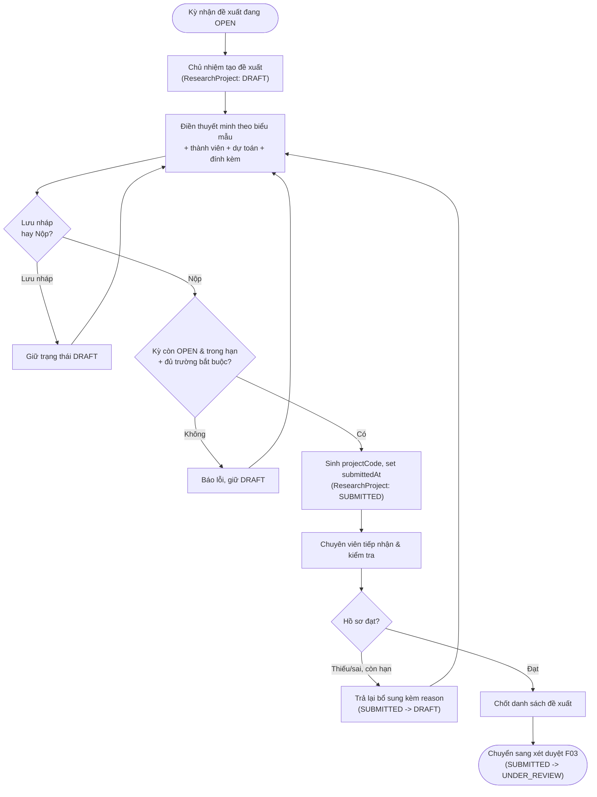

# Đề xuất đề tài

> Nguồn sự thật về **nghiệp vụ** của feature. Mọi luật, dữ liệu, tiêu chí nghiệm thu
> nằm ở đây. `ui.md` mô tả giao diện và trỏ ngược về file này.

## 1. Bối cảnh & mục tiêu

Hiện nay nhà khoa học đăng ký đề tài nghiên cứu qua email/giấy tờ rời rạc: chủ nhiệm khó biết
trạng thái hồ sơ, chuyên viên QL KHCN khó kiểm soát đủ/đúng hồ sơ và dễ thất lạc. F01 số hóa
**giai đoạn đề xuất**: chủ nhiệm soạn thuyết minh theo biểu mẫu của kỳ nhận đề xuất, thêm thành viên,
dự toán kinh phí, đính kèm tài liệu, lưu nháp rồi nộp; chuyên viên tiếp nhận, kiểm tra, trả lại
bổ sung khi cần và chốt danh sách đưa sang xét duyệt (F03).

F01 là **điểm khởi đầu vòng đời `ResearchProject`** (xem `../../architecture/data-model.md` §3), mở hai
trạng thái đầu tiên `DRAFT` và `SUBMITTED`.

**Kết quả mong đợi:**
- Mọi đề xuất nằm trong một kỳ nhận đề xuất đang `OPEN`, dữ liệu chuẩn hóa theo biểu mẫu, truy vết được.
- Chủ nhiệm chủ động theo dõi trạng thái hồ sơ và lý do trả lại; giảm hồ sơ thiếu/sai.
- Chuyên viên có danh sách đề xuất theo kỳ để kiểm tra và chốt sang xét duyệt nhanh, đúng hạn.

## 2. Phạm vi

- **Trong phạm vi:**
  - Chủ nhiệm tạo/sửa đề xuất khi kỳ nhận đề xuất `OPEN`: điền thuyết minh theo biểu mẫu của kỳ, thêm
    thành viên (`ProjectMember`), dự toán kinh phí đề xuất, đính kèm tài liệu (`Attachment`).
  - Lưu nháp (`DRAFT`) và nộp (`DRAFT` → `SUBMITTED`): sinh `projectCode`, set `submittedAt`.
  - Chuyên viên tiếp nhận, kiểm tra hồ sơ; trả lại bổ sung (`SUBMITTED` → `DRAFT`) kèm lý do khi còn hạn.
  - Chuyên viên chốt danh sách đề xuất hợp lệ để chuyển sang xét duyệt (F03).
- **Ngoài phạm vi:**
  - Cấu hình & mở/đóng kỳ nhận đề xuất, biểu mẫu thuyết minh, bộ tiêu chí → **F02** và **B01**.
  - Gán hội đồng, chấm điểm, chuyển `SUBMITTED` → `UNDER_REVIEW` và kết luận duyệt/từ chối → **F03**.
  - Quản lý người dùng/lĩnh vực/đơn vị → **B03/B01**.
  - Hợp đồng, tiến độ, kinh phí thực chi, nghiệm thu, sản phẩm → **F04–F08**.

## 3. Luồng nghiệp vụ chính

Luồng đề xuất bám đúng chuyển trạng thái `DRAFT ↔ SUBMITTED` của `ResearchProject` trong
`../../architecture/data-model.md` §3. Chỉ hai chuyển này thuộc F01; bước đưa vào hội đồng
(`SUBMITTED` → `UNDER_REVIEW`) thuộc F03.

Diễn giải các bước:
1. **Tạo đề xuất:** chủ nhiệm chọn một kỳ nhận đề xuất đang `OPEN`, hệ thống tạo `ResearchProject` ở `DRAFT`,
   `principalInvestigatorId` = người tạo, đồng thời tạo một `ProjectMember` vai trò `PRINCIPAL_INVESTIGATOR`.
2. **Soạn hồ sơ:** điền `name`, `researchFieldId` (thuộc lĩnh vực của kỳ), `abstract`, `proposalDocument`
   (jsonb theo `proposalTemplateId` của kỳ), `durationMonths`, `requestedBudget`; thêm thành
   viên; đính kèm tài liệu. Có thể lưu nháp nhiều lần.
3. **Nộp:** hệ thống kiểm tra điều kiện nộp (BR-01..BR-04), nếu đạt thì chuyển `SUBMITTED`, sinh
   `projectCode` duy nhất và set `submittedAt`, ghi `AuditLog`.
4. **Tiếp nhận/kiểm tra:** chuyên viên xem danh sách đề xuất theo kỳ, mở chi tiết hồ sơ.
5. **Trả lại bổ sung:** nếu hồ sơ thiếu/sai và kỳ còn hạn, chuyên viên trả về `DRAFT` kèm `reason`;
   chủ nhiệm sửa và nộp lại.
6. **Chốt:** chuyên viên chốt các đề xuất hợp lệ; bước đưa vào hội đồng/xét duyệt thuộc F03.

## 4. Business rules

| ID    | Quy tắc | Mô tả | Ghi chú |
|-------|---------|-------|---------|
| BR-01 | Chỉ nộp khi kỳ `OPEN` & còn hạn | `DRAFT` → `SUBMITTED` chỉ thực hiện khi `ProposalCall.status = OPEN` và thời điểm nộp trong khoảng `[startDate, endDate]`. | Quá `endDate` hoặc kỳ `CLOSED/CANCELLED` → chặn nộp. |
| BR-02 | Đủ trường bắt buộc của biểu mẫu | Phải đủ trường bắt buộc của `ResearchProject` (`name`, `researchFieldId`, `durationMonths`, `requestedBudget`) và mọi trường bắt buộc trong `proposalDocument` theo `proposalTemplateId` của kỳ mới được nộp. | Validate tại backend; FE chỉ phản ánh sớm. |
| BR-03 | Lĩnh vực hợp lệ với kỳ | `ResearchProject.researchFieldId` phải thuộc `ProposalCall.researchFieldIds` của kỳ nộp. | Nếu kỳ không giới hạn lĩnh vực thì bỏ qua. |
| BR-04 | Mỗi đề xuất một chủ nhiệm | Một `ResearchProject` có đúng một `principalInvestigatorId` và đúng một `ProjectMember` vai trò `PRINCIPAL_INVESTIGATOR`. | Chủ nhiệm là người tạo đề xuất. |
| BR-05 | Chủ nhiệm chỉ sửa khi `DRAFT` | Chủ nhiệm/thành viên chỉ chỉnh sửa hồ sơ (thuyết minh, thành viên, dự toán, đính kèm) khi `ResearchProject.status = DRAFT`. Sau `SUBMITTED` hồ sơ khóa. | Quyền sửa nội dung: chủ nhiệm; thành viên xem (xem `ui.md`). |
| BR-06 | Trả lại mới mở khóa sửa | Sau `SUBMITTED`, hồ sơ chỉ sửa tiếp được khi chuyên viên trả lại bổ sung (`SUBMITTED` → `DRAFT`) kèm `reason`, và chỉ khi kỳ còn hạn. | Chuyển lùi bắt buộc có `reason` (data-model §3). |
| BR-07 | `projectCode` tự động & duy nhất | `projectCode` sinh tự động tại thời điểm nộp lần đầu, theo định dạng `<callCode>-<số thứ tự>` và **unique** toàn hệ thống; giữ nguyên qua các lần trả lại/nộp lại. | `projectCode` chỉ sinh một lần. |
| BR-08 | Thành viên không trùng | Trong một `ResearchProject`, một `userId` chỉ xuất hiện một lần ở `ProjectMember`. | Unique cặp (`researchProjectId`, `userId`). |
| BR-09 | Kinh phí & thời gian hợp lệ | `requestedBudget ≥ 0` (số nguyên VND), `durationMonths > 0` (số tháng). | Định dạng tiền/thời gian theo data-model §1. |
| BR-10 | Hủy đề xuất có điều kiện | Đề xuất ở `DRAFT` hoặc `SUBMITTED` (trước xét duyệt) có thể chuyển `CANCELLED`; chuyển kèm `reason`, không xóa cứng. | `DRAFT`/`SUBMITTED` → `CANCELLED` theo data-model §3. |
| BR-11 | Tập trung máy trạng thái | Mọi chuyển `status` của `ResearchProject` đi qua domain service `proposal`, ghi `AuditLog`; không update enum trực tiếp. | Theo overview §4.3. |

## 5. Dữ liệu

Dùng lại thực thể & enum ở `../../architecture/data-model.md`; F01 **không** định nghĩa lại.

- **`ResearchProject`** (§4.3): trục chính của feature. F01 dùng `projectCode` (sinh khi nộp), `name`,
  `proposalCallId`, `researchFieldId`, `principalInvestigatorId`, `hostUnitId`, `abstract`, `proposalDocument` (jsonb theo
  biểu mẫu kỳ), `requestedBudget` (bigint VND), `durationMonths` (int tháng), `status`
  (`DRAFT`/`SUBMITTED`, và `CANCELLED` khi hủy), `submittedAt` (set khi `SUBMITTED`).
- **`ProjectMember`** (§4.3): `researchProjectId`, `userId`, `projectRole`
  (`PRINCIPAL_INVESTIGATOR`/`MEMBER`/`SECRETARY`), `responsibility`. Unique (`researchProjectId`, `userId`) — BR-08.
- **`Attachment`** (§4.3): đính kèm với `targetType = 'ResearchProject'`, `targetId = ResearchProject.id`;
  lưu object storage key, không nhị phân trong CSDL.
- **`ProposalCall`** (§4.3): đọc `status` (`OPEN`), `startDate`/`endDate`, `researchFieldIds`,
  `proposalTemplateId` để xác định điều kiện nộp & cấu trúc thuyết minh.
- **`ResearchField`** (§4.2), **`User`** (§4.1), **`Unit`** (§4.2): tham chiếu danh mục.
- **`AuditLog`** (§4.7): ghi mọi chuyển trạng thái (`SUBMIT`, `RETURN_FOR_REVISION`, `CANCEL`)  với
  `oldValue`/`newValue` và `reason`.

Chuyển trạng thái thuộc F01 (trích data-model §3):

| Từ | Tới | Điều kiện | Người thực hiện | BR |
|----|-----|-----------|-----------------|----|
| `DRAFT` | `SUBMITTED` | Kỳ `OPEN` & còn hạn, đủ trường bắt buộc | Chủ nhiệm | BR-01, BR-02 |
| `SUBMITTED` | `DRAFT` | Hồ sơ thiếu/sai, còn hạn nộp, kèm `reason` | Chuyên viên | BR-06 |
| `DRAFT` / `SUBMITTED` | `CANCELLED` | Trước xét duyệt, kèm `reason` | Chủ nhiệm/Chuyên viên | BR-10 |

## 6. Acceptance criteria

Viết theo Given / When / Then — đầu vào trực tiếp cho `test-plan.md`.

- **AC-01** (happy — tạo & lưu nháp) — Given chủ nhiệm đăng nhập và một kỳ nhận đề xuất đang `OPEN`,
  When tạo đề xuất mới và lưu nháp, Then hệ thống tạo `ResearchProject` ở `DRAFT` với `principalInvestigatorId` là người
  tạo và một `ProjectMember` vai trò `PRINCIPAL_INVESTIGATOR`, **chưa** sinh `projectCode`.
- **AC-02** (happy — nộp hợp lệ) — Given một đề xuất `DRAFT` đủ trường bắt buộc trong kỳ `OPEN` còn
  hạn, When chủ nhiệm nộp, Then `ResearchProject` chuyển `SUBMITTED`, sinh `projectCode` duy nhất, set `submittedAt`,
  khóa sửa hồ sơ và ghi `AuditLog`.
- **AC-03** (biên — quá hạn nộp) — Given một đề xuất `DRAFT` và thời điểm hiện tại sau `endDate`
  của kỳ (hoặc kỳ đã `CLOSED`), When chủ nhiệm nộp, Then hệ thống chặn, giữ `DRAFT` và báo lỗi
  "Đã hết hạn nộp của kỳ" (BR-01).
- **AC-04** (lỗi — thiếu trường bắt buộc) — Given một đề xuất `DRAFT` thiếu ≥1 trường bắt buộc của
  biểu mẫu hoặc của `ResearchProject`, When chủ nhiệm nộp, Then hệ thống chặn, giữ `DRAFT` và liệt kê các
  trường còn thiếu (BR-02).
- **AC-05** (sai quyền — sửa sau khi nộp) — Given một đề xuất ở `SUBMITTED`, When chủ nhiệm cố sửa
  thuyết minh/thành viên/đính kèm, Then hệ thống từ chối với thông báo hồ sơ đã nộp chỉ sửa được
  sau khi được trả lại (BR-05, BR-06).
- **AC-06** (sai quyền — không phải chủ nhiệm) — Given một người dùng không phải chủ nhiệm và
  không có quyền của chuyên viên, When cố mở/sửa/nộp đề xuất của người khác, Then bị từ chối
  (403) và không thấy đề xuất ngoài phạm vi của mình.
- **AC-07** (happy — chuyên viên trả lại bổ sung) — Given chuyên viên QL KHCN và một đề xuất
  `SUBMITTED` trong kỳ còn hạn, When trả lại bổ sung kèm `reason`, Then `ResearchProject` chuyển `DRAFT`, hồ sơ
  mở khóa cho chủ nhiệm sửa, `reason` hiển thị cho chủ nhiệm và ghi `AuditLog` (BR-06).
- **AC-08** (biên — trả lại khi hết hạn) — Given một đề xuất `SUBMITTED` mà kỳ đã hết hạn nộp,
  When chuyên viên trả lại bổ sung, Then hệ thống chặn vì chủ nhiệm không còn thời gian nộp lại
  (BR-06), gợi ý xử lý theo F03.
- **AC-09** (lỗi — thành viên trùng) — Given một đề xuất `DRAFT` đã có thành viên X, When chủ nhiệm
  thêm lại đúng người dùng X, Then hệ thống từ chối vì thành viên đã tồn tại (BR-08).
- **AC-10** (happy — chốt sang xét duyệt) — Given các đề xuất `SUBMITTED` hợp lệ trong một kỳ,
  When chuyên viên chốt danh sách, Then danh sách sẵn sàng chuyển sang xét duyệt F03; bản thân
  việc chuyển `SUBMITTED` → `UNDER_REVIEW` do F03 thực hiện.
- **AC-11** (biên — `projectCode` giữ nguyên khi nộp lại) — Given một đề xuất từng `SUBMITTED` rồi bị
  trả lại về `DRAFT`, When chủ nhiệm sửa và nộp lại, Then `projectCode` **không** sinh mới, `submittedAt`
  cập nhật theo lần nộp mới nhất (BR-07).

## 7. Phụ thuộc & rủi ro

**Phụ thuộc:**
- **F02 — Kỳ nhận đề xuất:** cần kỳ ở `OPEN`, `startDate`/`endDate`, `researchFieldIds`, `proposalTemplateId`.
- **B01 — Danh mục:** `ResearchField`, biểu mẫu thuyết minh, cấu hình hệ thống (định dạng `projectCode`).
- **B03 — Người dùng & phân quyền:** `User`, vai trò/quyền (`RESEARCH_PROJECT.*`), data scoping.
- **Chuyển tiếp F03 — Xét duyệt:** nhận các đề xuất `SUBMITTED` đã chốt; F03 chuyển sang
  `UNDER_REVIEW`.
- **B04 — Thông báo (tùy chọn giai đoạn Now):** thông báo khi trả lại bổ sung/nộp thành công.

**Giả định:**
- Biểu mẫu thuyết minh được B01/F02 định nghĩa trước; F01 chỉ render & validate theo schema.
- Domain service `proposal` là nơi duy nhất đổi `ResearchProject.status` (overview §4.3).

**Rủi ro / cần làm rõ:**
- **Định dạng `projectCode`:** chốt quy tắc đánh số (theo kỳ? theo năm?) và chống trùng khi nộp đồng
  thời (cần khóa/sequence ở backend) — BR-07.
- **Biểu mẫu đổi giữa kỳ:** nếu biểu mẫu thay đổi sau khi có đề xuất `DRAFT`, cần quy tắc version
  hóa thuyết minh để không vỡ dữ liệu jsonb đã nhập.
- **Quyền sửa của thành viên:** giai đoạn Now mặc định chỉ chủ nhiệm sửa nội dung; nếu cho thành
  viên/thư ký cùng sửa cần bổ sung quyền & audit (cần PO xác nhận).
- **Hết hạn khi đang nháp:** đề xuất `DRAFT` chưa nộp khi kỳ `CLOSED` sẽ không nộp được — cần thông
  báo nhắc hạn (B04) để giảm rủi ro trễ.
