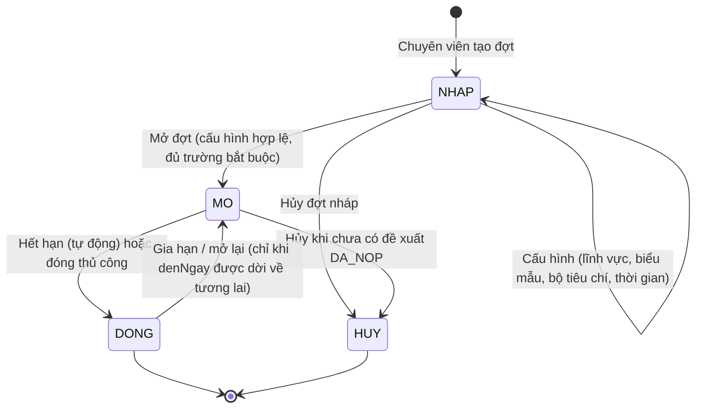

# Đợt kêu gọi đề xuất

> Nguồn sự thật về **nghiệp vụ** của feature. Mọi luật, dữ liệu, tiêu chí nghiệm thu
> nằm ở đây. `frontend.md` và `backoffice.md` chỉ mô tả giao diện và trỏ ngược về file này.

## 1. Bối cảnh & mục tiêu

Trước khi nhà khoa học có thể nộp đề xuất (F01), tổ chức phải **mở một kỳ nhận đề xuất** có
thời gian, lĩnh vực, biểu mẫu thuyết minh và bộ tiêu chí xét duyệt rõ ràng. Hiện việc kêu gọi
làm qua công văn/email rời rạc nên nhà khoa học không biết đợt nào đang mở, nộp theo mẫu nào,
còn chuyên viên khó kiểm soát số lượng và thời hạn.

**Đợt kêu gọi** (`DotKeuGoi`) là điểm khởi đầu của vòng đời đề tài và là **điều kiện tiên quyết
của F01**: mọi đề tài đều phải gắn vào đúng một đợt. Feature thuộc giai đoạn **Now** trên
`../../product/roadmap.md`.

Kết quả mong đợi:

- Chuyên viên QL KHCN tạo, cấu hình và mở/đóng/hủy đợt kêu gọi trong BackOffice.
- Nhà khoa học thấy được các đợt đang mở còn trong hạn và biết chính xác mẫu thuyết minh cần dùng.
- Bộ tiêu chí và biểu mẫu được "đóng băng" theo đợt để F01 (nộp) và F03 (xét duyệt) dùng nhất quán.

## 2. Phạm vi

- **Trong phạm vi:**
  - Tạo/sửa đợt ở trạng thái `NHAP`; cấu hình tên/mã, khoảng `tuNgay`–`denNgay`, lĩnh vực nhận
    (`linhVucIds`), biểu mẫu thuyết minh (`bieuMauThuyetMinhId`), bộ tiêu chí xét duyệt
    (`tieuChiXetDuyetId`).
  - Chuyển vòng đời đợt: mở (`MO`), đóng (`DONG`) thủ công hoặc tự động khi hết hạn, hủy (`HUY`).
  - Hiển thị danh sách đợt **đang mở** cho nhà khoa học và điều hướng sang luồng nộp đề xuất (F01).
  - Theo dõi số đề xuất đã gắn vào đợt (đếm `DeTai` theo đợt) ở BackOffice.
- **Ngoài phạm vi:**
  - Tạo/chỉnh nội dung thuyết minh và nộp hồ sơ đề tài → **F01**.
  - Định nghĩa danh mục lĩnh vực, mẫu biểu mẫu, bộ tiêu chí → **B01** (F02 chỉ tham chiếu).
  - Quy trình hội đồng chấm điểm → **F03** (chỉ tiêu thụ `tieuChiXetDuyetId` của đợt).
  - Quản lý người dùng/vai trò → **B03**.

## 3. Luồng nghiệp vụ chính

Chuyên viên tạo đợt ở trạng thái `NHAP`, cấu hình đầy đủ rồi **mở đợt**. Khi đợt `MO` và còn trong
hạn, nhà khoa học thấy đợt và nộp đề xuất qua F01. Hết hạn (hoặc đóng thủ công) đợt chuyển `DONG`,
ngừng nhận đề xuất mới; các đề tài đã nộp đi tiếp sang xét duyệt (F03). Đợt chưa có đề xuất hợp lệ
có thể bị **hủy** (`HUY`).

### 3.1 Vòng đời đợt kêu gọi (state machine)

| Từ | Tới | Điều kiện | Người thực hiện |
|---|---|---|---|
| `NHAP` | `MO` | Cấu hình hợp lệ (BR-01..BR-04), đủ trường bắt buộc | Chuyên viên |
| `NHAP` | `HUY` | Đợt nháp, không cần điều kiện | Chuyên viên |
| `MO` | `DONG` | Quá `denNgay` (job tự động) **hoặc** chuyên viên đóng thủ công | Hệ thống / Chuyên viên |
| `MO` | `HUY` | Chưa có đề tài nào ở trạng thái `DA_NOP` trở đi (BR-05) | Chuyên viên |
| `DONG` | `MO` | Chuyên viên gia hạn `denNgay` về tương lai (BR-06) | Chuyên viên |

> Logic chuyển trạng thái tập trung ở domain service module `call` (xem `../../architecture/overview.md` §4.3),
> không rải ở từng màn hình. Mọi chuyển trạng thái ghi `NhatKyHeThong`.

## 4. Business rules

| ID    | Quy tắc | Mô tả | Ghi chú |
|-------|---------|-------|---------|
| BR-01 | Khoảng thời gian hợp lệ | `denNgay` ≥ `tuNgay`. Không cho mở đợt nếu `denNgay` đã ở quá khứ. | Validate cả khi tạo/sửa và khi mở |
| BR-02 | Mã đợt duy nhất | `ma` là duy nhất toàn hệ thống (vd `KG-2026-01`). | Unique constraint trên `DotKeuGoi.ma` |
| BR-03 | Cấu hình bắt buộc khi mở | Để chuyển `NHAP → MO` phải có: `ten`, `ma`, `tuNgay`, `denNgay`, ≥1 `linhVucIds`, `bieuMauThuyetMinhId`, `tieuChiXetDuyetId`. | Đảm bảo F01/F03 có đủ cấu hình |
| BR-04 | Tham chiếu danh mục còn hiệu lực | `linhVucIds`, `bieuMauThuyetMinhId`, `tieuChiXetDuyetId` phải trỏ tới bản ghi B01 đang `ACTIVE`. | `ON DELETE RESTRICT`, xem data-model §5 |
| BR-05 | Chỉ đợt MO mới nhận đề xuất | Nhà khoa học chỉ nộp được khi đợt `MO` **và** thời điểm nộp ≤ `denNgay`. Đợt `NHAP`/`DONG`/`HUY` từ chối nộp. | Kiểm tra phía backend F01 |
| BR-06 | Khóa cấu hình sau khi có đề xuất | Khi đợt đã `MO` và đã có ≥1 đề tài `DA_NOP`: không sửa `tuNgay`, `linhVucIds`, `bieuMauThuyetMinhId`, `tieuChiXetDuyetId`; **chỉ cho gia hạn `denNgay`** về tương lai. | Tránh lệch dữ liệu với hồ sơ đã nộp |
| BR-07 | Không hủy đợt đã có đề xuất | Không cho `HUY` nếu đợt có bất kỳ đề tài nào ở `DA_NOP` trở đi. Phải `DONG` thay vì `HUY`. | Bảo toàn hồ sơ nhà khoa học |
| BR-08 | Hiển thị có lọc cho FE | Nhà khoa học chỉ thấy đợt `trangThai = MO` và `denNgay` ≥ hôm nay. | Đợt `NHAP/DONG/HUY` ẩn khỏi FE |

## 5. Dữ liệu

Thực thể chính: **`DotKeuGoi`** — định nghĩa đầy đủ ở `../../architecture/data-model.md` §4.3.
Các trường F02 thao tác trực tiếp: `ma`, `ten`, `tuNgay`, `denNgay`, `linhVucIds`,
`bieuMauThuyetMinhId`, `tieuChiXetDuyetId`, `trangThai` (`NHAP`|`MO`|`DONG`|`HUY`).

Quan hệ & tham chiếu:

- `DotKeuGoi ||--o{ DeTai` — một đợt nhận nhiều đề tài (F01). Số đề xuất của đợt = `COUNT(DeTai WHERE dotKeuGoiId = đợt)`.
- `linhVucIds[] → LinhVuc` (B01); `bieuMauThuyetMinhId`, `tieuChiXetDuyetId → BoTieuChi` (B01).
- Trường audit dùng chung (`createdAt/By`, `updatedAt/By`) và xóa mềm theo quy ước data-model §1.

F02 **không** định nghĩa trường mới ngoài những gì đã có trong data-model. Đếm đề xuất là truy vấn
dẫn xuất, không lưu cột riêng.

## 6. Acceptance criteria

Viết theo Given / When / Then — đầu vào trực tiếp cho `test-plan.md`.

- **AC-01** (happy, tạo) — Given chuyên viên QL KHCN đã đăng nhập BO,
  When tạo đợt mới với `ma`, `ten`, `tuNgay`–`denNgay` hợp lệ (BR-01),
  Then đợt được lưu ở trạng thái `NHAP` và xuất hiện trong danh sách đợt của BO.
- **AC-02** (happy, mở) — Given đợt `NHAP` đã cấu hình đủ trường bắt buộc (BR-03) với danh mục B01 còn hiệu lực (BR-04),
  When chuyên viên bấm "Mở đợt",
  Then đợt chuyển `MO`, ghi `NhatKyHeThong`, và nhà khoa học thấy đợt trong danh sách FE (BR-08).
- **AC-03** (happy, FE → F01) — Given một đợt `MO` còn trong hạn,
  When nhà khoa học mở chi tiết đợt và bấm "Nộp đề xuất",
  Then hệ thống điều hướng sang luồng F01 với `dotKeuGoiId` và biểu mẫu thuyết minh của đợt được nạp sẵn.
- **AC-04** (biên, hết hạn → đóng) — Given đợt `MO` có `denNgay` là hôm qua,
  When job định kỳ chạy (hoặc chuyên viên đóng thủ công),
  Then đợt chuyển `DONG`, biến mất khỏi danh sách FE, và F01 từ chối mọi yêu cầu nộp mới vào đợt này (BR-05).
- **AC-05** (lỗi, validate) — Given chuyên viên tạo/sửa đợt với `denNgay` < `tuNgay` hoặc `ma` đã tồn tại,
  When bấm Lưu,
  Then hệ thống từ chối, không lưu, và hiển thị lỗi tương ứng (BR-01 / BR-02).
- **AC-06** (biên, khóa cấu hình) — Given đợt `MO` đã có ≥1 đề tài `DA_NOP`,
  When chuyên viên cố sửa `tuNgay`/`linhVucIds`/`bieuMauThuyetMinhId`/`tieuChiXetDuyetId`,
  Then hệ thống chặn các trường đó và chỉ cho phép gia hạn `denNgay` về tương lai (BR-06).
- **AC-07** (lỗi, hủy) — Given đợt đã có đề tài `DA_NOP`,
  When chuyên viên cố `HUY` đợt,
  Then hệ thống từ chối với thông báo phải `DONG` thay vì `HUY` (BR-07).
- **AC-08** (quyền) — Given người dùng không có quyền `DOT_KEU_GOI.QUAN_LY` (vd nhà khoa học, thành viên hội đồng),
  When gọi API hoặc mở màn hình tạo/sửa/mở/đóng/hủy đợt,
  Then hệ thống từ chối (403) và không thay đổi dữ liệu.

## 7. Phụ thuộc & rủi ro

**Phụ thuộc:**

- **B01 — Danh mục & cấu hình:** nguồn của `LinhVuc`, biểu mẫu thuyết minh và `BoTieuChi`. Đợt chỉ
  cấu hình đủ khi B01 đã có dữ liệu hiệu lực.
- **B03 — Quản lý người dùng:** vai trò/quyền `DOT_KEU_GOI.QUAN_LY` để vận hành đợt (BR/AC-08).
- **F01 — Đề xuất đề tài (đầu ra):** F01 tiêu thụ `dotKeuGoiId`, biểu mẫu và trạng thái `MO` của đợt;
  ràng buộc BR-05/BR-06/BR-07 thực thi ở backend F01/`call`.
- **F03 — Xét duyệt hội đồng (đầu ra):** dùng `tieuChiXetDuyetId` đã đóng băng theo đợt.
- **Job scheduler** (overview §2): tự động đóng đợt khi quá `denNgay`.

**Rủi ro & điểm cần làm rõ:**

- *Đóng băng cấu hình:* cần chốt phạm vi "snapshot" biểu mẫu/bộ tiêu chí — tham chiếu id hay sao chép
  nội dung tại thời điểm mở? Hiện giả định tham chiếu + B01 dùng xóa mềm để giữ toàn vẹn (BR-04).
- *Múi giờ hạn nộp:* `tuNgay/denNgay` là `date`; cần thống nhất "hết hạn" tính theo cuối ngày
  `denNgay` theo Asia/Ho_Chi_Minh (overview §4.4) để job đóng đợt không lệch ngày.
- *Mở lại đợt đã đóng:* `DONG → MO` chỉ hợp lệ khi gia hạn `denNgay`; cần xác nhận nghiệp vụ có cho
  phép mở lại hay luôn tạo đợt mới.
- *Đợt chồng lấn lĩnh vực/thời gian:* chưa ràng buộc cứng; rủi ro nhà khoa học phân vân chọn đợt —
  cân nhắc cảnh báo (không chặn) ở BO.
