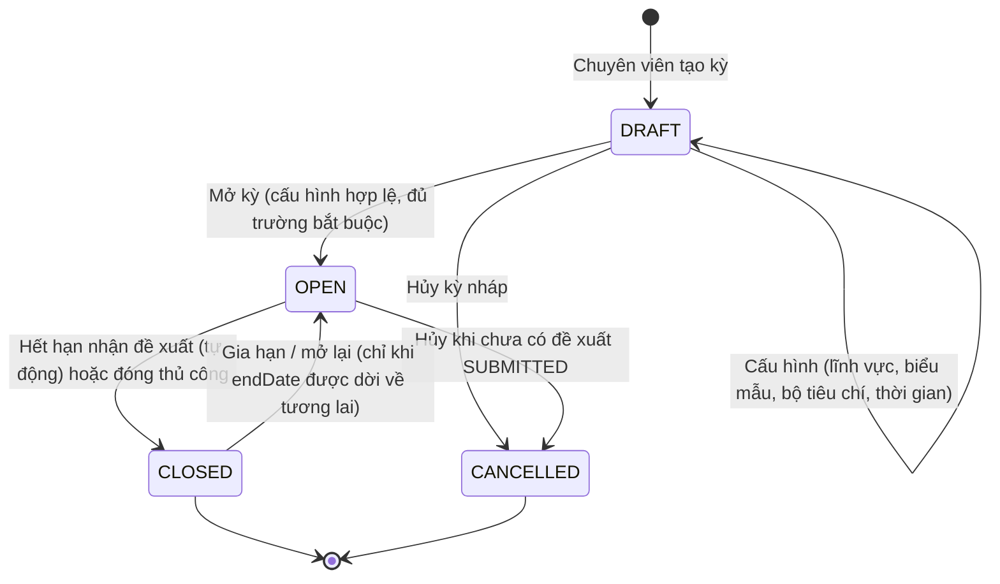

# Kỳ nhận đề xuất

> Nguồn sự thật về **nghiệp vụ** của feature. Mọi luật, dữ liệu, tiêu chí nghiệm thu
> nằm ở đây. `ui.md` mô tả giao diện và trỏ ngược về file này.

## 1. Bối cảnh & mục tiêu

Trước khi nhà khoa học có thể nộp đề xuất (F01), tổ chức phải **mở một kỳ nhận đề xuất** có
thời gian nhận hồ sơ, lĩnh vực, biểu mẫu thuyết minh và bộ tiêu chí xét duyệt rõ ràng. Hiện việc tiếp nhận đề xuất
làm qua công văn/email rời rạc nên nhà khoa học không biết kỳ nào đang mở, nộp theo mẫu nào,
còn chuyên viên khó kiểm soát số lượng và thời hạn.

**Kỳ nhận đề xuất** (`ProposalCall`) là điểm khởi đầu của vòng đời đề tài và là **điều kiện tiên quyết
của F01**: mọi đề tài đều phải gắn vào đúng một kỳ nhận đề xuất. Feature thuộc giai đoạn **Now** trên
`../../product/roadmap.md`.

Kết quả mong đợi:

- Chuyên viên QL KHCN tạo, cấu hình và mở/đóng/hủy kỳ nhận đề xuất trong BackOffice.
- Nhà khoa học thấy được các kỳ đang mở còn trong hạn nhận đề xuất và biết chính xác mẫu thuyết minh cần dùng.
- Bộ tiêu chí và biểu mẫu được "đóng băng" theo kỳ để F01 (nộp) và F03 (xét duyệt) dùng nhất quán.
- `startDate`/`endDate` của kỳ chỉ là **khoảng thời gian nhận đề xuất**, không phải thời gian thực hiện
  hoặc thời hạn hoàn thành đề tài; thời gian thực hiện nằm trong hồ sơ đề tài F01 (`durationMonths`) và các mốc tiến độ F04.

## 2. Phạm vi

- **Trong phạm vi:**
  - Tạo/sửa kỳ ở trạng thái `DRAFT`; cấu hình tên/mã, khoảng nhận đề xuất `startDate`–`endDate`, lĩnh vực nhận
    (`researchFieldIds`), biểu mẫu thuyết minh (`proposalTemplateId`), bộ tiêu chí xét duyệt
    (`reviewCriteriaSetId`).
  - Chuyển vòng đời kỳ: mở (`OPEN`), đóng (`CLOSED`) thủ công hoặc tự động khi hết hạn nhận đề xuất, hủy (`CANCELLED`).
  - Hiển thị danh sách kỳ **đang mở** cho nhà khoa học và điều hướng sang luồng nộp đề xuất (F01).
  - Theo dõi số đề xuất đã gắn vào kỳ (đếm `ResearchProject` theo kỳ) ở BackOffice.
- **Ngoài phạm vi:**
  - Tạo/chỉnh nội dung thuyết minh và nộp hồ sơ đề tài → **F01**.
  - Định nghĩa danh mục lĩnh vực, mẫu biểu mẫu, bộ tiêu chí → **B01** (F02 chỉ tham chiếu).
  - Quy trình hội đồng chấm điểm → **F03** (chỉ tiêu thụ `reviewCriteriaSetId` của kỳ).
  - Quản lý người dùng/vai trò → **B03**.

## 3. Luồng nghiệp vụ chính

Chuyên viên tạo kỳ ở trạng thái `DRAFT`, cấu hình đầy đủ rồi **mở kỳ**. Khi kỳ `OPEN` và còn trong
hạn nhận đề xuất, nhà khoa học thấy kỳ và nộp đề xuất qua F01. Hết hạn nhận đề xuất (hoặc đóng thủ công) kỳ chuyển `CLOSED`,
ngừng nhận đề xuất mới; các đề tài đã nộp đi tiếp sang xét duyệt (F03). Kỳ chưa có đề xuất hợp lệ
có thể bị **hủy** (`CANCELLED`).

### 3.1 Vòng đời kỳ nhận đề xuất (state machine)

| Từ | Tới | Điều kiện | Người thực hiện |
|---|---|---|---|
| `DRAFT` | `OPEN` | Cấu hình hợp lệ (BR-01..BR-04), đủ trường bắt buộc | Chuyên viên |
| `DRAFT` | `CANCELLED` | Kỳ nháp, không cần điều kiện | Chuyên viên |
| `OPEN` | `CLOSED` | Quá `endDate` (job tự động) **hoặc** chuyên viên đóng thủ công | Hệ thống / Chuyên viên |
| `OPEN` | `CANCELLED` | Chưa có đề tài nào ở trạng thái `SUBMITTED` trở đi (BR-05) | Chuyên viên |
| `CLOSED` | `OPEN` | Chuyên viên gia hạn `endDate` về tương lai (BR-06) | Chuyên viên |

> Logic chuyển trạng thái tập trung ở domain service module `call` (xem `../../architecture/overview.md` §4.3),
> không rải ở từng màn hình. Mọi chuyển trạng thái ghi `AuditLog`.

## 4. Business rules

| ID    | Quy tắc | Mô tả | Ghi chú |
|-------|---------|-------|---------|
| BR-01 | Khoảng nhận đề xuất hợp lệ | `endDate` ≥ `startDate`. Không cho mở kỳ nếu `endDate` đã ở quá khứ. | Validate cả khi tạo/sửa và khi mở |
| BR-02 | Mã kỳ duy nhất | `code` là duy nhất toàn hệ thống (vd `KG-2026-01`). | Unique constraint trên `ProposalCall.code` |
| BR-03 | Cấu hình bắt buộc khi mở | Để chuyển `DRAFT → OPEN` phải có: `name`, `code`, `startDate`, `endDate`, ≥1 `researchFieldIds`, `proposalTemplateId`, `reviewCriteriaSetId`. | Đảm bảo F01/F03 có đủ cấu hình |
| BR-04 | Tham chiếu danh mục còn hiệu lực | `researchFieldIds`, `proposalTemplateId`, `reviewCriteriaSetId` phải trỏ tới bản ghi B01 đang `ACTIVE`. | `ON DELETE RESTRICT`, xem data-model §5 |
| BR-05 | Chỉ kỳ OPEN mới nhận đề xuất | Nhà khoa học chỉ nộp được khi kỳ `OPEN` **và** thời điểm nộp ≤ `endDate`. Kỳ `DRAFT`/`CLOSED`/`CANCELLED` từ chối nộp. | Kiểm tra phía backend F01 |
| BR-06 | Khóa cấu hình sau khi có đề xuất | Khi kỳ đã `OPEN` và đã có ≥1 đề tài `SUBMITTED`: không sửa `startDate`, `researchFieldIds`, `proposalTemplateId`, `reviewCriteriaSetId`; **chỉ cho gia hạn `endDate` nhận đề xuất** về tương lai. | Tránh lệch dữ liệu với hồ sơ đã nộp |
| BR-07 | Không hủy kỳ đã có đề xuất | Không cho `CANCELLED` nếu kỳ có bất kỳ đề tài nào ở `SUBMITTED` trở đi. Phải `CLOSED` thay vì `CANCELLED`. | Bảo toàn hồ sơ nhà khoa học |
| BR-08 | Hiển thị có lọc cho FE | Nhà khoa học chỉ thấy kỳ `status = OPEN` và `endDate` ≥ hôm nay. | Kỳ `DRAFT/CLOSED/CANCELLED` ẩn khỏi FE |

## 5. Dữ liệu

Thực thể chính: **`ProposalCall`** — định nghĩa đầy đủ ở `../../architecture/data-model.md` §4.3.
Các trường F02 thao tác trực tiếp: `code`, `name`, `startDate`, `endDate`, `researchFieldIds`,
`proposalTemplateId`, `reviewCriteriaSetId`, `status` (`DRAFT`|`OPEN`|`CLOSED`|`CANCELLED`).

Quan hệ & tham chiếu:

- `ProposalCall ||--o{ ResearchProject` — một kỳ nhận nhiều đề tài (F01). Số đề xuất của kỳ = `COUNT(ResearchProject WHERE proposalCallId = kỳ)`.
- `researchFieldIds[] → ResearchField` (B01); `proposalTemplateId`, `reviewCriteriaSetId → CriteriaSet` (B01).
- Trường audit dùng chung (`createdAt/By`, `updatedAt/By`) và xóa mềm theo quy ước data-model §1.

F02 **không** định nghĩa trường mới ngoài những gì đã có trong data-model. Đếm đề xuất là truy vấn
dẫn xuất, không lưu cột riêng.

## 6. Acceptance criteria

Viết theo Given / When / Then — đầu vào trực tiếp cho `test-plan.md`.

- **AC-01** (happy, tạo) — Given chuyên viên QL KHCN đã đăng nhập BO,
  When tạo kỳ mới với `code`, `name`, `startDate`–`endDate` nhận đề xuất hợp lệ (BR-01),
  Then kỳ được lưu ở trạng thái `DRAFT` và xuất hiện trong danh sách kỳ của BO.
- **AC-02** (happy, mở) — Given kỳ `DRAFT` đã cấu hình đủ trường bắt buộc (BR-03) với danh mục B01 còn hiệu lực (BR-04),
  When chuyên viên bấm "Mở kỳ",
  Then kỳ chuyển `OPEN`, ghi `AuditLog`, và nhà khoa học thấy kỳ trong danh sách FE (BR-08).
- **AC-03** (happy, FE → F01) — Given một kỳ `OPEN` còn trong hạn nhận đề xuất,
  When nhà khoa học mở chi tiết kỳ và bấm "Nộp đề xuất",
  Then hệ thống điều hướng sang luồng F01 với `proposalCallId` và biểu mẫu thuyết minh của kỳ được nạp sẵn.
- **AC-04** (biên, hết hạn → đóng) — Given kỳ `OPEN` có `endDate` nhận đề xuất là hôm qua,
  When job định kỳ chạy (hoặc chuyên viên đóng thủ công),
  Then kỳ chuyển `CLOSED`, biến mất khỏi danh sách FE, và F01 từ chối mọi yêu cầu nộp mới vào kỳ này (BR-05).
- **AC-05** (lỗi, validate) — Given chuyên viên tạo/sửa kỳ với `endDate` < `startDate` hoặc `code` đã tồn tại,
  When bấm Lưu,
  Then hệ thống từ chối, không lưu, và hiển thị lỗi tương ứng (BR-01 / BR-02).
- **AC-06** (biên, khóa cấu hình) — Given kỳ `OPEN` đã có ≥1 đề tài `SUBMITTED`,
  When chuyên viên cố sửa `startDate`/`researchFieldIds`/`proposalTemplateId`/`reviewCriteriaSetId`,
  Then hệ thống chặn các trường đó và chỉ cho phép gia hạn `endDate` về tương lai (BR-06).
- **AC-07** (lỗi, hủy) — Given kỳ đã có đề tài `SUBMITTED`,
  When chuyên viên cố `CANCELLED` kỳ,
  Then hệ thống từ chối với thông báo phải `CLOSED` thay vì `CANCELLED` (BR-07).
- **AC-08** (quyền) — Given người dùng không có quyền `PROPOSAL_CALL.MANAGE` (vd nhà khoa học, thành viên hội đồng),
  When gọi API hoặc mở màn hình tạo/sửa/mở/đóng/hủy kỳ,
  Then hệ thống từ chối (403) và không thay đổi dữ liệu.

## 7. Phụ thuộc & rủi ro

**Phụ thuộc:**

- **B01 — Danh mục & cấu hình:** nguồn của `ResearchField`, biểu mẫu thuyết minh và `CriteriaSet`. Kỳ chỉ
  cấu hình đủ khi B01 đã có dữ liệu hiệu lực.
- **B03 — Quản lý người dùng:** vai trò/quyền `PROPOSAL_CALL.MANAGE` để vận hành kỳ (BR/AC-08).
- **F01 — Đề xuất đề tài (đầu ra):** F01 tiêu thụ `proposalCallId`, biểu mẫu và trạng thái `OPEN` của kỳ;
  ràng buộc BR-05/BR-06/BR-07 thực thi ở backend F01/`call`.
- **F03 — Xét duyệt hội đồng (đầu ra):** dùng `reviewCriteriaSetId` đã đóng băng theo kỳ.
- **Job scheduler** (overview §2): tự động đóng kỳ khi quá `endDate` nhận đề xuất.

**Rủi ro & điểm cần làm rõ:**

- *Đóng băng cấu hình:* cần chốt phạm vi "snapshot" biểu mẫu/bộ tiêu chí — tham chiếu id hay sao chép
  nội dung tại thời điểm mở? Hiện giả định tham chiếu + B01 dùng xóa mềm để giữ toàn vẹn (BR-04).
- *Múi giờ hạn nộp:* `startDate/endDate` là `date`; cần thống nhất "hết hạn nhận đề xuất" tính theo cuối ngày
  `endDate` theo Asia/Ho_Chi_Minh (overview §4.4) để job đóng kỳ không lệch ngày.
- *Mở lại kỳ đã đóng:* `CLOSED → OPEN` chỉ hợp lệ khi gia hạn `endDate`; cần xác nhận nghiệp vụ có cho
  phép mở lại hay luôn tạo kỳ mới.
- *Kỳ chồng lấn lĩnh vực/thời gian:* chưa ràng buộc cứng; rủi ro nhà khoa học phân vân chọn kỳ —
  cân nhắc cảnh báo (không chặn) ở BO.
