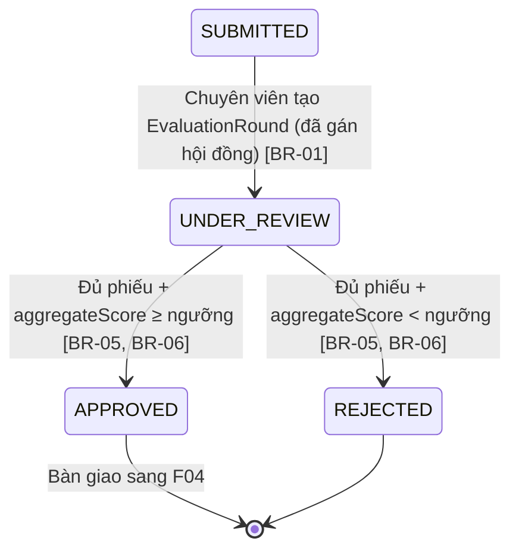

# Xét duyệt hội đồng

> Nguồn sự thật về **nghiệp vụ** của feature. Mọi luật, dữ liệu, tiêu chí nghiệm thu
> nằm ở đây. `frontend.md` và `backoffice.md` chỉ mô tả giao diện và trỏ ngược về file này.

## 1. Bối cảnh & mục tiêu

Sau khi kỳ nhận đề xuất đóng và chuyên viên chốt danh sách đề xuất hợp lệ (F01/F02), các đề tài cần được
một **hội đồng chuyên môn** đánh giá để chấp nhận hoặc từ chối đưa vào thực hiện. Hiện quy trình này
chạy thủ công (gửi hồ sơ giấy/email, tổng hợp điểm bằng bảng tính), khó truy vết, dễ sai sót khi cộng
điểm theo trọng số và dễ xung đột lợi ích.

F03 số hóa toàn bộ vòng xét duyệt: lập hội đồng `type=PROPOSAL_REVIEW`, phân công thành viên, mở đợt đánh giá
cho từng đề tài, để thành viên chấm điểm theo bộ tiêu chí, hệ thống tự tổng hợp điểm và hỗ trợ chuyên
viên ra kết luận theo ngưỡng cấu hình.

**Kết quả mong đợi:**
- Đề tài chuyển trạng thái `SUBMITTED → UNDER_REVIEW → APPROVED | REJECTED` có truy vết đầy đủ.
- Điểm tổng hợp tính tự động theo trọng số, không cộng tay; kết luận minh bạch theo ngưỡng.
- Chủ nhiệm được thông báo kết quả và (nếu công khai) nhận xét của hội đồng.

## 2. Phạm vi

- **Trong phạm vi:**
  - Lập `EvaluationCommittee` type `PROPOSAL_REVIEW`, phân công `CommitteeMember` (chủ tịch/phản biện/ủy viên/thư ký).
  - Tạo `EvaluationRound` cho từng đề tài → chuyển `ResearchProject` sang `UNDER_REVIEW`.
  - Thành viên hội đồng điền `ScoreSheet` (điểm từng `EvaluationCriterion` + nhận xét), gửi phiếu `DRAFT → SUBMITTED`.
  - Tính `aggregateScore` theo trọng số; chuyên viên ra kết luận `APPROVED | REJECTED` theo ngưỡng `SystemSetting`.
  - Thông báo kết quả cho chủ nhiệm (qua B04); chủ nhiệm xem tiến trình & kết quả ở FE.
- **Ngoài phạm vi:**
  - Tạo/sửa `CriteriaSet`, `EvaluationCriterion` và ngưỡng điểm → thuộc **B01** (danh mục & cấu hình).
  - Gán bộ tiêu chí cho kỳ nhận đề xuất (`ProposalCall.reviewCriteriaSetId`) → thuộc **F02**.
  - Tiếp nhận/chốt danh sách đề xuất → thuộc **F01**.
  - Nghiệm thu kết quả (`type=ACCEPTANCE`) → thuộc **F06** (dùng chung mô hình, xem [ADR-0003](../../architecture/decisions/0003-mo-hinh-hoi-dong-dung-chung.md)).
  - Giao đề tài/ký hợp đồng sau khi `APPROVED` → thuộc **F04**.

## 3. Luồng nghiệp vụ chính

Phần này mô tả luồng độc lập giao diện. Chuyển trạng thái `ResearchProject` bám đúng máy trạng thái ở
[data-model §3](../../architecture/data-model.md#3-vòng-đời-đề-tài-state-machine).

### 3.1 Luồng tổng quát (sequence)

```mermaid
sequenceDiagram
    actor CV as Chuyên viên QL KHCN
    actor TV as Thành viên hội đồng
    participant SYS as RMS (review service)
    actor CN as Chủ nhiệm đề tài

    CV->>SYS: Lập EvaluationCommittee (type=PROPOSAL_REVIEW), phân công CommitteeMember
    CV->>SYS: Tạo EvaluationRound cho từng đề tài (lấy CriteriaSet từ kỳ nhận đề xuất)
    SYS->>SYS: ResearchProject: SUBMITTED → UNDER_REVIEW
    SYS-->>CN: Thông báo "đề tài đang xét duyệt"
    loop Mỗi thành viên (trừ người xung đột lợi ích)
        TV->>SYS: Mở hồ sơ, điền CriterionScore + nhận xét (ScoreSheet DRAFT)
        TV->>SYS: Gửi phiếu (DRAFT → SUBMITTED)
        SYS->>SYS: Tính totalScore của phiếu theo trọng số
    end
    CV->>SYS: Xem bảng tổng hợp; yêu cầu ra kết luận
    SYS->>SYS: Kiểm tra đủ số phiếu SUBMITTED tối thiểu; tính aggregateScore
    SYS->>SYS: So ngưỡng (SystemSetting) → conclusion PASSED/FAILED
    SYS->>SYS: ResearchProject: UNDER_REVIEW → APPROVED | REJECTED
    SYS-->>CN: Thông báo kết quả APPROVED/REJECTED (+ nhận xét nếu công khai)
```

### 3.2 Chuyển trạng thái đề tài trong phạm vi F03



### 3.3 Vòng đời phiếu chấm & đợt đánh giá

- `ScoreSheet.status`: `DRAFT` (đang soạn, sửa được) → `SUBMITTED` (đã gửi, khóa, không sửa).
- `EvaluationRound.status`: `COLLECTING_SCORES` (đang thu phiếu) → `CONCLUDED` (đã có `conclusion`). Sau khi
  kết luận, không nhận thêm/sửa phiếu.

## 4. Business rules

| ID    | Quy tắc | Mô tả | Ghi chú |
|-------|---------|-------|---------|
| BR-01 | Mở xét duyệt cần hội đồng | Chỉ tạo `EvaluationRound` (đưa đề tài vào xét) khi đề tài đang `SUBMITTED` và đã có `EvaluationCommittee` type `PROPOSAL_REVIEW` với ≥ 1 `CommitteeMember`. Tạo thành công → `ResearchProject` chuyển `UNDER_REVIEW`. | Chuyển trạng thái qua domain service, không update enum trực tiếp |
| BR-02 | Bộ tiêu chí từ kỳ nhận đề xuất | `EvaluationRound` dùng `CriteriaSet` lấy theo `ProposalCall.reviewCriteriaSetId` của đề tài; bộ tiêu chí phải có `type=PROPOSAL_REVIEW`. Không cho chấm nếu kỳ nhận đề xuất chưa gán bộ tiêu chí. | Phụ thuộc F02/B01 |
| BR-03 | Xung đột lợi ích | Một thành viên hội đồng **không** được chấm đề tài mà mình là `principalInvestigatorId` hoặc có trong `ProjectMember`. Hệ thống ẩn đề tài đó khỏi hàng chờ chấm của thành viên và chặn tạo `ScoreSheet`. | Loại trừ khi tính số phiếu tối thiểu |
| BR-04 | Một thành viên một phiếu / đợt | Mỗi cặp (`committeeMemberId`, `evaluationRoundId`) chỉ có tối đa **một** `ScoreSheet`. Không tạo phiếu thứ hai. | Unique trên cặp khóa (data-model §5) |
| BR-05 | Điểm hợp lệ theo tiêu chí | Mỗi `CriterionScore.score` phải `0 ≤ score ≤ EvaluationCriterion.maxScore`. Phiếu phải có đủ điểm cho **tất cả** tiêu chí của bộ trước khi gửi. | Validate khi gửi phiếu (`DRAFT → SUBMITTED`) |
| BR-06 | Tính điểm theo trọng số | `ScoreSheet.totalScore = Σ(CriterionScore.score × EvaluationCriterion.weight)`. `EvaluationRound.aggregateScore = trung bình totalScore các ScoreSheet trạng thái SUBMITTED`. Làm tròn 2 chữ số thập phân. | Hệ thống tính, không nhập tay |
| BR-07 | Đủ phiếu mới kết luận | Chỉ ra kết luận khi số `ScoreSheet` `SUBMITTED` ≥ `PROPOSAL_REVIEW.MIN_SUBMITTED_SCORE_SHEETS` (`SystemSetting`). Thiếu phiếu → chặn kết luận, báo còn thiếu. | Mặc định cấu hình; điều chỉnh ở B01 |
| BR-08 | Kết luận theo ngưỡng | `aggregateScore ≥ PROPOSAL_REVIEW.PASSING_SCORE` → `conclusion=PASSED` → `ResearchProject=APPROVED`; ngược lại `conclusion=FAILED` → `ResearchProject=REJECTED`. Đặt `EvaluationRound.status=CONCLUDED`. | Ngưỡng từ `SystemSetting` |
| BR-09 | Tách bạch quyền | Chỉ **Chuyên viên QL KHCN** được lập hội đồng, mở đợt, ra kết luận. **Thành viên hội đồng** chỉ xem hồ sơ được phân công và chấm phiếu của mình. | RBAC backend (overview §4.1) |
| BR-10 | Khóa sau kết luận | Khi `EvaluationRound=CONCLUDED`, không nhận/sửa/rút `ScoreSheet`; không đổi kết luận trừ khi chuyên viên mở lại đợt có `reason` (ghi audit). | Mở lại là ngoại lệ, ghi `AuditLog` |
| BR-11 | Công khai nhận xét | Nhận xét hội đồng chỉ hiển thị cho chủ nhiệm khi `PROPOSAL_REVIEW.PUBLIC_COMMENTS=true`; mặc định ẩn danh tính người chấm. | Cấu hình B01 |

## 5. Dữ liệu

Dùng chung mô hình hội đồng/đánh giá — xem [data-model §4.4](../../architecture/data-model.md#44-hội-đồng--đánh-giá-f03-f06).
F03 thao tác trên các thực thể với `type=PROPOSAL_REVIEW`.

| Thực thể | Vai trò trong F03 | Trường trọng yếu |
|---|---|---|
| `EvaluationCommittee` | Hội đồng xét duyệt | `type=PROPOSAL_REVIEW`, `status` |
| `CommitteeMember` | Thành viên & chức danh | `committeeId`, `userId`, `committeeRole` (`CHAIR`/`REVIEWER`/`MEMBER`/`SECRETARY`) |
| `CriteriaSet` / `EvaluationCriterion` | Bộ tiêu chí chấm | `type=PROPOSAL_REVIEW`; tiêu chí có `maxScore`, `weight` |
| `EvaluationRound` | Lượt đánh giá 1 đề tài | `researchProjectId`, `committeeId`, `type=PROPOSAL_REVIEW`, `status`, `conclusion`, `aggregateScore` |
| `ScoreSheet` | Phiếu của 1 thành viên | `evaluationRoundId`, `committeeMemberId`, `status` (`DRAFT`/`SUBMITTED`), `comment`, `totalScore` |
| `CriterionScore` | Điểm từng tiêu chí | `scoreSheetId`, `evaluationCriterionId`, `score` |
| `ResearchProject` | Đối tượng được xét | `status` (đổi qua domain service) |
| `SystemSetting` | Tham số ngưỡng | `PROPOSAL_REVIEW.MIN_SUBMITTED_SCORE_SHEETS`, `PROPOSAL_REVIEW.PASSING_SCORE`, `PROPOSAL_REVIEW.PUBLIC_COMMENTS` |
| `Notification` | Thông báo kết quả | Sinh khi vào xét duyệt & khi có kết luận (B04) |
| `AuditLog` | Audit | Lập HĐ, gửi phiếu, ra kết luận, mở lại đợt |

> Ràng buộc bổ sung F03 cần (đã có trong data-model): unique (`committeeMemberId`,`evaluationRoundId`) cho
> `ScoreSheet` (BR-04); `EvaluationRound.conclusion` ∈ {`PASSED`,`FAILED`,null}. Nếu cần thêm trường mới
> (vd `EvaluationRound.reopenReason`), bổ sung vào data-model trong cùng PR.

## 6. Acceptance criteria

- **AC-01 (Happy — mở xét duyệt)** — Given một đề tài `SUBMITTED` thuộc kỳ nhận đề xuất đã đóng và đã gán
  bộ tiêu chí `PROPOSAL_REVIEW`, và đã có hội đồng `PROPOSAL_REVIEW` với ≥ 1 thành viên; When chuyên viên tạo
  `EvaluationRound` cho đề tài; Then hệ thống tạo đợt đánh giá `COLLECTING_SCORES`, chuyển `ResearchProject` sang
  `UNDER_REVIEW`, gửi thông báo cho chủ nhiệm và ghi audit.
- **AC-02 (Happy — chấm & gửi phiếu)** — Given thành viên hội đồng được phân công, không xung đột lợi
  ích, đợt đang `COLLECTING_SCORES`; When thành viên nhập đủ điểm cho mọi tiêu chí (mỗi điểm trong `[0, maxScore]`)
  kèm nhận xét rồi gửi phiếu; Then `ScoreSheet` chuyển `DRAFT → SUBMITTED`, hệ thống tính `totalScore` theo
  trọng số và khóa phiếu không cho sửa.
- **AC-03 (Happy — kết luận APPROVED)** — Given số phiếu `SUBMITTED` ≥ ngưỡng tối thiểu và `aggregateScore` ≥
  `PASSING_SCORE`; When chuyên viên ra kết luận; Then `EvaluationRound.conclusion=PASSED`, đợt chuyển `CONCLUDED`,
  `ResearchProject` chuyển `APPROVED`, chủ nhiệm nhận thông báo kết quả.
- **AC-04 (Biên — điểm ngưỡng REJECTED)** — Given đủ phiếu nhưng `aggregateScore < PASSING_SCORE`; When chuyên
  viên ra kết luận; Then `conclusion=FAILED`, `ResearchProject` chuyển `REJECTED`, chủ nhiệm nhận thông báo từ chối.
- **AC-05 (Biên — thiếu phiếu)** — Given số phiếu `SUBMITTED` < `MIN_SUBMITTED_SCORE_SHEETS`; When chuyên viên cố
  ra kết luận; Then hệ thống chặn, hiển thị số phiếu còn thiếu, không đổi trạng thái đề tài (BR-07).
- **AC-06 (Negative — xung đột lợi ích)** — Given thành viên hội đồng đồng thời là chủ nhiệm/thành viên
  của đề tài; When thành viên mở hàng chờ chấm; Then đề tài đó không xuất hiện và mọi cố gắng tạo
  `ScoreSheet` cho đề tài đó bị từ chối (BR-03).
- **AC-07 (Negative — điểm vượt maxScore)** — Given thành viên nhập một `score > maxScore` của tiêu chí;
  When gửi phiếu; Then hệ thống báo lỗi validate, không cho gửi, phiếu giữ `DRAFT` (BR-05).
- **AC-08 (Negative — một thành viên một phiếu)** — Given thành viên đã có một `ScoreSheet` trong đợt;
  When tạo phiếu thứ hai cho cùng đợt; Then hệ thống từ chối do trùng (BR-04).
- **AC-09 (Negative — sai quyền)** — Given người dùng là **Thành viên hội đồng** (không phải chuyên viên);
  When gọi hành động ra kết luận / lập hội đồng; Then hệ thống trả 403, không thực hiện (BR-09).
- **AC-10 (Negative — khóa sau kết luận)** — Given `EvaluationRound=CONCLUDED`; When thành viên cố gửi/sửa
  phiếu; Then bị từ chối (BR-10).

## 7. Phụ thuộc & rủi ro

**Phụ thuộc:**
- **F01 / F02** — danh sách đề tài hợp lệ đã chốt; kỳ nhận đề xuất đã đóng và đã gán `reviewCriteriaSetId`.
- **B01** — `CriteriaSet`/`EvaluationCriterion` type `PROPOSAL_REVIEW` và các tham số `SystemSetting`
  (`MIN_SUBMITTED_SCORE_SHEETS`, `PASSING_SCORE`, `PUBLIC_COMMENTS`).
- **B03** — vai trò & quyền (Chuyên viên QL KHCN, Thành viên hội đồng); tài khoản thành viên hội đồng.
- **B04** — kênh thông báo kết quả `APPROVED`/`REJECTED` cho chủ nhiệm.
- **F04** — tiếp nhận đề tài sau khi `APPROVED`.
- **F06** — chia sẻ mô hình hội đồng/phiếu chấm ([ADR-0003](../../architecture/decisions/0003-mo-hinh-hoi-dong-dung-chung.md));
  thay đổi model phải cân nhắc cả hai feature.

**Rủi ro & điểm cần làm rõ:**
- **Số phiếu hợp lệ khi có xung đột lợi ích:** nếu nhiều thành viên bị loại do BR-03, mẫu số tính
  `aggregateScore` và `MIN_SUBMITTED_SCORE_SHEETS` cần loại trừ họ — cần PO xác nhận công thức.
- **Mở lại đợt sau kết luận (BR-10):** quy trình và quyền mở lại cần làm rõ (có cần phê duyệt cấp trên?).
- **Đồng nhất với F06:** tránh nhồi luật riêng của xét duyệt vào model dùng chung.
- **Thay đổi ngưỡng giữa chừng:** nếu B01 đổi `PASSING_SCORE` khi đợt đang chấm — chốt là kết luận dùng
  ngưỡng tại thời điểm ra kết luận (giả định hiện tại), cần PO duyệt.
