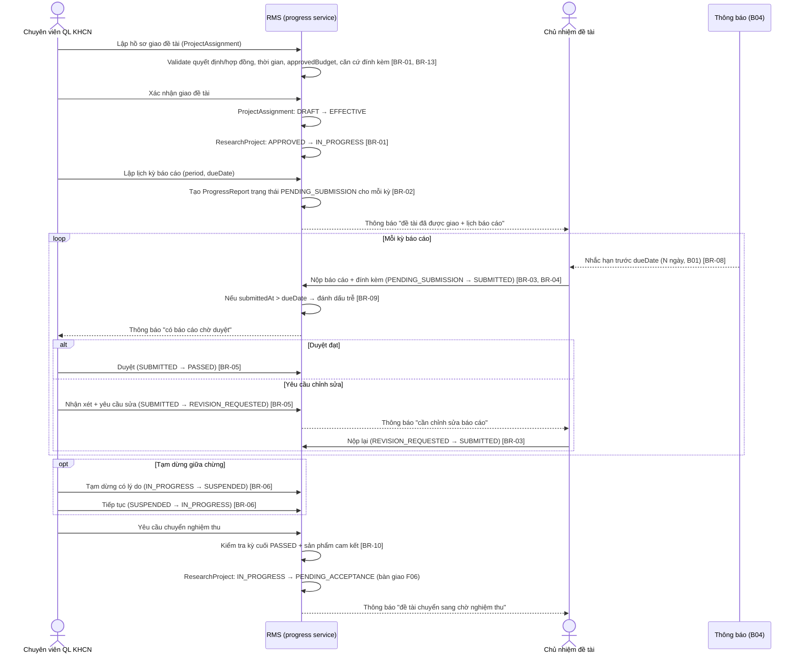
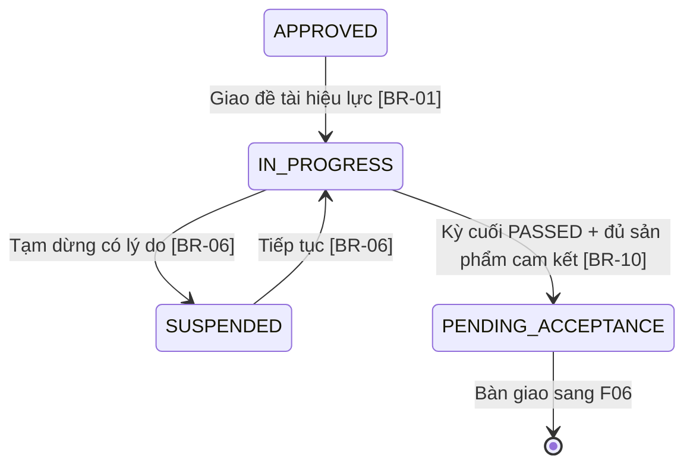
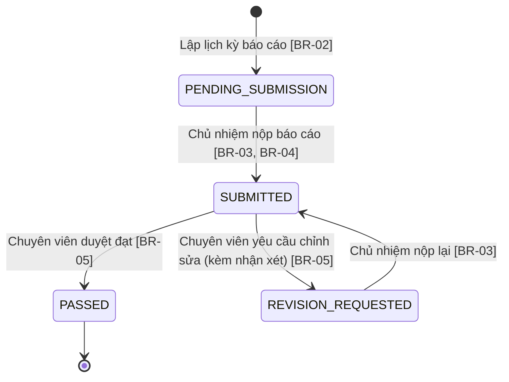

# Quản lý tiến độ

> Nguồn sự thật về **nghiệp vụ** của feature. Mọi luật, dữ liệu, tiêu chí nghiệm thu
> nằm ở đây. `frontend.md` và `backoffice.md` chỉ mô tả giao diện và trỏ ngược về file này.

## 1. Bối cảnh & mục tiêu

Sau khi hội đồng thông qua (F03), đề tài cần được **giao chính thức** trước khi bước vào giai đoạn thực
hiện: chuyên viên lập hồ sơ giao đề tài (quyết định/hợp đồng, thời gian thực hiện, tổng kinh phí được
phê duyệt, văn bản đính kèm), chủ nhiệm triển khai và **báo cáo tiến độ định kỳ**. Hiện việc giao đề tài
và theo dõi tiến độ chạy thủ công (quyết định/hợp đồng lưu rời, báo cáo gửi qua email/giấy, chuyên viên
tự nhớ lịch và nhắc hạn) nên dễ thiếu căn cứ bàn giao, trễ hạn, khó tổng hợp đề tài nào đang chậm, và
không truy được lịch sử duyệt/yêu cầu chỉnh sửa từng kỳ.

F04 số hóa toàn bộ giai đoạn thực hiện: **giao đề tài** bằng hồ sơ `ProjectAssignment` rồi chuyển
`ResearchProject` `APPROVED → IN_PROGRESS`, lập **lịch các kỳ báo cáo** (`ProgressReport` theo
`period`/`dueDate`), để chủ nhiệm **nộp báo cáo** (`PENDING_SUBMISSION → SUBMITTED`) kèm đính kèm, chuyên
viên **duyệt báo cáo** (`SUBMITTED → PASSED`) hoặc **yêu cầu chỉnh sửa** (`→ REVISION_REQUESTED`) kèm nhận xét, hỗ
trợ **tạm dừng/tiếp tục** đề tài có lý do (`IN_PROGRESS ↔ SUSPENDED`), và khi đủ điều kiện thì chuyển sang
chờ nghiệm thu (`IN_PROGRESS → PENDING_ACCEPTANCE`, bàn giao F06). Nhắc hạn nộp báo cáo qua B04 theo số ngày
cấu hình ở B01.

**Kết quả mong đợi:**

- Mỗi đề tài chỉ vào thực hiện khi có hồ sơ giao đề tài hiệu lực: số quyết định/hợp đồng, thời gian thực
  hiện, tổng kinh phí được phê duyệt và căn cứ đính kèm.
- Mỗi đề tài đang thực hiện có lịch báo cáo rõ ràng; trạng thái từng kỳ (`PENDING_SUBMISSION`/`SUBMITTED`/`PASSED`/`REVISION_REQUESTED`)
  và việc trễ hạn đều được theo dõi và truy vết.
- Chủ nhiệm được nhắc hạn trước khi đến `dueDate`; chuyên viên thấy đề tài/kỳ đang chậm hoặc quá hạn.
- Đề tài chỉ chuyển sang chờ nghiệm thu khi kỳ cuối đã `PASSED`, đảm bảo điều kiện chuyển tiếp F06.

## 2. Phạm vi

- **Trong phạm vi:**
  - **Giao đề tài:** lập/kích hoạt hồ sơ `ProjectAssignment` (quyết định/hợp đồng, ngày hiệu lực, thời
    gian thực hiện, `approvedBudget`, căn cứ đính kèm) rồi chuyển `ResearchProject` `APPROVED → IN_PROGRESS`
    (chuyên viên).
  - Lập & quản lý **lịch kỳ báo cáo** (`ProgressReport` theo `period`, `dueDate`) cho đề tài đang thực hiện.
  - Chủ nhiệm **nộp báo cáo tiến độ** định kỳ (`PENDING_SUBMISSION → SUBMITTED`), đính kèm tài liệu (`Attachment`).
  - Chuyên viên **duyệt** (`SUBMITTED → PASSED`) hoặc **yêu cầu chỉnh sửa** (`SUBMITTED → REVISION_REQUESTED`) kèm
    `officerComment`; chủ nhiệm nộp lại (`REVISION_REQUESTED → SUBMITTED`).
  - **Tạm dừng / tiếp tục** đề tài có lý do (`IN_PROGRESS ↔ SUSPENDED`).
  - Đánh dấu **trễ hạn** báo cáo và **nhắc hạn** trước `dueDate` (qua B04, số ngày từ `SystemSetting`/B01).
  - **Chuyển sang chờ nghiệm thu** (`IN_PROGRESS → PENDING_ACCEPTANCE`) khi đủ điều kiện, bàn giao F06.
- **Ngoài phạm vi:**
  - Xét duyệt đề xuất để đạt `APPROVED` → thuộc **F03**.
  - Cơ chế gửi thông báo/nhắc hạn thật (hàng đợi, kênh, mẫu) → thuộc **B04**; F04 chỉ phát sự kiện.
  - Tham số cấu hình (số ngày nhắc hạn) → thuộc **B01** (`SystemSetting`).
  - **Khoán kinh phí**, dự toán chi tiết, đợt cấp kinh phí, giao dịch chi/giải ngân và đối soát → thuộc **F05**.
  - Lập hội đồng nghiệm thu, chấm điểm, kết luận `PASSED`/`FAILED` đề tài → thuộc **F06**.

## 3. Luồng nghiệp vụ chính

Phần này mô tả luồng độc lập giao diện. Chuyển trạng thái `ResearchProject` bám đúng máy trạng thái ở
[data-model §3](../../architecture/data-model.md#3-vòng-đời-đề-tài-state-machine).

### 3.1 Luồng tổng quát (sequence)

### 3.2 Chuyển trạng thái đề tài trong phạm vi F04

### 3.3 Vòng đời báo cáo tiến độ (ProgressReport)

> Trễ hạn (`submittedAt > dueDate` hoặc quá `dueDate` mà chưa nộp) là **cờ đánh dấu** trên báo cáo (BR-09),
> không phải một trạng thái riêng trong enum — nó tô màu/gắn nhãn lên các trạng thái `PENDING_SUBMISSION`/`SUBMITTED`.

## 4. Business rules

| ID    | Quy tắc | Mô tả | Ghi chú |
|-------|---------|-------|---------|
| BR-01 | Giao đề tài cần `APPROVED` | Chỉ chuyển `ResearchProject` sang `IN_PROGRESS` từ trạng thái `APPROVED` (đã có kết luận hội đồng F03) và đã có `ProjectAssignment` hợp lệ chuyển `EFFECTIVE`. Hành động giao đề tài do chuyên viên thực hiện, ghi audit. | Chuyển qua domain service, không update enum trực tiếp (data-model §5) |
| BR-02 | Chỉ lập kỳ khi đang thực hiện | Chỉ tạo/sửa lịch `ProgressReport` khi đề tài ở `IN_PROGRESS`. Mỗi kỳ tạo ra có `period` (số thứ tự) và `dueDate` (ngày đến hạn), trạng thái khởi tạo `PENDING_SUBMISSION`. | Không lập kỳ khi `APPROVED`/`SUSPENDED`/`PENDING_ACCEPTANCE` |
| BR-03 | Chỉ chủ nhiệm nộp | Chỉ **Chủ nhiệm đề tài** được nộp/nộp lại báo cáo của đề tài mình (`PENDING_SUBMISSION → SUBMITTED`, `REVISION_REQUESTED → SUBMITTED`). Thành viên/chuyên viên không nộp thay. | RBAC + data scoping (overview §4.1) |
| BR-04 | Không nộp khi tạm dừng | Không cho nộp/nộp lại báo cáo khi đề tài đang `SUSPENDED`. Phải tiếp tục (`→ IN_PROGRESS`) trước. | Nhắc hạn cũng tạm ngưng khi `SUSPENDED` |
| BR-05 | Chỉ chuyên viên duyệt | Chỉ **Chuyên viên QL KHCN** được duyệt báo cáo `SUBMITTED`: hoặc `→ PASSED`, hoặc `→ REVISION_REQUESTED` **bắt buộc kèm** `officerComment`. Yêu cầu chỉnh sửa mà không có nhận xét bị chặn. | Chủ nhiệm không tự duyệt báo cáo của mình |
| BR-06 | Tạm dừng phải có lý do | `IN_PROGRESS → SUSPENDED` và `SUSPENDED → IN_PROGRESS` do chuyên viên thực hiện, **bắt buộc** kèm `reason`, ghi `AuditLog`. | Chuyển lùi/tạm dừng phải có reason (data-model §3) |
| BR-07 | Một kỳ một báo cáo | Mỗi cặp (`researchProjectId`, `period`) chỉ có **một** `ProgressReport`. Không tạo kỳ trùng số thứ tự cho cùng đề tài. | Unique trên cặp khóa (xem §5) |
| BR-08 | Nhắc hạn theo cấu hình | Hệ thống phát sự kiện nhắc hạn cho chủ nhiệm trước `dueDate` **N ngày**, với N = `SystemSetting['PROGRESS.REMINDER_DAYS_BEFORE_DUE']` (B01). Việc gửi do B04 đảm nhận. | Bỏ qua kỳ đã `PASSED` và đề tài `SUSPENDED` |
| BR-09 | Đánh dấu trễ hạn | Báo cáo bị đánh dấu **trễ** khi: chưa nộp mà đã quá `dueDate` (`PENDING_SUBMISSION`/`REVISION_REQUESTED`), hoặc nộp với `submittedAt > dueDate`. Cờ trễ phục vụ lọc & cảnh báo, không chặn nộp. | Tính theo múi giờ hiển thị; cờ dẫn xuất từ `dueDate`/`submittedAt` |
| BR-10 | Điều kiện chuyển nghiệm thu | `IN_PROGRESS → PENDING_ACCEPTANCE` chỉ khi **kỳ báo cáo cuối** (`period` lớn nhất) đã `PASSED` **và** đề tài đủ sản phẩm cam kết. Thiếu điều kiện → chặn, nêu rõ thiếu gì. | Kiểm tra ở domain service; bàn giao F06 |
| BR-11 | Tách bạch quyền & phạm vi | Chuyên viên chỉ thao tác đề tài trong phạm vi đơn vị/kỳ được phân; chủ nhiệm chỉ thấy đề tài của mình; thành viên đề tài chỉ xem (không nộp/duyệt). | Data scoping (overview §4.1) |
| BR-12 | Khóa báo cáo đã đạt | Báo cáo đã `PASSED` là chốt, không cho chủ nhiệm sửa/nộp lại; muốn thay đổi phải do chuyên viên mở lại (ngoại lệ, kèm `reason`, ghi audit). | Mở lại là ngoại lệ |
| BR-13 | Hồ sơ giao đề tài bắt buộc đủ căn cứ | `ProjectAssignment` phải có ít nhất một căn cứ (`contractNo` hoặc `decisionNo`), `signedAt`/`effectiveDate`, `startDate`, `endDate`, `approvedBudget` > 0 VND, và file quyết định/hợp đồng đính kèm trước khi chuyển `EFFECTIVE`. | Thiếu căn cứ → giữ đề tài `APPROVED` |
| BR-14 | Một hồ sơ giao đề tài hiệu lực | Mỗi `ResearchProject` chỉ có một `ProjectAssignment` `EFFECTIVE`. Sau khi hiệu lực không sửa trực tiếp các trường chính; mọi điều chỉnh thời gian/kinh phí/căn cứ phải có `reason`, ghi audit và tạo bản điều chỉnh/phụ lục theo chính sách sau này. | Tránh lệch lịch sử giao đề tài |
| BR-15 | Ràng buộc thời gian & kinh phí giao đề tài | `startDate <= endDate`; nếu thời gian thực hiện hoặc `approvedBudget` khác hồ sơ đề xuất ban đầu (`durationMonths`/`requestedBudget`) thì bắt buộc nhập `note` lý do điều chỉnh. `approvedBudget` là tổng căn cứ để F05 lập khoán kinh phí. | F05 không được lập tổng dự toán vượt căn cứ này nếu chưa có điều chỉnh |

## 5. Dữ liệu

Dùng chung mô hình ở [data-model §4.5](../../architecture/data-model.md#45-thực-hiện-đề-tài-f04-f05) và
vòng đời `ResearchProject` ở [data-model §3](../../architecture/data-model.md#3-vòng-đời-đề-tài-state-machine).

| Thực thể | Vai trò trong F04 | Trường trọng yếu |
|---|---|---|
| `ResearchProject` | Đối tượng đang thực hiện | `status` (`APPROVED`/`IN_PROGRESS`/`SUSPENDED`/`PENDING_ACCEPTANCE`) — đổi qua domain service |
| `ProjectAssignment` | Hồ sơ giao đề tài | `researchProjectId`, `assignmentType` (`CONTRACT`/`DECISION`), `contractNo`, `decisionNo`, `signedAt`, `effectiveDate`, `startDate`, `endDate`, `approvedBudget`, `fundingSource`, `status` (`DRAFT`/`EFFECTIVE`/`CANCELLED`), `note` |
| `ProgressReport` | Báo cáo từng kỳ | `researchProjectId`, `period`, `dueDate`, `submittedAt`, `content`, `status` (`PENDING_SUBMISSION`/`SUBMITTED`/`PASSED`/`REVISION_REQUESTED`), `officerComment` |
| `Attachment` | Đính kèm báo cáo / căn cứ giao đề tài | `targetType='ProgressReport'` hoặc `targetType='ProjectAssignment'`, `targetId`, `fileName`, `storageKey`, `fileSize`, `mimeType` |
| `SystemSetting` | Tham số nhắc hạn | `PROGRESS.REMINDER_DAYS_BEFORE_DUE` |
| `ResearchOutput` | Kiểm tra sản phẩm cam kết khi chuyển nghiệm thu (BR-10) | `researchProjectId` (đếm/đối chiếu cam kết) |
| `Notification` | Nhắc hạn & thông báo trạng thái báo cáo | Sinh `PROJECT_ASSIGNED` khi giao đề tài, nhắc hạn, có báo cáo chờ duyệt, yêu cầu chỉnh sửa, chuyển nghiệm thu (B04) |
| `AuditLog` | Audit | Giao đề tài, lập kỳ, nộp, duyệt/yêu cầu sửa, tạm dừng/tiếp tục, chuyển nghiệm thu |

> Ràng buộc bổ sung F04 cần: unique (`researchProjectId`) cho `ProjectAssignment` `EFFECTIVE` (BR-14);
> unique (`researchProjectId`, `period`) cho `ProgressReport` (BR-07); `officerComment`
> bắt buộc khi `status=REVISION_REQUESTED` (BR-05); chuyển `SUSPENDED` lưu `reason` qua audit (BR-06).
> Nếu cần thêm trường mới (vd `ProgressReport.isLate` materialized, `ResearchProject.suspensionReason`), bổ sung vào
> data-model trong cùng PR. Hiện cờ trễ hạn (BR-09) tính dẫn xuất từ `dueDate`/`submittedAt`.

## 6. Acceptance criteria

- **AC-01 (Happy — giao đề tài)** — Given một đề tài ở trạng thái `APPROVED`; When chuyên viên lập hồ sơ
  `ProjectAssignment` đủ căn cứ và xác nhận giao đề tài; Then `ProjectAssignment` chuyển `EFFECTIVE`,
  `ResearchProject` chuyển `IN_PROGRESS`, chủ nhiệm nhận thông báo, có audit.
- **AC-02 (Happy — lập lịch kỳ báo cáo)** — Given đề tài `IN_PROGRESS`; When chuyên viên tạo các kỳ
  báo cáo với `period` và `dueDate`; Then hệ thống tạo các `ProgressReport` trạng thái `PENDING_SUBMISSION`, mỗi đề tài mỗi
  `period` chỉ một bản ghi (BR-07).
- **AC-03 (Happy — nộp báo cáo)** — Given kỳ báo cáo `PENDING_SUBMISSION` của đề tài đang `IN_PROGRESS`; When chủ
  nhiệm nhập `content`, đính kèm tài liệu và nộp; Then `ProgressReport` chuyển `SUBMITTED`, ghi `submittedAt`,
  chuyên viên nhận thông báo có báo cáo chờ duyệt.
- **AC-04 (Happy — duyệt đạt)** — Given báo cáo `SUBMITTED`; When chuyên viên duyệt đạt; Then báo cáo chuyển
  `PASSED`, chủ nhiệm nhận thông báo, có audit.
- **AC-05 (Happy — yêu cầu chỉnh sửa & nộp lại)** — Given báo cáo `SUBMITTED`; When chuyên viên yêu cầu chỉnh
  sửa kèm `officerComment`; Then báo cáo chuyển `REVISION_REQUESTED`, chủ nhiệm nhận nhận xét, sửa và nộp
  lại; Then báo cáo về `SUBMITTED` (BR-03, BR-05).
- **AC-06 (Happy — tạm dừng & tiếp tục)** — Given đề tài `IN_PROGRESS`; When chuyên viên tạm dừng kèm
  `reason` rồi tiếp tục; Then `ResearchProject` chuyển `SUSPENDED` rồi về `IN_PROGRESS`, mỗi lần ghi `reason` vào audit
  (BR-06).
- **AC-07 (Happy — chuyển chờ nghiệm thu)** — Given đề tài `IN_PROGRESS` có kỳ cuối đã `PASSED` và đủ sản
  phẩm cam kết; When chuyên viên chuyển sang chờ nghiệm thu; Then `ResearchProject` chuyển `PENDING_ACCEPTANCE`, bàn giao
  F06, có audit (BR-10).
- **AC-08 (Biên — nộp trễ hạn)** — Given kỳ báo cáo `PENDING_SUBMISSION` đã quá `dueDate`; When chủ nhiệm nộp; Then hệ
  thống vẫn nhận (`SUBMITTED`) nhưng đánh dấu báo cáo **trễ hạn** (BR-09).
- **AC-09 (Negative — nộp khi tạm dừng)** — Given đề tài đang `SUSPENDED`; When chủ nhiệm cố nộp/nộp lại báo
  cáo; Then hệ thống chặn, báo "đề tài đang tạm dừng" (BR-04).
- **AC-10 (Negative — yêu cầu sửa thiếu nhận xét)** — Given báo cáo `SUBMITTED`; When chuyên viên yêu cầu chỉnh
  sửa nhưng bỏ trống `officerComment`; Then hệ thống chặn, không đổi trạng thái (BR-05).
- **AC-11 (Negative — sai quyền nộp/duyệt)** — Given người dùng không phải chủ nhiệm cố nộp báo cáo, hoặc
  không phải chuyên viên cố duyệt; When gọi hành động; Then hệ thống trả 403, không thực hiện (BR-03, BR-05).
- **AC-12 (Negative — chuyển nghiệm thu khi kỳ cuối chưa đạt)** — Given kỳ báo cáo cuối **chưa** `PASSED` hoặc
  thiếu sản phẩm cam kết; When chuyên viên cố chuyển sang chờ nghiệm thu; Then hệ thống chặn, nêu rõ điều
  kiện còn thiếu, đề tài giữ `IN_PROGRESS` (BR-10).
- **AC-13 (Negative — lập kỳ sai trạng thái / trùng kỳ)** — Given đề tài không ở `IN_PROGRESS` (vd `APPROVED`
  hoặc `SUSPENDED`), hoặc đã có báo cáo cùng `period`; When chuyên viên lập kỳ báo cáo; Then hệ thống chặn (BR-02,
  BR-07).
- **AC-14 (Negative — giao đề tài thiếu căn cứ)** — Given đề tài `APPROVED`; When chuyên viên xác nhận giao
  đề tài nhưng thiếu số hợp đồng/quyết định, ngày hiệu lực, khoảng thời gian, `approvedBudget` hoặc file căn cứ;
  Then hệ thống chặn, giữ `ResearchProject=APPROVED`, nêu rõ trường còn thiếu (BR-13).
- **AC-15 (Biên — điều chỉnh khác hồ sơ đề xuất)** — Given hồ sơ giao đề tài có `approvedBudget` hoặc thời gian
  thực hiện khác `requestedBudget`/`durationMonths` ban đầu; When chuyên viên xác nhận mà không nhập `note`;
  Then hệ thống chặn. Khi có `note`, cho giao đề tài và ghi lý do vào audit (BR-15).

## 7. Phụ thuộc & rủi ro

**Phụ thuộc:**

- **F03** — đầu vào là đề tài đã `APPROVED`; F04 nhận bàn giao để giao đề tài.
- **B01** — tham số `SystemSetting['PROGRESS.REMINDER_DAYS_BEFORE_DUE']` cho nhắc hạn; cấu hình sản phẩm cam kết
  (nếu định nghĩa ở danh mục).
- **B03** — vai trò & quyền (Chuyên viên QL KHCN, Chủ nhiệm, Thành viên đề tài); data scoping.
- **B04** — kênh nhắc hạn báo cáo và thông báo trạng thái (giao đề tài, chờ duyệt, yêu cầu sửa, chuyển nghiệm thu).
- **F05** — nhận `ProjectAssignment.approvedBudget` làm căn cứ lập **khoán kinh phí**; kinh phí/giải ngân chạy
  **song hành** trong giai đoạn thực hiện; cần thống nhất thời điểm khóa khi `SUSPENDED` và khi chuyển
  `PENDING_ACCEPTANCE`.
- **F06** — tiếp nhận đề tài sau `PENDING_ACCEPTANCE`; tiêu chí "đủ sản phẩm cam kết" (BR-10) cần đồng bộ với F06.

**Rủi ro & điểm cần làm rõ:**

- **Định nghĩa "đủ sản phẩm cam kết" (BR-10):** lấy từ thuyết minh đề tài hay danh mục riêng? Cần PO chốt
  nguồn dữ liệu và cách đối chiếu (đếm số lượng theo loại sản phẩm?).
- **Hồ sơ giao đề tài dùng quyết định hay hợp đồng:** có đơn vị chỉ dùng quyết định giao nhiệm vụ, có đơn vị
  ký hợp đồng; hiện cho phép một trong hai căn cứ (`contractNo` hoặc `decisionNo`), cần PO xác nhận danh sách
  trường bắt buộc theo quy chế.
- **Điều chỉnh sau khi giao đề tài:** gia hạn thời gian/tăng giảm kinh phí nên tạo phụ lục riêng hay cập nhật
  hồ sơ hiện tại có version? Hiện spec chặn sửa trực tiếp và yêu cầu audit, cần chốt model phụ lục khi vào phase sau.
- **Ảnh hưởng của `SUSPENDED` lên lịch & nhắc hạn:** khi tạm dừng, các `dueDate` có dời tương ứng không, hay
  giữ nguyên? Cần PO xác nhận chính sách dời hạn.
- **Cờ trễ hạn (BR-09) lưu hay tính động:** hiện giả định tính dẫn xuất; nếu cần báo cáo/thống kê nhanh có
  thể phải materialize trường — quyết định cùng B02.
- **Mở lại báo cáo đã `PASSED` (BR-12):** quy trình và quyền mở lại (có cần phê duyệt cấp trên?) cần làm rõ.
- **Đồng bộ với F05 khi chuyển nghiệm thu:** có yêu cầu kinh phí đã giải ngân/đối soát tới mức nào trước khi
  cho `PENDING_ACCEPTANCE` không — cần PO và F05 thống nhất.
