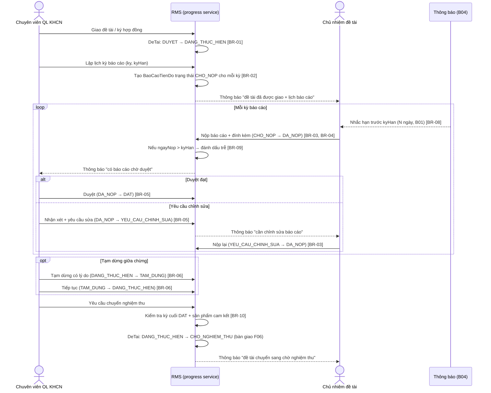
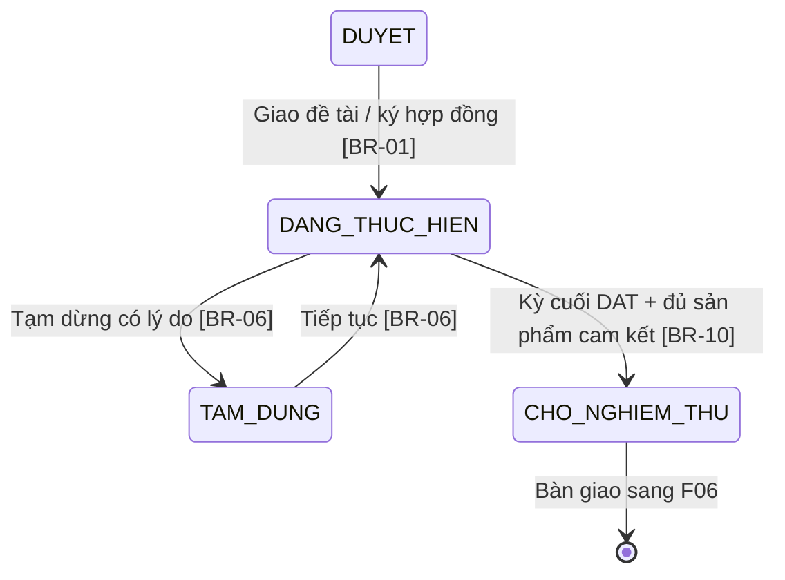
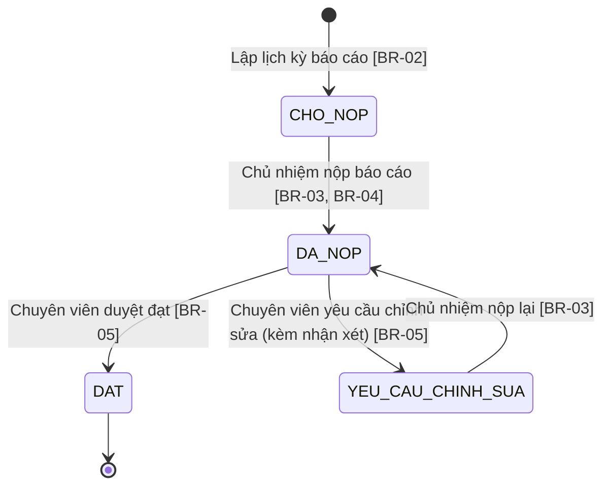

# Quản lý tiến độ

> Nguồn sự thật về **nghiệp vụ** của feature. Mọi luật, dữ liệu, tiêu chí nghiệm thu
> nằm ở đây. `frontend.md` và `backoffice.md` chỉ mô tả giao diện và trỏ ngược về file này.

## 1. Bối cảnh & mục tiêu

Sau khi hội đồng thông qua (F03), đề tài chuyển sang **giai đoạn thực hiện**: chuyên viên giao đề tài/ký
hợp đồng, chủ nhiệm triển khai và **báo cáo tiến độ định kỳ**. Hiện việc theo dõi tiến độ chạy thủ công
(báo cáo gửi qua email/giấy, chuyên viên tự nhớ lịch và nhắc hạn) nên dễ trễ hạn, khó tổng hợp đề tài nào
đang chậm, và không truy được lịch sử duyệt/yêu cầu chỉnh sửa từng kỳ.

F04 số hóa toàn bộ giai đoạn thực hiện: giao đề tài (`DUYET → DANG_THUC_HIEN`), lập **lịch các kỳ báo cáo**
(`BaoCaoTienDo` theo `ky`/`kyHan`), để chủ nhiệm **nộp báo cáo** (`CHO_NOP → DA_NOP`) kèm đính kèm, chuyên
viên **duyệt báo cáo** (`DA_NOP → DAT`) hoặc **yêu cầu chỉnh sửa** (`→ YEU_CAU_CHINH_SUA`) kèm nhận xét, hỗ
trợ **tạm dừng/tiếp tục** đề tài có lý do (`DANG_THUC_HIEN ↔ TAM_DUNG`), và khi đủ điều kiện thì chuyển sang
chờ nghiệm thu (`DANG_THUC_HIEN → CHO_NGHIEM_THU`, bàn giao F06). Nhắc hạn nộp báo cáo qua B04 theo số ngày
cấu hình ở B01.

**Kết quả mong đợi:**

- Mỗi đề tài đang thực hiện có lịch báo cáo rõ ràng; trạng thái từng kỳ (`CHO_NOP`/`DA_NOP`/`DAT`/`YEU_CAU_CHINH_SUA`)
  và việc trễ hạn đều được theo dõi và truy vết.
- Chủ nhiệm được nhắc hạn trước khi đến `kyHan`; chuyên viên thấy ngay đề tài/kỳ đang chậm hoặc quá hạn.
- Đề tài chỉ chuyển sang chờ nghiệm thu khi kỳ cuối đã `DAT`, đảm bảo điều kiện chuyển tiếp F06.

## 2. Phạm vi

- **Trong phạm vi:**
  - Giao đề tài/ký hợp đồng: chuyển `DeTai` `DUYET → DANG_THUC_HIEN` (chuyên viên).
  - Lập & quản lý **lịch kỳ báo cáo** (`BaoCaoTienDo` theo `ky`, `kyHan`) cho đề tài đang thực hiện.
  - Chủ nhiệm **nộp báo cáo tiến độ** định kỳ (`CHO_NOP → DA_NOP`), đính kèm tài liệu (`TaiLieuDinhKem`).
  - Chuyên viên **duyệt** (`DA_NOP → DAT`) hoặc **yêu cầu chỉnh sửa** (`DA_NOP → YEU_CAU_CHINH_SUA`) kèm
    `nhanXetChuyenVien`; chủ nhiệm nộp lại (`YEU_CAU_CHINH_SUA → DA_NOP`).
  - **Tạm dừng / tiếp tục** đề tài có lý do (`DANG_THUC_HIEN ↔ TAM_DUNG`).
  - Đánh dấu **trễ hạn** báo cáo và **nhắc hạn** trước `kyHan` (qua B04, số ngày từ `CauHinhHeThong`/B01).
  - **Chuyển sang chờ nghiệm thu** (`DANG_THUC_HIEN → CHO_NGHIEM_THU`) khi đủ điều kiện, bàn giao F06.
- **Ngoài phạm vi:**
  - Xét duyệt đề xuất để đạt `DUYET` → thuộc **F03**.
  - Cơ chế gửi thông báo/nhắc hạn thật (hàng đợi, kênh, mẫu) → thuộc **B04**; F04 chỉ phát sự kiện.
  - Tham số cấu hình (số ngày nhắc hạn) → thuộc **B01** (`CauHinhHeThong`).
  - Quản lý kinh phí/giải ngân song hành trong giai đoạn thực hiện → thuộc **F05**.
  - Lập hội đồng nghiệm thu, chấm điểm, kết luận `DAT`/`KHONG_DAT` đề tài → thuộc **F06**.

## 3. Luồng nghiệp vụ chính

Phần này mô tả luồng độc lập giao diện. Chuyển trạng thái `DeTai` bám đúng máy trạng thái ở
[data-model §3](../../architecture/data-model.md#3-vòng-đời-đề-tài-state-machine).

### 3.1 Luồng tổng quát (sequence)

### 3.2 Chuyển trạng thái đề tài trong phạm vi F04

### 3.3 Vòng đời báo cáo tiến độ (BaoCaoTienDo)

> Trễ hạn (`ngayNop > kyHan` hoặc quá `kyHan` mà chưa nộp) là **cờ đánh dấu** trên báo cáo (BR-09),
> không phải một trạng thái riêng trong enum — nó tô màu/gắn nhãn lên các trạng thái `CHO_NOP`/`DA_NOP`.

## 4. Business rules

| ID    | Quy tắc | Mô tả | Ghi chú |
|-------|---------|-------|---------|
| BR-01 | Giao đề tài cần `DUYET` | Chỉ chuyển `DeTai` sang `DANG_THUC_HIEN` từ trạng thái `DUYET` (đã có kết luận hội đồng F03). Hành động "giao đề tài/ký hợp đồng" do chuyên viên thực hiện, ghi audit. | Chuyển qua domain service, không update enum trực tiếp (data-model §5) |
| BR-02 | Chỉ lập kỳ khi đang thực hiện | Chỉ tạo/sửa lịch `BaoCaoTienDo` khi đề tài ở `DANG_THUC_HIEN`. Mỗi kỳ tạo ra có `ky` (số thứ tự) và `kyHan` (ngày đến hạn), trạng thái khởi tạo `CHO_NOP`. | Không lập kỳ khi `DUYET`/`TAM_DUNG`/`CHO_NGHIEM_THU` |
| BR-03 | Chỉ chủ nhiệm nộp | Chỉ **Chủ nhiệm đề tài** được nộp/nộp lại báo cáo của đề tài mình (`CHO_NOP → DA_NOP`, `YEU_CAU_CHINH_SUA → DA_NOP`). Thành viên/chuyên viên không nộp thay. | RBAC + data scoping (overview §4.1) |
| BR-04 | Không nộp khi tạm dừng | Không cho nộp/nộp lại báo cáo khi đề tài đang `TAM_DUNG`. Phải tiếp tục (`→ DANG_THUC_HIEN`) trước. | Nhắc hạn cũng tạm ngưng khi `TAM_DUNG` |
| BR-05 | Chỉ chuyên viên duyệt | Chỉ **Chuyên viên QL KHCN** được duyệt báo cáo `DA_NOP`: hoặc `→ DAT`, hoặc `→ YEU_CAU_CHINH_SUA` **bắt buộc kèm** `nhanXetChuyenVien`. Yêu cầu chỉnh sửa mà không có nhận xét bị chặn. | Chủ nhiệm không tự duyệt báo cáo của mình |
| BR-06 | Tạm dừng phải có lý do | `DANG_THUC_HIEN → TAM_DUNG` và `TAM_DUNG → DANG_THUC_HIEN` do chuyên viên thực hiện, **bắt buộc** kèm `lyDo`, ghi `NhatKyHeThong`. | Chuyển lùi/tạm dừng phải có lyDo (data-model §3) |
| BR-07 | Một kỳ một báo cáo | Mỗi cặp (`deTaiId`, `ky`) chỉ có **một** `BaoCaoTienDo`. Không tạo kỳ trùng số thứ tự cho cùng đề tài. | Unique trên cặp khóa (xem §5) |
| BR-08 | Nhắc hạn theo cấu hình | Hệ thống phát sự kiện nhắc hạn cho chủ nhiệm trước `kyHan` **N ngày**, với N = `CauHinhHeThong['TIEN_DO.SO_NGAY_NHAC_HAN']` (B01). Việc gửi do B04 đảm nhận. | Bỏ qua kỳ đã `DAT` và đề tài `TAM_DUNG` |
| BR-09 | Đánh dấu trễ hạn | Báo cáo bị đánh dấu **trễ** khi: chưa nộp mà đã quá `kyHan` (`CHO_NOP`/`YEU_CAU_CHINH_SUA`), hoặc nộp với `ngayNop > kyHan`. Cờ trễ phục vụ lọc & cảnh báo, không chặn nộp. | Tính theo múi giờ hiển thị; cờ dẫn xuất từ `kyHan`/`ngayNop` |
| BR-10 | Điều kiện chuyển nghiệm thu | `DANG_THUC_HIEN → CHO_NGHIEM_THU` chỉ khi **kỳ báo cáo cuối** (`ky` lớn nhất) đã `DAT` **và** đề tài đủ sản phẩm cam kết. Thiếu điều kiện → chặn, nêu rõ thiếu gì. | Kiểm tra ở domain service; bàn giao F06 |
| BR-11 | Tách bạch quyền & phạm vi | Chuyên viên chỉ thao tác đề tài trong phạm vi đơn vị/đợt được phân; chủ nhiệm chỉ thấy đề tài của mình; thành viên đề tài chỉ xem (không nộp/duyệt). | Data scoping (overview §4.1) |
| BR-12 | Khóa báo cáo đã đạt | Báo cáo đã `DAT` là chốt, không cho chủ nhiệm sửa/nộp lại; muốn thay đổi phải do chuyên viên mở lại (ngoại lệ, kèm `lyDo`, ghi audit). | Mở lại là ngoại lệ |

## 5. Dữ liệu

Dùng chung mô hình ở [data-model §4.5](../../architecture/data-model.md#45-thực-hiện-đề-tài-f04-f05) và
vòng đời `DeTai` ở [data-model §3](../../architecture/data-model.md#3-vòng-đời-đề-tài-state-machine).

| Thực thể | Vai trò trong F04 | Trường trọng yếu |
|---|---|---|
| `DeTai` | Đối tượng đang thực hiện | `trangThai` (`DUYET`/`DANG_THUC_HIEN`/`TAM_DUNG`/`CHO_NGHIEM_THU`) — đổi qua domain service |
| `BaoCaoTienDo` | Báo cáo từng kỳ | `deTaiId`, `ky`, `kyHan`, `ngayNop`, `noiDung`, `trangThai` (`CHO_NOP`/`DA_NOP`/`DAT`/`YEU_CAU_CHINH_SUA`), `nhanXetChuyenVien` |
| `TaiLieuDinhKem` | Đính kèm báo cáo | `loaiDoiTuong='BaoCaoTienDo'`, `doiTuongId`, `tenFile`, `duongDan`, `kichThuoc`, `mimeType` |
| `CauHinhHeThong` | Tham số nhắc hạn | `TIEN_DO.SO_NGAY_NHAC_HAN` |
| `SanPhamKhoaHoc` | Kiểm tra sản phẩm cam kết khi chuyển nghiệm thu (BR-10) | `deTaiId` (đếm/đối chiếu cam kết) |
| `ThongBao` | Nhắc hạn & thông báo trạng thái báo cáo | Sinh khi giao đề tài, nhắc hạn, có báo cáo chờ duyệt, yêu cầu chỉnh sửa, chuyển nghiệm thu (B04) |
| `NhatKyHeThong` | Audit | Giao đề tài, lập kỳ, nộp, duyệt/yêu cầu sửa, tạm dừng/tiếp tục, chuyển nghiệm thu |

> Ràng buộc bổ sung F04 cần: unique (`deTaiId`, `ky`) cho `BaoCaoTienDo` (BR-07); `nhanXetChuyenVien`
> bắt buộc khi `trangThai=YEU_CAU_CHINH_SUA` (BR-05); chuyển `TAM_DUNG` lưu `lyDo` qua audit (BR-06).
> Nếu cần thêm trường mới (vd `BaoCaoTienDo.coTreHan` materialized, `DeTai.lyDoTamDung`), bổ sung vào
> data-model trong cùng PR. Hiện cờ trễ hạn (BR-09) tính dẫn xuất từ `kyHan`/`ngayNop`.

## 6. Acceptance criteria

- **AC-01 (Happy — giao đề tài)** — Given một đề tài ở trạng thái `DUYET`; When chuyên viên thực hiện
  giao đề tài/ký hợp đồng; Then `DeTai` chuyển `DANG_THUC_HIEN`, chủ nhiệm nhận thông báo, có audit.
- **AC-02 (Happy — lập lịch kỳ báo cáo)** — Given đề tài `DANG_THUC_HIEN`; When chuyên viên tạo các kỳ
  báo cáo với `ky` và `kyHan`; Then hệ thống tạo các `BaoCaoTienDo` trạng thái `CHO_NOP`, mỗi đề tài mỗi
  `ky` chỉ một bản ghi (BR-07).
- **AC-03 (Happy — nộp báo cáo)** — Given kỳ báo cáo `CHO_NOP` của đề tài đang `DANG_THUC_HIEN`; When chủ
  nhiệm nhập `noiDung`, đính kèm tài liệu và nộp; Then `BaoCaoTienDo` chuyển `DA_NOP`, ghi `ngayNop`,
  chuyên viên nhận thông báo có báo cáo chờ duyệt.
- **AC-04 (Happy — duyệt đạt)** — Given báo cáo `DA_NOP`; When chuyên viên duyệt đạt; Then báo cáo chuyển
  `DAT`, chủ nhiệm nhận thông báo, có audit.
- **AC-05 (Happy — yêu cầu chỉnh sửa & nộp lại)** — Given báo cáo `DA_NOP`; When chuyên viên yêu cầu chỉnh
  sửa kèm `nhanXetChuyenVien`; Then báo cáo chuyển `YEU_CAU_CHINH_SUA`, chủ nhiệm nhận nhận xét, sửa và nộp
  lại; Then báo cáo về `DA_NOP` (BR-03, BR-05).
- **AC-06 (Happy — tạm dừng & tiếp tục)** — Given đề tài `DANG_THUC_HIEN`; When chuyên viên tạm dừng kèm
  `lyDo` rồi tiếp tục; Then `DeTai` chuyển `TAM_DUNG` rồi về `DANG_THUC_HIEN`, mỗi lần ghi `lyDo` vào audit
  (BR-06).
- **AC-07 (Happy — chuyển chờ nghiệm thu)** — Given đề tài `DANG_THUC_HIEN` có kỳ cuối đã `DAT` và đủ sản
  phẩm cam kết; When chuyên viên chuyển sang chờ nghiệm thu; Then `DeTai` chuyển `CHO_NGHIEM_THU`, bàn giao
  F06, có audit (BR-10).
- **AC-08 (Biên — nộp trễ hạn)** — Given kỳ báo cáo `CHO_NOP` đã quá `kyHan`; When chủ nhiệm nộp; Then hệ
  thống vẫn nhận (`DA_NOP`) nhưng đánh dấu báo cáo **trễ hạn** (BR-09).
- **AC-09 (Negative — nộp khi tạm dừng)** — Given đề tài đang `TAM_DUNG`; When chủ nhiệm cố nộp/nộp lại báo
  cáo; Then hệ thống chặn, báo "đề tài đang tạm dừng" (BR-04).
- **AC-10 (Negative — yêu cầu sửa thiếu nhận xét)** — Given báo cáo `DA_NOP`; When chuyên viên yêu cầu chỉnh
  sửa nhưng bỏ trống `nhanXetChuyenVien`; Then hệ thống chặn, không đổi trạng thái (BR-05).
- **AC-11 (Negative — sai quyền nộp/duyệt)** — Given người dùng không phải chủ nhiệm cố nộp báo cáo, hoặc
  không phải chuyên viên cố duyệt; When gọi hành động; Then hệ thống trả 403, không thực hiện (BR-03, BR-05).
- **AC-12 (Negative — chuyển nghiệm thu khi kỳ cuối chưa đạt)** — Given kỳ báo cáo cuối **chưa** `DAT` hoặc
  thiếu sản phẩm cam kết; When chuyên viên cố chuyển sang chờ nghiệm thu; Then hệ thống chặn, nêu rõ điều
  kiện còn thiếu, đề tài giữ `DANG_THUC_HIEN` (BR-10).
- **AC-13 (Negative — lập kỳ sai trạng thái / trùng kỳ)** — Given đề tài không ở `DANG_THUC_HIEN` (vd `DUYET`
  hoặc `TAM_DUNG`), hoặc đã có báo cáo cùng `ky`; When chuyên viên lập kỳ báo cáo; Then hệ thống chặn (BR-02,
  BR-07).

## 7. Phụ thuộc & rủi ro

**Phụ thuộc:**

- **F03** — đầu vào là đề tài đã `DUYET`; F04 nhận bàn giao để giao đề tài.
- **B01** — tham số `CauHinhHeThong['TIEN_DO.SO_NGAY_NHAC_HAN']` cho nhắc hạn; cấu hình sản phẩm cam kết
  (nếu định nghĩa ở danh mục).
- **B03** — vai trò & quyền (Chuyên viên QL KHCN, Chủ nhiệm, Thành viên đề tài); data scoping.
- **B04** — kênh nhắc hạn báo cáo và thông báo trạng thái (giao đề tài, chờ duyệt, yêu cầu sửa, chuyển nghiệm thu).
- **F05** — kinh phí/giải ngân chạy **song hành** trong giai đoạn thực hiện; cần thống nhất thời điểm khóa
  khi `TAM_DUNG` và khi chuyển `CHO_NGHIEM_THU`.
- **F06** — tiếp nhận đề tài sau `CHO_NGHIEM_THU`; tiêu chí "đủ sản phẩm cam kết" (BR-10) cần đồng bộ với F06.

**Rủi ro & điểm cần làm rõ:**

- **Định nghĩa "đủ sản phẩm cam kết" (BR-10):** lấy từ thuyết minh đề tài hay danh mục riêng? Cần PO chốt
  nguồn dữ liệu và cách đối chiếu (đếm số lượng theo loại sản phẩm?).
- **Ảnh hưởng của `TAM_DUNG` lên lịch & nhắc hạn:** khi tạm dừng, các `kyHan` có dời tương ứng không, hay
  giữ nguyên? Cần PO xác nhận chính sách dời hạn.
- **Cờ trễ hạn (BR-09) lưu hay tính động:** hiện giả định tính dẫn xuất; nếu cần báo cáo/thống kê nhanh có
  thể phải materialize trường — quyết định cùng B02.
- **Mở lại báo cáo đã `DAT` (BR-12):** quy trình và quyền mở lại (có cần phê duyệt cấp trên?) cần làm rõ.
- **Đồng bộ với F05 khi chuyển nghiệm thu:** có yêu cầu kinh phí đã giải ngân/đối soát tới mức nào trước khi
  cho `CHO_NGHIEM_THU` không — cần PO và F05 thống nhất.
