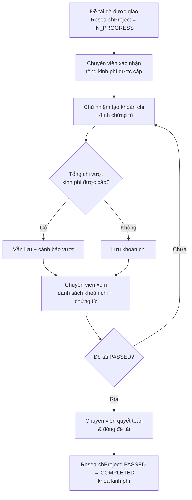

# Prototype nghiệp vụ — Quản lý kinh phí đề tài (bản đơn giản)

> Bản nháp để hình dung luồng và màn hình. Bám theo **bản đơn giản** đã chốt ở `spec.md`:
> xác nhận tổng kinh phí được cấp → chủ nhiệm tạo khoản chi + chứng từ → chuyên viên xem khoản chi →
> quyết toán & đóng đề tài. Khoản mục/dự toán, nhiều đợt cấp, đối soát tài chính, và quy trình phê
> duyệt thanh toán nhiều bước thuộc **giai đoạn sau** (xem `spec.md` §2).

## 1. Giả định cho prototype v0

- Phạm vi nội bộ trường, **chưa** tích hợp hệ thống kế toán/tài chính ngoài.
- Chỉ hai vai trò tham gia trực tiếp: **Chủ nhiệm đề tài** và **Chuyên viên QL KHCN**.
- Một đề tài có **một tổng kinh phí được cấp** (chuyên viên xác nhận một lần, mặc định = `approvedBudget`
  từ F04), không tách khoản mục, không nhiều đợt cấp ở bản này.
- Khoản chi gồm: số tiền, mô tả, ngày chi, và **chứng từ** đính kèm (`Attachment`).
- Vượt kinh phí được cấp → **cảnh báo** nhưng vẫn cho ghi.

## 2. Vai trò & trách nhiệm

| Vai trò | Việc được làm |
|---|---|
| Chủ nhiệm đề tài | Xem kinh phí được cấp của đề tài mình; tạo/sửa/xóa khoản chi; đính kèm chứng từ |
| Chuyên viên QL KHCN | Xác nhận tổng kinh phí được cấp; xem danh sách khoản chi + chứng từ; quyết toán & đóng đề tài |

## 3. Luồng tổng quát



## 4. Trạng thái

### 4.1 Kinh phí được cấp (`BudgetAllocation`, một bản ghi/đề tài)

```text
(chưa có)  → CONFIRMED   : chuyên viên xác nhận cấp
CONFIRMED  → CANCELLED   : hủy xác nhận (kèm lý do, ghi audit) — nếu cho phép
```

- `CONFIRMED` là tổng kinh phí được cấp đang hiệu lực, dùng làm mốc tính "còn lại" và cảnh báo vượt.

### 4.2 Khoản chi (`BudgetTransaction`, type `EXPENSE`)

- Không có máy trạng thái phê duyệt ở bản đơn giản. Khoản chi tồn tại khi đề tài `IN_PROGRESS`; chủ nhiệm
  sửa/xóa được khoản chi của mình cho tới khi đề tài `COMPLETED` thì **khóa** (BR-06).

## 5. Prototype màn hình FE (Chủ nhiệm)

### FE-01 — Tab "Kinh phí" trong chi tiết đề tài

```text
+--------------------------------------------------------------------------------+
| Đề tài: Nghiên cứu mô hình RMS AI-first                         IN_PROGRESS     |
+--------------------------------------------------------------------------------+
| Kinh phí được cấp        Đã chi               Còn lại                           |
| 300.000.000 VND          84.500.000 VND       215.500.000 VND                   |
+--------------------------------------------------------------------------------+
| Khoản chi                                                       [+ Thêm khoản chi]
| ------------------------------------------------------------------------------ |
| Ngày          Nội dung chi               Số tiền        Chứng từ               |
| 08/06/2026    Mua vật tư thí nghiệm       12.500.000     2 tệp   [Sửa] [Xóa]    |
| 15/05/2026    Thù lao nhân công đợt 1      30.000.000     1 tệp   [Sửa] [Xóa]    |
| 02/05/2026    Chi phí hội thảo             12.000.000     3 tệp   [Sửa] [Xóa]    |
+--------------------------------------------------------------------------------+
```

Mục tiêu:
- Chủ nhiệm nhìn nhanh tổng được cấp – đã chi – còn lại và quản lý khoản chi.
- Các số liệu lấy từ backend; không tự tính ở frontend để tránh lệch.
- Nếu tổng đã chi vượt kinh phí được cấp, hiển thị **cảnh báo** rõ ở thẻ tổng (vẫn cho thêm chi).

### FE-02 — Tạo/sửa khoản chi

```text
+--------------------------------------------------------------------------------+
| Thêm khoản chi                                                                 |
+--------------------------------------------------------------------------------+
| Số tiền             [12.500.000] VND                                            |
| Ngày chi            [08/06/2026]                                                 |
| Nội dung chi        [Mua vật tư thí nghiệm đợt 2                  ]             |
+--------------------------------------------------------------------------------+
| Chứng từ                                                                         |
| ------------------------------------------------------------------------------ |
| Tên tệp                         Kích thước     Thao tác                         |
| hoa-don-HD2026-001.pdf          240 KB         [Xem] [Xóa]                      |
| bien-ban-ban-giao.pdf           180 KB         [Xem] [Xóa]                      |
| [+ Đính kèm chứng từ]                                                           |
+--------------------------------------------------------------------------------+
| [Hủy]                                                          [Lưu khoản chi]  |
+--------------------------------------------------------------------------------+
```

- `Số tiền` validate số nguyên VND > 0 (BR-02). Chứng từ có thể đính một hoặc nhiều tệp (BR-05).
- Khi lưu làm tổng chi vượt kinh phí được cấp: hiển thị cảnh báo và **vẫn lưu** (BR-03).

## 6. Prototype màn hình BackOffice (Chuyên viên)

### BO-01 — Xác nhận cấp kinh phí

```text
+--------------------------------------------------------------------------------+
| Xác nhận cấp kinh phí: Nghiên cứu mô hình RMS AI-first            IN_PROGRESS   |
+--------------------------------------------------------------------------------+
| Kinh phí được phê duyệt (F04):   300.000.000 VND                                |
| Tổng kinh phí cấp cho đề tài:    [300.000.000] VND   (≤ mức phê duyệt)          |
+--------------------------------------------------------------------------------+
| [Hủy]                                                  [Xác nhận cấp kinh phí]  |
+--------------------------------------------------------------------------------+
```

- Số cấp mặc định = `approvedBudget`; validate > 0 và **không vượt** `approvedBudget` (BR-08).
- Sau khi xác nhận: hiển thị người xác nhận & thời điểm, gửi thông báo cho chủ nhiệm (B04), ghi audit.

### BO-02 — Danh sách khoản chi

```text
+--------------------------------------------------------------------------------+
| Khoản chi đề tài                                                                |
+--------------------------------------------------------------------------------+
| Bộ lọc: đề tài, từ ngày/đến ngày, có/không chứng từ                             |
+--------------------------------------------------------------------------------+
| Đề tài            Ngày         Nội dung chi          Số tiền       Chứng từ     |
| RMS AI-first      08/06/2026   Mua vật tư            12.500.000    [Xem 2 tệp]  |
| RMS AI-first      15/05/2026   Thù lao nhân công      30.000.000    [Xem 1 tệp]  |
| Hệ đo lường       20/05/2026   Chi phí khảo sát       18.000.000    [Xem 1 tệp]  |
+--------------------------------------------------------------------------------+
| Tổng cấp: 300.000.000   Đã chi: 84.500.000   Còn lại: 215.500.000              |
+--------------------------------------------------------------------------------+
```

- Chuyên viên chỉ **xem** (không sửa khoản chi của chủ nhiệm). Mở chứng từ để kiểm tra.

### BO-03 — Quyết toán & đóng đề tài

```text
+--------------------------------------------------------------------------------+
| Quyết toán đề tài: Nghiên cứu mô hình RMS AI-first                    PASSED    |
+--------------------------------------------------------------------------------+
| Tổng kinh phí được cấp     300.000.000 VND                                      |
| Tổng đã chi                284.500.000 VND                                      |
| Còn lại                     15.500.000 VND                                      |
+--------------------------------------------------------------------------------+
| Danh sách khoản chi (để chuyên viên rà soát thủ công)              [Xem chi tiết]
+--------------------------------------------------------------------------------+
| [Xuất bảng tổng hợp]                              [Quyết toán & đóng đề tài]    |
+--------------------------------------------------------------------------------+
```

- Chỉ bật khi đề tài `PASSED` (BR-07). Bản đơn giản **không** có điều kiện chặn tự động; chuyên viên rà
  soát thủ công rồi đóng.
- "Quyết toán & đóng đề tài" → chuyển `ResearchProject: PASSED → COMPLETED` qua domain service dùng chung,
  khóa kinh phí, gửi thông báo (B04) và ghi `AuditLog`.

## 7. Dữ liệu nghiệp vụ (theo data-model hiện hành)

| Thực thể | Mục đích trong bản đơn giản |
|---|---|
| `ProjectAssignment` | Cung cấp `approvedBudget` (mức phê duyệt) từ F04 |
| `BudgetAllocation` | Kinh phí được cấp cho đề tài (một bản ghi, `CONFIRMED`/`CANCELLED`) |
| `BudgetTransaction` | Khoản chi (type `EXPENSE`): số tiền, mô tả, ngày |
| `Attachment` | Chứng từ đính kèm khoản chi |
| `Notification` | Thông báo xác nhận cấp & quyết toán (B04) |
| `AuditLog` | Nhật ký append-only cho mọi thay đổi |

> Giai đoạn sau, khi mở rộng: bổ sung `BudgetEstimate` (khoản mục + `settlementMode`), `BudgetAllocation`
> nhiều đợt, và các trường đối soát. Giữ data-model tương thích để không phải migrate lớn.

## 8. Câu hỏi cần chốt tiếp

1. Có bắt buộc tối thiểu 1 chứng từ cho mỗi khoản chi không, hay để tùy chọn như bản hiện tại?
2. Khi quyết toán mà tổng chi vượt kinh phí được cấp, có cần cảnh báo/xác nhận thêm trước khi đóng không?
3. Có cho chuyên viên điều chỉnh tổng kinh phí được cấp sau khi đã xác nhận không? Xử lý ra sao khi đã chi vượt?
4. Chủ nhiệm tạo khoản chi khi chưa xác nhận cấp kinh phí: cho phép hay yêu cầu cấp trước?
