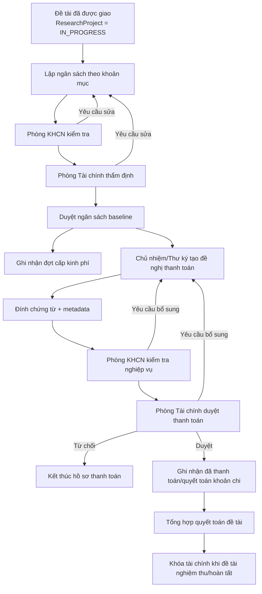

# Prototype nghiệp vụ — Quản lý tài chính đề tài

> Bản nháp để hình dung luồng và màn hình trước khi chốt `spec.md`. Phạm vi prototype này là
> **nghiệp vụ nội bộ trường**, chưa tích hợp hệ thống kế toán/tài chính ngoài.

## 1. Giả định cho prototype v0

- RMS quản lý tài chính ở mức hồ sơ nghiệp vụ nội bộ: dự toán, khoản mục, đợt cấp, đề nghị thanh toán,
  chứng từ, phê duyệt và quyết toán.
- Chưa tích hợp hệ thống kế toán/tài chính hiện có; Phòng Tài chính thao tác trực tiếp trên RMS.
- Vai trò chính: **Chủ nhiệm đề tài**, **Thư ký đề tài**, **Phòng KHCN**, **Phòng Tài chính**.
- Chứng từ lưu cả metadata và file đính kèm qua `Attachment`.
- Quy trình thật chưa chốt, nên prototype dùng luồng trung dung:
  **lập dự toán → thẩm định/duyệt → ghi nhận cấp kinh phí → đề nghị thanh toán → duyệt thanh toán → quyết toán/khóa tài chính**.

## 2. Vai trò & trách nhiệm

| Vai trò | Việc được làm |
|---|---|
| Chủ nhiệm đề tài | Xem ngân sách, tạo đề nghị thanh toán/quyết toán, giải trình khoản chi, nộp chứng từ |
| Thư ký đề tài | Nhập thay/chỉnh hồ sơ tài chính ở trạng thái nháp, chuẩn bị chứng từ cho chủ nhiệm |
| Phòng KHCN | Kiểm tra tính phù hợp với đề tài, tiến độ, nội dung được duyệt; chuyển Phòng Tài chính thẩm định |
| Phòng Tài chính | Thẩm định dự toán, ghi nhận cấp kinh phí, duyệt/từ chối/yêu cầu bổ sung thanh toán, khóa tài chính |

## 3. Luồng tổng quát



## 4. Trạng thái đề xuất

### 4.1 Ngân sách đề tài

```text
DRAFT
SUBMITTED_TO_KHCN
KHCN_REVISION_REQUESTED
KHCN_APPROVED
FINANCE_REVISION_REQUESTED
FINANCE_APPROVED
LOCKED
```

- `FINANCE_APPROVED` là baseline ngân sách đang hiệu lực.
- `LOCKED` dùng khi đề tài đã quyết toán/đóng tài chính.
- Nếu cần điều chỉnh ngân sách sau duyệt, tạo phiên bản điều chỉnh thay vì sửa đè baseline cũ.

### 4.2 Đề nghị thanh toán

```text
DRAFT
SUBMITTED
KHCN_REVIEWING
KHCN_REVISION_REQUESTED
FINANCE_REVIEWING
FINANCE_REVISION_REQUESTED
APPROVED
PAID
REJECTED
CANCELLED
```

- `APPROVED`: Phòng Tài chính đã duyệt nghiệp vụ.
- `PAID`: đã ghi nhận chi trả/thanh toán trong RMS.
- `REJECTED`: hồ sơ không hợp lệ và kết thúc.
- `CANCELLED`: người tạo hủy khi còn được phép.

## 5. Prototype màn hình FE

### FE-01 — Tab "Tài chính" trong chi tiết đề tài

```text
+--------------------------------------------------------------------------------+
| Đề tài: Nghiên cứu mô hình RMS AI-first                         IN_PROGRESS     |
+--------------------------------------------------------------------------------+
| Tổng được duyệt     Đã cấp              Đã thanh toán       Còn lại             |
| 300.000.000 VND     120.000.000 VND     84.500.000 VND      215.500.000 VND     |
+--------------------------------------------------------------------------------+
| Khoản mục ngân sách                                                            |
| ------------------------------------------------------------------------------ |
| Khoản mục            Dự toán        Đã thanh toán   Còn lại       Trạng thái    |
| Nhân công            90.000.000     30.000.000      60.000.000    Bình thường   |
| Vật tư               80.000.000     42.500.000      37.500.000    Bình thường   |
| Hội thảo             50.000.000     12.000.000      38.000.000    Bình thường   |
| Khác                 80.000.000     0               80.000.000    Chưa chi      |
+--------------------------------------------------------------------------------+
| [Tạo đề nghị thanh toán] [Xem đợt cấp] [Xem chứng từ]                           |
+--------------------------------------------------------------------------------+
```

Mục tiêu:
- Chủ nhiệm/Thư ký nhìn nhanh tổng quan tài chính đề tài.
- Các số liệu chỉ lấy từ backend; không tự tính ở frontend để tránh lệch.
- Nếu một khoản mục vượt hoặc gần vượt dự toán, hiển thị cảnh báo rõ ở hàng khoản mục.

### FE-02 — Tạo đề nghị thanh toán

```text
+--------------------------------------------------------------------------------+
| Tạo đề nghị thanh toán                                                         |
+--------------------------------------------------------------------------------+
| Loại hồ sơ           ( ) Thanh toán trong kỳ   ( ) Quyết toán cuối đề tài       |
| Khoản mục            [Vật tư                                      v]            |
| Số tiền đề nghị      [12.500.000] VND                                             |
| Ngày phát sinh       [08/06/2026]                                                |
| Nội dung chi         [Mua vật tư thí nghiệm đợt 2                  ]             |
| Giải trình           [Theo kế hoạch triển khai mẫu thử tháng 06...]             |
+--------------------------------------------------------------------------------+
| Chứng từ                                                                         |
| ------------------------------------------------------------------------------ |
| Loại chứng từ       Số chứng từ      Ngày chứng từ    File                     |
| Hóa đơn             HD-2026-001      07/06/2026      hoa-don.pdf               |
| Biên bản bàn giao    BB-2026-012      08/06/2026      bien-ban.pdf              |
| [+ Thêm chứng từ]                                                               |
+--------------------------------------------------------------------------------+
| [Lưu nháp]                                           [Nộp Phòng KHCN]           |
+--------------------------------------------------------------------------------+
```

Metadata chứng từ nên có tối thiểu:
- `documentType`: hóa đơn, hợp đồng, biên bản nghiệm thu, bảng kê, quyết định, khác.
- `documentNo`: số chứng từ.
- `documentDate`: ngày chứng từ.
- `issuer`: đơn vị/cá nhân phát hành nếu có.
- `amount`: số tiền trên chứng từ nếu cần đối chiếu.
- `attachmentId`: file đính kèm.

### FE-03 — Danh sách đề nghị thanh toán

```text
+--------------------------------------------------------------------------------+
| Đề nghị thanh toán                                                              |
+--------------------------------------------------------------------------------+
| Mã hồ sơ      Ngày nộp     Khoản mục   Số tiền        Trạng thái                |
| TT-00021      08/06/2026   Vật tư      12.500.000     FINANCE_REVIEWING         |
| TT-00018      15/05/2026   Nhân công   30.000.000     PAID                      |
| TT-00016      02/05/2026   Hội thảo    12.000.000     KHCN_REVISION_REQUESTED   |
+--------------------------------------------------------------------------------+
| Khi bị yêu cầu bổ sung: hiển thị ghi chú xử lý và nút [Bổ sung hồ sơ].          |
+--------------------------------------------------------------------------------+
```

## 6. Prototype màn hình BackOffice

### BO-01 — Hồ sơ ngân sách đề tài

```text
+--------------------------------------------------------------------------------+
| Hồ sơ ngân sách: Nghiên cứu mô hình RMS AI-first                  IN_PROGRESS   |
+--------------------------------------------------------------------------------+
| Kinh phí được giao từ F04: 300.000.000 VND                                      |
| Tổng dự toán hiện tại:       300.000.000 VND                                    |
| Phiên bản ngân sách:         v1 - FINANCE_APPROVED                              |
+--------------------------------------------------------------------------------+
| Khoản mục            Dự toán          Cơ chế thanh toán      Ghi chú            |
| Nhân công            90.000.000       Khoán/định mức         Theo thuyết minh   |
| Vật tư               80.000.000       Theo chứng từ          Hóa đơn bắt buộc   |
| Hội thảo             50.000.000       Theo chứng từ          Có chương trình    |
| Khác                 80.000.000       Hỗn hợp                Cần giải trình     |
+--------------------------------------------------------------------------------+
| [Yêu cầu sửa] [Phòng KHCN duyệt] [Chuyển Phòng Tài chính] [Tài chính duyệt]     |
+--------------------------------------------------------------------------------+
```

Ghi chú về "khoản mục":
- Khoản mục là nhóm chi để kiểm soát ngân sách.
- Danh mục nên cấu hình ở B01, không hard-code vào code.
- Mỗi khoản mục có thể chọn cơ chế kiểm soát chứng từ khác nhau.

### BO-02 — Đợt cấp kinh phí

```text
+--------------------------------------------------------------------------------+
| Đợt cấp kinh phí                                                                |
+--------------------------------------------------------------------------------+
| Đợt     Kế hoạch       Thực cấp       Số tiền        Trạng thái                 |
| Đợt 1   01/04/2026     05/04/2026     120.000.000    RELEASED                  |
| Đợt 2   01/08/2026     -              100.000.000    PLANNED                   |
| Đợt 3   01/12/2026     -               80.000.000    PLANNED                   |
+--------------------------------------------------------------------------------+
| [Thêm đợt cấp] [Ghi nhận đã cấp] [Hủy đợt cấp]                                  |
+--------------------------------------------------------------------------------+
```

Luật gợi ý:
- Tổng các đợt đã cấp không vượt tổng ngân sách được duyệt.
- Hủy đợt cấp bắt buộc nhập lý do và ghi `AuditLog`.
- Đợt đã cấp không xóa cứng.

### BO-03 — Hàng đợi duyệt thanh toán

```text
+--------------------------------------------------------------------------------+
| Hàng đợi duyệt thanh toán                                                       |
+--------------------------------------------------------------------------------+
| Mã hồ sơ  Đề tài                 Người nộp   Số tiền      Trạng thái            |
| TT-00021  RMS AI-first           Nguyễn A    12.500.000   FINANCE_REVIEWING     |
| TT-00020  Hệ đo lường mẫu thử    Trần B      18.000.000   KHCN_REVIEWING        |
| TT-00016  RMS AI-first           Nguyễn A    12.000.000   KHCN_REVISION_REQUESTED|
+--------------------------------------------------------------------------------+
| Bộ lọc: đơn vị, đề tài, trạng thái, khoản mục, từ ngày/đến ngày, thiếu chứng từ |
+--------------------------------------------------------------------------------+
```

### BO-04 — Chi tiết duyệt thanh toán

```text
+--------------------------------------------------------------------------------+
| Hồ sơ TT-00021                                                                  |
+--------------------------------------------------------------------------------+
| Đề tài             RMS AI-first                                                  |
| Người nộp          Nguyễn A                                                      |
| Khoản mục          Vật tư                                                        |
| Số tiền đề nghị    12.500.000 VND                                                |
| Ngân sách còn lại  37.500.000 VND                                                |
+--------------------------------------------------------------------------------+
| Chứng từ                                                                         |
| Hóa đơn HD-2026-001       07/06/2026      12.500.000      [Xem file]            |
| Biên bản BB-2026-012      08/06/2026       -              [Xem file]            |
+--------------------------------------------------------------------------------+
| Ý kiến Phòng KHCN     [Phù hợp nội dung triển khai giai đoạn 2...]              |
| Ý kiến Tài chính      [Đủ chứng từ, đề nghị thanh toán...]                      |
+--------------------------------------------------------------------------------+
| [Yêu cầu bổ sung] [Từ chối] [Duyệt thanh toán] [Ghi nhận đã thanh toán]          |
+--------------------------------------------------------------------------------+
```

Điểm cần làm rõ ở bước này:
- Phòng KHCN có bắt buộc duyệt trước Phòng Tài chính mọi hồ sơ không?
- Phòng Tài chính có thể trả thẳng về người nộp hay phải qua Phòng KHCN?
- `APPROVED` và `PAID` có tách riêng không? Prototype đang tách để phản ánh "duyệt" và "đã chi trả" là hai việc khác nhau.

### BO-05 — Quyết toán & khóa tài chính

```text
+--------------------------------------------------------------------------------+
| Quyết toán tài chính đề tài                                                     |
+--------------------------------------------------------------------------------+
| Tổng được duyệt       300.000.000 VND                                           |
| Tổng đã cấp           300.000.000 VND                                           |
| Tổng đã thanh toán    284.500.000 VND                                           |
| Chưa sử dụng           15.500.000 VND                                           |
+--------------------------------------------------------------------------------+
| Điều kiện khóa tài chính                                                        |
| [x] Không còn hồ sơ thanh toán đang xử lý                                       |
| [x] Không còn khoản thực thanh thiếu chứng từ bắt buộc                          |
| [x] Đề tài đã nghiệm thu / đủ điều kiện đóng theo F06                           |
| [ ] Đã xác nhận số dư/chênh lệch cuối kỳ                                        |
+--------------------------------------------------------------------------------+
| [Xuất bảng tổng hợp] [Yêu cầu bổ sung] [Khóa tài chính đề tài]                  |
+--------------------------------------------------------------------------------+
```

Sau khi khóa:
- Không cho tạo đề nghị thanh toán mới.
- Không cho sửa chứng từ/giao dịch, trừ quyền mở lại đặc biệt.
- Nếu chuyển `ResearchProject` sang `COMPLETED`, phải đi qua domain service dùng chung và ghi `AuditLog`.

## 7. Dữ liệu nghiệp vụ đề xuất

| Thực thể | Mục đích |
|---|---|
| `ProjectBudget` | Header ngân sách của đề tài, tổng tiền, trạng thái, phiên bản baseline |
| `BudgetLineItem` | Dòng ngân sách theo khoản mục, số tiền duyệt, cơ chế chứng từ |
| `BudgetRevision` | Điều chỉnh ngân sách sau duyệt, lưu phiên bản và lý do |
| `Disbursement` | Đợt cấp kinh phí nội bộ |
| `PaymentRequest` | Hồ sơ đề nghị thanh toán/quyết toán |
| `PaymentLineItem` | Chi tiết khoản chi trong một đề nghị thanh toán |
| `FinancialDocument` | Metadata chứng từ |
| `Attachment` | File chứng từ dùng chung |
| `FinancialApproval` | Lịch sử duyệt/yêu cầu sửa/từ chối theo từng bước |
| `AuditLog` | Nhật ký append-only cho mọi thay đổi trạng thái/số tiền |

> `data-model.md` hiện đang có `BudgetEstimate`, `BudgetAllocation`, `BudgetTransaction`. Khi chốt prototype,
> có thể chọn một trong hai hướng:
> 1. Giữ tên hiện tại và bổ sung trường/trạng thái cho thanh toán nội bộ.
> 2. Đổi sang bộ tên giàu nghiệp vụ hơn (`ProjectBudget`, `PaymentRequest`, `FinancialDocument`) nếu muốn tách rõ
> dự toán, đợt cấp và hồ sơ thanh toán.

## 8. Câu hỏi cần chốt tiếp

1. Phòng KHCN có duyệt mọi đề nghị thanh toán trước Phòng Tài chính không, hay chỉ duyệt các khoản liên quan nội dung chuyên môn?
2. Có cần phân biệt **thanh toán trong quá trình thực hiện** và **quyết toán cuối đề tài** bằng hai form khác nhau không?
3. Khi chi vượt khoản mục nhưng vẫn trong tổng ngân sách đề tài, hệ thống nên **chặn**, **cảnh báo**, hay cho phép nếu Phòng Tài chính duyệt?
4. Có cần quản lý **tạm ứng và hoàn ứng** riêng không?
5. Có cần xuất biểu mẫu/bảng kê tài chính theo mẫu trường không?
6. Ai được quyền mở lại hồ sơ tài chính đã khóa?
