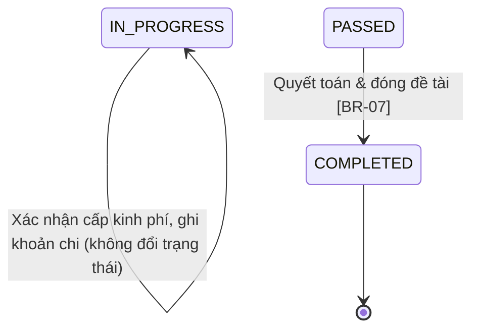

# Quản lý kinh phí

> Nguồn sự thật về **nghiệp vụ** của feature. Mọi luật, dữ liệu, tiêu chí nghiệm thu
> nằm ở đây. `ui.md` mô tả giao diện và trỏ ngược về file này.

## 1. Bối cảnh & mục tiêu

Sau khi đề tài được giao và chuyển sang `IN_PROGRESS` (F04), kinh phí được cấp và chi trong suốt quá
trình thực hiện. Hồ sơ giao đề tài ở F04 cung cấp **tổng kinh phí được phê duyệt**
(`ProjectAssignment.approvedBudget`). Hiện việc theo dõi kinh phí làm thủ công trên bảng tính: chủ
nhiệm không biết còn lại bao nhiêu, chứng từ khoản chi rời rạc, và chuyên viên khó nắm tình hình chi
tiêu của đề tài.

F05 (bản đơn giản, giai đoạn này) số hóa **vòng đời kinh phí cơ bản của một đề tài**:
- **Chuyên viên QL KHCN** xác nhận **tổng kinh phí được cấp** cho đề tài.
- **Chủ nhiệm đề tài** xem kinh phí được cấp, **tạo các khoản chi** và **đính kèm chứng từ**.
- **Chuyên viên** xem danh sách khoản chi kèm chứng từ và **quyết toán/đóng đề tài** khi nghiệm thu đạt.

RMS **không thay thế kế toán** — RMS chỉ ghi nhận và gắn chi tiêu với đề tài để các bên theo dõi.

> **Giai đoạn sau (ngoài phạm vi hiện tại):** dự toán/khoán theo **khoản mục** + cơ chế quyết toán
> (`LUMP_SUM`/`ACTUAL_EXPENSE`/`MIXED`), **nhiều đợt cấp** kinh phí, và **đối soát** với hệ thống tài
> chính (chưa có hệ thống kế toán để đối soát — xem
> [ADR-0004](../../architecture/decisions/0004-doi-soat-kinh-phi-qua-api.md), đã hoãn).

**Kết quả mong đợi:**
- Mỗi đề tài `IN_PROGRESS` có một **tổng kinh phí được cấp** đã được chuyên viên xác nhận.
- Chủ nhiệm ghi nhận được các khoản chi của đề tài mình, mỗi khoản có thể đính kèm chứng từ.
- Chủ nhiệm và chuyên viên xem được tổng cấp – tổng đã chi – còn lại, và danh sách khoản chi + chứng từ.
- Khi đề tài `PASSED`, chuyên viên quyết toán và đóng đề tài (`COMPLETED`, phối hợp F06).

## 2. Phạm vi

- **Trong phạm vi:**
  - **Xác nhận kinh phí được cấp** cho đề tài `IN_PROGRESS` (chuyên viên), mặc định lấy
    `ProjectAssignment.approvedBudget` từ F04 làm tổng — xác nhận **một lần** cho cả đề tài.
  - **Tạo/sửa/xóa khoản chi** (`BudgetTransaction`) cho đề tài: số tiền, mô tả, ngày chi (chủ nhiệm).
  - **Đính kèm chứng từ** cho khoản chi (`Attachment`).
  - Xem **tổng quan kinh phí** đề tài: tổng được cấp – tổng đã chi – còn lại; cảnh báo khi vượt.
  - **Xem danh sách khoản chi** kèm chứng từ (chuyên viên xem mọi đề tài; chủ nhiệm xem đề tài mình).
  - **Quyết toán & đóng đề tài** khi `PASSED` → `COMPLETED` (chuyên viên, phối hợp F06).
  - Thông báo xác nhận cấp kinh phí & kết quả quyết toán (qua **B04**).
- **Ngoài phạm vi (giai đoạn sau):**
  - Dự toán/khoán theo **khoản mục** (`BudgetEstimate`) và cơ chế quyết toán theo khoản mục
    (`settlementMode`: `LUMP_SUM`/`ACTUAL_EXPENSE`/`MIXED`).
  - **Nhiều đợt cấp** kinh phí theo kế hoạch/thực tế (`BudgetAllocation` nhiều dòng, vòng đời
    `PLANNED → DISBURSED/CANCELLED`).
  - **Đối soát** giao dịch RMS với hệ thống tài chính (API hoặc nhập file), xử lý chênh lệch — **hoãn**
    vì hiện chưa có hệ thống kế toán ([ADR-0004](../../architecture/decisions/0004-doi-soat-kinh-phi-qua-api.md), đã hoãn).
  - Hạch toán/kế toán đầy đủ (sổ cái, định khoản) → ở **hệ thống tài chính**, không phải RMS.
  - Giao đề tài chính thức đưa đề tài vào `IN_PROGRESS` → thuộc **F04**.
  - Kết luận nghiệm thu `PASSED`/`FAILED` → thuộc **F06**; F05 chỉ xử lý phần quyết toán trước khi đóng.

## 3. Luồng nghiệp vụ chính

Phần này mô tả luồng độc lập giao diện. Chuyển trạng thái `ResearchProject` bám đúng máy trạng thái ở
[data-model §3](../../architecture/data-model.md#3-vòng-đời-đề-tài-state-machine).

### 3.1 Luồng tổng quát (sequence)

```mermaid
sequenceDiagram
    actor CN as Chủ nhiệm đề tài
    actor CV as Chuyên viên QL KHCN
    participant SYS as RMS (budget service)

    Note over CV,SYS: Đề tài đã IN_PROGRESS (F04)
    CV->>SYS: Xác nhận tổng kinh phí được cấp (mặc định = approvedBudget) [BR-08]
    SYS->>SYS: Ghi nhận kinh phí được cấp cho đề tài (xác nhận 1 lần)
    SYS-->>CN: Thông báo đã cấp kinh phí (B04)

    loop Trong quá trình thực hiện
        CN->>SYS: Tạo khoản chi (số tiền, mô tả, ngày) + đính chứng từ [BR-04]
        SYS->>SYS: Cập nhật tổng đã chi & còn lại; cảnh báo nếu vượt kinh phí được cấp [BR-03]
    end

    CV->>SYS: Xem danh sách khoản chi kèm chứng từ [BR-04]

    Note over CV,SYS: Khi đề tài PASSED (F06) → quyết toán
    CV->>SYS: Yêu cầu quyết toán & đóng đề tài [BR-07]
    SYS->>SYS: ResearchProject: PASSED → COMPLETED (phối hợp F06); khóa kinh phí
    SYS-->>CN: Thông báo đề tài đã quyết toán & hoàn thành
```

### 3.2 Chuyển trạng thái đề tài trong phạm vi F05



> F05 không tự chuyển đề tài vào `IN_PROGRESS` (do F04) hay sang `PASSED` (do F06). F05 chỉ kích hoạt
> chuyển `PASSED → COMPLETED` khi quyết toán; chuyển trạng thái qua domain service dùng chung, không
> update enum trực tiếp ([data-model §5](../../architecture/data-model.md#5-ghi-chú-toàn-vẹn)).

## 4. Business rules

| ID    | Quy tắc | Mô tả | Ghi chú |
|-------|---------|-------|---------|
| BR-01 | Chỉ quản kinh phí khi đang thực hiện | Chỉ xác nhận cấp kinh phí và ghi/sửa khoản chi cho đề tài có `status=IN_PROGRESS` (hoặc `SUSPENDED` — chỉ xem, không thêm chi mới). Đề tài chưa giao hoặc đã `COMPLETED` không nhận thay đổi kinh phí mới. | Phụ thuộc F04 |
| BR-02 | Số tiền hợp lệ | Số tiền kinh phí được cấp và `amount` của khoản chi là **số nguyên VND > 0** (`bigint`), không số thực, không âm/không 0. Đơn vị thống nhất VND. | Tiền tệ lưu `bigint` ([data-model §1](../../architecture/data-model.md#1-quy-ước-chung)) |
| BR-03 | Cảnh báo vượt kinh phí được cấp | Khi tổng các khoản chi của đề tài **vượt** tổng kinh phí được cấp, hệ thống **vẫn cho ghi** khoản chi nhưng hiển thị **cảnh báo vượt kinh phí**. Không chặn ở bản đơn giản. | Chế độ chặn (`BLOCK`) là cấu hình giai đoạn sau (B01) |
| BR-04 | Phân quyền theo vai trò | **Chủ nhiệm đề tài**: xem kinh phí và **tạo/sửa/xóa khoản chi + đính chứng từ** cho **đề tài của mình**; **không** xác nhận cấp kinh phí, **không** quyết toán. **Chuyên viên QL KHCN**: **xác nhận cấp kinh phí**, **xem** khoản chi + chứng từ của các đề tài, **quyết toán**; không tạo khoản chi thay chủ nhiệm. | RBAC + data scoping (overview §4.1) |
| BR-05 | Chứng từ khoản chi | Mỗi khoản chi có thể đính kèm **một hoặc nhiều** chứng từ (`Attachment`, lưu object storage). Việc bắt buộc chứng từ theo loại khoản chi để giai đoạn sau (gắn với cơ chế quyết toán theo khoản mục). | File theo quy ước Attachment chung |
| BR-06 | Khóa kinh phí sau khi đóng đề tài | Sau khi đề tài `COMPLETED`, khoản chi và kinh phí được cấp bị **khóa**, không sửa/xóa. Trước đó chủ nhiệm sửa/xóa được khoản chi của mình khi đề tài còn `IN_PROGRESS`. | Giữ toàn vẹn quyết toán |
| BR-07 | Quyết toán & đóng đề tài | Khi đề tài `PASSED`, **Chuyên viên QL KHCN** thực hiện quyết toán và chuyển `ResearchProject: PASSED → COMPLETED` (qua domain service, phối hợp F06). Bản đơn giản **không** có điều kiện chặn tự động (không đối soát, không bắt buộc chứng từ cứng); chuyên viên rà soát thủ công trước khi đóng. Ghi audit. | Phối hợp F06; điều kiện chặt hơn để giai đoạn sau |
| BR-08 | Xác nhận cấp kinh phí một lần | **Chuyên viên** xác nhận tổng kinh phí được cấp cho đề tài, mặc định bằng `ProjectAssignment.approvedBudget`; tổng cấp **không vượt** `approvedBudget`. Xác nhận một lần cho cả đề tài; điều chỉnh phải ghi audit. | Nhiều đợt cấp để giai đoạn sau |
| BR-09 | Truy vết mọi thay đổi kinh phí | Xác nhận/điều chỉnh cấp kinh phí, tạo/sửa/xóa khoản chi, đính/gỡ chứng từ, quyết toán đều ghi `AuditLog` (append-only). | Audit (overview §4.2) |

## 5. Dữ liệu

Dùng chung mô hình ở [data-model §4.5](../../architecture/data-model.md#45-thực-hiện-đề-tài-f04-f05).
Bản đơn giản thao tác trên `BudgetAllocation` (kinh phí được cấp), `BudgetTransaction` (khoản chi) và
`Attachment` (chứng từ), gắn với `ResearchProject`.

| Thực thể | Vai trò trong F05 | Trường trọng yếu |
|---|---|---|
| `ResearchProject` | Đối tượng có kinh phí | `status` (`IN_PROGRESS`/`PASSED`/`COMPLETED`), `principalInvestigatorId` |
| `ProjectAssignment` | Căn cứ tổng kinh phí được phê duyệt từ F04 | `researchProjectId`, `approvedBudget`, `status=EFFECTIVE` |
| `BudgetAllocation` | **Kinh phí được cấp** (xác nhận 1 lần / đề tài) | `researchProjectId`, `amount` (`bigint` VND, > 0), `status` (`CONFIRMED`/`CANCELLED`), `confirmedBy`, `confirmedAt` |
| `BudgetTransaction` | **Khoản chi** của đề tài | `researchProjectId`, `amount` (`bigint` VND, > 0), `description`, `date`, `type=EXPENSE`, `createdBy` |
| `Attachment` | Chứng từ khoản chi | `targetType=BudgetTransaction`, `targetId`, `storageKey` (object storage) |
| `Notification` | Thông báo cấp kinh phí & quyết toán | Sinh khi xác nhận cấp kinh phí và khi quyết toán/`COMPLETED` (B04) |
| `AuditLog` | Audit | Xác nhận/điều chỉnh cấp kinh phí, tạo/sửa/xóa khoản chi, đính/gỡ chứng từ, quyết toán |

> **Trường có thể cần bổ sung/điều chỉnh ở data-model (cùng PR khi chốt):** `BudgetTransaction.description`,
> `BudgetTransaction.createdBy`; `BudgetAllocation` rút gọn còn một bản ghi/đề tài với `status`
> `CONFIRMED`/`CANCELLED` + `confirmedBy`/`confirmedAt`. Ràng buộc: `amount > 0`.
>
> **Giai đoạn sau:** `BudgetEstimate` (khoản mục + `settlementMode`), `BudgetAllocation` nhiều đợt
> (`PLANNED`/`DISBURSED`), và các trường đối soát (`reconciliationStatus`, `financeTransactionCode`…) chỉ
> thêm khi mở lại phạm vi tương ứng. Nếu thay đổi, cập nhật
> [data-model §4.5](../../architecture/data-model.md#45-thực-hiện-đề-tài-f04-f05).

## 6. Acceptance criteria

- **AC-01 (Happy — xác nhận cấp kinh phí)** — Given một đề tài `IN_PROGRESS` đã có `ProjectAssignment.EFFECTIVE`
  với `approvedBudget` > 0; When chuyên viên xác nhận cấp kinh phí cho đề tài; Then hệ thống ghi nhận tổng
  kinh phí được cấp (≤ `approvedBudget`), thông báo cho chủ nhiệm (B04) và ghi audit (BR-08).
- **AC-02 (Happy — chủ nhiệm tạo khoản chi + chứng từ)** — Given đề tài `IN_PROGRESS` của chủ nhiệm;
  When chủ nhiệm tạo một khoản chi với `amount` > 0, mô tả, ngày chi và đính kèm chứng từ; Then khoản chi
  được lưu, chứng từ gắn vào khoản chi, cập nhật tổng đã chi & còn lại, ghi audit (BR-04, BR-05).
- **AC-03 (Happy — chuyên viên xem khoản chi)** — Given đề tài đã có các khoản chi; When chuyên viên mở
  danh sách kinh phí của đề tài; Then hệ thống hiển thị tổng được cấp – tổng đã chi – còn lại và danh
  sách khoản chi kèm chứng từ (BR-04).
- **AC-04 (Biên — vượt kinh phí được cấp)** — Given tổng đã chi sắp vượt tổng kinh phí được cấp; When chủ
  nhiệm tạo khoản chi làm tổng chi vượt mức cấp; Then hệ thống **vẫn lưu** khoản chi và hiển thị **cảnh báo
  vượt kinh phí** (BR-03).
- **AC-05 (Happy — quyết toán & đóng đề tài)** — Given đề tài `PASSED`; When chuyên viên thực hiện quyết
  toán & đóng đề tài; Then `ResearchProject` chuyển `PASSED → COMPLETED` (qua domain service, phối hợp F06),
  kinh phí bị khóa, chủ nhiệm nhận thông báo, ghi audit (BR-06, BR-07).
- **AC-06 (Negative — số tiền không hợp lệ)** — Given nhập `amount` ≤ 0 hoặc không phải số nguyên; When lưu
  khoản chi hoặc xác nhận cấp kinh phí; Then hệ thống báo lỗi validate, không lưu (BR-02).
- **AC-07 (Negative — chủ nhiệm không được xác nhận cấp/quyết toán)** — Given người dùng là **Chủ nhiệm đề tài**;
  When gọi hành động xác nhận cấp kinh phí hoặc quyết toán/đóng đề tài; Then hệ thống trả 403, không thực
  hiện (BR-04).
- **AC-08 (Negative — sai phạm vi dữ liệu)** — Given chủ nhiệm A; When truy cập/sửa kinh phí của đề tài
  không thuộc A; Then hệ thống từ chối (403/ẩn), chỉ thấy đề tài của mình (BR-04).
- **AC-09 (Negative — ghi khoản chi khi chưa/không còn thực hiện)** — Given đề tài chưa `IN_PROGRESS`
  (vd `APPROVED`) hoặc đã `COMPLETED`; When tạo/sửa khoản chi mới; Then hệ thống chặn (BR-01, BR-06).

## 7. Phụ thuộc & rủi ro

**Phụ thuộc:**
- **F04** — đề tài phải ở `IN_PROGRESS` mới quản kinh phí; F04 đưa đề tài vào trạng thái này và cung cấp
  `ProjectAssignment.approvedBudget` làm căn cứ tổng kinh phí được cấp.
- **F06** — kết luận nghiệm thu `PASSED` là tiền đề quyết toán; chuyển `PASSED → COMPLETED` là điểm phối
  hợp chung giữa F05 (quyết toán kinh phí) và F06 (đóng đề tài) — xem
  [data-model §3](../../architecture/data-model.md#3-vòng-đời-đề-tài-state-machine).
- **B03** — vai trò & quyền (Chuyên viên QL KHCN; Chủ nhiệm đề tài) và data scoping.
- **B04** — kênh thông báo xác nhận cấp kinh phí và kết quả quyết toán.

**Rủi ro & điểm cần làm rõ:**
- **Ai sở hữu chuyển `PASSED → COMPLETED`:** F05 hay F06 kích hoạt; thống nhất domain service dùng chung
  để tránh hai feature cùng đổi trạng thái.
- **Chứng từ bắt buộc hay tùy chọn:** bản đơn giản cho đính chứng từ tùy chọn (BR-05). Cần PO xác nhận có
  cần bắt buộc tối thiểu 1 chứng từ cho mỗi khoản chi hay không.
- **Điều kiện quyết toán:** bản đơn giản không có gate tự động (BR-07). Cần PO xác nhận đủ cho giai đoạn này,
  hay cần tối thiểu cảnh báo khi tổng chi vượt mức cấp lúc quyết toán.
- **Điều chỉnh kinh phí được cấp:** có cho chuyên viên sửa tổng cấp sau khi đã xác nhận (≤ `approvedBudget`)
  không, và xử lý ra sao khi tổng đã chi đã vượt mức cấp mới.
- **Mở rộng giai đoạn sau:** khoản mục/dự toán (`BudgetEstimate` + `settlementMode`), nhiều đợt cấp
  (`BudgetAllocation`), và đối soát với hệ thống tài chính ([ADR-0004](../../architecture/decisions/0004-doi-soat-kinh-phi-qua-api.md))
  sẽ được thiết kế lại khi mở phạm vi — giữ data-model tương thích để không phải migrate lớn.
