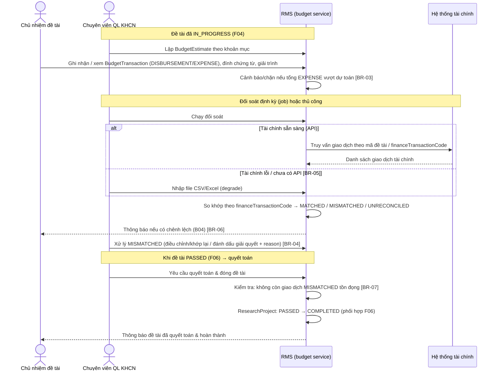
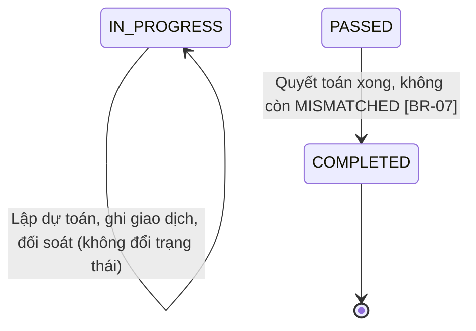
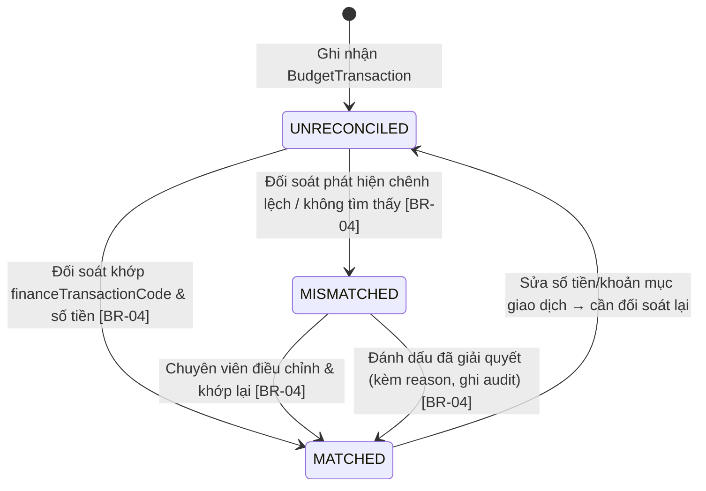

# Quản lý kinh phí

> Nguồn sự thật về **nghiệp vụ** của feature. Mọi luật, dữ liệu, tiêu chí nghiệm thu
> nằm ở đây. `frontend.md` và `backoffice.md` chỉ mô tả giao diện và trỏ ngược về file này.

## 1. Bối cảnh & mục tiêu

Sau khi đề tài được giao và chuyển sang `IN_PROGRESS` (F04), kinh phí được cấp và chi theo
khoản mục trong suốt quá trình thực hiện. Hiện việc theo dõi kinh phí làm thủ công trên bảng tính,
tách rời sổ kế toán thật của hệ thống tài chính: chủ nhiệm không biết còn lại bao nhiêu theo dự
toán, chuyên viên khó phát hiện chênh lệch giữa số liệu RMS và số liệu tài chính, và đến khi quyết
toán để đóng đề tài thì dữ liệu đã lệch khó truy nguyên.

F05 số hóa việc **theo dõi** dự toán và giao dịch kinh phí ở mức đề tài, rồi **đối soát** chúng với
hệ thống tài chính qua tích hợp (API, fallback nhập file). RMS **không thay thế kế toán** — sổ cái
thật vẫn ở hệ thống tài chính; RMS phản ánh, gắn chi tiêu với đề tài và phát hiện chênh lệch để
chuyên viên xử lý (xem [ADR-0004](../../architecture/decisions/0004-doi-soat-kinh-phi-qua-api.md)).

**Kết quả mong đợi:**
- Mỗi đề tài `IN_PROGRESS` có dự toán theo khoản mục (`BudgetEstimate`) và sổ giao dịch cấp/chi
  (`BudgetTransaction`); chủ nhiệm xem được dự toán vs thực chi và giải trình khoản chi.
- Chuyên viên chạy đối soát định kỳ; mỗi giao dịch có `reconciliationStatus` (`MATCHED`/`MISMATCHED`/`UNRECONCILED`),
  chênh lệch được xử lý có truy vết; tài chính lỗi vẫn đối soát thủ công được (degrade).
- Khi đề tài `PASSED`, chuyên viên quyết toán; chỉ đóng đề tài (`COMPLETED`) khi **không còn giao dịch
  `MISMATCHED` tồn đọng** (phối hợp F06).

## 2. Phạm vi

- **Trong phạm vi:**
  - Lập/sửa dự toán kinh phí theo khoản mục (`BudgetEstimate`) cho đề tài `IN_PROGRESS`.
  - Ghi nhận giao dịch cấp/chi (`BudgetTransaction` type `DISBURSEMENT`/`EXPENSE`) gắn khoản mục, có thể đính chứng từ.
  - Đối soát giao dịch với hệ thống tài chính qua API; **fallback nhập file CSV/Excel** khi tài chính
    lỗi/chưa có API; gán `reconciliationStatus` theo `financeTransactionCode`.
  - Chuyên viên xử lý chênh lệch (`MISMATCHED`): điều chỉnh/khớp lại hoặc đánh dấu giải quyết có `reason`.
  - Chủ nhiệm (FE) xem kinh phí đề tài mình (dự toán vs thực chi theo khoản mục), giải trình khoản chi,
    đính chứng từ — **không** tự chạy đối soát.
  - Quyết toán khi đề tài `PASSED` → đóng đề tài `COMPLETED` (phối hợp F06), với điều kiện không còn `MISMATCHED`.
  - Thông báo chênh lệch đối soát & kết quả quyết toán (qua **B04**).
- **Ngoài phạm vi:**
  - Hạch toán/kế toán đầy đủ (sổ cái, định khoản) → ở **hệ thống tài chính**, không phải RMS
    ([ADR-0004](../../architecture/decisions/0004-doi-soat-kinh-phi-qua-api.md)).
  - Giao đề tài/ký hợp đồng đưa đề tài vào `IN_PROGRESS` → thuộc **F04**.
  - Kết luận nghiệm thu `PASSED`/`FAILED` → thuộc **F06**; F05 chỉ xử lý phần quyết toán trước khi đóng.
  - Cấu hình tham số (ngưỡng cảnh báo vượt dự toán, chế độ chặn/cảnh báo, lịch đối soát) → **B01**.
  - Định nghĩa danh mục khoản mục dùng chung (nếu chuẩn hóa) → **B01**.

## 3. Luồng nghiệp vụ chính

Phần này mô tả luồng độc lập giao diện. Chuyển trạng thái `ResearchProject` bám đúng máy trạng thái ở
[data-model §3](../../architecture/data-model.md#3-vòng-đời-đề-tài-state-machine).

### 3.1 Luồng tổng quát (sequence)

### 3.2 Chuyển trạng thái đề tài trong phạm vi F05

> F05 không tự chuyển đề tài vào `IN_PROGRESS` (do F04) hay sang `PASSED` (do F06). F05 chỉ kích hoạt
> chuyển `PASSED → COMPLETED` khi quyết toán đạt điều kiện; chuyển trạng thái qua domain service dùng
> chung, không update enum trực tiếp ([data-model §5](../../architecture/data-model.md#5-ghi-chú-toàn-vẹn)).

### 3.3 Vòng đời trạng thái đối soát của một giao dịch

> Giao dịch chỉ chuyển trạng thái đối soát qua hành động đối soát/xử lý lệch của chuyên viên (hoặc job).
> Chủ nhiệm sửa giao dịch của mình ở mức cho phép sẽ đưa giao dịch về `UNRECONCILED` (BR-08).

## 4. Business rules

| ID    | Quy tắc | Mô tả | Ghi chú |
|-------|---------|-------|---------|
| BR-01 | Chỉ quản kinh phí khi đang thực hiện | Chỉ lập/sửa `BudgetEstimate` và ghi `BudgetTransaction` cho đề tài có `status=IN_PROGRESS` (hoặc `SUSPENDED` — chỉ xem, không thêm chi). Đề tài chưa giao hoặc đã `COMPLETED` không nhận giao dịch mới. | Phụ thuộc F04 |
| BR-02 | Số tiền hợp lệ | `amount` (giao dịch) và `estimatedAmount` (dự toán) là **số nguyên VND > 0** (`bigint`), không số thực, không âm/không 0. Đơn vị thống nhất VND. | Tiền tệ lưu `bigint` ([data-model §1](../../architecture/data-model.md#1-quy-ước-chung)) |
| BR-03 | Tổng chi vs dự toán | Tổng `BudgetTransaction` type `EXPENSE` của một khoản mục **không vượt** `BudgetEstimate` của khoản mục đó. Hành vi khi vượt theo cấu hình `BUDGET.OVER_BUDGET_MODE` (`WARN` = cho ghi kèm cảnh báo / `BLOCK` = chặn). | Cấu hình B01; mặc định `WARN` |
| BR-04 | Chỉ chuyên viên đối soát & xử lý lệch | Chỉ **Chuyên viên QL KHCN** được chạy đối soát, nhập file đối soát và xử lý giao dịch `MISMATCHED` (điều chỉnh/khớp lại/đánh dấu giải quyết kèm `reason`). Đối soát so khớp theo `financeTransactionCode` & `amount` → gán `reconciliationStatus`. | RBAC backend (overview §4.1) |
| BR-05 | Degrade đối soát thủ công | Khi API tài chính lỗi/chưa sẵn sàng, chuyên viên đối soát bằng cách **nhập file CSV/Excel** giao dịch tài chính; kết quả đối soát tương đương API. Hệ thống không được khóa nghiệp vụ kinh phí chỉ vì tài chính lỗi. | [ADR-0004](../../architecture/decisions/0004-doi-soat-kinh-phi-qua-api.md); [integrations §4](../../architecture/integrations.md#4-hệ-thống-tài-chính-đối-soát-kinh-phí--f05) |
| BR-06 | Thông báo chênh lệch | Sau mỗi lần đối soát phát sinh giao dịch `MISMATCHED`, hệ thống gửi thông báo cho chuyên viên phụ trách và chủ nhiệm đề tài liên quan (qua **B04**), kèm liên kết tới giao dịch lệch. | Kênh & mẫu ở B04 |
| BR-07 | Không COMPLETED khi còn MISMATCHED | Chỉ cho quyết toán & chuyển `ResearchProject: PASSED → COMPLETED` khi **không còn** giao dịch `reconciliationStatus=MISMATCHED` tồn đọng của đề tài. Còn `MISMATCHED` → chặn, liệt kê giao dịch cần xử lý. | [ADR-0004](../../architecture/decisions/0004-doi-soat-kinh-phi-qua-api.md); phối hợp F06 |
| BR-08 | Chủ nhiệm chỉ xem/giải trình | **Chủ nhiệm đề tài** chỉ **xem** dự toán vs thực chi của đề tài mình, **giải trình** khoản chi và **đính chứng từ**; **không** chạy đối soát, **không** đổi `reconciliationStatus`, **không** sửa dự toán. Nếu chính sách cho chủ nhiệm nhập đề nghị chi, giao dịch tạo ở `UNRECONCILED` và phải được chuyên viên đối soát. | Data scoping: chỉ đề tài của mình (overview §4.1) |
| BR-09 | Khóa đối chiếu duy nhất | `financeTransactionCode` khi đã gán phải **duy nhất** trong phạm vi nguồn tài chính (không hai giao dịch RMS cùng map một mã chứng từ). Giao dịch chưa có mã giữ `UNRECONCILED`. | Tránh khớp trùng khi đối soát |
| BR-10 | Sửa giao dịch → đối soát lại | Sửa `amount`/`budgetLine`/`type` của giao dịch đã `MATCHED` đưa giao dịch về `UNRECONCILED` và yêu cầu đối soát lại. Giao dịch đã thuộc đề tài `COMPLETED` thì khóa, không sửa. | Giữ toàn vẹn quyết toán |
| BR-11 | Truy vết mọi thay đổi kinh phí | Lập/sửa dự toán, ghi/sửa giao dịch, chạy đối soát, xử lý lệch, quyết toán đều ghi `AuditLog` (append-only). | Audit (overview §4.2) |

## 5. Dữ liệu

Dùng chung mô hình ở [data-model §4.5](../../architecture/data-model.md#45-thực-hiện-đề-tài-f04-f05).
F05 thao tác trên `BudgetEstimate`, `BudgetTransaction` gắn với `ResearchProject`.

| Thực thể | Vai trò trong F05 | Trường trọng yếu |
|---|---|---|
| `ResearchProject` | Đối tượng có kinh phí | `status` (`IN_PROGRESS`/`PASSED`/`COMPLETED`), `principalInvestigatorId`, `requestedBudget` (tham chiếu) |
| `BudgetEstimate` | Dự toán theo khoản mục | `researchProjectId`, `budgetLine`, `estimatedAmount` (`bigint` VND, > 0), `period` |
| `BudgetTransaction` | Giao dịch cấp/chi | `researchProjectId`, `budgetLine`, `amount` (`bigint` VND, > 0), `type` (`DISBURSEMENT`/`EXPENSE`), `date`, `reconciliationStatus` (`UNRECONCILED`/`MATCHED`/`MISMATCHED`), `financeTransactionCode` |
| `Attachment` | Chứng từ khoản chi | `targetType=BudgetTransaction`, `targetId`, `storageKey` (object storage) |
| `SystemSetting` | Tham số kinh phí | `BUDGET.OVER_BUDGET_MODE` (`WARN`/`BLOCK`), `BUDGET.OVER_BUDGET_WARNING_THRESHOLD` (%), `BUDGET.RECONCILIATION_SCHEDULE` |
| `Notification` | Thông báo lệch & quyết toán | Sinh khi có `MISMATCHED` và khi quyết toán/`COMPLETED` (B04) |
| `AuditLog` | Audit | Lập/sửa dự toán, ghi/sửa giao dịch, đối soát, xử lý lệch, quyết toán |

> **Trường có thể cần bổ sung vào data-model (cùng PR khi chốt):** `BudgetTransaction.mismatchResolutionReason`
> (ghi lý do khi đánh dấu `MISMATCHED` đã giải quyết), `BudgetTransaction.description`/`explanation` (giải
> trình của chủ nhiệm), `BudgetTransaction.reconciliationSource` (`API`/`FILE`). Ràng buộc: `amount > 0`,
> `estimatedAmount > 0`; `financeTransactionCode` unique khi không null trong phạm vi nguồn (BR-09).
> Nếu dùng các trường này, cập nhật [data-model §4.5](../../architecture/data-model.md#45-thực-hiện-đề-tài-f04-f05).

## 6. Acceptance criteria

- **AC-01 (Happy — lập dự toán)** — Given một đề tài `IN_PROGRESS`; When chuyên viên lập
  `BudgetEstimate` cho các khoản mục với `estimatedAmount` là số nguyên VND > 0; Then hệ thống lưu dự toán
  theo khoản mục, hiển thị tổng dự toán và ghi audit.
- **AC-02 (Happy — ghi giao dịch chi trong dự toán)** — Given đề tài `IN_PROGRESS` đã có dự toán
  khoản mục X; When ghi một `BudgetTransaction` type `EXPENSE` cho khoản mục X với `amount` > 0 mà tổng chi
  khoản mục **không vượt** dự toán; Then giao dịch được lưu ở `reconciliationStatus=UNRECONCILED`, cập
  nhật thực chi của khoản mục, ghi audit.
- **AC-03 (Happy — đối soát khớp qua API)** — Given có các giao dịch `UNRECONCILED` với
  `financeTransactionCode` khớp số tiền bên tài chính; When chuyên viên chạy đối soát qua API; Then các
  giao dịch khớp chuyển `MATCHED`, các giao dịch lệch/không tìm thấy chuyển `MISMATCHED`, hệ thống thông báo
  chênh lệch (B04) và ghi audit.
- **AC-04 (Happy — degrade nhập file)** — Given API tài chính không sẵn sàng; When chuyên viên nhập
  file CSV/Excel giao dịch tài chính để đối soát; Then hệ thống so khớp theo `financeTransactionCode` và
  gán `reconciliationStatus` y như đối soát API; nghiệp vụ kinh phí không bị khóa (BR-05).
- **AC-05 (Happy — xử lý lệch)** — Given một giao dịch `MISMATCHED`; When chuyên viên điều chỉnh để khớp lại
  hoặc đánh dấu đã giải quyết kèm `reason`; Then giao dịch chuyển `MATCHED`, lưu `reason` và ghi audit.
- **AC-06 (Happy — quyết toán & đóng đề tài)** — Given đề tài `PASSED` và **không còn** giao dịch `MISMATCHED`
  tồn đọng; When chuyên viên thực hiện quyết toán & đóng đề tài; Then `ResearchProject` chuyển `PASSED → COMPLETED`
  (qua domain service, phối hợp F06), chủ nhiệm nhận thông báo, ghi audit.
- **AC-07 (Negative — chặn quyết toán khi còn MISMATCHED)** — Given đề tài `PASSED` còn ≥ 1 giao dịch `MISMATCHED`;
  When chuyên viên cố quyết toán/đóng đề tài; Then hệ thống chặn, liệt kê giao dịch `MISMATCHED` cần xử lý,
  đề tài giữ `PASSED` (BR-07).
- **AC-08 (Negative — số tiền không hợp lệ)** — Given chuyên viên/chủ nhiệm nhập `amount` ≤ 0 hoặc
  không phải số nguyên; When lưu giao dịch/dự toán; Then hệ thống báo lỗi validate, không lưu (BR-02).
- **AC-09 (Biên — vượt dự toán theo cấu hình)** — Given `BUDGET.OVER_BUDGET_MODE=BLOCK` và một
  giao dịch `EXPENSE` làm tổng chi khoản mục vượt dự toán; When ghi giao dịch; Then hệ thống chặn. Với
  `BUDGET.OVER_BUDGET_MODE=WARN`, giao dịch được ghi kèm cảnh báo vượt dự toán (BR-03).
- **AC-10 (Negative — chủ nhiệm không được đối soát)** — Given người dùng là **Chủ nhiệm đề tài**;
  When gọi hành động chạy đối soát / đổi `reconciliationStatus` / sửa dự toán; Then hệ thống trả 403,
  không thực hiện (BR-04, BR-08).
- **AC-11 (Negative — sai phạm vi dữ liệu)** — Given chủ nhiệm A; When truy cập kinh phí của đề tài
  không thuộc A; Then hệ thống từ chối (403/ẩn), chỉ thấy đề tài của mình (BR-08).
- **AC-12 (Negative — kinh phí khi chưa thực hiện)** — Given đề tài chưa `IN_PROGRESS` (vd `APPROVED`)
  hoặc đã `COMPLETED`; When ghi giao dịch chi mới; Then hệ thống chặn (BR-01).
- **AC-13 (Biên — mã đối chiếu trùng)** — Given một `financeTransactionCode` đã gán cho giao dịch khác;
  When đối soát/gán mã đó cho giao dịch thứ hai; Then hệ thống từ chối khớp trùng (BR-09).

## 7. Phụ thuộc & rủi ro

**Phụ thuộc:**
- **F04** — đề tài phải ở `IN_PROGRESS` mới quản kinh phí; F04 đưa đề tài vào trạng thái này.
- **F06** — kết luận nghiệm thu `PASSED` là tiền đề quyết toán; chuyển `PASSED → COMPLETED` là điểm phối
  hợp chung giữa F05 (quyết toán kinh phí) và F06 (đóng đề tài) — xem
  [data-model §3](../../architecture/data-model.md#3-vòng-đời-đề-tài-state-machine).
- **Hệ thống tài chính** — nguồn đối soát qua API/file; có chế độ degrade thủ công
  ([integrations §4](../../architecture/integrations.md#4-hệ-thống-tài-chính-đối-soát-kinh-phí--f05),
  [ADR-0004](../../architecture/decisions/0004-doi-soat-kinh-phi-qua-api.md)).
- **B01** — tham số `SystemSetting` (`BUDGET.OVER_BUDGET_MODE`, `BUDGET.OVER_BUDGET_WARNING_THRESHOLD`, `BUDGET.RECONCILIATION_SCHEDULE`)
  và danh mục khoản mục (nếu chuẩn hóa).
- **B03** — vai trò & quyền (Chuyên viên QL KHCN; Chủ nhiệm đề tài) và data scoping.
- **B04** — kênh thông báo chênh lệch đối soát và kết quả quyết toán.

**Rủi ro & điểm cần làm rõ:**
- **Định nghĩa "khớp" khi đối soát:** khớp theo `financeTransactionCode` + đúng `amount`, hay cho phép sai
  số/tỷ giá? Hiện giả định khớp tuyệt đối số nguyên VND; cần PO/Tài chính xác nhận.
- **Chế độ vượt dự toán:** `WARN` vs `BLOCK` ở mức khoản mục hay tổng đề tài; ngưỡng cảnh báo (%) —
  cần PO chốt và phản ánh ở B01.
- **Quyền nhập giao dịch của chủ nhiệm:** chủ nhiệm chỉ giải trình/đính chứng từ, hay được nhập đề nghị
  chi (tạo giao dịch `UNRECONCILED` chờ chuyên viên)? Mặc định hiện tại: chỉ xem/giải trình (BR-08).
- **Ai sở hữu chuyển `PASSED → COMPLETED`:** F05 hay F06 kích hoạt; thống nhất domain service dùng chung,
  F05 cung cấp điều kiện "không còn MISMATCHED". Cần chốt với F06 để tránh hai feature cùng đổi trạng thái.
- **Định dạng file đối soát:** schema cột CSV/Excel (mã chứng từ, số tiền, ngày, mã đề tài) cần thống
  nhất với Tài chính; xử lý dòng lỗi/định dạng sai khi nhập.
- **Đối soát đồng thời với sửa giao dịch:** tránh race khi job đối soát chạy lúc chủ nhiệm sửa giao
  dịch (BR-10) — cần khóa lạc quan/đánh dấu phiên đối soát.
