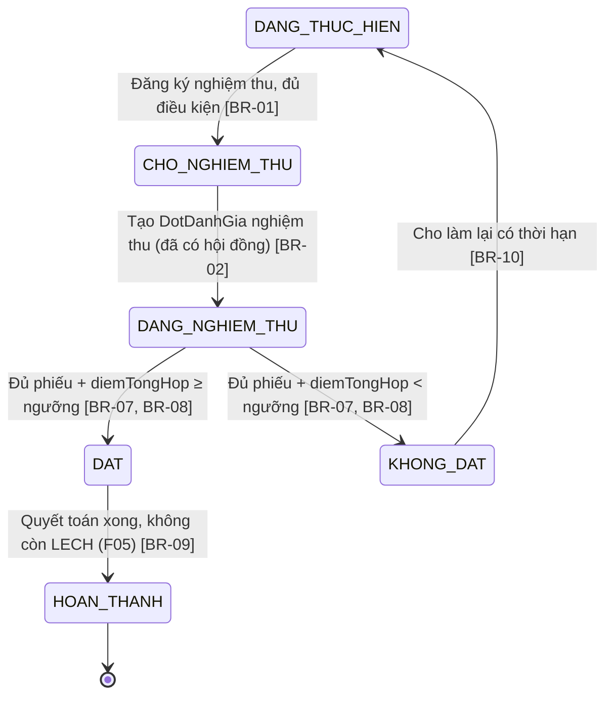

# Nghiệm thu

> Nguồn sự thật về **nghiệp vụ** của feature. Mọi luật, dữ liệu, tiêu chí nghiệm thu
> nằm ở đây. `frontend.md` và `backoffice.md` chỉ mô tả giao diện và trỏ ngược về file này.

## 1. Bối cảnh & mục tiêu

Khi đề tài hoàn thành giai đoạn thực hiện (F04) và đủ sản phẩm cam kết (F07), nó cần được một **hội đồng
nghiệm thu** đánh giá kết quả cuối để kết luận **đạt** hay **không đạt**, làm cơ sở quyết toán và đóng đề
tài. Quy trình nghiệm thu về bản chất giống xét duyệt (F03): lập hội đồng, chấm theo bộ tiêu chí, tổng hợp
điểm, ra kết luận — nên F06 **dùng chung mô hình hội đồng/phiếu chấm** với F03, phân biệt bằng
`loai=NGHIEM_THU` (xem [ADR-0003](../../architecture/decisions/0003-mo-hinh-hoi-dong-dung-chung.md)).

F06 số hóa vòng nghiệm thu: chủ nhiệm đăng ký nghiệm thu khi đủ điều kiện
(`DANG_THUC_HIEN → CHO_NGHIEM_THU`), chuyên viên lập hội đồng `loai=NGHIEM_THU` và mở đợt đánh giá
(`→ DANG_NGHIEM_THU`), thành viên chấm theo bộ tiêu chí nghiệm thu, hệ thống tổng hợp điểm, chuyên viên
kết luận `DAT`/`KHONG_DAT`; sau khi `DAT` và quyết toán xong (F05) thì đóng đề tài (`→ HOAN_THANH`).

**Kết quả mong đợi:**
- Đề tài đi đúng chuỗi `DANG_THUC_HIEN → CHO_NGHIEM_THU → DANG_NGHIEM_THU → DAT | KHONG_DAT`, có truy vết.
- Điểm nghiệm thu tổng hợp tự động theo trọng số; kết luận minh bạch theo ngưỡng.
- `KHONG_DAT` có thể cho **làm lại có thời hạn**; `DAT` dẫn tới quyết toán & `HOAN_THANH`.

## 2. Phạm vi

- **Trong phạm vi:**
  - Chủ nhiệm đăng ký nghiệm thu khi đủ điều kiện → `DeTai: DANG_THUC_HIEN → CHO_NGHIEM_THU`; nộp hồ sơ cuối.
  - Lập `HoiDong` loai `NGHIEM_THU`, phân công `ThanhVienHoiDong`; tạo `DotDanhGia` loai `NGHIEM_THU`
    → `DeTai: CHO_NGHIEM_THU → DANG_NGHIEM_THU`.
  - Thành viên chấm `PhieuCham` theo `BoTieuChi` loai `NGHIEM_THU`; hệ thống tính `diemTongHop`.
  - Chuyên viên kết luận `DAT`/`KHONG_DAT`; `KHONG_DAT → DANG_THUC_HIEN` (làm lại có thời hạn).
  - Sau `DAT` + quyết toán xong (F05) → `DeTai: DAT → HOAN_THANH`.
- **Ngoài phạm vi:**
  - Cơ chế hội đồng/phiếu chấm cốt lõi và xét duyệt đề xuất → đã ở **F03** (dùng chung mô hình).
  - Tạo/sửa `BoTieuChi` loai `NGHIEM_THU` và ngưỡng → thuộc **B01**.
  - Báo cáo tiến độ & điều kiện vào nghiệm thu phía thực hiện → thuộc **F04**.
  - Kê khai/duyệt sản phẩm khoa học → thuộc **F07**.
  - Đối soát & quyết toán kinh phí (điều kiện "không còn LECH") → thuộc **F05**.

## 3. Luồng nghiệp vụ chính

Chuyển trạng thái `DeTai` bám đúng máy trạng thái ở
[data-model §3](../../architecture/data-model.md#3-vòng-đời-đề-tài-state-machine).

### 3.1 Luồng tổng quát (sequence)

```mermaid
sequenceDiagram
    actor CN as Chủ nhiệm đề tài
    actor CV as Chuyên viên QL KHCN
    actor TV as Thành viên hội đồng
    participant SYS as RMS (acceptance service)

    CN->>SYS: Đăng ký nghiệm thu + nộp hồ sơ cuối
    SYS->>SYS: Kiểm tra điều kiện (báo cáo cuối DAT + sản phẩm cam kết) [BR-01]
    SYS->>SYS: DeTai: DANG_THUC_HIEN → CHO_NGHIEM_THU
    CV->>SYS: Lập HoiDong (loai=NGHIEM_THU), phân công thành viên
    CV->>SYS: Tạo DotDanhGia (loai=NGHIEM_THU), lấy BoTieuChi nghiệm thu [BR-02]
    SYS->>SYS: DeTai: CHO_NGHIEM_THU → DANG_NGHIEM_THU
    loop Mỗi thành viên (trừ xung đột lợi ích) [BR-03]
        TV->>SYS: Chấm DiemTieuChi + nhận xét; gửi phiếu (NHAP → DA_GUI) [BR-04, BR-05]
        SYS->>SYS: Tính tongDiem theo trọng số [BR-06]
    end
    CV->>SYS: Yêu cầu ra kết luận
    SYS->>SYS: Kiểm tra đủ phiếu; tính diemTongHop; so ngưỡng [BR-07, BR-08]
    alt Đạt
        SYS->>SYS: ketLuan=DAT → DeTai: DANG_NGHIEM_THU → DAT
        CV->>SYS: Quyết toán (F05) xong → DeTai: DAT → HOAN_THANH [BR-09]
    else Không đạt
        SYS->>SYS: ketLuan=KHONG_DAT → DeTai: DANG_NGHIEM_THU → KHONG_DAT
        CV->>SYS: Cho làm lại có thời hạn → KHONG_DAT → DANG_THUC_HIEN [BR-10]
    end
    SYS-->>CN: Thông báo lịch & kết quả nghiệm thu (B04)
```

### 3.2 Chuyển trạng thái đề tài trong phạm vi F06



### 3.3 Vòng đời phiếu chấm & đợt đánh giá

Giống F03 (dùng chung mô hình): `PhieuCham.trangThai` `NHAP → DA_GUI` (khóa khi gửi);
`DotDanhGia.trangThai` `DANG_CHAM → DA_KET_LUAN`. Khác biệt duy nhất là `loai=NGHIEM_THU` và bộ tiêu chí
nghiệm thu.

## 4. Business rules

| ID    | Quy tắc | Mô tả | Ghi chú |
|-------|---------|-------|---------|
| BR-01 | Điều kiện vào nghiệm thu | Chỉ cho `DANG_THUC_HIEN → CHO_NGHIEM_THU` khi **kỳ báo cáo cuối** đã `DAT` (F04) **và** đủ **sản phẩm cam kết** đã `DA_DUYET` (F07). Thiếu → chặn, nêu rõ thiếu gì. | Đồng bộ điều kiện với F04 BR-10 |
| BR-02 | Bộ tiêu chí nghiệm thu | `DotDanhGia` loai `NGHIEM_THU` dùng `BoTieuChi` loai `NGHIEM_THU` (cấu hình ở B01). Tạo đợt khi đề tài `CHO_NGHIEM_THU` và đã có `HoiDong` loai `NGHIEM_THU` ≥ 1 thành viên → `DeTai` chuyển `DANG_NGHIEM_THU`. | Dùng chung mô hình F03 [ADR-0003] |
| BR-03 | Xung đột lợi ích | Thành viên hội đồng **không** chấm đề tài mình là `chuNhiemId` hoặc có trong `ThanhVienDeTai`; ẩn khỏi hàng chờ và chặn tạo `PhieuCham`. | Loại trừ khi tính phiếu tối thiểu |
| BR-04 | Một thành viên một phiếu / đợt | Mỗi (`thanhVienHoiDongId`, `dotDanhGiaId`) tối đa **một** `PhieuCham`. | Unique (data-model §5) |
| BR-05 | Điểm hợp lệ | `0 ≤ DiemTieuChi.diem ≤ TieuChiDanhGia.diemToiDa`; đủ điểm mọi tiêu chí trước khi gửi phiếu. | Validate khi `NHAP → DA_GUI` |
| BR-06 | Tính điểm theo trọng số | `tongDiem = Σ(diem × trongSo)`; `diemTongHop` = trung bình `tongDiem` các phiếu `DA_GUI`, làm tròn 2 chữ số. | Hệ thống tính, không nhập tay |
| BR-07 | Đủ phiếu mới kết luận | Số phiếu `DA_GUI` ≥ `NGHIEM_THU.SO_PHIEU_TOI_THIEU` (`CauHinhHeThong`) mới được kết luận. | Cấu hình B01 |
| BR-08 | Kết luận theo ngưỡng | `diemTongHop ≥ NGHIEM_THU.NGUONG_DAT` → `DAT`; ngược lại `KHONG_DAT`. Đặt `DotDanhGia=DA_KET_LUAN`. | Ngưỡng từ `CauHinhHeThong` |
| BR-09 | Đóng đề tài cần quyết toán | `DAT → HOAN_THANH` chỉ khi F05 xác nhận đã quyết toán, **không còn** giao dịch `LECH` (xem F05 BR-07). Dùng domain service chung, tránh hai feature cùng đổi trạng thái. | Phối hợp F05 |
| BR-10 | Làm lại có giới hạn | `KHONG_DAT → DANG_THUC_HIEN` (cho làm lại) kèm `lyDo` và **thời hạn**; số lần làm lại không vượt `NGHIEM_THU.SO_LAN_LAM_LAI_TOI_DA`. Hết hạn/quá số lần → xử lý theo quy định (không tự đóng). | Cấu hình B01; ghi audit |
| BR-11 | Tách bạch quyền | Chỉ **Chuyên viên QL KHCN** lập hội đồng, mở đợt, ra kết luận, cho làm lại. **Thành viên hội đồng** chỉ chấm phiếu được phân công. Chủ nhiệm chỉ đăng ký & nộp hồ sơ. | RBAC backend |
| BR-12 | Khóa sau kết luận | `DotDanhGia=DA_KET_LUAN` → không nhận/sửa phiếu, không đổi kết luận trừ khi chuyên viên mở lại đợt có `lyDo` (audit). | Ngoại lệ, ghi `NhatKyHeThong` |

## 5. Dữ liệu

Dùng chung mô hình hội đồng/đánh giá — xem [data-model §4.4](../../architecture/data-model.md#44-hội-đồng--đánh-giá-f03-f06).
F06 thao tác với `loai=NGHIEM_THU`.

| Thực thể | Vai trò trong F06 | Trường trọng yếu |
|---|---|---|
| `DeTai` | Đối tượng nghiệm thu | `trangThai` (`DANG_THUC_HIEN`/`CHO_NGHIEM_THU`/`DANG_NGHIEM_THU`/`DAT`/`KHONG_DAT`/`HOAN_THANH`) |
| `HoiDong` | Hội đồng nghiệm thu | `loai=NGHIEM_THU` |
| `ThanhVienHoiDong` | Thành viên & chức danh | `chucDanh` |
| `BoTieuChi`/`TieuChiDanhGia` | Bộ tiêu chí nghiệm thu | `loai=NGHIEM_THU`; `diemToiDa`, `trongSo` |
| `DotDanhGia` | Lượt nghiệm thu 1 đề tài | `loai=NGHIEM_THU`, `trangThai`, `ketLuan`, `diemTongHop` |
| `PhieuCham`/`DiemTieuChi` | Phiếu & điểm tiêu chí | như F03 |
| `BaoCaoTienDo` | Kiểm tra kỳ cuối `DAT` (BR-01) | `ky` lớn nhất, `trangThai=DAT` |
| `SanPhamKhoaHoc` | Kiểm tra sản phẩm cam kết `DA_DUYET` (BR-01) | `deTaiId`, `trangThaiDuyet=DA_DUYET` |
| `TaiLieuDinhKem` | Hồ sơ nghiệm thu cuối | `loaiDoiTuong='DeTai'`/`'DotDanhGia'` |
| `CauHinhHeThong` | Tham số nghiệm thu | `NGHIEM_THU.SO_PHIEU_TOI_THIEU`, `NGHIEM_THU.NGUONG_DAT`, `NGHIEM_THU.SO_LAN_LAM_LAI_TOI_DA` |
| `ThongBao`/`NhatKyHeThong` | Thông báo & audit | Lịch & kết quả nghiệm thu, làm lại, đóng đề tài |

> Trường có thể bổ sung (cùng PR khi chốt): `DotDanhGia.lyDoMoLai`, `DeTai.soLanLamLai`/`hanLamLai`. Hiện
> số lần làm lại tính dẫn xuất từ `NhatKyHeThong`; nếu cần báo cáo nhanh thì materialize vào data-model.

## 6. Acceptance criteria

- **AC-01 (Happy — đăng ký nghiệm thu)** — Given đề tài `DANG_THUC_HIEN` có kỳ báo cáo cuối `DAT` và đủ
  sản phẩm cam kết `DA_DUYET`; When chủ nhiệm đăng ký nghiệm thu và nộp hồ sơ cuối; Then `DeTai` chuyển
  `CHO_NGHIEM_THU`, chuyên viên nhận thông báo, ghi audit.
- **AC-02 (Happy — mở đợt nghiệm thu)** — Given đề tài `CHO_NGHIEM_THU` và đã có hội đồng `NGHIEM_THU`
  ≥ 1 thành viên; When chuyên viên tạo `DotDanhGia` loai `NGHIEM_THU`; Then đợt `DANG_CHAM`, `DeTai`
  chuyển `DANG_NGHIEM_THU`, chủ nhiệm nhận thông báo lịch.
- **AC-03 (Happy — chấm & gửi phiếu)** — Given thành viên không xung đột lợi ích, đợt `DANG_CHAM`; When
  nhập đủ điểm mọi tiêu chí (trong `[0, diemToiDa]`) và gửi; Then `PhieuCham` `NHAP → DA_GUI`, tính
  `tongDiem`, khóa phiếu.
- **AC-04 (Happy — kết luận DAT & đóng đề tài)** — Given đủ phiếu, `diemTongHop ≥ NGUONG_DAT`; When chuyên
  viên ra kết luận, rồi F05 xác nhận quyết toán xong; Then `ketLuan=DAT`, `DeTai` `DAT`, sau quyết toán
  chuyển `HOAN_THANH`, thông báo chủ nhiệm.
- **AC-05 (Biên — kết luận KHONG_DAT & làm lại)** — Given đủ phiếu, `diemTongHop < NGUONG_DAT`; When chuyên
  viên ra kết luận `KHONG_DAT` rồi cho làm lại kèm lý do & thời hạn; Then `DeTai` `KHONG_DAT → DANG_THUC_HIEN`,
  tăng số lần làm lại, ghi audit (BR-10).
- **AC-06 (Biên — thiếu phiếu)** — Given số phiếu `DA_GUI` < `SO_PHIEU_TOI_THIEU`; When chuyên viên cố ra
  kết luận; Then chặn, báo số phiếu thiếu, không đổi trạng thái (BR-07).
- **AC-07 (Negative — chưa đủ điều kiện nghiệm thu)** — Given đề tài `DANG_THUC_HIEN` chưa có kỳ cuối `DAT`
  hoặc thiếu sản phẩm cam kết; When chủ nhiệm đăng ký nghiệm thu; Then chặn, nêu điều kiện thiếu, giữ
  `DANG_THUC_HIEN` (BR-01).
- **AC-08 (Negative — xung đột lợi ích)** — Given thành viên hội đồng là chủ nhiệm/thành viên đề tài; When
  mở hàng chờ chấm; Then đề tài đó bị ẩn và chặn tạo `PhieuCham` (BR-03).
- **AC-09 (Negative — điểm vượt diemToiDa)** — Given thành viên nhập `diem > diemToiDa`; When gửi phiếu;
  Then lỗi validate, phiếu giữ `NHAP` (BR-05).
- **AC-10 (Negative — đóng đề tài khi còn LECH)** — Given đề tài `DAT` nhưng F05 còn giao dịch `LECH`; When
  chuyên viên cố đóng đề tài; Then chặn, yêu cầu xử lý quyết toán trước (BR-09, F05 BR-07).
- **AC-11 (Negative — sai quyền)** — Given người dùng là Thành viên hội đồng (không phải chuyên viên); When
  gọi hành động ra kết luận/lập hội đồng/cho làm lại; Then 403, không thực hiện (BR-11).
- **AC-12 (Negative — khóa sau kết luận)** — Given `DotDanhGia=DA_KET_LUAN`; When thành viên cố gửi/sửa
  phiếu; Then bị từ chối (BR-12).

## 7. Phụ thuộc & rủi ro

**Phụ thuộc:**
- **F04** — điều kiện kỳ báo cáo cuối `DAT`; nhận đề tài sau `CHO_NGHIEM_THU`; làm lại trả về `DANG_THUC_HIEN`.
- **F07** — sản phẩm cam kết `DA_DUYET` là điều kiện vào nghiệm thu.
- **F05** — quyết toán & điều kiện "không còn LECH" để đóng đề tài `DAT → HOAN_THANH`.
- **B01** — `BoTieuChi` loai `NGHIEM_THU`; tham số `SO_PHIEU_TOI_THIEU`, `NGUONG_DAT`, `SO_LAN_LAM_LAI_TOI_DA`.
- **B03** — vai trò Chuyên viên QL KHCN, Thành viên hội đồng; data scoping.
- **B04** — thông báo lịch & kết quả nghiệm thu, làm lại, hoàn thành.
- **F03** — dùng chung mô hình hội đồng/phiếu chấm ([ADR-0003](../../architecture/decisions/0003-mo-hinh-hoi-dong-dung-chung.md)); thay đổi model cân nhắc cả hai.

**Rủi ro & điểm cần làm rõ:**
- **Định nghĩa "đủ sản phẩm cam kết" (BR-01):** đồng bộ chính xác với F04 BR-10 và F07 — đếm theo loại/số
  lượng từ thuyết minh? Cần PO chốt nguồn dữ liệu chung.
- **Ai sở hữu chuyển `DAT → HOAN_THANH`:** F06 hay F05 kích hoạt — thống nhất domain service dùng chung,
  F05 cung cấp điều kiện quyết toán (xem F05 §7).
- **Chính sách làm lại (BR-10):** số lần tối đa, thời hạn, và xử lý khi quá hạn/quá số lần (đóng không đạt?
  chuyển hội đồng?). Cần PO chốt.
- **Mở lại đợt sau kết luận (BR-12):** quyền & quy trình mở lại cần làm rõ.
