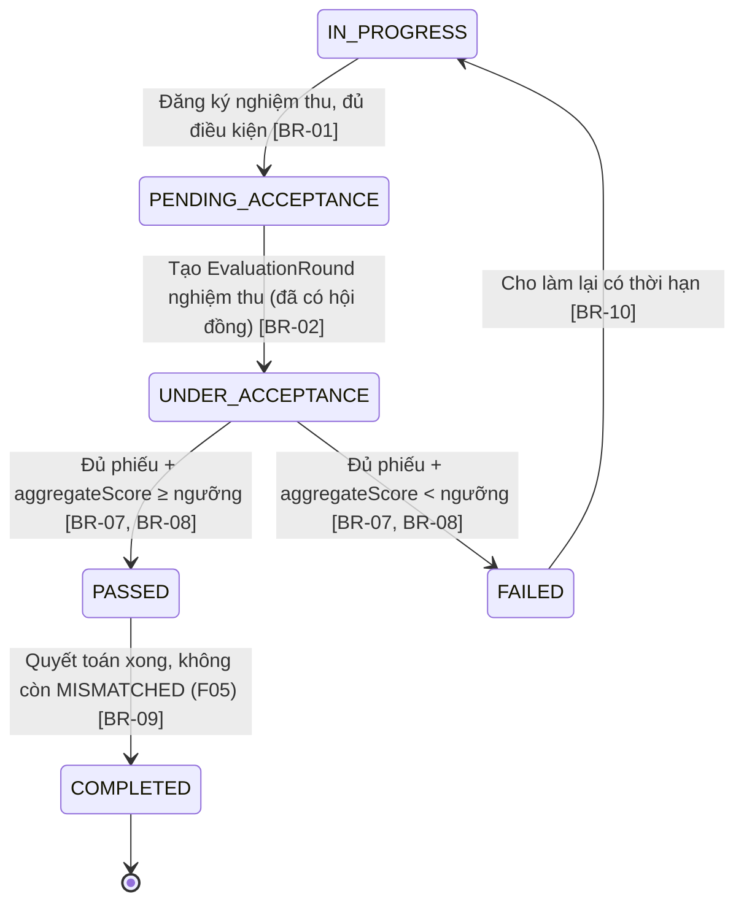

# Nghiệm thu

> Nguồn sự thật về **nghiệp vụ** của feature. Mọi luật, dữ liệu, tiêu chí nghiệm thu
> nằm ở đây. `frontend.md` và `backoffice.md` chỉ mô tả giao diện và trỏ ngược về file này.

## 1. Bối cảnh & mục tiêu

Khi đề tài hoàn thành giai đoạn thực hiện (F04) và đủ sản phẩm cam kết (F07), nó cần được một **hội đồng
nghiệm thu** đánh giá kết quả cuối để kết luận **đạt** hay **không đạt**, làm cơ sở quyết toán và đóng đề
tài. Quy trình nghiệm thu về bản chất giống xét duyệt (F03): lập hội đồng, chấm theo bộ tiêu chí, tổng hợp
điểm, ra kết luận — nên F06 **dùng chung mô hình hội đồng/phiếu chấm** với F03, phân biệt bằng
`type=ACCEPTANCE` (xem [ADR-0003](../../architecture/decisions/0003-mo-hinh-hoi-dong-dung-chung.md)).

F06 số hóa vòng nghiệm thu: chủ nhiệm đăng ký nghiệm thu khi đủ điều kiện
(`IN_PROGRESS → PENDING_ACCEPTANCE`), chuyên viên lập hội đồng `type=ACCEPTANCE` và mở đợt đánh giá
(`→ UNDER_ACCEPTANCE`), thành viên chấm theo bộ tiêu chí nghiệm thu, hệ thống tổng hợp điểm, chuyên viên
kết luận `PASSED`/`FAILED`; sau khi `PASSED` và quyết toán xong (F05) thì đóng đề tài (`→ COMPLETED`).

**Kết quả mong đợi:**
- Đề tài đi đúng chuỗi `IN_PROGRESS → PENDING_ACCEPTANCE → UNDER_ACCEPTANCE → PASSED | FAILED`, có truy vết.
- Điểm nghiệm thu tổng hợp tự động theo trọng số; kết luận minh bạch theo ngưỡng.
- `FAILED` có thể cho **làm lại có thời hạn**; `PASSED` dẫn tới quyết toán & `COMPLETED`.

## 2. Phạm vi

- **Trong phạm vi:**
  - Chủ nhiệm đăng ký nghiệm thu khi đủ điều kiện → `ResearchProject: IN_PROGRESS → PENDING_ACCEPTANCE`; nộp hồ sơ cuối.
  - Lập `EvaluationCommittee` type `ACCEPTANCE`, phân công `CommitteeMember`; tạo `EvaluationRound` type `ACCEPTANCE`
    → `ResearchProject: PENDING_ACCEPTANCE → UNDER_ACCEPTANCE`.
  - Thành viên chấm `ScoreSheet` theo `CriteriaSet` type `ACCEPTANCE`; hệ thống tính `aggregateScore`.
  - Chuyên viên kết luận `PASSED`/`FAILED`; `FAILED → IN_PROGRESS` (làm lại có thời hạn).
  - Sau `PASSED` + quyết toán xong (F05) → `ResearchProject: PASSED → COMPLETED`.
- **Ngoài phạm vi:**
  - Cơ chế hội đồng/phiếu chấm cốt lõi và xét duyệt đề xuất → đã ở **F03** (dùng chung mô hình).
  - Tạo/sửa `CriteriaSet` type `ACCEPTANCE` và ngưỡng → thuộc **B01**.
  - Báo cáo tiến độ & điều kiện vào nghiệm thu phía thực hiện → thuộc **F04**.
  - Kê khai/duyệt sản phẩm khoa học → thuộc **F07**.
  - Đối soát & quyết toán kinh phí (điều kiện "không còn MISMATCHED") → thuộc **F05**.

## 3. Luồng nghiệp vụ chính

Chuyển trạng thái `ResearchProject` bám đúng máy trạng thái ở
[data-model §3](../../architecture/data-model.md#3-vòng-đời-đề-tài-state-machine).

### 3.1 Luồng tổng quát (sequence)

```mermaid
sequenceDiagram
    actor CN as Chủ nhiệm đề tài
    actor CV as Chuyên viên QL KHCN
    actor TV as Thành viên hội đồng
    participant SYS as RMS (acceptance service)

    CN->>SYS: Đăng ký nghiệm thu + nộp hồ sơ cuối
    SYS->>SYS: Kiểm tra điều kiện (báo cáo cuối PASSED + sản phẩm cam kết) [BR-01]
    SYS->>SYS: ResearchProject: IN_PROGRESS → PENDING_ACCEPTANCE
    CV->>SYS: Lập EvaluationCommittee (type=ACCEPTANCE), phân công thành viên
    CV->>SYS: Tạo EvaluationRound (type=ACCEPTANCE), lấy CriteriaSet nghiệm thu [BR-02]
    SYS->>SYS: ResearchProject: PENDING_ACCEPTANCE → UNDER_ACCEPTANCE
    loop Mỗi thành viên (trừ xung đột lợi ích) [BR-03]
        TV->>SYS: Chấm CriterionScore + nhận xét; gửi phiếu (DRAFT → SUBMITTED) [BR-04, BR-05]
        SYS->>SYS: Tính totalScore theo trọng số [BR-06]
    end
    CV->>SYS: Yêu cầu ra kết luận
    SYS->>SYS: Kiểm tra đủ phiếu; tính aggregateScore; so ngưỡng [BR-07, BR-08]
    alt Đạt
        SYS->>SYS: conclusion=PASSED → ResearchProject: UNDER_ACCEPTANCE → PASSED
        CV->>SYS: Quyết toán (F05) xong → ResearchProject: PASSED → COMPLETED [BR-09]
    else Không đạt
        SYS->>SYS: conclusion=FAILED → ResearchProject: UNDER_ACCEPTANCE → FAILED
        CV->>SYS: Cho làm lại có thời hạn → FAILED → IN_PROGRESS [BR-10]
    end
    SYS-->>CN: Thông báo lịch & kết quả nghiệm thu (B04)
```

### 3.2 Chuyển trạng thái đề tài trong phạm vi F06



### 3.3 Vòng đời phiếu chấm & đợt đánh giá

Giống F03 (dùng chung mô hình): `ScoreSheet.status` `DRAFT → SUBMITTED` (khóa khi gửi);
`EvaluationRound.status` `COLLECTING_SCORES → CONCLUDED`. Khác biệt duy nhất là `type=ACCEPTANCE` và bộ tiêu chí
nghiệm thu.

## 4. Business rules

| ID    | Quy tắc | Mô tả | Ghi chú |
|-------|---------|-------|---------|
| BR-01 | Điều kiện vào nghiệm thu | Chỉ cho `IN_PROGRESS → PENDING_ACCEPTANCE` khi **kỳ báo cáo cuối** đã `PASSED` (F04) **và** đủ **sản phẩm cam kết** đã `APPROVED` (F07). Thiếu → chặn, nêu rõ thiếu gì. | Đồng bộ điều kiện với F04 BR-10 |
| BR-02 | Bộ tiêu chí nghiệm thu | `EvaluationRound` type `ACCEPTANCE` dùng `CriteriaSet` type `ACCEPTANCE` (cấu hình ở B01). Tạo đợt khi đề tài `PENDING_ACCEPTANCE` và đã có `EvaluationCommittee` type `ACCEPTANCE` ≥ 1 thành viên → `ResearchProject` chuyển `UNDER_ACCEPTANCE`. | Dùng chung mô hình F03 [ADR-0003] |
| BR-03 | Xung đột lợi ích | Thành viên hội đồng **không** chấm đề tài mình là `principalInvestigatorId` hoặc có trong `ProjectMember`; ẩn khỏi hàng chờ và chặn tạo `ScoreSheet`. | Loại trừ khi tính phiếu tối thiểu |
| BR-04 | Một thành viên một phiếu / đợt | Mỗi (`committeeMemberId`, `evaluationRoundId`) tối đa **một** `ScoreSheet`. | Unique (data-model §5) |
| BR-05 | Điểm hợp lệ | `0 ≤ CriterionScore.score ≤ EvaluationCriterion.maxScore`; đủ điểm mọi tiêu chí trước khi gửi phiếu. | Validate khi `DRAFT → SUBMITTED` |
| BR-06 | Tính điểm theo trọng số | `totalScore = Σ(score × weight)`; `aggregateScore` = trung bình `totalScore` các phiếu `SUBMITTED`, làm tròn 2 chữ số. | Hệ thống tính, không nhập tay |
| BR-07 | Đủ phiếu mới kết luận | Số phiếu `SUBMITTED` ≥ `ACCEPTANCE.MIN_SUBMITTED_SCORE_SHEETS` (`SystemSetting`) mới được kết luận. | Cấu hình B01 |
| BR-08 | Kết luận theo ngưỡng | `aggregateScore ≥ ACCEPTANCE.PASSING_SCORE` → `PASSED`; ngược lại `FAILED`. Đặt `EvaluationRound=CONCLUDED`. | Ngưỡng từ `SystemSetting` |
| BR-09 | Đóng đề tài cần quyết toán | `PASSED → COMPLETED` chỉ khi F05 xác nhận đã quyết toán, **không còn** giao dịch `MISMATCHED` (xem F05 BR-07). Dùng domain service chung, tránh hai feature cùng đổi trạng thái. | Phối hợp F05 |
| BR-10 | Làm lại có giới hạn | `FAILED → IN_PROGRESS` (cho làm lại) kèm `reason` và **thời hạn**; số lần làm lại không vượt `ACCEPTANCE.MAX_REDO_COUNT`. Hết hạn/quá số lần → xử lý theo quy định (không tự đóng). | Cấu hình B01; ghi audit |
| BR-11 | Tách bạch quyền | Chỉ **Chuyên viên QL KHCN** lập hội đồng, mở đợt, ra kết luận, cho làm lại. **Thành viên hội đồng** chỉ chấm phiếu được phân công. Chủ nhiệm chỉ đăng ký & nộp hồ sơ. | RBAC backend |
| BR-12 | Khóa sau kết luận | `EvaluationRound=CONCLUDED` → không nhận/sửa phiếu, không đổi kết luận trừ khi chuyên viên mở lại đợt có `reason` (audit). | Ngoại lệ, ghi `AuditLog` |

## 5. Dữ liệu

Dùng chung mô hình hội đồng/đánh giá — xem [data-model §4.4](../../architecture/data-model.md#44-hội-đồng--đánh-giá-f03-f06).
F06 thao tác với `type=ACCEPTANCE`.

| Thực thể | Vai trò trong F06 | Trường trọng yếu |
|---|---|---|
| `ResearchProject` | Đối tượng nghiệm thu | `status` (`IN_PROGRESS`/`PENDING_ACCEPTANCE`/`UNDER_ACCEPTANCE`/`PASSED`/`FAILED`/`COMPLETED`) |
| `EvaluationCommittee` | Hội đồng nghiệm thu | `type=ACCEPTANCE` |
| `CommitteeMember` | Thành viên & chức danh | `committeeRole` |
| `CriteriaSet`/`EvaluationCriterion` | Bộ tiêu chí nghiệm thu | `type=ACCEPTANCE`; `maxScore`, `weight` |
| `EvaluationRound` | Lượt nghiệm thu 1 đề tài | `type=ACCEPTANCE`, `status`, `conclusion`, `aggregateScore` |
| `ScoreSheet`/`CriterionScore` | Phiếu & điểm tiêu chí | như F03 |
| `ProgressReport` | Kiểm tra kỳ cuối `PASSED` (BR-01) | `period` lớn nhất, `status=PASSED` |
| `ResearchOutput` | Kiểm tra sản phẩm cam kết `APPROVED` (BR-01) | `researchProjectId`, `approvalStatus=APPROVED` |
| `Attachment` | Hồ sơ nghiệm thu cuối | `targetType='ResearchProject'`/`'EvaluationRound'` |
| `SystemSetting` | Tham số nghiệm thu | `ACCEPTANCE.MIN_SUBMITTED_SCORE_SHEETS`, `ACCEPTANCE.PASSING_SCORE`, `ACCEPTANCE.MAX_REDO_COUNT` |
| `Notification`/`AuditLog` | Thông báo & audit | Lịch & kết quả nghiệm thu, làm lại, đóng đề tài |

> Trường có thể bổ sung (cùng PR khi chốt): `EvaluationRound.reopenReason`, `ResearchProject.redoCount`/`redoDueDate`. Hiện
> số lần làm lại tính dẫn xuất từ `AuditLog`; nếu cần báo cáo nhanh thì materialize vào data-model.

## 6. Acceptance criteria

- **AC-01 (Happy — đăng ký nghiệm thu)** — Given đề tài `IN_PROGRESS` có kỳ báo cáo cuối `PASSED` và đủ
  sản phẩm cam kết `APPROVED`; When chủ nhiệm đăng ký nghiệm thu và nộp hồ sơ cuối; Then `ResearchProject` chuyển
  `PENDING_ACCEPTANCE`, chuyên viên nhận thông báo, ghi audit.
- **AC-02 (Happy — mở đợt nghiệm thu)** — Given đề tài `PENDING_ACCEPTANCE` và đã có hội đồng `ACCEPTANCE`
  ≥ 1 thành viên; When chuyên viên tạo `EvaluationRound` type `ACCEPTANCE`; Then đợt `COLLECTING_SCORES`, `ResearchProject`
  chuyển `UNDER_ACCEPTANCE`, chủ nhiệm nhận thông báo lịch.
- **AC-03 (Happy — chấm & gửi phiếu)** — Given thành viên không xung đột lợi ích, đợt `COLLECTING_SCORES`; When
  nhập đủ điểm mọi tiêu chí (trong `[0, maxScore]`) và gửi; Then `ScoreSheet` `DRAFT → SUBMITTED`, tính
  `totalScore`, khóa phiếu.
- **AC-04 (Happy — kết luận PASSED & đóng đề tài)** — Given đủ phiếu, `aggregateScore ≥ PASSING_SCORE`; When chuyên
  viên ra kết luận, rồi F05 xác nhận quyết toán xong; Then `conclusion=PASSED`, `ResearchProject` `PASSED`, sau quyết toán
  chuyển `COMPLETED`, thông báo chủ nhiệm.
- **AC-05 (Biên — kết luận FAILED & làm lại)** — Given đủ phiếu, `aggregateScore < PASSING_SCORE`; When chuyên
  viên ra kết luận `FAILED` rồi cho làm lại kèm lý do & thời hạn; Then `ResearchProject` `FAILED → IN_PROGRESS`,
  tăng số lần làm lại, ghi audit (BR-10).
- **AC-06 (Biên — thiếu phiếu)** — Given số phiếu `SUBMITTED` < `MIN_SUBMITTED_SCORE_SHEETS`; When chuyên viên cố ra
  kết luận; Then chặn, báo số phiếu thiếu, không đổi trạng thái (BR-07).
- **AC-07 (Negative — chưa đủ điều kiện nghiệm thu)** — Given đề tài `IN_PROGRESS` chưa có kỳ cuối `PASSED`
  hoặc thiếu sản phẩm cam kết; When chủ nhiệm đăng ký nghiệm thu; Then chặn, nêu điều kiện thiếu, giữ
  `IN_PROGRESS` (BR-01).
- **AC-08 (Negative — xung đột lợi ích)** — Given thành viên hội đồng là chủ nhiệm/thành viên đề tài; When
  mở hàng chờ chấm; Then đề tài đó bị ẩn và chặn tạo `ScoreSheet` (BR-03).
- **AC-09 (Negative — điểm vượt maxScore)** — Given thành viên nhập `score > maxScore`; When gửi phiếu;
  Then lỗi validate, phiếu giữ `DRAFT` (BR-05).
- **AC-10 (Negative — đóng đề tài khi còn MISMATCHED)** — Given đề tài `PASSED` nhưng F05 còn giao dịch `MISMATCHED`; When
  chuyên viên cố đóng đề tài; Then chặn, yêu cầu xử lý quyết toán trước (BR-09, F05 BR-07).
- **AC-11 (Negative — sai quyền)** — Given người dùng là Thành viên hội đồng (không phải chuyên viên); When
  gọi hành động ra kết luận/lập hội đồng/cho làm lại; Then 403, không thực hiện (BR-11).
- **AC-12 (Negative — khóa sau kết luận)** — Given `EvaluationRound=CONCLUDED`; When thành viên cố gửi/sửa
  phiếu; Then bị từ chối (BR-12).

## 7. Phụ thuộc & rủi ro

**Phụ thuộc:**
- **F04** — điều kiện kỳ báo cáo cuối `PASSED`; nhận đề tài sau `PENDING_ACCEPTANCE`; làm lại trả về `IN_PROGRESS`.
- **F07** — sản phẩm cam kết `APPROVED` là điều kiện vào nghiệm thu.
- **F05** — quyết toán & điều kiện "không còn MISMATCHED" để đóng đề tài `PASSED → COMPLETED`.
- **B01** — `CriteriaSet` type `ACCEPTANCE`; tham số `MIN_SUBMITTED_SCORE_SHEETS`, `PASSING_SCORE`, `MAX_REDO_COUNT`.
- **B03** — vai trò Chuyên viên QL KHCN, Thành viên hội đồng; data scoping.
- **B04** — thông báo lịch & kết quả nghiệm thu, làm lại, hoàn thành.
- **F03** — dùng chung mô hình hội đồng/phiếu chấm ([ADR-0003](../../architecture/decisions/0003-mo-hinh-hoi-dong-dung-chung.md)); thay đổi model cân nhắc cả hai.

**Rủi ro & điểm cần làm rõ:**
- **Định nghĩa "đủ sản phẩm cam kết" (BR-01):** đồng bộ chính xác với F04 BR-10 và F07 — đếm theo loại/số
  lượng từ thuyết minh? Cần PO chốt nguồn dữ liệu chung.
- **Ai sở hữu chuyển `PASSED → COMPLETED`:** F06 hay F05 kích hoạt — thống nhất domain service dùng chung,
  F05 cung cấp điều kiện quyết toán (xem F05 §7).
- **Chính sách làm lại (BR-10):** số lần tối đa, thời hạn, và xử lý khi quá hạn/quá số lần (đóng không đạt?
  chuyển hội đồng?). Cần PO chốt.
- **Mở lại đợt sau kết luận (BR-12):** quyền & quy trình mở lại cần làm rõ.
