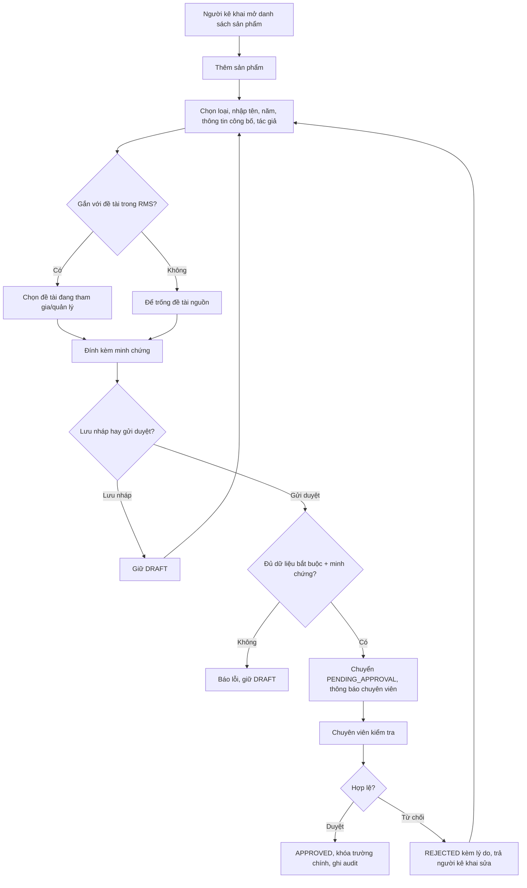
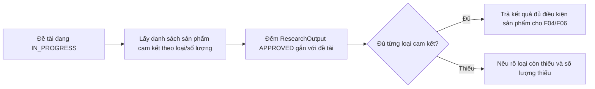

# Sản phẩm khoa học

> **Nguồn sự thật về nghiệp vụ** của feature — do **PO/BA sở hữu và duyệt**. Mọi luật, dữ liệu,
> tiêu chí nghiệm thu nằm ở đây. Giao diện ở [`ui.md`](./ui.md), thiết kế kỹ thuật ở
> [`design.md`](./design.md), kiểm thử ở [`test-plan.md`](./test-plan.md).

## 1. Bối cảnh & mục tiêu

Trong vòng đời đề tài, sản phẩm khoa học là đầu ra cần kê khai, nộp minh chứng, được chuyên viên duyệt và
dùng làm căn cứ nghiệm thu. Hiện sản phẩm thường nằm rải rác trong báo cáo, email hoặc file minh chứng nên
khó kiểm tra đề tài đã đủ cam kết hay chưa, khó tổng hợp thành lý lịch khoa học của nhà nghiên cứu, và khó
thống kê theo loại sản phẩm.

F07 số hóa phần **kê khai và duyệt sản phẩm khoa học**: chủ nhiệm hoặc tác giả kê khai sản phẩm, gắn với
đề tài nguồn nếu có, thêm đồng tác giả và minh chứng; chuyên viên QL KHCN kiểm tra, duyệt hoặc từ chối kèm
lý do. Chỉ sản phẩm **đã duyệt** mới được tính vào điều kiện nghiệm thu (F04/F06) và hiển thị trong lý lịch
khoa học (F08).

**Kết quả mong đợi:**
- Mỗi sản phẩm có loại, năm công bố, tác giả, minh chứng và trạng thái duyệt rõ ràng.
- Đề tài đang thực hiện nhìn được mức hoàn thành sản phẩm cam kết theo loại/số lượng.
- Lý lịch khoa học và báo cáo thống kê chỉ lấy sản phẩm đã duyệt, tránh nhập trùng và sai nguồn.

## 2. Phạm vi

- **Trong phạm vi:**
  - Chủ nhiệm đề tài hoặc tác giả kê khai sản phẩm khoa học, gắn với `ResearchProject` khi sản phẩm thuộc
    một đề tài trong RMS; cho phép sản phẩm ngoài đề tài (`researchProjectId = null`) để phục vụ lý lịch.
  - Chọn loại sản phẩm từ `ProductType` (B01), nhập tên, năm công bố, thông tin công bố, danh sách tác giả.
  - Đính kèm minh chứng bắt buộc trước khi gửi duyệt.
  - Chuyên viên QL KHCN duyệt hoặc từ chối sản phẩm; từ chối bắt buộc có lý do.
  - Đối chiếu sản phẩm đã duyệt với **sản phẩm cam kết** của đề tài để cung cấp điều kiện "đủ sản phẩm cam
    kết" cho F04/F06.
  - Sản phẩm đã duyệt được F08 dùng để hiển thị lý lịch khoa học; B02 dùng để báo cáo/thống kê.
- **Ngoài phạm vi:**
  - Cấu hình danh mục `ProductType` và quy định minh chứng theo loại sản phẩm → thuộc **B01**.
  - Quy trình nghiệm thu, chuyển `IN_PROGRESS → PENDING_ACCEPTANCE`, kết luận `PASSED`/`FAILED` → thuộc
    **F04/F06**; F07 chỉ cung cấp kết quả đối chiếu sản phẩm.
  - Trích xuất lý lịch khoa học/CV → thuộc **F08**.
  - Công khai sản phẩm ra cổng ngoài → để dành **B05/Cổng công khai**.
  - Chấm điểm sản phẩm, quy đổi giờ giảng, định mức thưởng → thuộc **P03** hoặc feature sau.

## 3. Luồng nghiệp vụ chính

### 3.1 Kê khai và duyệt sản phẩm

### 3.2 Đối chiếu sản phẩm cam kết của đề tài

> Nguồn "sản phẩm cam kết" được chốt từ thuyết minh/hồ sơ đề tài khi đề tài được giao. F07 sở hữu cách
> đối chiếu; việc chuyển trạng thái nghiệm thu vẫn đi qua domain service của F04/F06.

## 4. Business rules

| ID | Quy tắc | Mô tả | Ghi chú |
|----|---------|-------|---------|
| BR-01 | Sản phẩm có vòng đời duyệt riêng | `ResearchOutput.approvalStatus`: `DRAFT` (nếu triển khai lưu nháp) → `PENDING_APPROVAL` → `APPROVED` hoặc `REJECTED`. Chỉ `APPROVED` được tính cho nghiệm thu/lý lịch/báo cáo. | Data-model hiện có `PENDING_APPROVAL`/`APPROVED`/`REJECTED`; cần bổ sung `DRAFT` nếu muốn lưu nháp. |
| BR-02 | Người được kê khai | Chủ nhiệm đề tài kê khai sản phẩm cho đề tài mình; thành viên/tác giả kê khai sản phẩm của chính mình. Chuyên viên/Admin có thể nhập hộ theo phạm vi dữ liệu. | Backend kiểm RBAC + data scoping. |
| BR-03 | Gắn đề tài nguồn có điều kiện | Nếu gắn `researchProjectId`, người kê khai phải là chủ nhiệm/thành viên đề tài hoặc có quyền chuyên viên trong phạm vi. Đề tài phải chưa `COMPLETED` khi gửi duyệt sản phẩm mới. | Sản phẩm ngoài RMS để `researchProjectId = null`. |
| BR-04 | Loại sản phẩm bắt buộc | Mỗi sản phẩm phải chọn `ProductType` còn hiệu lực trong tenant. Loại sản phẩm dùng để đối chiếu cam kết và báo cáo. | Quản trị danh mục ở B01. |
| BR-05 | Thông tin tối thiểu khi gửi duyệt | Khi gửi duyệt phải có: tên sản phẩm, loại, năm công bố hợp lệ, ít nhất một tác giả, thông tin công bố/tạp chí/hội nghị hoặc mô tả tương đương, và minh chứng. | Nháp có thể thiếu. |
| BR-06 | Năm công bố hợp lệ | `publicationYear` là số nguyên, không lớn hơn năm hiện tại; nếu gắn đề tài thì không nhỏ hơn năm bắt đầu đề tài (khi có `ProjectAssignment.startDate`). | Năm hiện tại theo Asia/Ho_Chi_Minh khi hiển thị. |
| BR-07 | Minh chứng bắt buộc trước duyệt | Sản phẩm chỉ được gửi duyệt khi có ít nhất một minh chứng (`Attachment`); chuyên viên có thể yêu cầu thay minh chứng bằng cách từ chối kèm lý do. | File dùng quy ước Attachment chung. |
| BR-08 | Chống trùng sản phẩm trong tenant | Hệ thống cảnh báo khi có sản phẩm cùng tên chuẩn hóa, cùng năm công bố và trùng ít nhất một tác giả; người có quyền vẫn có thể lưu nếu xác nhận "khác sản phẩm". | Chặn cứng chỉ khi trùng cùng `researchProjectId` + loại + tên + năm. |
| BR-09 | Duyệt/từ chối bởi chuyên viên | Chỉ Chuyên viên QL KHCN/Admin được duyệt hoặc từ chối. Từ chối bắt buộc có lý do; duyệt ghi thời điểm/người duyệt. | RBAC backend. |
| BR-10 | Khóa trường chính sau duyệt | Sau `APPROVED`, không cho sửa loại, tên, năm công bố, tác giả, đề tài nguồn và minh chứng. Muốn sửa phải yêu cầu mở lại/đính chính có lý do, ghi audit. | Tránh làm lệch điều kiện nghiệm thu/lý lịch. |
| BR-11 | Đối chiếu sản phẩm cam kết theo loại/số lượng | Một đề tài đủ sản phẩm cam kết khi số sản phẩm `APPROVED` gắn với đề tài đạt tối thiểu từng loại/số lượng đã cam kết trong hồ sơ đề tài. Thiếu phải nêu rõ loại và số lượng còn thiếu. | Cung cấp cho F04 BR-10, F06 BR-01. |
| BR-12 | Sản phẩm bị từ chối không được tính | `REJECTED` không xuất hiện trong lý lịch F08, không tính vào nghiệm thu, nhưng người kê khai thấy lý do để sửa/gửi lại bản mới hoặc mở lại bản cũ nếu triển khai. | Không xóa cứng. |
| BR-13 | Phạm vi xem theo vai trò | Tác giả/chủ nhiệm xem sản phẩm của mình/đề tài mình; chuyên viên xem theo phạm vi dữ liệu; admin xem toàn tenant. | UI ẩn/hiện không thay kiểm tra backend. |
| BR-14 | Mọi thay đổi quan trọng ghi audit | Tạo, gửi duyệt, duyệt, từ chối, mở lại/đính chính, đổi đề tài nguồn, đính/gỡ minh chứng đều ghi `AuditLog` append-only. | Tuân thủ AGENTS.md §4.4. |

## 5. Dữ liệu

Dùng chung mô hình ở [`data-model.md §4.6`](../../architecture/data-model.md#46-sản-phẩm--lý-lịch-f07-f08).

| Thực thể | Vai trò trong F07 | Trường trọng yếu |
|---|---|---|
| `ResearchOutput` | Sản phẩm khoa học | `researchProjectId` nullable, `productTypeId`, `name`, `authors`, `publicationYear`, `publicationInfo`, `evidenceAttachmentId`, `approvalStatus` |
| `ProductType` | Loại sản phẩm | `code`, `name`, `category` (`ARTICLE`/`PATENT`/`SOLUTION`/`TRAINING`/`OTHER`), `recordStatus` |
| `ResearchProject` | Đề tài nguồn và điều kiện nghiệm thu | `id`, `statusSemantic`, `principalInvestigatorId`; sản phẩm gắn qua `researchProjectId` |
| `ProjectMember` | Kiểm quyền kê khai theo đề tài | `researchProjectId`, `userId`, `projectRole` |
| `ProjectAssignment` | Kiểm năm bắt đầu đề tài | `researchProjectId`, `startDate`, `status=EFFECTIVE` |
| `Attachment` | Minh chứng sản phẩm | `targetType='ResearchOutput'`, `targetId`, `evidenceTypeItemId`, `storageKey` |
| `AuditLog` | Nhật ký | Tạo/gửi duyệt/duyệt/từ chối/mở lại/đính chính |

**Cần bổ sung/chốt ở data-model khi triển khai:**
- `ResearchOutput.approvalStatus` có cần thêm `DRAFT` hay dùng bản ghi chỉ được tạo khi gửi duyệt.
- Trường duyệt: `submittedAt`, `approvedBy`, `approvedAt`, `rejectedBy`, `rejectedAt`, `rejectionReason`,
  `correctionReason` (nếu mở lại/đính chính).
- Cấu trúc sản phẩm cam kết của đề tài: tối thiểu cần `ExpectedOutput` hoặc khối trong `proposalDocument`
  được chuẩn hóa thành `{ productTypeId, minQuantity }` khi giao đề tài.
- `authors` nên chuẩn hóa đủ để liên kết tác giả nội bộ (`userId`) và tác giả ngoài (`name`, `affiliation`).

## 6. Acceptance criteria

- **AC-01 (Happy — kê khai và gửi duyệt)** — Given chủ nhiệm đề tài có đề tài đang `IN_PROGRESS`; When tạo
  sản phẩm, chọn loại, nhập tên/năm/thông tin công bố/tác giả, gắn đề tài, đính minh chứng và gửi duyệt;
  Then sản phẩm chuyển `PENDING_APPROVAL`, chuyên viên nhận thông báo, ghi audit (BR-02..BR-07, BR-14).
- **AC-02 (Happy — lưu sản phẩm ngoài đề tài)** — Given nhà nghiên cứu có sản phẩm không thuộc đề tài RMS;
  When kê khai sản phẩm và để trống đề tài nguồn; Then sản phẩm vẫn gửi duyệt được nếu đủ thông tin/minh
  chứng và sau khi duyệt sẽ hiển thị trong lý lịch F08 (BR-03, BR-12).
- **AC-03 (Happy — duyệt sản phẩm)** — Given sản phẩm `PENDING_APPROVAL` đủ minh chứng; When chuyên viên
  duyệt; Then `approvalStatus=APPROVED`, ghi người/thời điểm duyệt, khóa trường chính, sản phẩm được tính
  cho nghiệm thu/lý lịch/báo cáo (BR-09, BR-10).
- **AC-04 (Happy — từ chối sản phẩm)** — Given sản phẩm `PENDING_APPROVAL`; When chuyên viên từ chối kèm lý
  do; Then `approvalStatus=REJECTED`, người kê khai thấy lý do, sản phẩm không tính cho nghiệm thu/lý lịch
  (BR-09, BR-12).
- **AC-05 (Biên — thiếu minh chứng)** — Given sản phẩm thiếu minh chứng; When người kê khai gửi duyệt; Then
  hệ thống chặn, giữ bản nháp/chưa gửi, báo cần đính kèm minh chứng (BR-07).
- **AC-06 (Biên — năm công bố không hợp lệ)** — Given năm hiện tại là 2026; When nhập `publicationYear=2030`
  hoặc nhỏ hơn năm bắt đầu đề tài đã gắn; Then hệ thống từ chối với lỗi năm công bố không hợp lệ (BR-06).
- **AC-07 (Negative — gắn đề tài không thuộc phạm vi)** — Given người dùng không là chủ nhiệm/thành viên và
  không có quyền chuyên viên trong phạm vi; When cố gắn sản phẩm vào đề tài đó; Then backend trả 403, không
  lưu liên kết (BR-03, BR-13).
- **AC-08 (Negative — sai quyền duyệt)** — Given người dùng là chủ nhiệm/thành viên đề tài; When gọi hành
  động duyệt/từ chối sản phẩm; Then backend trả 403, không đổi trạng thái (BR-09).
- **AC-09 (Biên — cảnh báo trùng)** — Given đã có sản phẩm cùng tên chuẩn hóa, cùng năm và trùng tác giả;
  When kê khai sản phẩm mới tương tự; Then hệ thống cảnh báo trùng và yêu cầu xác nhận trước khi lưu/gửi
  (BR-08).
- **AC-10 (Negative — sửa sau duyệt)** — Given sản phẩm `APPROVED`; When người kê khai cố sửa loại/tên/năm/tác
  giả/minh chứng; Then hệ thống từ chối, hướng dẫn yêu cầu đính chính/mở lại có lý do (BR-10).
- **AC-11 (Happy — đối chiếu đủ sản phẩm cam kết)** — Given đề tài có cam kết 2 bài báo và đã có 2
  `ResearchOutput.APPROVED` loại bài báo gắn với đề tài; When F04/F06 kiểm điều kiện sản phẩm; Then F07 trả
  kết quả **đủ**, cho phép bước nghiệm thu tiếp tục (BR-11).
- **AC-12 (Biên — thiếu sản phẩm cam kết)** — Given đề tài cam kết 2 bài báo nhưng mới có 1 sản phẩm
  `APPROVED` và 1 sản phẩm `REJECTED`; When kiểm điều kiện sản phẩm; Then F07 trả kết quả **thiếu 1 bài báo**,
  F04/F06 chặn chuyển nghiệm thu (BR-11, BR-12).
- **AC-13 (Quyền — xem theo phạm vi)** — Given chuyên viên ngoài phạm vi dữ liệu hoặc người không liên quan;
  When mở danh sách/chi tiết sản phẩm của đề tài; Then hệ thống từ chối hoặc không trả dữ liệu ngoài phạm vi
  (BR-13).

## 7. Phụ thuộc & rủi ro

**Phụ thuộc:**
- **B01** — danh mục `ProductType`, loại minh chứng (`EVIDENCE_TYPE`) và trạng thái hiệu lực danh mục.
- **B03** — vai trò/quyền, phạm vi dữ liệu, thông tin người dùng nội bộ để liên kết tác giả.
- **B04** — thông báo khi gửi duyệt, duyệt/từ chối, cần bổ sung minh chứng.
- **F01/F04** — hồ sơ/thuyết minh đề tài và thời điểm giao đề tài; nguồn chuẩn hóa sản phẩm cam kết.
- **F04/F06** — kiểm điều kiện đủ sản phẩm trước nghiệm thu.
- **F08** — lý lịch khoa học chỉ lấy `ResearchOutput.APPROVED`.
- **B02** — báo cáo/thống kê theo loại sản phẩm, năm, đơn vị, đề tài.

**Rủi ro & điểm cần làm rõ:**

| Rủi ro / điểm mở | Ảnh hưởng | Giảm thiểu / cần chốt |
|------------------|-----------|------------------------|
| Chưa có cấu trúc chuẩn cho "sản phẩm cam kết" trong đề xuất/giao đề tài | Cao | Chốt `ExpectedOutput` hoặc chuẩn hóa phần này từ `proposalDocument` trước khi nghiệm thu. |
| Tác giả ngoài hệ thống và thứ tự tác giả phức tạp | Trung bình | Chuẩn hóa `authors` gồm tác giả nội bộ (`userId`) và ngoài (`name`, `affiliation`, `order`). |
| Trùng sản phẩm do nhiều đồng tác giả cùng kê khai | Trung bình | Cảnh báo trùng + luồng hợp nhất/đính chính ở giai đoạn sau; hiện BR-08 giảm rủi ro. |
| Sửa sản phẩm đã duyệt làm lệch nghiệm thu/lý lịch | Cao | Khóa trường chính sau duyệt; mọi đính chính qua mở lại có lý do và audit. |
| Loại sản phẩm/minh chứng khác nhau theo tenant | Trung bình | Dùng `ProductType`/`EVIDENCE_TYPE` per-tenant trong B01; không hard-code ở F07. |

**Đã chốt trong bản này:**
- Chỉ sản phẩm `APPROVED` được tính vào nghiệm thu, lý lịch và báo cáo.
- F07 không tự chuyển trạng thái đề tài; chỉ trả kết quả đối chiếu sản phẩm cho F04/F06.
- Sản phẩm ngoài đề tài RMS được phép kê khai để phục vụ lý lịch khoa học.
