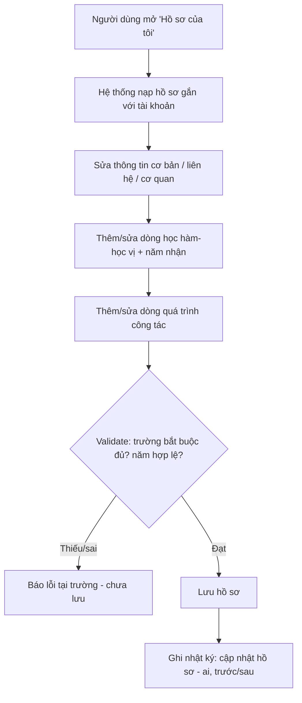
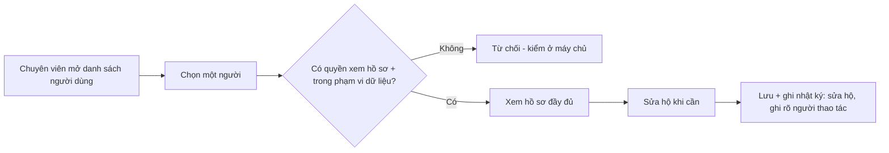
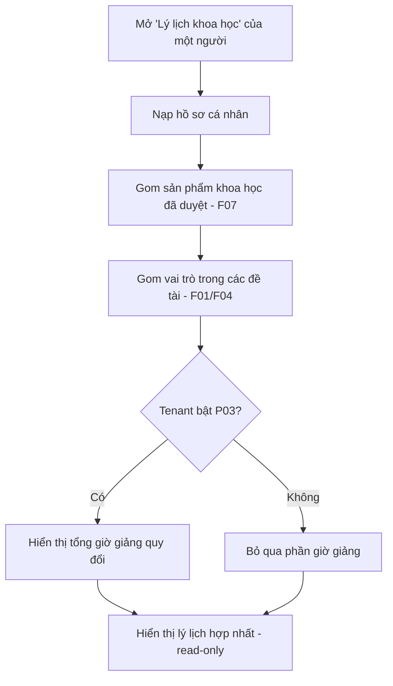
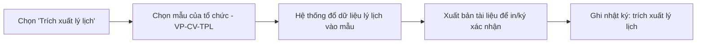

# Lý lịch khoa học

> **Nguồn sự thật về nghiệp vụ** của feature — do **PO/BA sở hữu và duyệt**. Mọi luật, dữ liệu, tiêu chí
> nghiệm thu nằm ở đây, viết bằng **ngôn ngữ nghiệp vụ**. Giao diện ở [`ui.md`](./ui.md); kiểm thử ở
> [`test-plan.md`](./test-plan.md); cả hai trỏ ngược về file này.
>
> F08 gồm **hai phần dính liền**: (1) **Hồ sơ cá nhân** — dữ liệu master của một người, do chính họ tự
> cập nhật; (2) **Lý lịch khoa học** — khung nhìn tổng hợp (view) đặt trên hồ sơ + sản phẩm khoa học +
> vai trò trong đề tài + giờ giảng quy đổi. Phần khoa học **không lưu trùng**, gom từ các feature khác.

## 1. Bối cảnh & mục tiêu

Mỗi nhà khoa học trong RMS cần một **hồ sơ** đầy đủ: thông tin cơ bản, liên hệ, cơ quan công tác, học
hàm/học vị và quá trình công tác. Từ hồ sơ này cộng với hoạt động nghiên cứu trên hệ thống (đề tài, sản
phẩm, giờ giảng), RMS dựng **lý lịch khoa học** dùng để xét duyệt đề tài, lập hội đồng, và **trích xuất
bản CV ký xác nhận** theo mẫu của từng trường/viện.

Tách bạch với [B03 — Quản lý người dùng](../B03-quan-ly-nguoi-dung/spec.md):
- **B03** sở hữu **tài khoản & định danh** (email-OTP qua hệ thống xác thực, vai trò, quyền, trạng thái).
- **F08** sở hữu **nội dung hồ sơ** (tiểu sử, học hàm/vị, quá trình công tác) và **khung nhìn lý lịch**.
  F08 **không** đụng tới email/định danh/vai trò.

**Người dùng feature này:**
- **Chủ hồ sơ** (mọi người dùng đã đăng nhập): **tự xem và sửa** hồ sơ của chính mình.
- **Chuyên viên QL KHCN / Quản trị hệ thống**: xem hồ sơ người khác và **sửa hộ** khi cần (nhập liệu hộ,
  đính chính), theo phạm vi dữ liệu.

**Kết quả mong đợi:**
- Mỗi người dùng có một hồ sơ gắn 1-1 với tài khoản; tự cập nhật được thông tin của mình mà không cần admin.
- Lý lịch khoa học hiển thị **đồng bộ, không nhập trùng** với dữ liệu đề tài/sản phẩm đã có trên hệ thống.
- Mỗi trường/viện (tenant) cấu hình được **trường nào hiển thị / bắt buộc** mà không sửa code.
- Trích xuất được bản lý lịch theo mẫu của tổ chức để in/ký xác nhận.

## 2. Phạm vi

- **Trong phạm vi:**
  - **Hồ sơ cá nhân** với các nhóm trường (tập hiển thị/bắt buộc cấu hình per-tenant — BR-04):
    - *Thông tin cơ bản:* họ tên, giới tính, ngày sinh (đầy đủ `dd/MM/yyyy`).
    - *Thông tin liên hệ:* email (chỉ hiển thị, do B03/hệ thống xác thực quản — BR-02), số điện thoại, địa chỉ.
    - *Thông tin cơ quan công tác:* trường/viện (= tenant hiện tại, hiển thị ngầm — BR-03), phòng ban
      (đơn vị), chức vụ.
    - *Học hàm* và *học vị* (**tách bạch**): mỗi loại là một danh sách nhiều dòng, mỗi dòng gồm loại +
      **năm nhận** (BR-05).
    - *Quá trình công tác:* danh sách nhiều dòng theo thời gian (BR-06).
  - **Tự phục vụ:** chủ hồ sơ tự sửa hồ sơ của mình; **admin/chuyên viên** sửa hộ (BR-01).
  - **Khung nhìn lý lịch khoa học** tổng hợp (read-only, không lưu trùng — BR-07): sản phẩm khoa học
    (F07), vai trò trong đề tài (F01/F04), giờ giảng quy đổi (P03 — nếu tenant bật).
  - **Trích xuất lý lịch** theo template per-tenant để in/ký xác nhận (BR-08, VP-CV-TPL).
- **Ngoài phạm vi:**
  - Email, định danh đăng nhập, vai trò & quyền, trạng thái tài khoản — thuộc
    [B03](../B03-quan-ly-nguoi-dung/spec.md).
  - Tạo/duyệt **sản phẩm khoa học** chi tiết — thuộc [F07](../F07-san-pham-khoa-hoc/); F08 chỉ **hiển thị**.
  - **Công thức/định mức quy đổi giờ giảng** — thuộc [P03](../P03-quy-doi-gio-giang/); F08 chỉ hiển thị tổng.
  - Cây **đơn vị** và danh mục **chức vụ / học hàm-học vị** (chỉ tham chiếu) — thuộc
    [B01](../B01-danh-muc-cau-hinh/).
  - **Trường tùy biến (custom field)** do tenant tự định nghĩa — *ngoài phạm vi giai đoạn này*; cấu hình
    chỉ ở mức bật/tắt + bắt buộc trên bộ trường chuẩn (BR-04).

## 3. Luồng nghiệp vụ chính

### 3.1 Chủ hồ sơ tự cập nhật hồ sơ

> Email **không** sửa ở màn hình này (chỉ hiển thị); trường/viện hiển thị ngầm theo tenant (BR-02, BR-03).

### 3.2 Chuyên viên / admin xem & sửa hộ hồ sơ người khác

### 3.3 Xem lý lịch khoa học (khung nhìn tổng hợp)

### 3.4 Trích xuất lý lịch để ký xác nhận

## 4. Business rules

| ID | Quy tắc | Mô tả | Ghi chú |
|----|---------|-------|---------|
| BR-01 | Hồ sơ 1-1 với tài khoản; tự phục vụ + sửa hộ | Mỗi người dùng có đúng một hồ sơ gắn 1-1 với tài khoản (B03). Chủ hồ sơ **tự xem/sửa** hồ sơ của mình; **Chuyên viên QL KHCN / Quản trị hệ thống** xem & **sửa hộ** theo phạm vi dữ liệu. | Quyền kiểm ở máy chủ (như B03 BR-08). |
| BR-02 | Email & định danh không sửa ở F08 | Email và định danh đăng nhập chỉ **hiển thị** trong hồ sơ; muốn đổi phải đổi ở hệ thống xác thực rồi đồng bộ. F08 không sửa email. | Thuộc B03 BR-09 / ADR-0008. |
| BR-03 | Trường/Viện = tenant hiện tại | "Trường/Viện" trong thông tin cơ quan công tác **hiển thị tự động** theo tenant người dùng thuộc về, **không nhập tay**. Trong tenant chỉ chọn **phòng ban** (đơn vị) và **chức vụ**. | Đa tổ chức — ADR-0012. |
| BR-04 | Tập trường hiển thị/bắt buộc cấu hình per-tenant | Mỗi tenant cấu hình **trường nào hiển thị** và **trường nào bắt buộc** trên bộ trường chuẩn (giới tính, năm sinh, địa chỉ, chức vụ, học hàm/vị, quá trình công tác…). Trường lõi (họ tên) luôn có. **Không** tạo trường tùy biến mới. | VP-PROFILE — [variation-points](../../architecture/variation-points.md). |
| BR-05 | Học hàm & học vị tách bạch, danh sách + năm nhận | **Học hàm** (danh mục `ACADEMIC_RANK`: GS/PGS) và **học vị** (danh mục `ACADEMIC_DEGREE`: TS/ThS/CN) là **hai nhóm riêng**; mỗi nhóm lưu **nhiều dòng**, mỗi dòng gồm loại + **năm nhận**. Năm nhận **≤ năm hiện tại** và (nếu có ngày sinh) **≥ năm sinh**. | Danh mục per-tenant (B01). |
| BR-06 | Quá trình công tác là danh sách theo thời gian | Quá trình công tác lưu **nhiều dòng**; mỗi dòng gồm tổ chức/đơn vị, chức vụ, **từ ngày – đến ngày**. "Đến" bỏ trống = **đang công tác**. Ràng buộc **từ ≤ đến**. | — |
| BR-07 | Lý lịch khoa học là khung nhìn tổng hợp, không lưu trùng | Phần khoa học của lý lịch **không nhập tay, không lưu trùng**: hệ thống gom **sản phẩm khoa học** (F07, chỉ bản đã duyệt), **vai trò trong đề tài** (F01/F04) và **giờ giảng quy đổi** (P03 — nếu tenant bật). | F08 = view trên `User` + `ResearchOutput` + vai trò ([data-model §4.6](../../architecture/data-model.md)). |
| BR-08 | Trích xuất theo mẫu của tổ chức | Bản lý lịch trích xuất theo **template per-tenant**; nội dung lấy từ khung nhìn tổng hợp tại thời điểm trích xuất, phục vụ in/ký xác nhận. | VP-CV-TPL. |
| BR-09 | Phạm vi xem hồ sơ kiểm ở máy chủ | Chủ hồ sơ luôn xem được hồ sơ mình; người khác chỉ xem khi có quyền + trong phạm vi dữ liệu. Giao diện ẩn/hiện theo quyền **không** thay cho kiểm tra ở máy chủ. | ADR-0005, B03 BR-08. |
| BR-10 | Mọi thay đổi hồ sơ đều ghi nhật ký | Tạo/sửa hồ sơ (kể cả sửa hộ) và trích xuất lý lịch đều **ghi nhật ký** (ai, khi nào, giá trị trước/sau). | Audit append-only (AGENTS.md §4.4). |

## 5. Dữ liệu (mức khái niệm)

Mô hình bảng/trường ở [`../../architecture/data-model.md §4.1, §4.6`](../../architecture/data-model.md).

- **Hồ sơ cá nhân** — mở rộng thực thể **`User`** (B03 sở hữu khung tài khoản; F08 sở hữu các trường nội
  dung): giới tính, ngày sinh (đầy đủ `dd/MM/yyyy`), địa chỉ, chức vụ (FK danh mục `POSITION`). Họ tên, email, số điện
  thoại, đơn vị (phòng ban) đã có sẵn ở `User`.
- **Học hàm & học vị** — thực thể con **`AcademicQualification`** (nhiều dòng/người) với `kind`
  (`RANK` = học hàm / `DEGREE` = học vị) + loại (FK danh mục `ACADEMIC_RANK` hoặc `ACADEMIC_DEGREE` khớp
  `kind`) + năm nhận (BR-05).
- **Quá trình công tác** — thực thể con **`WorkHistory`** (nhiều dòng/người): tổ chức/đơn vị, chức vụ,
  khoảng thời gian (BR-06).
- **Khung nhìn lý lịch khoa học** — **không phải bảng riêng**: tổng hợp `User` + `AcademicQualification`
  + `WorkHistory` + `ResearchOutput` (F07) + vai trò trong `ResearchProject`/`ProjectMember` + giờ giảng
  quy đổi (P03) (BR-07).
- **Nhật ký (audit):** ghi mọi thay đổi hồ sơ và lần trích xuất lý lịch (BR-10).

> **Danh mục per-tenant liên quan** (B01, cưỡi trên VP-CAT): `POSITION` (chức vụ — đã có), `ACADEMIC_RANK`
> (học hàm — **bổ sung**), `ACADEMIC_DEGREE` (học vị — **bổ sung**), `ADMINISTRATIVE_DIVISION` (địa chỉ
> Tỉnh/Huyện/Xã — đã có, tùy chọn).

## 6. Acceptance criteria

Viết theo Given / When / Then bằng ngôn ngữ nghiệp vụ; khẳng định mức field để ở `test-plan.md`/`design.md`.

- **AC-01** (happy — tự cập nhật hồ sơ) — Given người dùng U đã đăng nhập, When U mở "Hồ sơ của tôi", sửa
  giới tính, năm sinh, địa chỉ, số điện thoại và lưu với đủ trường bắt buộc, Then hồ sơ của U được cập
  nhật và nhật ký ghi *cập nhật hồ sơ* (BR-01, BR-10).
- **AC-02** (quyền — không sửa email ở F08) — Given U mở hồ sơ của mình, When U thử đổi email, Then trường
  email ở chế độ **chỉ đọc** và không có cách lưu email mới từ F08 (BR-02).
- **AC-03** (cấu hình — trường ẩn/bắt buộc theo tenant) — Given tenant T cấu hình "địa chỉ = ẩn" và "chức
  vụ = bắt buộc", When người dùng của T mở hồ sơ, Then trường địa chỉ **không hiển thị** và không lưu được
  nếu **chưa nhập chức vụ** (BR-04).
- **AC-04** (ngầm — trường/viện theo tenant) — Given U thuộc tenant "ĐH Thủy Lợi", When U xem thông tin cơ
  quan công tác, Then "Trường/Viện" hiển thị **"ĐH Thủy Lợi"** tự động và **không có ô nhập tay** (BR-03).
- **AC-05** (happy — học hàm & học vị tách bạch) — Given U mở hồ sơ, When U thêm **học vị** "Tiến sĩ —
  2015" (`kind=DEGREE`, danh mục `ACADEMIC_DEGREE`) và **học hàm** "Phó giáo sư — 2021" (`kind=RANK`, danh
  mục `ACADEMIC_RANK`), Then cả hai dòng được lưu vào đúng nhóm, mỗi dòng có loại và năm nhận (BR-05).
- **AC-06** (biên — năm nhận không hợp lệ) — Given năm hiện tại là 2026, When U nhập học vị với năm nhận
  **2030**, Then hệ thống từ chối với lỗi "Năm nhận không hợp lệ" và không lưu dòng đó (BR-05).
- **AC-07** (happy — quá trình công tác đang công tác) — Given U thêm một dòng quá trình công tác với "từ
  2020", "đến" bỏ trống, Then dòng được lưu và hiển thị là **đang công tác** (BR-06).
- **AC-08** (biên — khoảng thời gian ngược) — Given U nhập dòng công tác "từ 2022 đến 2019", When lưu, Then
  hệ thống từ chối với lỗi "Từ ngày phải ≤ đến ngày" (BR-06).
- **AC-09** (happy — lý lịch tổng hợp không trùng) — Given U là chủ nhiệm 2 đề tài và có 3 sản phẩm khoa
  học **đã duyệt**, When mở lý lịch khoa học của U, Then phần khoa học hiển thị đúng 2 vai trò đề tài và 3
  sản phẩm, **lấy trực tiếp** từ dữ liệu hệ thống, không có ô nhập tay (BR-07).
- **AC-10** (cấu hình — giờ giảng theo tenant) — Given tenant **không bật P03**, When mở lý lịch khoa học,
  Then phần "giờ giảng quy đổi" **không hiển thị**; Given tenant **bật P03**, Then hiển thị tổng giờ giảng
  quy đổi (BR-07).
- **AC-11** (quyền — sửa hộ trong phạm vi) — Given chuyên viên QL KHCN C có quyền và U thuộc phạm vi dữ
  liệu của C, When C sửa hộ hồ sơ của U, Then thay đổi được lưu và nhật ký ghi *sửa hộ* kèm người thao tác
  là C (BR-01, BR-10).
- **AC-12** (quyền — ngoài phạm vi) — Given người dùng K **không** có quyền xem hồ sơ người khác, When K
  cố mở hồ sơ của U, Then hệ thống **từ chối ở máy chủ** dù giao diện có ẩn nút (BR-09).
- **AC-13** (happy — trích xuất theo mẫu) — Given tenant T có mẫu lý lịch riêng, When người dùng trích xuất
  lý lịch của U, Then hệ thống đổ dữ liệu lý lịch vào **mẫu của T** và xuất bản tài liệu để in/ký, đồng
  thời ghi nhật ký *trích xuất lý lịch* (BR-08, BR-10).

## 7. Phụ thuộc & rủi ro

**Phụ thuộc:**
- [B03](../B03-quan-ly-nguoi-dung/spec.md) — tài khoản, định danh, vai trò/quyền, phạm vi dữ liệu; F08
  gắn hồ sơ 1-1 với `User`.
- [B01](../B01-danh-muc-cau-hinh/) — danh mục `POSITION` (chức vụ), `ACADEMIC_RANK` (học hàm),
  `ACADEMIC_DEGREE` (học vị), `ADMINISTRATIVE_DIVISION` (địa chỉ); cây **đơn vị** (phòng ban).
- [F07](../F07-san-pham-khoa-hoc/) — sản phẩm khoa học; [F01](../F01-de-xuat-de-tai/)/[F04](../F04-thuc-hien-de-tai/)
  — vai trò trong đề tài; [P03](../P03-quy-doi-gio-giang/) — giờ giảng quy đổi (optional per-tenant).
- **Sổ biến thiên** — VP-PROFILE (trường hồ sơ per-tenant), VP-CV-TPL (mẫu trích xuất), VP-CAT (danh mục):
  [variation-points.md](../../architecture/variation-points.md); [ADR-0012](../../architecture/decisions/0012-ranh-gioi-loi-vs-cau-hinh-tenant.md).
- **Nhật ký (audit)** cho ghi vết.

**Rủi ro & điểm cần làm rõ:**

| Rủi ro | Ảnh hưởng | Giảm thiểu |
|--------|-----------|------------|
| Lộ thông tin cá nhân (năm sinh, địa chỉ, điện thoại) cho người không có quyền | Cao | Phạm vi xem kiểm ở máy chủ (BR-09); cấu hình ẩn trường nhạy cảm per-tenant (BR-04) |
| Người dùng nhập hồ sơ lệch với hồ sơ nhân sự chính thức của trường | Trung bình | Đồng bộ GV/SV từ hệ thống ngoài khi bật (VP-SYNC); cho phép admin sửa hộ/đính chính (BR-01) |
| Phần khoa học lệch do nhập trùng | Trung bình | Lý lịch là view, không lưu trùng (BR-07); chỉ gom bản sản phẩm đã duyệt |
| Trích xuất lý lịch ra dữ liệu chưa kiểm chứng | Thấp | Bản trích xuất phục vụ ký xác nhận của tổ chức; ghi nhật ký lần trích xuất (BR-08, BR-10) |

**Đã chốt:**
- Ngày sinh lưu **đủ ngày** `dd/MM/yyyy` (không phải chỉ năm).
- **Học hàm** và **học vị** tách **hai danh mục riêng** (`ACADEMIC_RANK` / `ACADEMIC_DEGREE`), phân biệt
  bằng `kind` trong `AcademicQualification`.
- **Không** làm versioning (snapshot) hồ sơ ở giai đoạn này — audit đủ để truy vết; nhu cầu "lý lịch tại
  thời điểm nộp" giải quyết bằng đính kèm bản trích xuất CV vào hồ sơ đề tài lúc nộp (BR-08). *Để mở cho
  tương lai nếu nghiệp vụ cần tái lập lý lịch theo mốc thời gian.*
