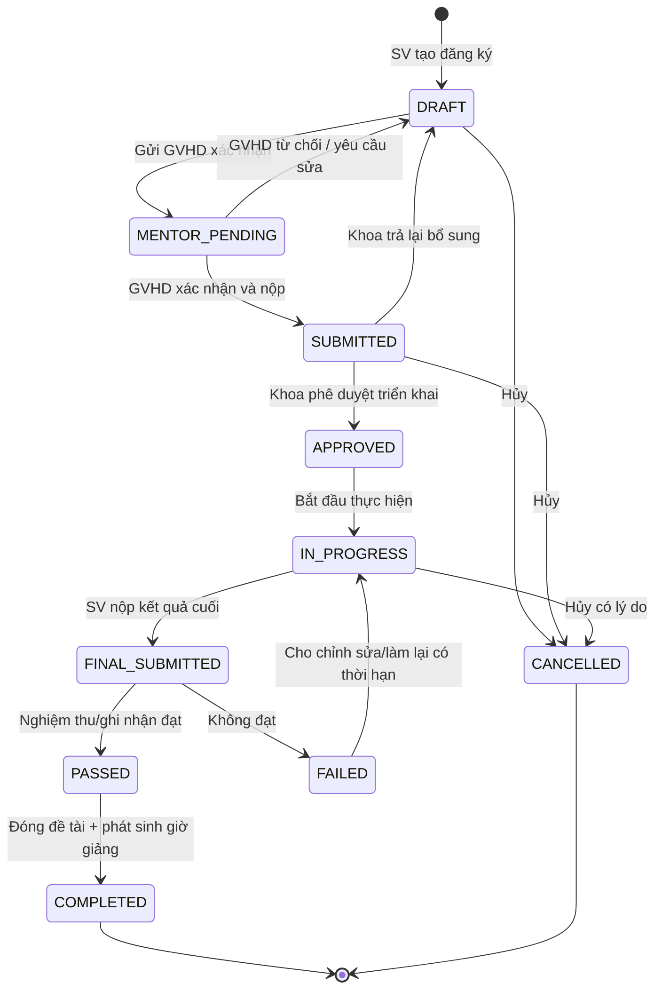

# Đề tài sinh viên

> **Nguồn sự thật về nghiệp vụ.** Mô hình dữ liệu/API ở `design.md`.
>
> **Định hướng vòng đời:** mặc định quản lý theo quy trình **rút gọn có nghiệm thu**; tenant có thể bật
> mức **đầy đủ** (hội đồng xét duyệt/nghiệm thu, checkpoint bắt buộc) qua `VP-MODE`/`VP-WF`. Dù ở mức nào,
> điểm nghiệp vụ bắt buộc là: đề tài có **GV hướng dẫn xác nhận**, có **kết quả nghiệm thu/ghi nhận**, và
> nếu đạt thì phát sinh sự kiện **quy đổi giờ giảng cho GV hướng dẫn** qua P03.

## 1. Bối cảnh & mục tiêu

- Quản lý đề tài NCKH của **sinh viên** có **giảng viên hướng dẫn**. Điểm cốt lõi: **tính giờ giảng cho
  giảng viên hướng dẫn** và đổ về lý lịch khoa học (F08).
- Sinh viên được **đồng bộ/xác nhận** từ hệ thống sinh viên (không khai lại — yêu cầu kỹ thuật biên bản §C).
- F10 khác đề tài cấp cơ sở F01–F06: trọng tâm là **đăng ký nhóm SV → GVHD xác nhận → thực hiện → nộp kết quả
  → nghiệm thu/ghi nhận**, có thể rút gọn bước hội đồng để phù hợp vận hành ở khoa/bộ môn.

## 2. Phạm vi

- **Trong phạm vi:**
  - Mở đợt đề tài SV theo năm học/học kỳ/khoa hoặc đơn vị quản lý.
  - Sinh viên lập đăng ký đề tài, chọn thành viên từ dữ liệu đồng bộ, chỉ định/đề xuất GV hướng dẫn.
  - GV hướng dẫn xác nhận hoặc từ chối hướng dẫn trước khi đề tài được nộp chính thức.
  - Khoa/bộ môn/chuyên viên QLKH sơ duyệt và phê duyệt triển khai.
  - Theo dõi thực hiện ở mức tối thiểu; tenant có thể bật checkpoint/báo cáo tiến độ bắt buộc.
  - Nộp báo cáo/kết quả/minh chứng cuối kỳ; nghiệm thu hoặc ghi nhận kết quả.
  - Đề tài nghiệm thu đạt phát sinh sự kiện quy đổi giờ giảng cho GV hướng dẫn qua P03 và hiển thị ở F08.
- **Ngoài phạm vi:**
  - Tính điểm học phần/điểm tốt nghiệp của sinh viên — thuộc hệ thống đào tạo.
  - Quản lý học vụ chi tiết của sinh viên — thuộc hệ thống sinh viên/đào tạo.
  - Quyết toán/thù lao theo giờ giảng — ngoài phạm vi P03/F10.
  - Quản lý kinh phí hỗ trợ đề tài SV ở mức dự toán/giải ngân — chưa chốt; nếu có, cần quyết định reuse F05
    hoặc ghi nhận kinh phí nhẹ riêng cho F10.

## 3. Luồng nghiệp vụ chính

### 3.1 Workflow mặc định — rút gọn có nghiệm thu

1. **Mở đợt đề tài SV:** chuyên viên/khoa cấu hình đợt, thời hạn, đơn vị, loại đề tài, giới hạn số SV/nhóm,
   yêu cầu minh chứng và công thức P03 áp dụng.
2. **SV lập đăng ký nháp:** SV trưởng nhóm chọn thành viên từ dữ liệu đồng bộ, nhập đề tài, mục tiêu, sản
   phẩm dự kiến, lĩnh vực, khoa/bộ môn và GV hướng dẫn đề xuất.
3. **GV hướng dẫn xác nhận:** GVHD đồng ý hoặc từ chối. Chỉ hồ sơ có GVHD xác nhận mới được nộp chính thức.
4. **Khoa/bộ môn sơ duyệt:** kiểm tra trùng lặp, phù hợp chuyên môn, thành viên, GVHD, minh chứng bắt buộc.
5. **Phê duyệt triển khai:** đề tài được đưa vào thực hiện; thay đổi thành viên/GVHD sau mốc này phải có lý
   do và ghi audit.
6. **Theo dõi thực hiện:** nhóm SV/GVHD cập nhật tiến độ theo mức tenant cấu hình.
7. **Nộp kết quả cuối:** SV nộp báo cáo, sản phẩm/minh chứng; GVHD xác nhận đủ điều kiện nghiệm thu.
8. **Nghiệm thu/ghi nhận kết quả:** khoa/chuyên viên ghi kết luận đạt/không đạt; tenant full lifecycle có
   thể lập hội đồng và phiếu chấm.
9. **Đóng đề tài:** nếu đạt, F10 phát sự kiện `STUDENT_PROJECT_ACCEPTED` sang P03 để quy đổi giờ giảng cho
   GVHD; kết quả tự tổng hợp vào F08.

### 3.2 Biến thể full lifecycle

Tenant có thể bật quy trình đầy đủ bằng `VP-MODE = FULL_LIFECYCLE` và `VP-WF`, bổ sung:
- Hội đồng/nhóm phản biện xét duyệt đề cương trước `APPROVED`.
- Checkpoint/báo cáo tiến độ bắt buộc trong `IN_PROGRESS`.
- Hội đồng nghiệm thu với biên bản/phiếu chấm trước `PASSED`/`FAILED`.

Các bước bổ sung phải vẫn map về `statusSemantic` chuẩn trong `data-model.md §3.1`; không tạo semantic mới
ngoài danh sách lõi.

## 4. Business rules

| ID    | Quy tắc | Mô tả | Ghi chú |
|-------|---------|-------|---------|
| BR-01 | Đợt đề tài là cổng đăng ký | Đề tài SV chỉ được nộp trong một đợt đang mở và thuộc phạm vi đơn vị/khoa được phép | Thời hạn là tham số tenant/kỳ |
| BR-02 | SV từ đồng bộ | Thành viên SV lấy từ dữ liệu đồng bộ, xác nhận thay vì khai lại | Phụ thuộc `VP-SYNC`/tích hợp hệ thống SV |
| BR-03 | Nhóm SV hợp lệ | Số lượng thành viên, vai trò trưởng nhóm và điều kiện tham gia theo cấu hình đợt | Ví dụ min/max SV/nhóm |
| BR-04 | GV hướng dẫn bắt buộc | Mỗi đề tài SV phải có ≥1 GV hướng dẫn đã xác nhận trước khi nộp chính thức | Đối tượng tính giờ giảng |
| BR-05 | GVHD có quyền từ chối/yêu cầu sửa | GVHD có thể từ chối hướng dẫn hoặc yêu cầu SV sửa đăng ký trước khi nộp | Ghi lịch sử thao tác |
| BR-06 | Sơ duyệt trước triển khai | Khoa/bộ môn/chuyên viên phải phê duyệt thì đề tài mới chuyển sang thực hiện | Có thể là duyệt nhanh hoặc qua hội đồng |
| BR-07 | Thay đổi sau phê duyệt có kiểm soát | Sau `APPROVED/IN_PROGRESS`, đổi thành viên, GVHD, tên đề tài hoặc mục tiêu chính phải có lý do và audit | Backend kiểm quyền |
| BR-08 | Minh chứng theo giai đoạn | Loại minh chứng bắt buộc theo loại đề tài/giai đoạn lấy từ cấu hình `VP-EVID-REQ` | Dùng chung F09–F12 |
| BR-09 | Kết quả cuối cần GVHD xác nhận | Trước nghiệm thu/ghi nhận, GVHD phải xác nhận hồ sơ kết quả đủ điều kiện | Có thể cấu hình bắt buộc/không bắt buộc nếu PO chốt khác |
| BR-10 | Chỉ đề tài đạt mới sinh giờ giảng | Chỉ đề tài có kết quả `PASSED`/`COMPLETED` mới phát sinh yêu cầu quy đổi giờ giảng | Điều kiện nguồn cho P03 |
| BR-11 | Quy đổi giờ giảng qua P03 | Giờ giảng cho GVHD được tính bởi P03 theo công thức hiệu lực và quy tắc phân bổ vai trò | Không hardcode ở F10 |
| BR-12 | Idempotent giờ giảng | Một đề tài SV đạt không được tạo trùng bản ghi giờ giảng khi xử lý lại hoặc đóng lại | Khóa nguồn sự kiện |
| BR-13 | Mọi chuyển trạng thái có audit | Mọi hành động đổi trạng thái nghiệp vụ ghi `AuditLog` append-only | Luật bất biến AGENTS.md §4 |
| BR-14 | Workflow cấu hình nhưng semantic cố định | Tenant được cấu hình graph qua `VP-WF`, nhưng mỗi bước phải map về `statusSemantic` chuẩn | ADR-0007 |

## 5. Dữ liệu (mức khái niệm)

- **Đợt đề tài SV:** mã đợt, năm học/học kỳ, đơn vị/khoa, thời hạn đăng ký, thời hạn nộp kết quả, loại đề
  tài, min/max SV/nhóm, yêu cầu minh chứng, trạng thái mở/đóng.
- **Đề tài SV:** mã, tên, mục tiêu, lĩnh vực, sản phẩm dự kiến, nhóm sinh viên, trưởng nhóm, GV hướng dẫn,
  đợt, đơn vị quản lý, trạng thái workflow, `statusSemantic`, kết quả, minh chứng.
- **Thành viên SV:** tham chiếu sinh viên đồng bộ, vai trò trong nhóm, trạng thái tham gia.
- **GV hướng dẫn:** tham chiếu `User`, vai trò hướng dẫn, tỷ lệ/phần phân bổ giờ giảng nếu tenant cấu hình.
- **Kết quả cuối:** báo cáo, sản phẩm/minh chứng, nhận xét GVHD, kết luận nghiệm thu/ghi nhận, ngày kết luận.
- **Sự kiện quy đổi:** `sourceType = STUDENT_PROJECT`, `sourceId`, GVHD, vai trò, trạng thái xử lý P03.

> Mô hình chi tiết cần bổ sung ở `design.md` và/hoặc `data-model.md` khi F10 chuyển sang Review.

## 6. Trạng thái & semantic

| Trạng thái F10 | `statusSemantic` | Ý nghĩa |
|---|---|---|
| `DRAFT` | `DRAFT` | SV đang soạn đăng ký |
| `MENTOR_PENDING` | `DRAFT` | Chờ GVHD xác nhận hướng dẫn |
| `SUBMITTED` | `SUBMITTED` | Đã nộp, chờ khoa/bộ môn xử lý |
| `APPROVED` | `APPROVED` | Được phê duyệt triển khai |
| `IN_PROGRESS` | `IN_PROGRESS` | Đang thực hiện |
| `FINAL_SUBMITTED` | `PENDING_ACCEPTANCE` | Đã nộp kết quả cuối, chờ nghiệm thu/ghi nhận |
| `UNDER_ACCEPTANCE` | `UNDER_ACCEPTANCE` | Đang nghiệm thu bằng hội đồng (nếu full lifecycle) |
| `PASSED` | `PASSED` | Kết quả đạt |
| `FAILED` | `FAILED` | Kết quả không đạt |
| `COMPLETED` | `COMPLETED` | Đã đóng đề tài và xử lý quy đổi giờ |
| `CANCELLED` | `CANCELLED` | Đã hủy |

## 7. Acceptance criteria

- **AC-01** *(BR-01)* — Given đợt đăng ký đã đóng, When SV nộp đề tài mới vào đợt đó, Then hệ thống từ
  chối và không tạo hồ sơ nộp chính thức.
- **AC-02** *(BR-02)* — Given SV đã có trong dữ liệu đồng bộ, When thêm vào nhóm, Then người dùng chọn từ
  danh sách đồng bộ và không có ô nhập tay hồ sơ SV.
- **AC-03** *(BR-03)* — Given đợt cấu hình tối đa 5 SV/nhóm, When nhóm thêm thành viên thứ 6, Then hệ thống
  chặn lưu/nộp và báo vượt giới hạn.
- **AC-04** *(BR-04,05)* — Given đề tài chưa có GVHD xác nhận, When SV nộp chính thức, Then hệ thống chặn
  và yêu cầu GVHD xác nhận trước.
- **AC-05** *(BR-05)* — Given GVHD từ chối hướng dẫn kèm lý do, When xử lý yêu cầu xác nhận, Then đề tài
  quay về nháp và lịch sử ghi nhận người từ chối/lý do/thời điểm.
- **AC-06** *(BR-06)* — Given đề tài đã nộp hợp lệ, When khoa/bộ môn phê duyệt triển khai, Then trạng thái
  chuyển sang `APPROVED/IN_PROGRESS` theo workflow cấu hình và ghi audit.
- **AC-07** *(BR-07)* — Given đề tài đang thực hiện, When người dùng đổi GVHD hoặc thành viên mà không có
  quyền/lý do hợp lệ, Then hệ thống từ chối ở backend.
- **AC-08** *(BR-08)* — Given loại đề tài yêu cầu báo cáo tổng kết và sản phẩm minh chứng ở giai đoạn cuối,
  When SV nộp kết quả thiếu một loại minh chứng, Then hệ thống chặn nộp kết quả cuối.
- **AC-09** *(BR-09)* — Given hồ sơ kết quả cuối chưa có xác nhận GVHD, When gửi nghiệm thu/ghi nhận, Then
  hệ thống chặn nếu tenant cấu hình bắt buộc xác nhận GVHD.
- **AC-10** *(BR-10,11)* — Given đề tài SV được nghiệm thu/ghi nhận đạt, When đóng đề tài, Then F10 phát
  yêu cầu quy đổi sang P03 và GVHD được tính giờ theo công thức hiệu lực.
- **AC-11** *(BR-12)* — Given cùng đề tài đạt đã được P03 xử lý, When hệ thống xử lý lại sự kiện đóng đề tài,
  Then không phát sinh bản ghi giờ giảng trùng.
- **AC-12** *(BR-13)* — Given người dùng thực hiện một chuyển trạng thái nghiệp vụ, When chuyển thành công,
  Then `AuditLog` ghi actor, thời điểm, trạng thái trước/sau và ghi chú nếu có.
- **AC-13** *(BR-14)* — Given tenant cấu hình thêm bước hội đồng nghiệm thu, When kích hoạt workflow, Then
  mỗi bước có `statusSemantic` hợp lệ và báo cáo vẫn đọc được theo semantic chuẩn.

## 8. Phụ thuộc & rủi ro

**Phụ thuộc:**
- [P03](../P03-quy-doi-gio-giang/) — công thức, phân bổ, idempotency bản ghi giờ giảng.
- [F08](../F08-ly-lich-khoa-hoc/) — hiển thị giờ giảng và vai trò hướng dẫn trong lý lịch khoa học.
- [B03](../B03-quan-ly-nguoi-dung/) — tài khoản, vai trò, quyền, phạm vi dữ liệu.
- [B01](../B01-danh-muc-cau-hinh/) — danh mục loại đề tài, lĩnh vực, đơn vị, minh chứng, tiêu chí.
- `integrations.md` — cần bổ sung đồng bộ sinh viên/giảng viên (`VP-SYNC`).
- `variation-points.md` — `VP-MODE`, `VP-WF`, `VP-EVID-REQ`, `VP-TH-FORMULA`, `VP-TH-ALLOC`.

**Rủi ro & điểm cần chốt:**

| Vấn đề | Ảnh hưởng | Đề xuất |
|---|---|---|
| Trường muốn quản lý đề tài SV như đề tài cấp cơ sở đầy đủ | Tăng độ phức tạp F10 | Giữ default rút gọn; bật `FULL_LIFECYCLE` theo tenant |
| Chưa có tích hợp sinh viên | Không đảm bảo "xác nhận, không khai lại" | Cần bổ sung adapter/nguồn đồng bộ trong `integrations.md`; fallback import có kiểm soát nếu PO chốt |
| Công thức giờ giảng chưa chốt | Chặn AC-10 khi triển khai thật | P03 phải có seed/cấu hình theo kỳ trước khi bật F10 production |
| Nhiều GVHD cùng hướng dẫn | Cần phân bổ giờ rõ ràng | Dùng `VP-TH-ALLOC`; mặc định yêu cầu tổng tỷ lệ phân bổ = 100% nếu có nhiều GVHD |
| Có kinh phí hỗ trợ đề tài SV | Có thể kéo F05 vào F10 | PO chốt: ngoài phạm vi, ghi nhận nhẹ, hoặc reuse F05 |
