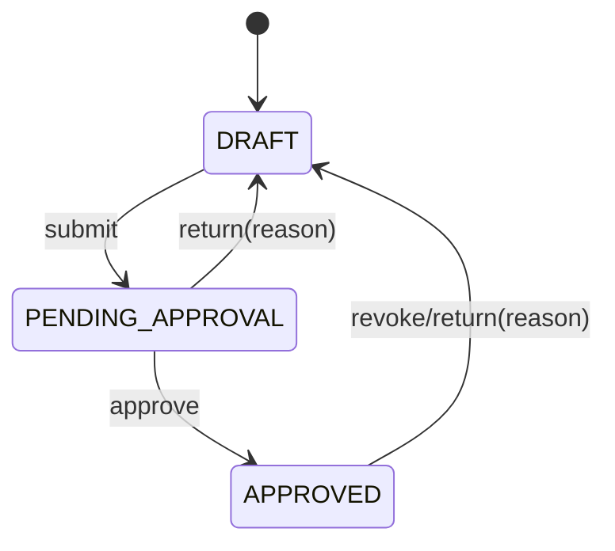

# Dự án phục vụ sản xuất — Thiết kế

> Thiết kế hệ thống đích cho repo code tương lai. Repo hiện tại chỉ lưu tài liệu; hợp đồng API chi tiết sẽ nằm ở
> `packages/api-contracts` khi bước sang pha thực thi.

## 1. Module & ranh giới

- **Module backend:** `applied-project` (theo ánh xạ AGENTS.md §3).
- **Entity nghiệp vụ:** `AppliedProject`, tách khỏi `ResearchProject` của F01–F06 vì F11 là đầu mục dự án
  phục vụ sản xuất, không chạy lifecycle đề tài cấp cơ sở.
- **Ranh giới kinh phí:** F11 lưu `totalBudgetVnd`/`contractValueVnd` ở mức đầu mục để thống kê và quy đổi
  giờ giảng. F11 không tạo tham chiếu sang F05 và không xử lý dự toán/giải ngân/quyết toán.

## 2. Mô hình trạng thái

Trạng thái tối thiểu:

- Mọi transition đi qua domain service của `applied-project`.
- Transition `approve`, `return`, `revoke` ghi `AuditLog` append-only qua P02.
- UI không tự cập nhật enum trạng thái trực tiếp.

## 3. Dữ liệu khái niệm

| Khái niệm | Trường chính | Ghi chú |
|---|---|---|
| `AppliedProject` | `id`, `code`, `title`, `hostUnitId`, `principalUserId`, `startDate`, `endDate`, `contractValueVnd`, `totalBudgetVnd`, `status`, `resultSummary`, `returnReason` | Tiền VND; ngày hiển thị `dd/MM/yyyy`, lưu UTC |
| `AppliedProjectPartner` | `projectId`, `partnerId` hoặc `partnerName`, `taxCode`, `contactInfo` | Danh mục/quick-create `EXTERNAL_PARTNER` |
| `AppliedProjectMember` | `projectId`, `userId`, `roleCode`, `contributionRate` | Đầu vào phân bổ giờ P03 |
| `AppliedProjectEvidence` | `projectId`, `attachmentId`, `evidenceTypeCode`, `stage` | `evidenceTypeCode` từ `EVIDENCE_TYPE` |
| `TeachingHourSourceRef` | `sourceType=APPLIED_PROJECT`, `sourceId`, `eventKey` | Khóa idempotent cho P03 |

## 4. Tích hợp

- **B01:** `Unit`, `EXTERNAL_PARTNER`, `EVIDENCE_TYPE`, tham số `f11.teachingHourTrigger`.
- **B03:** quyền backend `APPLIEDPROJECT.VIEW`, `APPLIEDPROJECT.EDIT`, `APPLIEDPROJECT.SUBMIT`,
  `APPLIEDPROJECT.APPROVE`.
- **P02:** ghi audit cùng transaction khi đổi trạng thái hoặc điều chỉnh dữ liệu ảnh hưởng giờ giảng.
- **P03:** nhận sự kiện `APPLIED_PROJECT_APPROVED` hoặc `APPLIED_PROJECT_RESULT_APPROVED` theo cấu hình.
- **F08:** đọc bản ghi giờ giảng từ P03 để tổng hợp vào lý lịch khoa học.

## 5. Truy vết BR/AC → hiện thực

| BR/AC | Cách hiện thực |
|---|---|
| BR-01 / AC-01 | Validate `hostUnitId` bắt buộc; scope dữ liệu theo đơn vị qua RBAC/RLS của hệ thống đích |
| BR-02 / AC-02 | Validate có ít nhất một `AppliedProjectPartner` khi gửi duyệt; hỗ trợ chọn/tạo nhanh đối tác theo quyền |
| BR-03 / AC-03 | Chỉ lưu trường tiền tổng; không render bảng dòng ngân sách và không tạo reference sang F05 |
| BR-04 / AC-04 | Guard `RequiredEvidenceGuard` đọc `requiredEvidence` theo giai đoạn và `EVIDENCE_TYPE` |
| BR-05 / AC-05 | Domain service kiểm transition `submit/approve/return`; lưu `returnReason` khi trả lại |
| BR-05,07 / AC-06 | Audit middleware/domain event ghi `AuditLog` append-only cho approve/return/revoke |
| BR-06,07 / AC-07 | Domain event sang P03 với `sourceType=APPLIED_PROJECT` + `eventKey`; P03 đảm bảo idempotent và điều chỉnh |

## 6. Điểm mở kỹ thuật

- Chuẩn hóa seed danh mục `EXTERNAL_PARTNER`: có cần mã số thuế làm khóa chống trùng không.
- Tham số `f11.teachingHourTrigger` dùng mặc định nào cho tenant mới; đề xuất pilot là `ON_RESULT_APPROVED`.
- Chuẩn hóa mã vai trò F11 (`PRINCIPAL`, `COORDINATOR`, `MEMBER`) để P03 phân bổ giờ ổn định.
