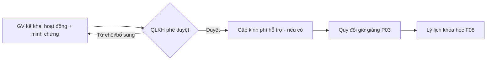

# Hoạt động khoa học & minh chứng

> **Nguồn sự thật về nghiệp vụ.** Mô hình dữ liệu/API ở `design.md`.
>
> Feature **gộp** 3 phân hệ có **quy trình giống nhau** trong biên bản: **Hội nghị/Hội thảo**,
> **Phục vụ cộng đồng**, **Sở hữu trí tuệ**. Quy trình chung: *giảng viên cung cấp thông tin & minh
> chứng → QLKH phê duyệt & cấp kinh phí hỗ trợ → quy đổi giờ giảng*. Phân biệt bằng **loại hoạt động**.

## 1. Bối cảnh & mục tiêu

- Giảng viên có nhiều hoạt động khoa học cần Trường ghi nhận, **phê duyệt** và **cấp kinh phí hỗ trợ**:
  tham dự/báo cáo hội nghị–hội thảo, hoạt động phục vụ cộng đồng, đăng ký sở hữu trí tuệ.
- Thay vì 3 feature tách rời (cùng một luồng), dùng **một feature cấu hình theo loại hoạt động** để giảm
  trùng lặp và dễ mở rộng loại mới.
- Kết quả: hoạt động được duyệt → cấp kinh phí (khi áp dụng) → **quy đổi giờ giảng (P03)** → lý lịch (F08).

## 2. Phạm vi

- **Trong phạm vi:**
  - Giảng viên **đề nghị/kê khai** hoạt động kèm minh chứng (tờ trình cử đi, thông tin phát biểu, văn bằng SHTT…).
  - **Phê duyệt** của QLKH (tái dùng mô hình phê duyệt/cuộc họp nếu cần) và **cấp kinh phí hỗ trợ** (tái dùng F05 ở mức ghi nhận).
  - **Quy đổi giờ giảng** theo loại hoạt động (P03); tổng hợp vào lý lịch (F08).
  - **Loại hoạt động** mở rộng được qua danh mục (B01): `CONFERENCE` (hội nghị/hội thảo), `COMMUNITY` (phục vụ cộng đồng), `IP` (sở hữu trí tuệ)…
- **Ngoài phạm vi:** quản lý dự toán/giải ngân kinh phí chi tiết (mặc định chỉ ghi nhận khoản hỗ trợ).

## 3. Luồng nghiệp vụ chính

1. Giảng viên chọn **loại hoạt động** → kê khai thông tin + đính kèm **minh chứng**.
2. QLKH **phê duyệt** (duyệt/từ chối/yêu cầu bổ sung) và xác định **kinh phí hỗ trợ** (nếu có).
3. Hoạt động được duyệt → **quy đổi giờ giảng (P03)** → tự động vào **lý lịch khoa học (F08)**.

## 4. Business rules

| ID    | Quy tắc | Mô tả | Ghi chú |
|-------|---------|-------|---------|
| BR-01 | Loại hoạt động cấu hình | Loại hoạt động lấy từ danh mục, mở rộng được | B01; tránh hardcode |
| BR-02 | Minh chứng bắt buộc | Phải có minh chứng phù hợp loại hoạt động để được duyệt | Bộ minh chứng theo loại — PO chốt |
| BR-03 | Phê duyệt mới cấp kinh phí | Chỉ hoạt động đã duyệt mới ghi nhận kinh phí hỗ trợ & sinh giờ giảng | Trạng thái hợp lệ cho P03 (BR-04 của P03) |
| BR-04 | Giờ giảng theo loại | Số giờ quy đổi khác nhau theo loại hoạt động & vai trò | Công thức ở P03 |

## 5. Dữ liệu (mức khái niệm)

Hoạt động khoa học (loại, giảng viên/chủ thể, tiêu đề, thời gian/địa điểm, **minh chứng** đính kèm,
trạng thái phê duyệt, **kinh phí hỗ trợ**, tham chiếu giờ giảng).

## 6. Acceptance criteria

- **AC-01** *(BR-01)* — Given danh mục có loại `CONFERENCE`/`COMMUNITY`/`IP`, When GV kê khai, Then chọn được loại và form minh chứng tương ứng.
- **AC-02** *(BR-02)* — Given thiếu minh chứng bắt buộc, When gửi duyệt, Then bị chặn.
- **AC-03** *(BR-03)* — Given hoạt động bị từ chối, When xử lý, Then không phát sinh kinh phí & không sinh giờ giảng.
- **AC-04** *(BR-03,04)* — Given hoạt động được duyệt, When hoàn tất, Then ghi nhận kinh phí hỗ trợ (nếu có) và sinh giờ giảng qua P03.

## 7. Phụ thuộc & rủi ro

- **Phụ thuộc:** P03 (giờ giảng), F08 (lý lịch), B01 (danh mục loại hoạt động), F05 (ghi nhận kinh phí hỗ trợ), B04 (thông báo), P02 (audit).
- **Điểm cần chốt:** bộ minh chứng & cấp duyệt theo từng loại; mức độ quản lý kinh phí hỗ trợ (biên bản §D);
  SHTT có cần theo dõi vòng đời cấp văn bằng riêng không.
